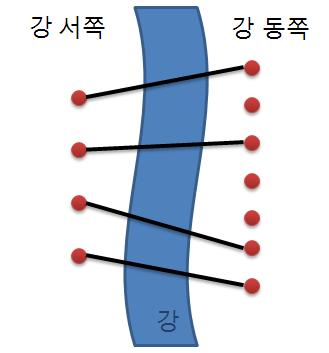

## 문제
[백준-다리 놓기(1010)](https://www.acmicpc.net/problem/1010)


## 문제 풀이

이 문제는 다리를 겹치지 않고, 최대한 많이 놓는 것이 목적인 문제이다.



서쪽의 지을 수 있는 다리를 n개, 동쪽의 지을 수 있는 다리를 m개라고 할 때, n개의 다리는 모두 하나씩 m개 중 각 하나에 겹치지 연결되어야 한다.

즉, 강 동쪽의 다리 개수인 m개 중에서 n개를 겹치지 않고 뽑으면 되는 것이다.

이때 겹치지 않는 것을 신경 쓸 필요가 없다.

사진과 n=4, m=7이라고 할 때, m개 중 4개(2, 1, 3, 4)가 뽑혀 서쪽에서 동쪽으로 가는 다리가 겹치게 된다고 가정해보자.

그러나 결과적으로 보면 (1, 2, 3, 4)와 같은 것으로 카운트되기 때문에 (순서가 상관 없다) 우리는 겹치는 것에 신경 쓰지 않고 동쪽에 어떤 것이 선택되었는지만 보면 된다.

따라서 nCr을 이용해 코드를 작성하고자 한다.

dp는 재귀를 이용해 구현했다.

## 코드

```java
import java.io.BufferedReader;
import java.io.InputStreamReader;
import java.io.IOException;
import java.util.StringTokenizer;

public class boj_1010 {
	private static int[][] dp = new int[30][30];
	public static void main(String[] args) throws IOException {
		BufferedReader br = new BufferedReader(new InputStreamReader(System.in));
		StringBuilder sb = new StringBuilder();
		
		int T = Integer.parseInt(br.readLine());
		
		for (int i=0; i<T; i++) {
			StringTokenizer st = new StringTokenizer(br.readLine());
			int n = Integer.parseInt(st.nextToken());
			int m = Integer.parseInt(st.nextToken());
			sb.append(DP(m, n)).append("\n");
		}
		
		System.out.println(sb);
	}
	
	private static int DP(int m, int n) {
		if (dp[m][n] > 0) return dp[m][n];
		
		if (n==m || n==0) return dp[m][n] = 1;
		
		return dp[m][n] = DP(m-1, n-1) + DP(m-1, n);
	}
}
```

## 고려사항

1. 한 테스트가 끝날 때마다 dp를 초기화하지 않아도 된다!
<br /> -> nCr을 구할 때 n, r이 다르더라도 결국 구하는 과정에 있어 같은 결괏값들이 쓰이기 때문이다.

2. dp의 값을 업데이트하는 것을 잊지 말자.
<br/> -> n==m || n==0일 때 1을 리턴하는 것이 아니라 나중에 계산을 위해 dp의 값을 업데이트해야 한다.

```java
return dp[m][n] = DP(m-1, n-1) + DP(m-1, n);
```

이 부분도 마찬가지로, DP로 나온 값을 업데이트 시켜야 동일한 값을 여러 번 계산할 필요 없이 한 번에 계산이 가능하다. 그래야 DP의 장점을 살릴 수 있다.

## 참고 자료
- https://st-lab.tistory.com/194