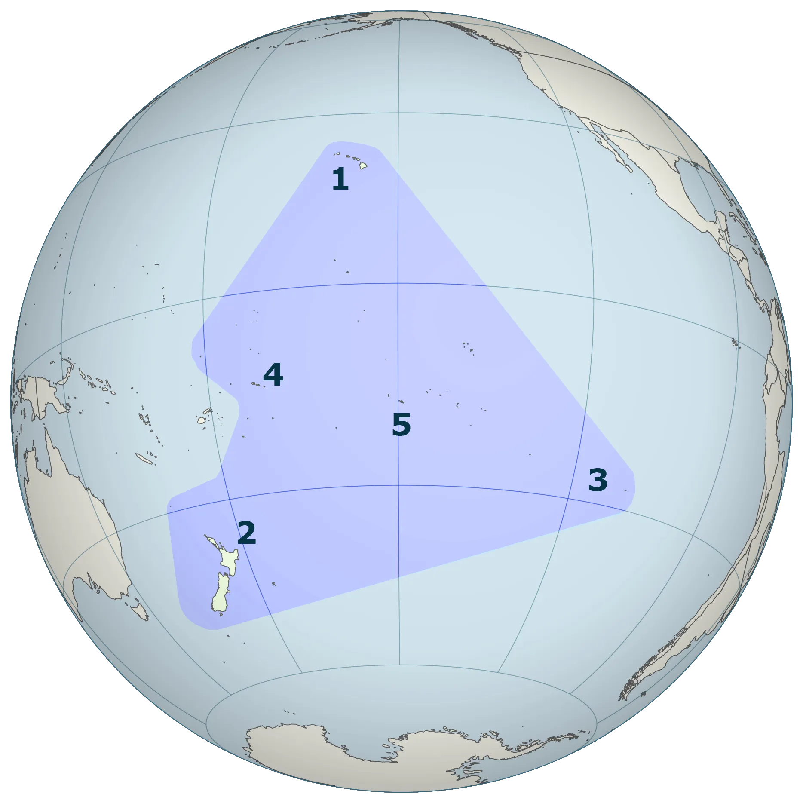

<strong>총균쇠(Jared Diamond 저)를 읽고 생겨난 궁금증을 정리한 정리본입니다.</strong>
{: .notice}

> (47p) 폴리네시아인의 조상들이 약 3,200년 전 태평양 곳곳으로 퍼져나갔을 떄, 그들이 맞닥뜨린 섬들은 제각각 환경이 크게 달랐다.

## 🫧 폴리네시아

폴리네시아는 특정 위치의 섬들의 문화권(집합체)를 의미한다. 

종종 <strong>`폴리네시아 삼각지대`*1</strong> 로 폴리네시아를 정의하곤 한다.

### ✨ 폴리네시아 삼각지대

(\*1) 폴리네시아 삼각지대 : 하와이(하와이), 이스터 섬(라파누이), 뉴질랜드(아오테아로아)의 세 섬 그룹이 있는 태평양의 지역

- 태평양의 지리적 지역이지만, 서쪽에는 `피지`*2 는 제외한다.

### ✨ 피지

(\*2) 피지(Fiji): 보통 멜라네시아로 분류되고, 삼각지대 바깥(서쪽) 에 위치한다.
 -> 다만 피지령 로투마(Rotuma) 같이 폴리네시아 계통의 `아웃라이어`가 있어서, `“폴리네시아 문화권 전체”`를 넓게 그릴 때 피지 관련 지역이 함께 언급되기도 한다.

### ✨ 폴리네시아 민족
유럽인들이 처음 이 섬에 도착했을 때 이 섬들은 모두 사람이 살지 않았으며, 오늘날 가장 많은 폴리네시아 민족은 다음과 같다.

- 마오리족
- 하와이족 (카나카 마오리족)
- 통가족
- 사모아족
- 니우족
- 타히티족

### ✨ 폴리네시아 삼각지대 모국어

- 폴리네시아 삼각지대의 모국어는 `폴리네시아어` 이며, 언어학자들은 말레이-폴리네시아어의 해양 하위 그룹의 일부로 분류함.
- 폴리네시아어는 5,000년 전 동남아시아에서 사용되었던 원시 오스트로네시아어에서 파생되었다.

## 🫧 폴리네시아인의 조상

폴리네시아인의 직계 조상은 신석기 시대 라피타 문화로 여겨진다.

이 집단은 기원전 15000년 경 `서쪽의 동남아시아 섬에서 유래한 오스트로네시아인들의 이주` + `북쪽의 미크로네시아로 이주한 더 이른 오스트로네시아인들의 이주`가 합쳐져 멜라네시아 섬과 미크로네시아에서 출현했다.

#### 💡 여기서 -네시아는 그리스어로 `섬`을 의미한다.

영화 모아나가 폴리네시아인이며, 해당 영화 내 폴리네시아의 문화가 숨어져 있다.

💡 `모아나`라는 단어도 큰 바다(ocean)이라는 뜻을 공유하는 태평양의 단어이다.

다음 영상을 참고해도 좋을 듯하다.

[영화 모아나에 숨겨진 폴리네시아 역사 총정리](https://youtu.be/qr70nF4D4ns?si=mNnwH59FE-zyxltf)

💡 지나가는 지식으로 말해보건대, 대만 원주민 또한 한족 이주 전부터 대만에 살고 있던 오스트로네시아계의 원주민족이다.

## 🫧 참고 자료
- [폴리네시아 삼각지대](https://en.wikipedia.org/wiki/Polynesian_Triangle)
- [모아나의 폴리네시아](https://brunch.co.kr/@truemaddeepnz/53)