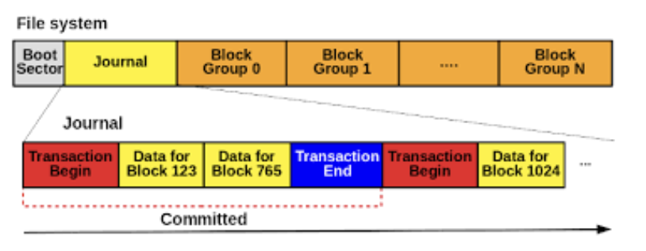
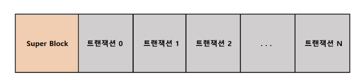
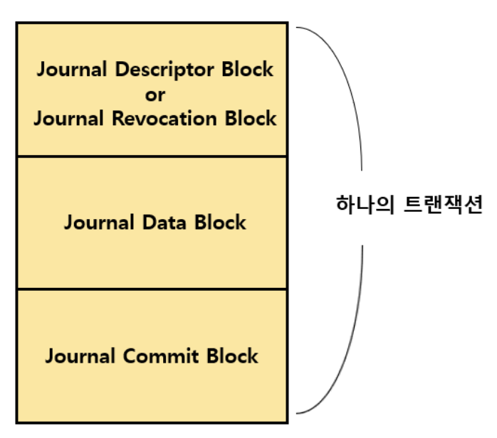

<strong>ext4 파일 시스템에 대한 내용은 [Ext4 파일 시스템](https://ajung7038.github.io/file%20system/OS-ext4-%ED%8C%8C%EC%9D%BC-%EC%8B%9C%EC%8A%A4%ED%85%9C%EC%9D%B4%EB%9E%80/)을 참조해주세요</strong>
{: .notice}

# 📌 Ext4 Journaling

## 🫧 Journal



저널은 위 사진처럼 블록 그룹의 맨 앞에 존재하며, 파일 시스템 당 하나씩 존재한다.

특히, 저널은 inode 8번에 위치하는데, 이 말은 저널도 하나의 파일처럼 관리된다는 소리이기도 하다.

파일 하나당 inode 하나의 번호가 부여되는 것처럼, 저널 또한 하나의 파일로써 관리되는 것이다.

> 추가로, 파일 하나당 inode 하나라고 해서 할당된 블록 하나당 inode가 하나라고 해서는 안 된다는 점 기억하자!

블록은 공간을 고정된 크기로 나누었기 때문에, 블록 크기보다 파일 크기가 클 경우 블록 여러 개에 고정된 크기로 잘려 할당되기 때문에 inode는 하나더라도 여러 개의 블록을 가지고 있는 경우가 훨씬 많다.



파일 시스템에 하나의 슈퍼 블록이 존재하는 것처럼, 저널에도 슈퍼블록이 존재하는데, 이때 다음과 같은 정보들을 담고 있다.

- 사용 가능한 총 블록 수
- 저널 시작 위치
- 첫 번째 트랜잭션 시퀀스 번호
- 첫 번째 저널에 대한 정보

위와 같이 슈퍼 블록 하나에 트랜잭션이 여러 개 담겨 있는 구조이다.

트랜잭션은 순환 버퍼 형식으로, N번째 트랜잭션까지 채우고 나면 다시 0번 트랜잭션을 덮으면서 계속 재사용하는 구조로, 만일 빠른 시간 내 여러 번의 변경 사항이 기록되었다면 빠르게 기존 정보들이 날아갈 것이다..

이제 본격적인 저널 내 트랜잭션 구조에 대해 알아보자.



하나의 트랜잭션 내에는 다음과 같이 Descriptor Block, Data Block, Commit Block이 한 쌍을 이루고 있다.

다음을 통해 더 자세하게 구조에 대해 살펴보고자 한다.

### ✨ Descriptor block
- 트랜잭션 내 수정될 블록들의 목록과 속성을 정의
- Header + Tag 배열로 구성되어 있다.
- 저널 태그 포함 (데이터에 대한 정보)
- 여러 개의 저널 태그가 하나의 디스크립터 블록 내 포함되어 있음
- 어떤 블록 그룹의 몇 번째 블록인지, 어떤 inode의 데이터인지 등을 포함

### ✨ Data Block
- descripton block의 저널 태그에 해당하는 위치의, 수정될 블록의 실제 데이터 (수정되기 이전의 데이터 값)를 담고 있음
- 장애 발생 시 해당 데이터 블록의 값으로 롤백할 수 있도록 함
- 이 영역을 통해 삭제된 파일 복구 가능

### ✨ Commit Block
- 하나의 트랜잭션의 끝을 나타내는 블록
- 커밋된 시각에 대한 정보 포함
- 커밋 블록이 있어야 해당 트랜잭션이 유효한 것으로 간주

```java
[Descriptor Block]
   └─ Tag1: Block 100 → [Data Block 100]: 수정 전 데이터
   └─ Tag2: Block 204 → [Data Block 204]: 수정 전 데이터
[Commit Block]
```


## 🫧 참고 자료