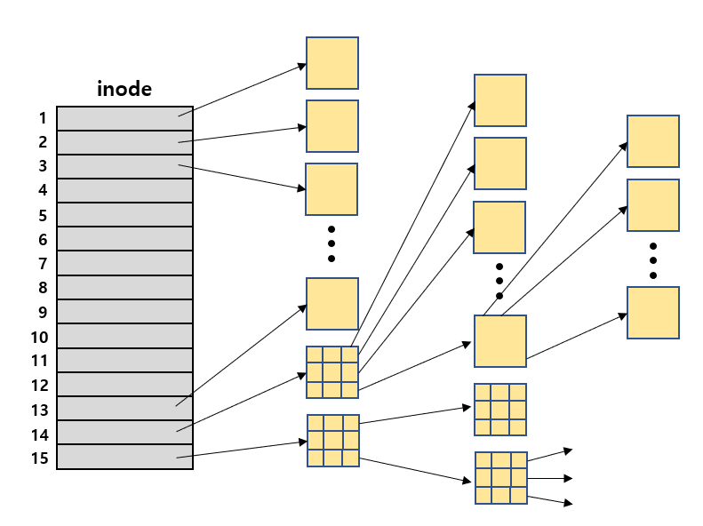
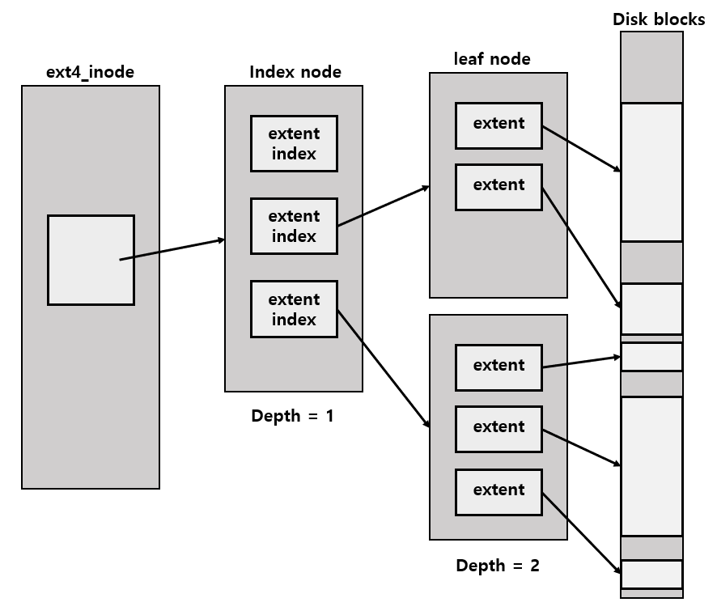
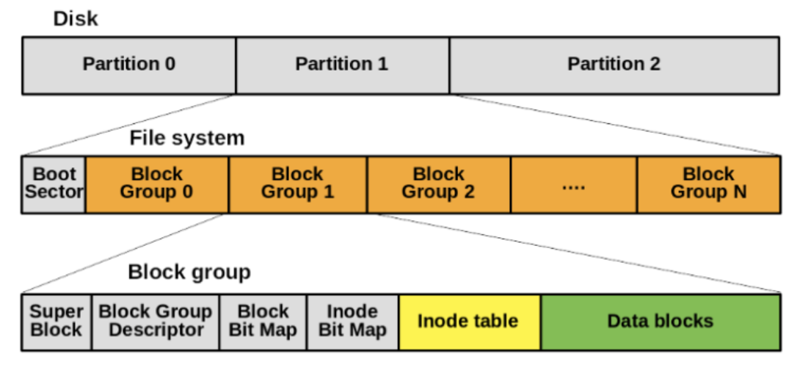
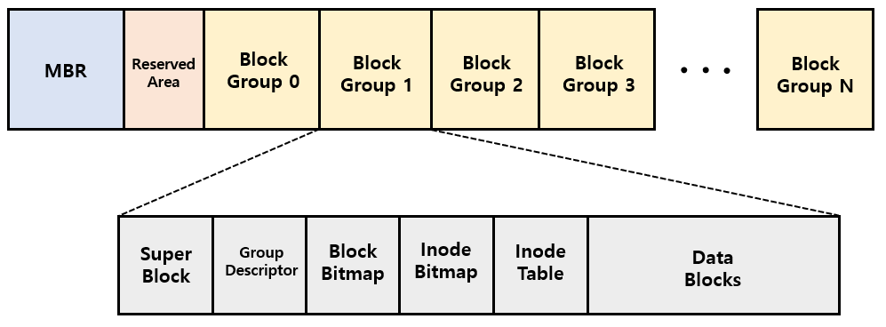
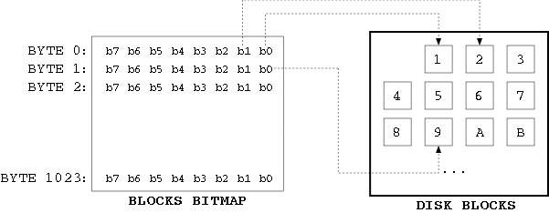
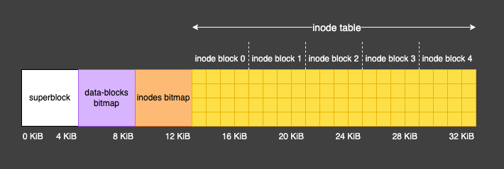
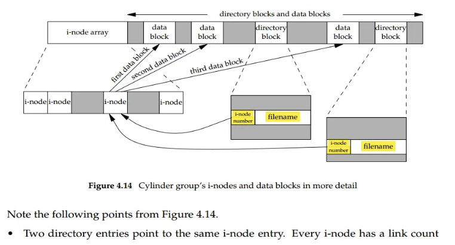

# 📌 Ext4 File System

파일 포렌식 툴을 만들기 위해 파일 시스템에 대해 공부하면서 기초적인 지식에 구멍이 뚫렸다는 사실을 알았다.

특히, 리눅스 커널 코드를 뜯으며 어떤 원리로 inode가 변화하는지, dentry가 할당되는지 등 뒤죽박죽 섞인다는 느낌이 들어, 공부를 하면서 기록으로 남기기로 다짐했다!

## 🫧 파일 시스템
파일 시스템이란 운영체제에서 저장 장치에 있는 파일과 디렉터리(폴더)를 구성하고 관리하는 시스템이다.

파일 및 파일의 메타데이터, 디렉터리 정보등을 쉽게 관리할 수 있게 도와준다.

### ✨ 파일
여기서 파일이란 컴퓨터에서 사용되는 논리적인 단위로, 관련된 정보를 한데 묶어둔 저장 단위로써의 의미를 가진다.

운영체제는 다양한 저장 장치를 file이라는 논리적 단위로 접근을 가능할 수 있게 해 주는데, 이때 파일을 생성하거나, 삭제하는 등의 동작을 통해 우리는 파일에 대한 간접적 제어권을 얻게 된다.

### ✨ 파일의 메타데이터
파일의 메타데이터는 파일의 정보를 담고 있는 내용으로, 다음과 같은 정보를 소유하고 있다.

- 파일명
- 파일 유형 (.pdf, .pptx 등)
- 저장된 위치
- 파일 사이즈
- 소유자
- 접근 권한 (읽기, 쓰기, 실행)

파일 정보를 클릭하면 손쉽게 얻을 수 있는 것들이라고 생각하면 이해가 쉽다.

### ✨ 디렉터리 (폴더)

파일의 메타데이터 중 일부를 보관하는 일종의 특별한 파일이다.

디렉터리가 없다면 파일이 어느 위치에 존재하는지 찾기 어려울 것이다.

우리가 흔히 사용하는 폴더처럼, 디렉터리도 비슷한 이유로 사용된다고 생각하면 이해가 쉽다.

파일 생성, 검색, 삭제 등의 작업 수행이 가능하다.

## 🫧 Ext4 File System
그 중 나는 Linux 운영체제에서 쓰이는 ext4 파일 시스템에 대해 공부하고자 한다.

### ✨ Ext File System

각각의 운영체제들은 저마다의 파일들을 관리하는 파일 시스템을 채택하고 있다. 

대표적으로 윈도우는 NTFS, 맥OS는 APFS를, 리눅스에서는 Ext 파일 시스템을 사용하고 있다.

ext 시리즈는 ext2, ext3, ext4로 되어 있으며, 숫자가 커질수록 버전이 업그레이드된 느낌이라고 생각하면 될 것 같다.

### ✨ ext2

간단히 언급하고 넘어가자면, ext2는 리눅스에서 사용되는 파일 시스템으로, `inode`라는 특수한 구조를 활용해 파일을 저장한다.

이는 다음 그림과 같이 <strong>block mapping</strong> 방식으로 저장된다.

inode 1번부터 12번까지는 하나의 파일에 매핑을 하는 반면, 파일의 크기가 커지고 많아질수록 당연히 inode가 부족하게 되었다.

따라서 inode 13번부터는 하나의 inode가 마치 폴더처럼 여러 개의 블록을 가리키고, 블록이 또 나뉘어 여러 개의 블록을 가리킴으로써 더 많은 파일들을 저장할 수 있도록 만들었다.

### ✨ ext3
ext3와 비슷하지만, 파일 시스템의 변경 사항을 추적하는 <strong>`저널링`</strong> 기능을 도입했다.

이는 파일의 변경 등 파일 시스템의 변경 사항을 일일이 기록하여 파일 복구 시 유용하게 사용될 수 있는 기능이다.

### ✨ ext4

마지막으로 ext4는, ext3처럼 저널링 기능을 적극 도입하였지만, ext2와 ext3에서 적용된 방법인 "Block Mapping"의 한계를 인정하고, <strong>`extent tree`</strong> 구조를 채택했다는 점이 차이점이다.

Block Mapping에서 depth가 끊임없이 깊어지며 속도가 느려지는 등의 한계를 극복하고자 했다.

## 🫧 Ext4의 구조

ext4의 구조는 다음과 같다.

하나의 디스크는 여러 파티션으로 나눠질 수 있으며, 하나의 파티션 안에 하나의 파일 시스템이 존재한다.

### ✨ MBR (Master Boot Record)

: 컴퓨터의 부팅 과정에서 운영체제를 로드하는 데 사용되는 중요한 영역

### ✨ Super Block
- 파일 시스템 전체에 대한 메타데이터
- 총 inode 개수, 총 블록 개수 등 전체 파일 시스템의 틀을 규정
- 여러 개의 블록 그룹에 모두 동일한 값으로 저장

### ✨ Group Descriptor
- 각 블록 그룹의 메타데이터
- Data block bitmap, inode bitmap, inode table의 위치 포함

### ✨ Bitmap

- bitmap은 일련의 비트로써, 각 비트는 블록 그룹 내 특정 상태를 나태낸다.
	- 블록 비트맵인 경우, 비트값 0인 경우 블록 그룹 내 특정 블록이 비워져 있음을 나타낸다.
	- inode 비트맵인 경우, 비트값 1인 경우 블록 그룹 내 특정 아이노드가 사용 중임을 나타낸다.

### ✨ inode 테이블
- inode와 블록 간 매핑
- 일련의 연속된 블록으로 구성되며, 각 블록에는 미리 정의된 개수의 inode가 포함된다.
- 파일 유형, 권한, 소유자, 디스크 상 데이터 블록의 위치가 포함되어 있다.

### ✨ Data block
- 실제 파일 데이터와 디렉터리 엔트리 저장

### ✨ Directory Entry

데이터 블록에서 말하는 디렉터리 엔트리란, 디렉터리를 표현하는 자료구조를 말한다.

흔히 파일 이름과 inode를 가리키는 포인터로 구성되어 있다.

줄여서 `Dentry`라고 부르기도 한다.

디렉터리 엔티리로 파일을 찾아가는 방법은 다음과 같다.

1. 디렉터리 엔트리에 파일 이름과 inode 번호 존재
2. inode 번호를 가지고 inode 테이블에서 해당 위치를 찾아 실제 파일의 정보를 담고 있는 데이터 블록 찾아가기
3. 파일 정보 읽기

## 🫧 Journal

ext3부터 도입한 기능인 저널링 기법은 `저널`에 파일 시스템의 변경 사항을 기록함으로써 구현된다.

파일 시스템의 일관성을 보장하기 위해 변경 내용을 먼저 기록하게 되며, 파일 생성, 삭제 등의 파일 시스템을 변경하기 위해서는 저널에 필수로 기입해야 한다.

만약 저널에 기록하는 것이 실패하면, 파일 시스템의 변경 사항 저장도 실패한다.

저널에 대한 자세한 정보는 [Ext4 Journaling]()에 기입해두었다.

## 🫧 참고 자료
- [파일 시스템의 정의 | Tistory | beatmejy](https://beatmejy.tistory.com/30)
- [ext4 파일 시스템 기본 구조](https://ddongwon.tistory.com/66)
- https://blog.carlosgaldino.com/writing-a-file-system-from-scratch-in-rust.html