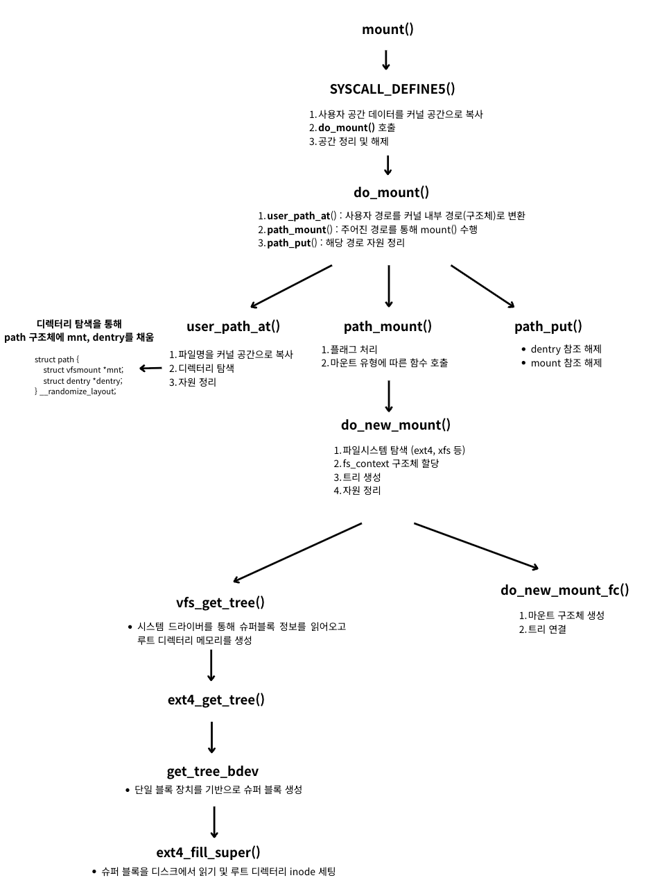

<strong>[linux kernel sourse tree](https://github.com/torvalds/linux)의 깃허브 코드를 참조해 시스템 콜 호출 시 변화 과정을 분석한 글입니다.</strong>
{: .notice}

# 📌 mount()

- 파일 시스템을 지정된 디렉터리 (마운트 포인트)에 연결하는 작업을 수행하는 함수
- 운영체제가 파일 시스템의 데이터를 디렉터리 트리 구조에 통합하도록 함

## 🫧 과정



1. 시스템 콜을 통해 mount() 요청
2. 파일 시스템 파악 후 시스템 드라이버에서 마운트 함수 호출 (이때 빈 슈퍼 블록 구조체도 함께 넘김)
3. 드라이버는 디스크에서 슈퍼 블록 드라이버를 읽음
4. 읽어온 정보를 빈 슈퍼 블록 구조체에 기입해 리턴

## 🫧 특징

- 슈퍼 블록 : 파일 시스템의 전체적인 메타데이터가 담긴 디스크 구조
- 커널은 이를 메모리로 로드해야 mount 가능
- 디렉터리 탐색 과정에서 RCU 알고리즘 사용 (lock-free) ⇒ 가시성 보장 X
    - RCU로 lock-free 탐색 (읽는 쪽의 데이터 일관성 유지)
        - 컨텍스트 스위치, Dentry 구조 변경 등의 이유로 실패 가능
    - 락 기반 일반 탐색
    - 캐시가 유효하지 않은 경우 디스크에서 재확인
        - 디스크 I/O를 줄이기 위해 경로 정보를 dentry cache에 저장해두고 가져다 씀

### ✨ 마운트 유형
1. 바인드 마운트(MS_BIND) : 이미 존재하는 경로를 다른 위치에서 또 접근할 수 있게 하는 것
    - 새 파일 시스템 마운트가 아닌 경로 복붙 느낌으로 사용
    - inode가 공유됨
2. 리마운트(MS_REMOUNT) : 기존에 마운트된 파일 시스템의 속성을 바꾸는 것
    - 실제 슈퍼블록을 언마운트하지 않고 설정만 변경
3. 바인드 + 리마운트
    - 바인딩된 마운트에 옵션 변경 시 사용
4. 이동 (MS_MOVE) : 이미 마운트된 파일 시스템을 다른 디렉터리 위치로 옮김
    - 실제 마운트 트리의 연결 지점을 바꾸고자 할 때 사용

## 🫧 사용 예시 (코드)

```c
#include <stdio.h>
#include <sys/mount.h>
#include <errno.h>

int main() {
    const char *source = "/dev/sdb1"; // 마운트할 장치 경로
    const char *target = "/mnt/mydisk"; // 마운트 포인트
    const char *filesystemtype = "ext4"; // 파일 시스템 유형
    unsigned long mountflags = 0; // 기본 플래그
    const void *data = NULL; // 추가 데이터 없음

    if (mount(source, target, filesystemtype, mountflags, data) == 0) {
        printf("파일 시스템이 성공적으로 마운트되었습니다.\n");
    } else {
        perror("mount 실패");
    }

    return 0;
}
```

## 🫧 코드

### ✨ SYSCALL_DEFINE5
- 시스템 콜 인자를 do_mount()로 넘김
- fs/namespace.c, $4040

```c
// 마운트할 장치 경로, 마운트포인트, 파일 시스템 유형, 기본 플래그, 추가 데이터
SYSCALL_DEFINE5(mount, char __user *, dev_name, char __user *, dir_name,
		char __user *, type, unsigned long, flags, void __user *, data)
{
	int ret;
	char *kernel_type;
	char *kernel_dev;
	void *options;

	// 1. 사용자 공간 데이터를 커널 공간으로 복사
	kernel_type = copy_mount_string(type);
	ret = PTR_ERR(kernel_type);
	if (IS_ERR(kernel_type))
		goto out_type;

	kernel_dev = copy_mount_string(dev_name);
	ret = PTR_ERR(kernel_dev);
	if (IS_ERR(kernel_dev))
		goto out_dev;

	options = copy_mount_options(data);
	ret = PTR_ERR(options);
	if (IS_ERR(options))
		goto out_data;

	// 2. do_mount 호출
	ret = do_mount(kernel_dev, dir_name, kernel_type, flags, options);

	// 3. 할당된 공간 해제
	kfree(options);
out_data:
	kfree(kernel_dev);
out_dev:
	kfree(kernel_type);
out_type:
	return ret;
}
```

### ✨ do_mount()
- fs/namespace.c, $3844

```c
long do_mount(const char *dev_name, const char __user *dir_name,
		const char *type_page, unsigned long flags, void *data_page)
{
	struct path path;
	int ret;

	**// 1. 사용자 경로 -> 커널 내부 경로로 반환하기**
	ret = **user_path_at(AT_FDCWD, dir_name, LOOKUP_FOLLOW, &path)**;
	// 변환에 실패한 경우 리턴
	if (ret)
		return ret;
	**// 2. 실질적 마운트 실행**
	ret = **path_mount(dev_name, &path, type_page, flags, data_page)**;
	**// 3. 해당 경로 자원 정리**
	**path_put(&path)**;
	return ret;
}
```

### ✨ user_path_at()
- 사용자 경로를 커널 내부 경로(구조체)로 변환
- fs/namei.c, $3066

```c
int user_path_at(int dfd, const char __user *name, unsigned flags,
		 struct path *path)
{
	**// 1. 파일명을 커널 공간으로 복사**
	struct filename *filename = getname_flags(name, flags);
	**// 2. 디렉터리 탐색**
	// 이때 path 구조체에 mnt, dentry가 채워짐
	int ret = filename_lookup(dfd, filename, flags, path, NULL);

	**// 3. 자원 정리**
	putname(filename);
	return ret;
}
EXPORT_SYMBOL(user_path_at);
```

### ✨ path_mount()
- 주어진 경로를 통해 mount() 수행 ⇒ 디스패쳐 역할
- fs/namespace.c, $3765
- 마운트 유형을 판별 (remount, bind, move)
- 유형이 일치하지 않으면 일반 마운트 실행 (do_new_mount)

```c
int path_mount(const char *dev_name, struct path *path,
		const char *type_page, unsigned long flags, void *data_page)
{
	unsigned int mnt_flags = 0, sb_flags;
	int ret;

	/* Discard magic */
	if ((flags & MS_MGC_MSK) == MS_MGC_VAL)
		flags &= ~MS_MGC_MSK;

	/* Basic sanity checks */
	if (data_page)
		((char *)data_page)[PAGE_SIZE - 1] = 0;

	if (flags & MS_NOUSER)
		return -EINVAL;
	
	ret = security_sb_mount(dev_name, path, type_page, flags, data_page);
	if (ret)
		return ret;
	if (!may_mount())
		return -EPERM;
	if (flags & SB_MANDLOCK)
		warn_mandlock();

	/* Default to relatime unless overriden */
	if (!(flags & MS_NOATIME))
		mnt_flags |= MNT_RELATIME;
		
	**// 1. 플래그 처리**
	/* Separate the per-mountpoint flags */
	if (flags & MS_NOSUID)
		mnt_flags |= MNT_NOSUID;
	if (flags & MS_NODEV)
		mnt_flags |= MNT_NODEV;
	if (flags & MS_NOEXEC)
		mnt_flags |= MNT_NOEXEC;
	if (flags & MS_NOATIME)
		mnt_flags |= MNT_NOATIME;
	if (flags & MS_NODIRATIME)
		mnt_flags |= MNT_NODIRATIME;
	if (flags & MS_STRICTATIME)
		mnt_flags &= ~(MNT_RELATIME | MNT_NOATIME);
	if (flags & MS_RDONLY)
		mnt_flags |= MNT_READONLY;
	if (flags & MS_NOSYMFOLLOW)
		mnt_flags |= MNT_NOSYMFOLLOW;

	/* The default atime for remount is preservation */
	if ((flags & MS_REMOUNT) &&
	    ((flags & (MS_NOATIME | MS_NODIRATIME | MS_RELATIME |
		       MS_STRICTATIME)) == 0)) {
		mnt_flags &= ~MNT_ATIME_MASK;
		mnt_flags |= path->mnt->mnt_flags & MNT_ATIME_MASK;
	}

	sb_flags = flags & (SB_RDONLY |
			    SB_SYNCHRONOUS |
			    SB_MANDLOCK |
			    SB_DIRSYNC |
			    SB_SILENT |
			    SB_POSIXACL |
			    SB_LAZYTIME |
			    SB_I_VERSION);
	
	**// 2. 마운트 유형에 따른 함수 호출**
	if ((flags & (MS_REMOUNT | MS_BIND)) == (MS_REMOUNT | MS_BIND))
		return do_reconfigure_mnt(path, mnt_flags);
	// 리마운트
	if (flags & MS_REMOUNT)
		return do_remount(path, flags, sb_flags, mnt_flags, data_page);
	// 바인드 마운트
	if (flags & MS_BIND)
		return do_loopback(path, dev_name, flags & MS_REC);
	if (flags & (MS_SHARED | MS_PRIVATE | MS_SLAVE | MS_UNBINDABLE))
		return do_change_type(path, flags);
	if (flags & MS_MOVE)
		return do_move_mount_old(path, dev_name);

	return **do_new_mount(path, type_page, sb_flags, mnt_flags, dev_name,
			    data_page)**;
}
```

### ✨ path_put()
- 해당 경로 자원 정리
```c
void path_put(const struct path *path)
{
	**// dentry 참조 해제**
	dput(path->dentry);
	**// mount 참조 해제**
	mntput(path->mnt);
}
EXPORT_SYMBOL(path_put);
```

### ✨ do_new_mount()
- 슈퍼 블록 로딩 및 VFS에 마운트 트리를 붙임
- fs/namespace.c. $3466

```c
static int do_new_mount(struct path *path, const char *fstype, int sb_flags,
			int mnt_flags, const char *name, void *data)
{
	struct file_system_type *type;
	struct fs_context *fc;
	const char *subtype = NULL;
	int err = 0;

	if (!fstype)
		return -EINVAL;

	**// 1. 파일 시스템 탐색 (ext4, xfs 등)**
	type = get_fs_type(fstype);
	if (!type)
		return -ENODEV;

	if (type->fs_flags & FS_HAS_SUBTYPE) {
		subtype = strchr(fstype, '.');
		if (subtype) {
			subtype++;
			if (!*subtype) {
				put_filesystem(type);
				return -EINVAL;
			}
		}
	}
	**// 2. fs_context 구조체 할당**
	fc = fs_context_for_mount(type, sb_flags);
	put_filesystem(type);
	if (IS_ERR(fc))
		return PTR_ERR(fc);

	/*
	 * Indicate to the filesystem that the mount request is coming
	 * from the legacy mount system call.
	 */
	fc->oldapi = true;

	if (subtype)
		err = vfs_parse_fs_string(fc, "subtype",
					  subtype, strlen(subtype));
	if (!err && name)
		err = vfs_parse_fs_string(fc, "source", name, strlen(name));
	if (!err)
		err = parse_monolithic_mount_data(fc, data);
	if (!err && !mount_capable(fc))
		err = -EPERM;
	
	**// 3. 트리 생성**
	if (!err)
		err = **vfs_get_tree(fc)**;
	if (!err)
		err = **do_new_mount_fc(fc, path, mnt_flags)**;
	
	**// 4. 자원 정리**
	put_fs_context(fc);
	return err;
}
```

### ✨ vfs_get_tree()
- 해당 파일 시스템 드라이버에게 슈퍼 블록을 세팅해달라고 요청하는 함수
- fs/super.c, $1803
- fc->ops->get_tree(fc) 호출 ⇒ ext4_get_tree(fc)
- 시스템 드라이버를 통해 슈퍼 블록 정보를 읽어오고 루트 디렉터리 메모리 생성

```c
int vfs_get_tree(struct fs_context *fc)
{
	struct super_block *sb;
	int error;

	// 중복 마운트 방지
	if (fc->root)
		return -EBUSY;

	/* Get the mountable root in fc->root, with a ref on the root and a ref
	 * on the superblock.
	 */
	error = **fc->ops->get_tree(fc)**;
	if (error < 0)
		return error;

	// 마운트 되어 있지 않으면 (슈퍼 노드 존재 X)
	if (!fc->root) {
		pr_err("Filesystem %s get_tree() didn't set fc->root, returned %i\n",
		       fc->fs_type->name, error);
		/* We don't know what the locking state of the superblock is -
		 * if there is a superblock.
		 */
		BUG();
	}

  // root dentry에 접근해 슈퍼 블록 포인터를 가져옴
	sb = fc->root->d_sb;
	WARN_ON(!sb->s_bdi);

	/*
	 * super_wake() contains a memory barrier which also care of
	 * ordering for super_cache_count(). We place it before setting
	 * SB_BORN as the data dependency between the two functions is
	 * the superblock structure contents that we just set up, not
	 * the SB_BORN flag.
	 */
	super_wake(sb, SB_BORN);

	error = security_sb_set_mnt_opts(sb, fc->security, 0, NULL);
	if (unlikely(error)) {
		fc_drop_locked(fc);
		return error;
	}

	/*
	 * filesystems should never set s_maxbytes larger than MAX_LFS_FILESIZE
	 * but s_maxbytes was an unsigned long long for many releases. Throw
	 * this warning for a little while to try and catch filesystems that
	 * violate this rule.
	 */
	WARN((sb->s_maxbytes < 0), "%s set sb->s_maxbytes to "
		"negative value (%lld)\n", fc->fs_type->name, sb->s_maxbytes);

	return 0;
}
EXPORT_SYMBOL(vfs_get_tree);
```

### ✨ do_new_mount_fc()

- 루트 dentry를 마운트 지점에 연결
- fs/namespace.c, $3425

```c
static int do_new_mount_fc(struct fs_context *fc, struct path *mountpoint,
			   unsigned int mnt_flags)
{
	struct vfsmount *mnt;
	struct mountpoint *mp;
	struct super_block *sb = fc->root->d_sb;
	int error;

	error = security_sb_kern_mount(sb);
	if (!error && mount_too_revealing(sb, &mnt_flags))
		error = -EPERM;

	if (unlikely(error)) {
		fc_drop_locked(fc);
		return error;
	}
	
	// 슈퍼블록에 락 걸기
	up_write(&sb->s_umount);
	
	
	**// 1. 마운트 구조체 생성**
	mnt = vfs_create_mount(fc);
	if (IS_ERR(mnt))
		return PTR_ERR(mnt);

	mnt_warn_timestamp_expiry(mountpoint, mnt);
	
	// 마운트 트리에 락 걸기
	mp = lock_mount(mountpoint);
	if (IS_ERR(mp)) {
		mntput(mnt);
		return PTR_ERR(mp);
	}
	
	**// 2. 트리 연결**
	error = do_add_mount(real_mount(mnt), mp, mountpoint, mnt_flags);
	unlock_mount(mp);
	if (error < 0)
		mntput(mnt);
	return error;
}
```

### ✨ fc->ops->get_tree(fc)
- linux/fs_context.h, $90
- `fs_context_operations` : 파일 시스템 드라이버 (여기서는 ext4)에서 `get_tree` 핸들러를 설정해둔 포인트
- 마운트 시점에 fs_context를 생성할 때, get_tree가 드라이버에 의해 채워짐.

```c
struct fs_context {
	**const struct fs_context_operations *ops;**
	struct mutex		uapi_mutex;	/* Userspace access mutex */
	struct file_system_type	*fs_type;
	void			*fs_private;	/* The filesystem's context */
	void			*sget_key;
	struct dentry		*root;		/* The root and superblock */
	struct user_namespace	*user_ns;	/* The user namespace for this mount */
	struct net		*net_ns;	/* The network namespace for this mount */
	const struct cred	*cred;		/* The mounter's credentials */
	struct p_log		log;		/* Logging buffer */
	const char		*source;	/* The source name (eg. dev path) */
	void			*security;	/* LSM options */
	void			*s_fs_info;	/* Proposed s_fs_info */
	unsigned int		sb_flags;	/* Proposed superblock flags (SB_*) */
	unsigned int		sb_flags_mask;	/* Superblock flags that were changed */
	unsigned int		s_iflags;	/* OR'd with sb->s_iflags */
	enum fs_context_purpose	purpose:8;
	enum fs_context_phase	phase:8;	/* The phase the context is in */
	bool			need_free:1;	/* Need to call ops->free() */
	bool			global:1;	/* Goes into &init_user_ns */
	bool			oldapi:1;	/* Coming from mount(2) */
	bool			exclusive:1;    /* create new superblock, reject existing one */
};

struct fs_context_operations {
	void (*free)(struct fs_context *fc);
	int (*dup)(struct fs_context *fc, struct fs_context *src_fc);
	int (*parse_param)(struct fs_context *fc, struct fs_parameter *param);
	int (*parse_monolithic)(struct fs_context *fc, void *data);
	**int (*get_tree)(struct fs_context *fc);**
	int (*reconfigure)(struct fs_context *fc);
};
```

- 참고로, /fs/ext4/super.c에는 아래와 같이 기입되어 있음

```c
static const struct fs_context_operations ext4_context_ops = {
	.parse_param	= ext4_parse_param,
	**.get_tree	= ext4_get_tree,**
	.reconfigure	= ext4_reconfigure,
	.free		= ext4_fc_free,
};
```

### ✨ ext4_get_tree()

- fs/ext4/super.c, $5763

```c
static int ext4_get_tree(struct fs_context *fc)
{
	return **get_tree_bdev(fc, ext4_fill_super)**;
}
```

### ✨ get_tree_bdev()

- 단일 블록 장치를 기반으로 슈퍼 블록 생성
- fs/super.c, $1655

```c
int get_tree_bdev(struct fs_context *fc,
		int (*fill_super)(struct super_block *,
				  struct fs_context *))
{
	return get_tree_bdev_flags(fc, **fill_super**, 0);
}
```

### ✨ ext4_fill_super()

- 슈퍼 블록을 디스크에서 읽기 및 루트 디렉터리 inode 세팅
- 읽어온 데이터를 super_block *sb에 채워넣음
- fs/ext4/super.c, $5713

```c
static int ext4_fill_super(struct super_block *sb, struct fs_context *fc)
{
	struct ext4_fs_context *ctx = fc->fs_private;
	struct ext4_sb_info *sbi;
	const char *descr;
	int ret;

	sbi = ext4_alloc_sbi(sb);
	if (!sbi)
		return -ENOMEM;

	fc->s_fs_info = sbi;

	/* Cleanup superblock name */
	strreplace(sb->s_id, '/', '!');

	sbi->s_sb_block = 1;	/* Default super block location */
	if (ctx->spec & EXT4_SPEC_s_sb_block)
		sbi->s_sb_block = ctx->s_sb_block;

	// 디스크 읽기
	ret = __ext4_fill_super(fc, sb);
	if (ret < 0)
		goto free_sbi;

	if (sbi->s_journal) {
		if (test_opt(sb, DATA_FLAGS) == EXT4_MOUNT_JOURNAL_DATA)
			descr = " journalled data mode";
		else if (test_opt(sb, DATA_FLAGS) == EXT4_MOUNT_ORDERED_DATA)
			descr = " ordered data mode";
		else
			descr = " writeback data mode";
	} else
		descr = "out journal";

	if (___ratelimit(&ext4_mount_msg_ratelimit, "EXT4-fs mount"))
		ext4_msg(sb, KERN_INFO, "mounted filesystem %pU %s with%s. "
			 "Quota mode: %s.", &sb->s_uuid,
			 sb_rdonly(sb) ? "ro" : "r/w", descr,
			 ext4_quota_mode(sb));

	/* Update the s_overhead_clusters if necessary */
	ext4_update_overhead(sb, false);
	return 0;

free_sbi:
	ext4_free_sbi(sbi);
	fc->s_fs_info = NULL;
	return ret;
}
```

## 🫧 참고 자료

- [예시 코드 출처](https://ko.ittrip.xyz/c/c-language-mount-system-call)