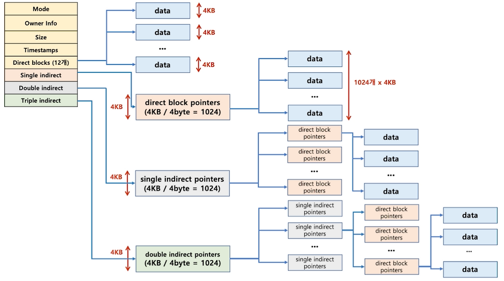

<strong>[linux kernel sourse tree](https://github.com/torvalds/linux)의 깃허브 코드를 참조해 Ext4의 주요 구조체를 정리한 글입니다.</strong>
{: .notice}


> Ext4 주요 구조체 정리
<br/>
[Superblock](https://ajung7038.github.io/file%20system/OS-Ext4-Structure-Superblock/), [inode](https://ajung7038.github.io/file%20system/OS-Ext4-Structure-inode/), [dentry](), [Block Group](), [extent](), [orphan](), [Journal]()

# 📌 Ext4 inode

## 🫧 inode

: 리눅스 파일 시스템에서 파일이나 디렉터리의 메타데이터를 저장하는 데이터 구조

- 크기
- 소유자
- 권한
- 수정 시간

각 파일(또는 디렉터리)은 inode 번호를 할당 받는다.

프로세스가 생성되면 프로세스 id를 할당 받는 것처럼, 파일도 생성과 함께 inode를 할당받으며 이를 통해 파일을 검색하고 액세스하는 것이 가능해진다.

inode가 저장되면 `inode bitmap`에 할당되었음이 표시되고 (0->1) `inode table`의 특정 위치에 해당 inode에 대한 정보가 써지게 된다.

### ✨ inode 블록의 구조



#### 🌙 Direct Blocks(12개)
- 대개 12개의 주소공간을 갖는다
- 각 주소 공간이 실제 데이터 블록을 가리키게 된다.
- 각 데이터 블록은 4KB의 크기를 갖는다
- 12개로 구성되어 있기 때문에 총 48KB 용량의 영역을 갖는다
 
#### 🌙 Single Indirect Block 
- Single indirect block은 1개로 구성되어 있으므로, 총 4kb의 크기를 갖는다
- 데이터 블록의 주소를 가리키는 4byte 단위의 포인터로 구성되어 있다
- 4kb의 공간을 4byte 짜리 포인터로 채운다면, 총 1024개의 포인터를 채울 수 있다
- 1024개의 포인터가 4kb짜리 데이터 블록을 가리키므로, 1024 * 4kb = 4MB의 용량을 관리할 수 있다
 
#### 🌙 Double Indirect Block 
- Double indirect block은 1개로 구성되어 있어, 총 4kb의 크기를 갖는다
- single indirect block을 가리키는 포인터로 구성되어 있다
- 그러므로 1024 * 1024 * 4kb = 4GB의 용량을 관리할 수 있다.
 
#### 🌙 Triple Indirect Block
- Single indirect block, Double indirect block과 동일한 방식으로 작동한다
- Double indirect block을 가리키는 포인터로 구성되어 있다
- 그러므로 1024 * 1024 * 1024 * 4kb = 4TB의 용량을 관리할 수 있다


## 🫧 코드

```java
struct ext4_inode {
	__le16	i_mode;		// 파일 타입 (파일, 디렉터리 등)
	__le16	i_uid;		// owner uid
	__le32	i_size_lo;	// 파일 크기 (하위 32비트)
	__le32	i_atime;	// 마지막 접근 시간
	__le32	i_ctime;	// inode 메타데이터 변경 시간
	__le32	i_mtime;	// 파일 수정 시간
	__le32	i_dtime;	// 삭제 시각 (default = 0)
	__le16	i_gid;		// 그룹 id
	__le16	i_links_count;	// 하드링크 개수 (이 필드가 0이면 삭제로 인식)
	__le32	i_blocks_lo;	// 파일이 차지한 블록 수
	__le32	i_flags;	// 파일 플래그

	__le32	i_block[EXT4_N_BLOCKS];/ // 데이터 블록 주소 (직접/간접/이중/삼중)
	__le32	i_size_high; // 파일 크기 (상위 32비트)
};
```

## 🫧 참고 자료
- [inode block](https://devraphy.tistory.com/250)