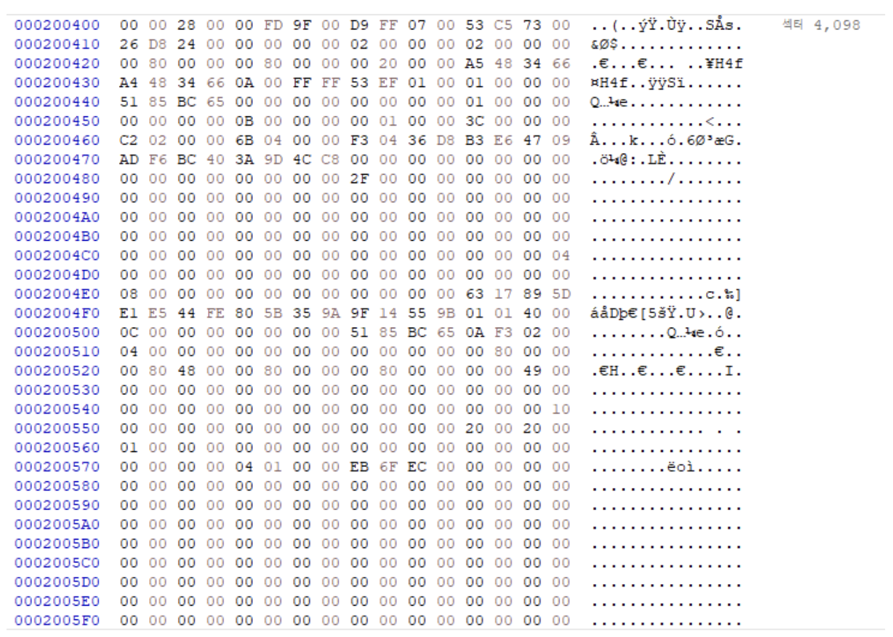

<strong>[linux kernel sourse tree](https://github.com/torvalds/linux)의 깃허브 코드를 참조해 Ext4의 주요 구조체를 정리한 글입니다.</strong>
</br>
Ext4 주요 구조체 정리 : [Superblock](), [inode](), [dentry](), [Block Group](), [extent](), [orphan](), [Journal]()
{: .notice}

# 📌 Ext4 Superblock

## 🫧 Superblock

Superblock은 전체적인 파일 시스템의 정보를 담고 있다.

슈퍼 블록이 손상되면 파일 시스템 전체의 데이터가 날아가는 것이므로 이를 방지하기 위해 여러 개의 블록 그룹에 모두 동일한 값으로 저장한다.

- 총 inode 개수
- 총 블록 수
- 사용 가능한 블록 수
- 사용 중인 블록 수
- 블록 크기

다음은 /fs/ext4/ext4.h, $1304에 위치한 superblock 구조체이다.

편의를 위해 일부 생략하였으므로 전문을 보고 싶으신 분들은 [Linux 오픈소스](https://github.com/torvalds/linux)를 참고해 주세요.

## 🫧 Cluster

: 여러 개의 연속된 블록을 묶은 단위

ext4에서는 클러스터가 블록보다 큰 단위로 사용될 수 있으며, 기본적으로 블록의 크기는 4KB, 클러스터는 이 블록의 묶음으로 정의된다.

클러스터는 큰 저장 공간의 효율적 관리를 위해 사용하며, 한 클러스터의 크기를 블록 크기보다 크게 잡음으로써 보다 적은 메타데이터를 관리할 수 있고, 디스크 입출력을 최적화할 수 있다.

extents와 cluster의 차이점은 [여기]()에서..

## 🫧 코드

- /fs/ext4/ext4/h, $1304

```c
struct ext4_super_block {
/*00*/	__le32	s_inodes_count; // 전체 inode 수
	__le32	s_blocks_count_lo;	// 전체 블록 수
	__le32	s_free_blocks_count_lo;	// 사용 가능한 블록 수
/*10*/	__le32	s_free_inodes_count;	// 사용 가능한 inode 수

	// 실제 데이터가 저장될 수 있는 첫 블록 번호 (0 or 1)
	// 0인 경우 슈퍼 블록은 블록 그룹 0의 블록 1에 위치, 그 이후부터 가용 블록
	// 1인 경우 슈퍼 블록이 블록 그룹 0의 블록 0에 위치, 블록 1부터 가용 블록
	__le32	s_first_data_block;
	__le32	s_log_block_size;	// 블록 크기
	__le32	s_log_cluster_size;	// 클러스터 크기 (로그 단위로 표현)
/*20*/	__le32	s_blocks_per_group;	// 한 블록 그룹에 포함된 블록 개수
	__le32	s_clusters_per_group;	// 한 블록 그룹에 포함된 클러스터 개수
	__le32	s_inodes_per_group;	// 한 블록 그룹에 포함된 inode 개수
	
	__le32	s_mtime;		// 마운트된 시각

	// 마지막으로 파일 시스템이 수정된 시간 (파일 수정 시 이 값도 수정됨)
/*30*/	__le32	s_wtime;		// 마지막 쓰기 시간
	__le16	s_magic;		// 매직 넘버 (ext 계열인지 확인)

	__le32	s_first_ino;		// 사용 가능한 첫 inode 번호 (보통 11부터 시작)
	__le16  s_inode_size;		// inode 구조체 바이트 크기
/*68*/	__u8	s_uuid[16];		// 파일 시스템을 고유하게 식별하기 위한 UUID
/*88*/	char	s_last_mounted[64] __nonstring;	// 마지막 마운트 경로
	
	__u8	s_prealloc_blocks;	// 일반 파일에 대해 미리 할당할 블록 수 (보통 8 블록 할당)
	__u8	s_prealloc_dir_blocks;	// 디렉터리에 대해 미리 할당할 블록 수


/*E0*/	__le32	s_journal_inum;		// 저널의 inode 번호 (일반적으로 8번에 위치 -> 이 부분을 읽어서 저널을 찾아감)
	__le32	s_last_orphan;		// 삭제 예정이지만 아직 닫히지 않은 orphan inode 리스트 시작점
	__le16  s_desc_size;		// 그룹 디스크립터 단위
	__le32	s_first_meta_bg;	// Meta_bg 기능 활성화 경우에 메타 블록 그룹 시작 번호 (그룹 디스크립터 등이 포함된 특수 블록 그룹)

/*150*/
	__le32	s_lpf_ino;		// lost+found 디렉터리의 inode 번호

	__le32  s_orphan_file_inum;	// orphan inode 관리를 위한 orphan file의 inode number
};
```

### ✨ orphan file

> dentry에는 연결되어있지 않지만 아직 살아있는 inode

: 삭제된 파일이지만 파일 시스템에는 여전히 파일 메타데이터가 남아있고, 루트 디렉터리에서 접근할 수 없는 파일

#### 🌙 발생 이유
1. open() 시스템 콜 호출
2. unlink() 시스템 콜 호출
3. 디렉터리 엔트리 삭제
4. <strong>close() 시스템 콜 호출 X?</strong>

그러나 close() 시스템 콜(파일 디스크립터 정리)을 호출하지 않았기 때문에 데이터는 지워지지 않고 디스크 상에 남아 있다.

#### 🌙 접근 방법
- 슈퍼 블록의 s_last_orphan 필드는 linked list 형태로 연결되어 있는 orphan inode들의 시작점을 가리킨다.
- 즉, 이 필드가 0이 아니라면, orphan inode가 존재한다는 뜻이고, 그 inode 안의 i_next_orphan을 따라가면서 다음 orphan inode들을 찾는 방식이다.
<br/> => inode와 관련된 설명은 [여기]()에서..

#### 🌙 파일 복구

만일 다음 조건들이 충족된다면 orphan inode를 통해 파일 복구가 가능할 것이다.

1. 해당 inode가 삭제되지 않은 상태
2. 파일 삭제 직후 시스템의 이유로 아직 완전히 정리되지 않은 상태
<br/>(sync X, mount X)

=> 파일 시스템의 일관성 보장을 위해, mount 시 s_last_orphan이 가리키는 inode들을 순회하며 truncate 실행 후 inode 삭제

### ✨ `s_last_orphan` vs `s_orphan_file_inum`

두 가지 방식 모두 orphan file을 처리하는 방식이지만, 저마다 차이점이 조금씩 존재한다.

#### 🌙 s_last_orphan

- 전통적인 복구 방식을 위한 필드
- linked list의 마지막 inode 번호를 저장
- linked list 형태로 inode를 추적하는 방식
	- 각 orphan_inode 구조체에 i_next_orphan 필드를 통해 다음 inode 번호를 찾아감으로써 파일 복구가 가능

#### 🌙 s_orphan_file_inum
- ext4에 새로 도입된 디렉터리 기반 방식을 위한 필드
- orphan file을 모아두는 디렉터리의 inode 번호 (ext4에서는 디렉터리도 파일로 취급)
	- dentry는 사라졌지만 inode와 블록은 여전히 존재하기 때문에, 커널이 자동으로 할당한 dentry 이름과 inode 번호를 연결하여 새로운 dentry를 만들어 저장
- orphan 전용 디렉터리를 탐색하며 복구 파일을 찾아냄

### ✨ magic number




슈퍼 블록의 크기는 1024 Bytes이며, 파일 시스템의 전반적인 정보를 저장한다.


특히, 시작 지점에서 0x38만큼 앞으로 가면 슈퍼 블록의 매직 넘버를 확인할 수 있다. (0xEF53)

파일의 매직 넘버는 일종의 파일 시그니처로, 이 값으로 파일 시스템을 파악하거나 어떤 포맷인지 식별이 가능하다.

특히, 사진에서 본 것과 같이 슈퍼 블록에서의 매직 넘버 (0xEF53)은 ext 계열 파일 시스템 매직 넘버로, 이를 통해 해당 파일 시스템이 ext 시리즈인 것을 인식할 수 있다.


### ✨ meta block group

일반적인 경우 Group Descriptor Table?은 보통 Block Group 0에 포함되어 있지만, meta_bg 포맷 사용 시 Group Descriptor Table이 각 블록 그룹의 메타 블록 그룹 내 분산 배치된다.

이 경우 몇 번째 블록 그룹부터가 메타 블록 그룹인지 알아야 하는데, 이때 메타 블록 그룹 시작 번호를 포함하는 `s_first_meta_bg` 이 쓰이게 된다.

## 🫧 주의 깊게 보아야 할 점

- 저널도 파일로써 취급되며, 대개 inode 8번에 위치한다.
- `s_journal_inum`을 읽어 저널을 찾아간다. 만일 이 숫자가 손상된다면 시스템에서는 저널에 접근할 수 없다.
- 스냅샷도 inode처럼 관리된다.

## 🫧 참고 자료
- [Orphan File](https://wiki.sleuthkit.org/index.php?title=Orphan_Files)
- [magic number 사진 출처](https://roklcw.tistory.com/65)
[슈퍼블록 오프셋 구조](https://yum-history.tistory.com/249)