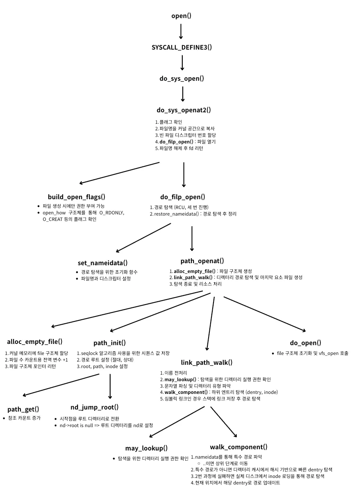
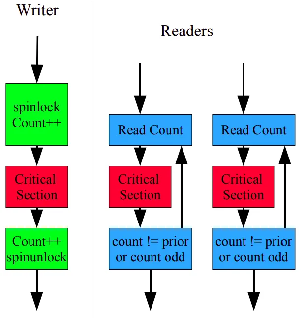
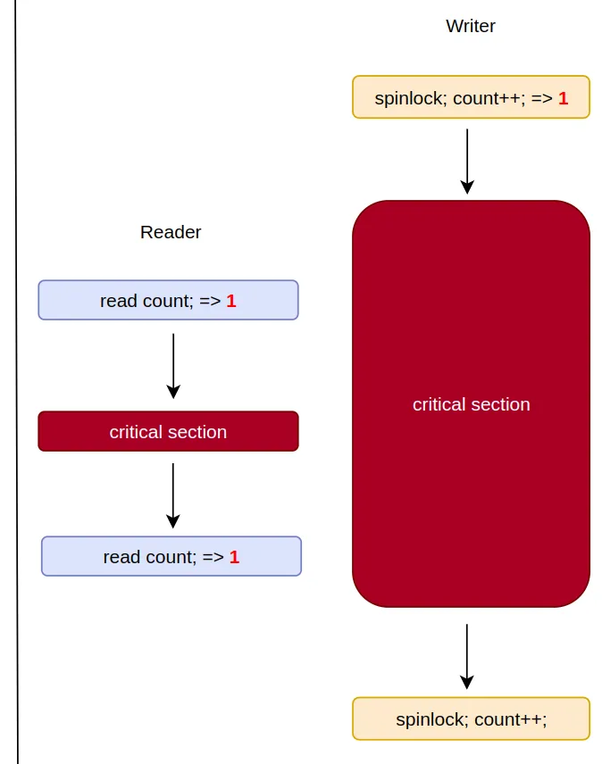

<strong>[linux kernel sourse tree](https://github.com/torvalds/linux)의 깃허브 코드를 참조해 시스템 콜 호출 시 변화 과정을 분석한 글입니다.</strong>
{: .notice}

# 📌 open()

- 파일 시스템을 지정된 디렉터리 (마운트 포인트)에 연결하는 작업을 수행하는 함수
- 운영체제가 파일 시스템의 데이터를 디렉터리 트리 구조에 통합하도록 함

## 🫧 과정



1. 빈 파일 디스크립터 번호 할당
2. 파일 구조체 생성 및 디렉터리 경로 탐색
3. 마지막 요소 파일 구조체 생성 및 할당

## 🫧 특징

- 경로 탐색 과정에서 mount()와 동일한 함수 공유 (link_path_walk, restore_nameidata 등)
- 경로 탐색 과정에서 seqlock 알고리즘 사용

### ✨ seqlock 알고리즘
- 2.6 커널에 등장한 lock-free 동기화 메커니즘
- sequence counter을 통해 동기화 구현
- 스핀락, 쓰기 우선
    


#### writer

- 들어갈 때 count++
- 나올 때도 count++
- 이를 통해 들어갈 때 홀수, 나올 때 짝수로 만듦.


#### reader

- CS에서 나오기 전과 후의 시퀀스 넘버를 확인함
- 일치하면&짝수이면 유효한 값
- 일치하지 않으면 다시 시도 (스핀락) ⇒ 이 때문에 간접적으로 공유 변수를 수정하는 RCU 알고리즘 사용

#### 💡 왜 짝수인지 검사할까?
                


- 다음과 같은 상황을 방지하기 위함!
	- writer가 먼저 홀수로 바꿨기 때문에 결과적으로 Reader은 무효
                

    
### ✨ seqlock vs RCU (Seqlock을 쓰는 경우)
1. 데이터가 복잡 or 포인터가 아님
    - 일반적으로 RCU는 포인터를 따라가며 탐색하므로 포인터가 아닌 경우 빠른 읽기를 위해 seqlock을 사용함
2. 쓰기 경쟁이 적고 다시 읽을 수 있는 경우
    - RCU는 쓰기 비용이 큼. (RCU에서 쓰기는 락을 걺)
    - seqlock에서는 스핀락 + 시퀀스 번호 변경만 있으면 됨
- symlink도 파일 시스템 상에서는 dentry 객체로 표현

## 🫧 사용 예시 (코드)

```c
#include <fcntl.h>
#include <stdio.h>
#include <stdlib.h>
#include <unistd.h>
#include <sys/stat.h>
#include <sys/types.h>

int main(int argc, char *argv) {
        int fd = open("test", O_RDONLY); // 파일명, 모드

        if (fd < 0) {
                perror("Opening of the file is failed\n");
        }
        else {
                printf("file sucessfully opened\n");
        }

        close(fd); 
        return 0;
}
```

## 🫧 코드

### ✨ SYSCALL_DEFINE3

- linux/fs/open.c, $1421

```c
SYSCALL_DEFINE3(open, const char __user *, filename, int, flags, umode_t, mode)
{
	if (force_o_largefile())
		flags |= O_LARGEFILE;
	return **do_sys_open(AT_FDCWD, filename, flags, mode)**;
}
```

### ✨ do_sys_open()
- linux/fs/open.c, $1414

```c
long do_sys_open(int dfd, const char __user *filename, int flags, umode_t mode)
{
	struct open_how how = build_open_how(flags, mode);
	return **do_sys_openat2(dfd, filename, &how)**;
}
```

### ✨ do_sys_openat2()
- 디스크립터 번호 할당

- linux/fs/open.c, $1386

```c
static long do_sys_openat2(int dfd, const char __user *filename,
			   struct open_how *how)
{
	struct open_flags op;
	**// 1. 플래그 확인**
	int fd = **build_open_flags(how, &op)**;
	struct filename *tmp;

	if (fd)
		return fd;

	**// 2. 파일명을 커널 공간으로 복사**
	tmp = getname(filename);
	if (IS_ERR(tmp))
		return PTR_ERR(tmp);
	
	**// 3. 빈 파일디스크립터 번호 할당**
	fd = get_unused_fd_flags(how->flags);
	if (fd >= 0) {
		**// 4. 파일 열기**
		struct file *f = **do_filp_open(dfd, tmp, &op)**;
		if (IS_ERR(f)) {
			put_unused_fd(fd);
			fd = PTR_ERR(f);
		} else {
			fd_install(fd, f);
		}
	}
	**// 5. 파일명 해제 후 fd 리턴**
	putname(tmp);
	return fd;
}
```

### ✨ build_open_flags()

- 플래그 설정

- fs/open.c, $1202

```c

// how : O_RDONLY, O_CREAT 등이 포함
inline int build_open_flags(const struct open_how *how, struct open_flags *op)
{
	u64 flags = how->flags;
	u64 strip = __FMODE_NONOTIFY | O_CLOEXEC;
	int lookup_flags = 0;
	int acc_mode = ACC_MODE(flags);

	BUILD_BUG_ON_MSG(upper_32_bits(VALID_OPEN_FLAGS),
			 "struct open_flags doesn't yet handle flags > 32 bits");

	/*
	 * Strip flags that either shouldn't be set by userspace like
	 * FMODE_NONOTIFY or that aren't relevant in determining struct
	 * open_flags like O_CLOEXEC.
	 */
	flags &= ~strip;

	/*
	 * Older syscalls implicitly clear all of the invalid flags or argument
	 * values before calling build_open_flags(), but openat2(2) checks all
	 * of its arguments.
	 */
	if (flags & ~VALID_OPEN_FLAGS)
		return -EINVAL;
	if (how->resolve & ~VALID_RESOLVE_FLAGS)
		return -EINVAL;

	/* Scoping flags are mutually exclusive. */
	if ((how->resolve & RESOLVE_BENEATH) && (how->resolve & RESOLVE_IN_ROOT))
		return -EINVAL;

	/* Deal with the mode. */
	
	**// 파일 생성 시에만 권한 정보를 줄 수 있음 (퍼미션 비트)**
	if (WILL_CREATE(flags)) {
		if (how->mode & ~S_IALLUGO)
			return -EINVAL;
		op->mode = how->mode | S_IFREG;
	} else {
		if (how->mode != 0)
			return -EINVAL;
		op->mode = 0;
	}

	/*
	 * Block bugs where O_DIRECTORY | O_CREAT created regular files.
	 * Note, that blocking O_DIRECTORY | O_CREAT here also protects
	 * O_TMPFILE below which requires O_DIRECTORY being raised.
	 */
	if ((flags & (O_DIRECTORY | O_CREAT)) == (O_DIRECTORY | O_CREAT))
		return -EINVAL;

	/* Now handle the creative implementation of O_TMPFILE. */
	if (flags & __O_TMPFILE) {
		/*
		 * In order to ensure programs get explicit errors when trying
		 * to use O_TMPFILE on old kernels we enforce that O_DIRECTORY
		 * is raised alongside __O_TMPFILE.
		 */
		if (!(flags & O_DIRECTORY))
			return -EINVAL;
		if (!(acc_mode & MAY_WRITE))
			return -EINVAL;
	}
	if (flags & O_PATH) {
		/* O_PATH only permits certain other flags to be set. */
		if (flags & ~O_PATH_FLAGS)
			return -EINVAL;
		acc_mode = 0;
	}

	/*
	 * O_SYNC is implemented as __O_SYNC|O_DSYNC.  As many places only
	 * check for O_DSYNC if the need any syncing at all we enforce it's
	 * always set instead of having to deal with possibly weird behaviour
	 * for malicious applications setting only __O_SYNC.
	 */
	if (flags & __O_SYNC)
		flags |= O_DSYNC;

	op->open_flag = flags;

	/* O_TRUNC implies we need access checks for write permissions */
	if (flags & O_TRUNC)
		acc_mode |= MAY_WRITE;

	/* Allow the LSM permission hook to distinguish append
	   access from general write access. */
	if (flags & O_APPEND)
		acc_mode |= MAY_APPEND;

	op->acc_mode = acc_mode;

	op->intent = flags & O_PATH ? 0 : LOOKUP_OPEN;

	if (flags & O_CREAT) {
		op->intent |= LOOKUP_CREATE;
		if (flags & O_EXCL) {
			op->intent |= LOOKUP_EXCL;
			flags |= O_NOFOLLOW;
		}
	}

	if (flags & O_DIRECTORY)
		lookup_flags |= LOOKUP_DIRECTORY;
	if (!(flags & O_NOFOLLOW))
		lookup_flags |= LOOKUP_FOLLOW;

	if (how->resolve & RESOLVE_NO_XDEV)
		lookup_flags |= LOOKUP_NO_XDEV;
	if (how->resolve & RESOLVE_NO_MAGICLINKS)
		lookup_flags |= LOOKUP_NO_MAGICLINKS;
	if (how->resolve & RESOLVE_NO_SYMLINKS)
		lookup_flags |= LOOKUP_NO_SYMLINKS;
	if (how->resolve & RESOLVE_BENEATH)
		lookup_flags |= LOOKUP_BENEATH;
	if (how->resolve & RESOLVE_IN_ROOT)
		lookup_flags |= LOOKUP_IN_ROOT;
	if (how->resolve & RESOLVE_CACHED) {
		/* Don't bother even trying for create/truncate/tmpfile open */
		if (flags & (O_TRUNC | O_CREAT | __O_TMPFILE))
			return -EAGAIN;
		lookup_flags |= LOOKUP_CACHED;
	}

	op->lookup_flags = lookup_flags;
	return 0;
}
```

### ✨ do_filp_open()
- 파일 경로 탐색 및 file 구조체 생성 함수

- /fs/namei.c, $4006

```c
// 디렉터리 파일 디스크립터, 경로, 설정
struct file *do_filp_open(int dfd, struct filename *pathname,
		const struct open_flags *op)
{
	// 탐색을 위한 구조체
	struct nameidata nd;
	int flags = op->lookup_flags;
	struct file *filp;

	**// 1. 경로 탐색 (RCU, 세 번의 탐색)**
	**set_nameidata(&nd, dfd, pathname, NULL)**;
	filp = **path_openat(&nd, op, flags | LOOKUP_RCU)**;
	// 첫 번째 시도
	if (unlikely(filp == ERR_PTR(-ECHILD)))
		filp = path_openat(&nd, op, flags);
	// 두 번째 시도
	if (unlikely(filp == ERR_PTR(-ESTALE)))
		filp = path_openat(&nd, op, flags | LOOKUP_REVAL);
	// 경로 탐색 후 정리
	restore_nameidata();
	return filp;
}
```

### ✨ set_nameidata()
- 경로 탐색을 위한 초기화 함수 (파일명, 디스크립터 설정)

- /fs/namei.c, $675

```c
static inline void set_nameidata(struct nameidata *p, int dfd, struct filename *name,
			  const struct path *root)
{
	**__set_nameidata(p, dfd, name)**;
	p->state = 0;
	if (unlikely(root)) {
		p->state = ND_ROOT_PRESET;
		p->root = *root;
	}
}
```

### ✨ __set_nameidata()

- 초기화 및 파일 디스크립터 설정

- /fs/namei.c, $660

```c
static void __set_nameidata(struct nameidata *p, int dfd, struct filename *name)
{
	struct nameidata *old = current->nameidata;
	p->stack = p->internal;
	p->depth = 0;
	p->dfd = dfd;
	p->name = name;
	p->pathname = likely(name) ? name->name : "";
	p->path.mnt = NULL; // 마운트 지점 초기화
	p->path.dentry = NULL; // 디엔트리 초기화
	p->total_link_count = old ? old->total_link_count : 0;
	p->saved = old;
	current->nameidata = p;
}
```

### ✨ path_openat()
- 구조체 할당 및 탐색

- /fs/namei.c, $3977

```c
static struct file *path_openat(struct nameidata *nd,
			const struct open_flags *op, unsigned flags)
{
	struct file *file;
	int error;

	**// 1. file 구조체 할당**
	file = **alloc_empty_file(op->open_flag, current_cred())**;
	if (IS_ERR(file))
		return file;

	if (unlikely(file->f_flags & __O_TMPFILE)) {
		error = do_tmpfile(nd, flags, op, file);
	} else if (unlikely(file->f_flags & O_PATH)) {
		error = do_o_path(nd, flags, file);
	} else {
		const char *s = **path_init(nd, flags)**;
		**// 2. 디렉터리 경로 탐색 및 마지막 요소 파일 생성/확인**
		while (!(error = **link_path_walk(s, nd))** &&
						// link_path_walk로 찾은 마지막 파일에 대한 기본 설정
		       (s = open_last_lookups(nd, file, op)) != NULL)
			;
		if (!error)
			error = **do_open(nd, file, op)**;
		**// 3. 탐색 종료 및 리소스 처리**
		terminate_walk(nd);
	}
	if (likely(!error)) {
		if (likely(file->f_mode & FMODE_OPENED))
			return file;
		WARN_ON(1);
		error = -EINVAL;
	}
	fput(file);
	if (error == -EOPENSTALE) {
		if (flags & LOOKUP_RCU)
			error = -ECHILD;
		else
			error = -ESTALE;
	}
	return ERR_PTR(error);
}
```

### ✨ alloc_empty_file()

- 파일 구조체 생성 함수

- /fs/file_table.c, $210

```c
struct file *alloc_empty_file(int flags, const struct cred *cred)
{
	static long old_max;
	struct file *f;
	int error;

	/*
	 * Privileged users can go above max_files
	 */
	if (get_nr_files() >= files_stat.max_files && !capable(CAP_SYS_ADMIN)) {
		/*
		 * percpu_counters are inaccurate.  Do an expensive check before
		 * we go and fail.
		 */
		if (percpu_counter_sum_positive(&nr_files) >= files_stat.max_files)
			goto over;
	}

	**// 1. 커널 메모리에 file 구조체 할당**
	f = kmem_cache_alloc(filp_cachep, GFP_KERNEL);
	if (unlikely(!f))
		return ERR_PTR(-ENOMEM);

	error = init_file(f, flags, cred);
	if (unlikely(error)) {
		kmem_cache_free(filp_cachep, f);
		return ERR_PTR(error);
	}

	**// 2. 파일 수를 카운트하는 전역 변수 ++;**
	percpu_counter_inc(&nr_files);

	**// 3. 파일 구조체 포인터 리턴**
	return f;

over:
	/* Ran out of filps - report that */
	if (get_nr_files() > old_max) {
		pr_info("VFS: file-max limit %lu reached\n", get_max_files());
		old_max = get_nr_files();
	}
	return ERR_PTR(-ENFILE);
}
```

### ✨ path_init()

- 경로 탐색 시작점 결정 (절대 경로 || 상대 경로)

- fs/namei.c, $2498

```c
/* must be paired with terminate_walk() */
static const char *path_init(struct nameidata *nd, unsigned flags)
{
	int error;
	const char *s = nd->pathname;

	/* LOOKUP_CACHED requires RCU, ask caller to retry */
	// RCU 초기화
	if ((flags & (LOOKUP_RCU | LOOKUP_CACHED)) == LOOKUP_CACHED)
		return ERR_PTR(-EAGAIN);

	if (!*s)
		flags &= ~LOOKUP_RCU;
	if (flags & LOOKUP_RCU)
		rcu_read_lock();
	else
		nd->seq = nd->next_seq = 0;

	nd->flags = flags;
	nd->state |= ND_JUMPED;

	// **1. seqlock 알고리즘 사용을 위해 시퀀스 값 저장**
	nd->m_seq = __read_seqcount_begin(&mount_lock.seqcount);
	nd->r_seq = __read_seqcount_begin(&rename_lock.seqcount);
	smp_rmb();

	// **2. 경로 루트 설정**
	if (nd->state & ND_ROOT_PRESET) {
		struct dentry *root = nd->root.dentry;
		struct inode *inode = root->d_inode;
		// dentry에 하위 디렉터리가 있는지 확인
		if (*s && unlikely(!d_can_lookup(root)))
			return ERR_PTR(-ENOTDIR);
		nd->path = nd->root;
		nd->inode = inode;
		if (flags & LOOKUP_RCU) {
		**// RCU + seqlock 함께 사용 => 빠르게 읽고, 유효성 검사 진행**
			nd->seq = read_seqcount_begin(&nd->path.dentry->d_seq);
			nd->root_seq = nd->seq;
		} else {
			**path_get(&nd->path)**;
		}
		return s;
	}

	nd->root.mnt = NULL;

	/* Absolute pathname -- fetch the root (LOOKUP_IN_ROOT uses nd->dfd). */
	**// 절대 경로**
	if (*s == '/' && !(flags & LOOKUP_IN_ROOT)) {
		**// 시작점을 루트 디렉터리로 전환**
		error = **nd_jump_root(nd)**;
		if (unlikely(error))
			return ERR_PTR(error);
		return s;
	}

	/* Relative pathname -- get the starting-point it is relative to. */
	**// 상대 경로**
	if (nd->dfd == AT_FDCWD) {
		if (flags & LOOKUP_RCU) {
			struct fs_struct *fs = current->fs;
			unsigned seq;

			do {
				seq = read_seqcount_begin(&fs->seq);
				nd->path = fs->pwd;
				nd->inode = nd->path.dentry->d_inode;
				nd->seq = __read_seqcount_begin(&nd->path.dentry->d_seq);
			} while (read_seqcount_retry(&fs->seq, seq));
		} else {
			// 현재 작업 디렉터리
			// 이때도 락 잡음
			get_fs_pwd(current->fs, &nd->path);
			// 디엔트리 따라가며 탐색
			nd->inode = nd->path.dentry->d_inode;
		}
	} else {
		/* Caller must check execute permissions on the starting path component */
		CLASS(fd_raw, f)(nd->dfd);
		struct dentry *dentry;

		if (fd_empty(f))
			return ERR_PTR(-EBADF);

		if (flags & LOOKUP_LINKAT_EMPTY) {
			if (fd_file(f)->f_cred != current_cred() &&
			    !ns_capable(fd_file(f)->f_cred->user_ns, CAP_DAC_READ_SEARCH))
				return ERR_PTR(-ENOENT);
		}

		dentry = fd_file(f)->f_path.dentry;

		if (*s && unlikely(!d_can_lookup(dentry)))
			return ERR_PTR(-ENOTDIR);

		nd->path = fd_file(f)->f_path;
		if (flags & LOOKUP_RCU) {
			nd->inode = nd->path.dentry->d_inode;
			nd->seq = read_seqcount_begin(&nd->path.dentry->d_seq);
		} else {
			path_get(&nd->path);
			nd->inode = nd->path.dentry->d_inode;
		}
	}

	/* For scoped-lookups we need to set the root to the dirfd as well. */
	if (flags & LOOKUP_IS_SCOPED) {
		nd->root = nd->path;
		if (flags & LOOKUP_RCU) {
			nd->root_seq = nd->seq;
		} else {
			path_get(&nd->root);
			nd->state |= ND_ROOT_GRABBED;
		}
	}
	return s;
}
```

### ✨ path_get()
- 참조 카운트 증가

```c
void path_get(const struct path *path)
{
	mntget(path->mnt);
	dget(path->dentry);
}
EXPORT_SYMBOL(path_get);
```

### ✨ nd_jump_root()
- 시작점을 루트 디렉터리로 전환

- /fs/namei.c, $1024

```c
static int nd_jump_root(struct nameidata *nd)
{
	if (unlikely(nd->flags & LOOKUP_BENEATH))
		return -EXDEV;
	if (unlikely(nd->flags & LOOKUP_NO_XDEV)) {
		/* Absolute path arguments to path_init() are allowed. */
		if (nd->path.mnt != NULL && nd->path.mnt != nd->root.mnt)
			return -EXDEV;
	}
	if (!nd->root.mnt) {
		// nd -> root가 비어있을 때 루트 디렉터리를 nd로 설정
		int error = set_root(nd);
		if (error)
			return error;
	}
	if (nd->flags & LOOKUP_RCU) {
		struct dentry *d;
		nd->path = nd->root;
		d = nd->path.dentry;
		nd->inode = d->d_inode;
		nd->seq = nd->root_seq;
		if (read_seqcount_retry(&d->d_seq, nd->seq))
			return -ECHILD;
	} else {
		path_put(&nd->path);
		nd->path = nd->root;
		path_get(&nd->path);
		nd->inode = nd->path.dentry->d_inode;
	}
	nd->state |= ND_JUMPED;
	return 0;
}
```

### ✨ link_path_walk()
- dentry를 따라가며 경로 탐색 및 구성

- /fs/namei.c, $2402

```c
static int link_path_walk(const char *name, struct nameidata *nd)
{
	int depth = 0; // depth <= nd->depth
	int err;

	nd->last_type = LAST_ROOT;
	nd->flags |= LOOKUP_PARENT;
	if (IS_ERR(name))
		return PTR_ERR(name);
		**// 1. 이름 전처리**
	while (*name=='/')
		name++;
	if (!*name) {
		nd->dir_mode = 0; // short-circuit the 'hardening' idiocy
		return 0;
	}

	/* At this point we know we have a real path component. */
	for(;;) {
		struct mnt_idmap *idmap;
		const char *link;
		unsigned long lastword;

		// 사용자 환경에 맞춘 id 재매핑(리마운트) 을 위해 필요 (ex, 컨테이너)
		// https://lwn.net/Articles/837566/
		idmap = mnt_idmap(nd->path.mnt);
		**// 2. 탐색을 위한 디렉터리 실행 권한 확인**
		err = **may_lookup(idmap, nd)**;
		if (err)
			return err;

		nd->last.name = name;
		name = hash_name(nd, name, &lastword);
		**// 3. 문자열 파싱 및 디렉터리 유형 파악 (., .., 일반)**
		switch(lastword) {
		// ..
		case LAST_WORD_IS_DOTDOT:
			nd->last_type = LAST_DOTDOT;
			nd->state |= ND_JUMPED;
			break;
	
		// .
		case LAST_WORD_IS_DOT:
			nd->last_type = LAST_DOT;
			break;

		default:
			nd->last_type = LAST_NORM;
			nd->state &= ~ND_JUMPED;

			struct dentry *parent = nd->path.dentry;
			if (unlikely(parent->d_flags & DCACHE_OP_HASH)) {
				err = parent->d_op->d_hash(parent, &nd->last);
				if (err < 0)
					return err;
			}
		}

		if (!*name)
			goto OK;
		/*
		 * If it wasn't NUL, we know it was '/'. Skip that
		 * slash, and continue until no more slashes.
		 */
		do {
			name++;
		} while (unlikely(*name == '/'));
		if (unlikely(!*name)) {
OK:
			/* pathname or trailing symlink, done */
			// 스택이 비어 있다면 탐색 종료
			.. 아니면 스택 --하고 해당 링크 재탐색
			if (!depth) {
				nd->dir_vfsuid = i_uid_into_vfsuid(idmap, nd->inode);
				nd->dir_mode = nd->inode->i_mode;
				nd->flags &= ~LOOKUP_PARENT;
				return 0;
			}
			/* last component of nested symlink */
			name = nd->stack[--depth].name;
			**// 4. 하위 엔트리 탐색 (dentry, inode 탐색)**
			link = **walk_component(nd, 0)**;
		} else {
			/* not the last component */
			link = walk_component(nd, WALK_MORE);
		}
		
		**// 5. 심볼릭 링크인 경우 스택에 링크 저장 후 경로 탐색**
		if (unlikely(link)) {
			if (IS_ERR(link))
				return PTR_ERR(link);
			/* a symlink to follow */
			nd->stack[depth++].name = name;
			name = link;
			continue;
		}
		if (unlikely(!d_can_lookup(nd->path.dentry))) {
			if (nd->flags & LOOKUP_RCU) {
				// RCU 일시중지
				if (!try_to_unlazy(nd))
					return -ECHILD;
			}
			return -ENOTDIR;
		}
	}
}
```

### ✨ may_lookup()
- 탐색을 위한 디렉터리 실행 권한 확인

- fs/namei.c, $1813

```c
static inline int may_lookup(struct mnt_idmap *idmap,
			     struct nameidata *restrict nd)
{
	int err, mask;

	// RCU 모드는 모든 블로킹을 피해야 하므로 검사하지 않는다는 MAY_NOT_BLOCK 플래그 추가
	mask = nd->flags & LOOKUP_RCU ? MAY_NOT_BLOCK : 0;
	// exec 권한 검사
	err = inode_permission(idmap, nd->inode, mask | MAY_EXEC);
	if (likely(!err))
		return 0;

	// If we failed, and we weren't in LOOKUP_RCU, it's final
	if (!(nd->flags & LOOKUP_RCU))
		return err;

	// Drop out of RCU mode to make sure it wasn't transient
	if (!try_to_unlazy(nd))
		return -ECHILD;	// redo it all non-lazy

	if (err != -ECHILD)	// hard error
		return err;

	return inode_permission(idmap, nd->inode, MAY_EXEC);
}
```

### ✨ walk_component()
- 경로 파악 및 dentry 탐색

- /fs/namei.c, $2097

```c
static const char *walk_component(struct nameidata *nd, int flags)
{
	struct dentry *dentry;
	/*
	 * "." and ".." are special - ".." especially so because it has
	 * to be able to know about the current root directory and
	 * parent relationships.
	 */
	 
	**// 1. nameidata에 저장된 경로를 통해 ., .. 등의 특수 경로 파악**
	if (unlikely(nd->last_type != LAST_NORM)) {
		if (!(flags & WALK_MORE) && nd->depth)
			put_link(nd);
		**// 1-1. ..이면 상위 단계로 거슬러 올라가기**
		return handle_dots(nd, nd->last_type);
	}
	
	**// 2. 특수 경로가 아니면 디렉터리 캐시에서 해시 기반으로 빠른 dentry 탐색 (디스크 I/O X)**
	dentry = lookup_fast(nd);
	if (IS_ERR(dentry))
		return ERR_CAST(dentry);
		**// 3. 2번 과정에 실패하면 실제 디스크에서 inode 로딩을 통해 경로 탐색**
	if (unlikely(!dentry)) {
		dentry = lookup_slow(&nd->last, nd->path.dentry, nd->flags);
		if (IS_ERR(dentry))
			return ERR_CAST(dentry);
	}
	if (!(flags & WALK_MORE) && nd->depth)
		put_link(nd);
	**// 4. 현재 위치에서 해당 dentry로 경로 업데이트**
	return step_into(nd, flags, dentry);
}
```

### ✨ do_open()
- 실제 파일 열기 작업을 수행하는 함수

```c
static int do_open(struct nameidata *nd,
		   struct file *file, const struct open_flags *op)
{
	struct mnt_idmap *idmap;
	int open_flag = op->open_flag;
	bool do_truncate;
	int acc_mode;
	int error;

	if (!(file->f_mode & (FMODE_OPENED | FMODE_CREATED))) {
		error = complete_walk(nd);
		if (error)
			return error;
	}
	if (!(file->f_mode & FMODE_CREATED))
		audit_inode(nd->name, nd->path.dentry, 0);
	idmap = mnt_idmap(nd->path.mnt);
	if (open_flag & O_CREAT) {
		if ((open_flag & O_EXCL) && !(file->f_mode & FMODE_CREATED))
			return -EEXIST;
		if (d_is_dir(nd->path.dentry))
			return -EISDIR;
		error = may_create_in_sticky(idmap, nd,
					     d_backing_inode(nd->path.dentry));
		if (unlikely(error))
			return error;
	}
	if ((nd->flags & LOOKUP_DIRECTORY) && !d_can_lookup(nd->path.dentry))
		return -ENOTDIR;

	do_truncate = false;
	acc_mode = op->acc_mode;
	if (file->f_mode & FMODE_CREATED) {
		/* Don't check for write permission, don't truncate */
		open_flag &= ~O_TRUNC;
		acc_mode = 0;
	} else if (d_is_reg(nd->path.dentry) && open_flag & O_TRUNC) {
		error = mnt_want_write(nd->path.mnt);
		if (error)
			return error;
		do_truncate = true;
	}
	
	**// file 구조체 초기화 및 vfs_open**
	error = may_open(idmap, &nd->path, acc_mode, open_flag);
	if (!error && !(file->f_mode & FMODE_OPENED))
		error = vfs_open(&nd->path, file);
	if (!error)
		error = security_file_post_open(file, op->acc_mode);
	if (!error && do_truncate)
		error = handle_truncate(idmap, file);
	if (unlikely(error > 0)) {
		WARN_ON(1);
		error = -EINVAL;
	}
	if (do_truncate)
		mnt_drop_write(nd->path.mnt);
	return error;
}
```

## 🫧 참고 자료

- [코드 사용 예제](https://0xax.gitbooks.io/linux-insides/content/SysCall/linux-syscall-5.html?utm_source=chatgpt.com)
- [seqlock 참고자료](https://yohda.tistory.com/entry/%EB%A6%AC%EB%88%85%EC%8A%A4-%EC%BB%A4%EB%84%90-Synchronization-sequential-locks)