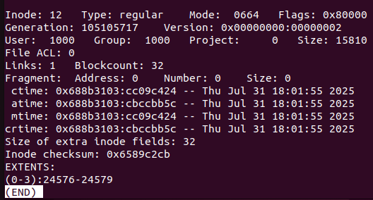
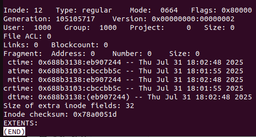

<strong>[Ext4Magic](https://github.com/gktrk/ext4magic)의 깃허브 코드를 참조해 분석한 글입니다.</strong>
{: .notice}

# 📌 Ext4Magic 파일 복구 실험

## 🫧 실험 시나리오 준비

본 환경은 단일 파일에서 이루어진다.

크게는 파일 삭제/복구 시 변화하는 inode, dentry 관찰부터, dentry 제거 후 복원, i_block 사이즈 초기화 후 복원 등 비트의 조작을 통해 파일 복구 시 필요한 필수적인 요소들에 대해 알아볼 예정이다.

### ✨ 복구 환경

- <strong>OS</strong>: Ubuntu 22.04 LTS
- <strong>FS</strong>: ext4
- <strong>Partition</strong>: 100MB
- <strong>File Type</strong>: .png
- <strong>File Size</strong>: 16KB (4블록 할당)
- <strong>Journal Size</strong>: 4MB
- 단일 파일 대상의 삭제/복구 실험

저널에 관해서 테스트할 때 최대한 변수를 통제하기 위해 동일한 명령어로 `저널 활성화 이미지`와 `저널 비활성화 이미지`를 뜬다.

이후, 저널 활성화 이미지에서 비트 조작을 통해 저널을 밀어 `저널을 인위적으로 삭제한 경우`도 함께 보고자 한다.


#### 📌 실험 세팅
1. `sudo dd if=/dev/zero of=journal_disk.img bs=4096 count=25600`로 이미지 파일 생성
2. sudo losetup -fP test_disk.img
3. sudo fdisk -l
4. sudo fdisk /dev/loopXX
<br/>-> n, p, enter, enter, enter, w

5. sudo fdisk -l
6. 파일 시스템 생성
<br/>-> `저널 활성화` : `sudo mkfs.ext4 /dev/loop14p1`
<br/>-> `저널 비활성화` : `sudo mkfs.ext4 /dev/loop14p1 -O ^has_journal`

7. sudo mkdir /mnt/journal_disk
8. sudo mount /dev/loop15p1 /mnt/journal_disk
9. cd /mnt/journal_disk
10. sudo chmod 777 /mnt/journal_disk
11. 파일 생성
<br/> -> `작은 파일인 경우` : `convert -size 64x64 canvas:blue test.png` 파일 생성
<br/> -> `큰 파일인 경우` : cp ~/ext4magic_test/testfile.pdf . (큰 파일의 경우 15.8KB로 세팅)

12. `sync`
13. `이미지 뜨기` : sudo dd if=/dev/loop15p1 of=~/ext4magic_test/cretae_journal.img bs=4096 count=25600
14. `rm` 명령어로 png 파일 삭제
15. `sync`
16. 13번처럼 똑같이 `이미지 뜨기`

#### 📌 [실험 3] 저널 비활성화 상태의 이미지
1. [실험 1] 저널 활성화 상태의 이미지의 바이트를 조작해 8번 inode (저널이 위치하는 inode)를 0으로 초기화

이미지 파일 생성부터 mount까지의 과정 (과정 1~3)은 [다음 정리본](https://ajung7038.github.io/file%20forensic/FS-%EA%B0%80%EC%83%81-%EB%94%94%EC%8A%A4%ED%81%AC-%EC%83%9D%EC%84%B1/)에 나와 있다.


## 🫧 [실험 1] 저널 활성화 상태의 이미지 분석

### ✨ 파일 삭제 전/후 변화 실험 시나리오

1. 파일 생성
2. 파일 삭제 시 `block bitmap`, `inode bitmap`, `inode table`, `directory entry` 변화 관찰
	- debugfs, xxd, hexdump 사용

확인 지점
- inode bitmap: 1 → 0으로 변경되는지
- block bitmap: 사용 중이던 블록이 free 되었는지
- inode 테이블: i_mode, i_links_count, i_dtime 변화 확인
- dentry: 이름이 삭제되었는지, ext4_delete_entry() 흔적


#### 📌 debugfs로 파일 시스템 내부 구조 분석하기

- 파일을 지우기 전 inode 상태


- 파일을 지운 후 inode 상태


#### inode table

```
-0001e000: ff0f 0000 0000 0000 0000 0000 0000 0000  ................
+0001e000: ff07 0000 0000 0000 0000 0000 0000 0000  ................
```

`0xff0f -> 0xff07`로 1 -> 0으로 inode 비트맵이 변화되었음을 알 수 있다.

#### inode bitmap

```
-0000ec00: 0f00 0000 0000 0000 0000 0000 0000 0000  ................
+0000ec00: 0000 0000 0000 0000 0000 0000 0000 0000  ................
```

0f00 -> 0000 으로 변화하였음을 알 수 있다.

inode가 삭제되었다고 해서 inode 자체가 밀리는 것은 아니다. 이 과정에서 i_mode, i_dtime 등이 변화하였음을 알 수 있다.

#### dentry

```
-0000f010: 0c00 0202 2e2e 0000 0b00 0000 1400 0a02  ................
-0000f020: 6c6f 7374 2b66 6f75 6e64 0000 0c00 0000  lost+found......
-0000f030: `c80f` `0c01` 7465 7374 6669 6c65 2e70 6466  ....testfile.pdf
+0000f010: 0c00 0202 2e2e 0000 0b00 0000 `dc0f` 0a02  ................
+0000f020: 6c6f 7374 2b66 6f75 6e64 0000 `0000` 0000  lost+found......
+0000f030: 0000 0000 0000 0000 0000 0000 0000 0000  ................
```
testfile의 dentry가 삭제됐음을 확인할 수 있다.

디렉터리 블록에서 파일명이 제거되었으며, `c80f`는 inode 번호, `0c01`은 레코드 길이 및 파일 타입을 의미한다.

#### journal

```
-00024000: 0000 0000 0000 0000 0000 0000 0000 0000  ................
-00024010: 0000 0000 0000 0000 0000 0000 0000 0000  ................
-00024020: 0000 0000 0000 0000 0000 0000 0000 0000  ................
-00024030: 0000 0000 0000 0000 0000 0000 0000 0000  ................
-00024040: 0000 0000 0000 0000 0000 0000 0000 0000  ................
-00024050: 0000 0000 0000 0000 0000 0000 0000 0000  ................
-00024060: 0000 0000 0000 0000 0000 0000 0000 0000  ................
-00024070: 0000 0000 0000 0000 0000 0000 0000 0000  ................
+00024000: c03b 3998 0000 0001 0000 0005 0000 000f  .;9.............
+00024010: 0000 0000 0000 0000 9459 1f45 0000 0000  .........Y.E....
+00024020: 0000 0000 0000 0000 0000 0000 0000 002e  ................
+00024030: 0000 0002 0000 0000 272e cac6 0000 0000  ........'.......
+00024040: 0000 0002 0000 0000 6f2c 7765 0000 000e  ........o,we....
+00024050: 0000 0002 0000 0000 58cb 50c4 0000 0001  ........X.P.....
+00024060: 0000 0002 0000 0000 ae39 0357 0000 001e  .........9.W....
+00024070: 0000 000a 0000 0000 b545 f63f 0000 0000  .........E.?....
```

저널에서 새 트랜잭션이 생기며, create.hex에서 비어있던 영역이 아래쪽 `delete.img`에서는 데이터로 채워져 있음을 확인할 수 있다.


### ✨ `inode table` 손상 시 복구 여부 실험 시나리오

1. 파일 삭제 후 inode 위치 찾기
- superblock을 확인하여 위치를 찾을 수 있음
2. hex 에디터로 `i_mode`, `i_size`, `i_block` 등 inode 구조체 크기만큼 0으로 덮어쓰기
3. 복구 시도

### ✨ `dentry` 손상 시 복구 여부 실험 시나리오

1. 디렉터리의 data block 찾기
2. dentry 영역에서 해당 파일명/해시 삭제 (rec_len만큼)
3. 복구 시도

### ✨ `데이터 블록` 손상 시 복구 여부 실험 시나리오
1. 삭제 후 data block을 `25%`, `50%`, `75%`만큼 덮어쓰기
- dd if=/dev/zero of=/dev/sdX bs=1 seek=data block offset count=크기
- 복구 후 파일 오픈이 가능한지
- 복구된 파일에 어떤 데이터가 남아있는지
- 얼마만큼 복구되는지

### ✨ `inode table` & `dentry` 손상 시 복구 여부 실험 시나리오

- 이었지만.. 조작을 가하지 않은 `delete.img`에서조차 복구에 실패했다.


## 🫧 [실험 2] 저널 비활성화 상태의 이미지 분석
- ext4magic에서는 저널 비활성화 상태의 이미지는 복구 자체를 시도할 수 없다.