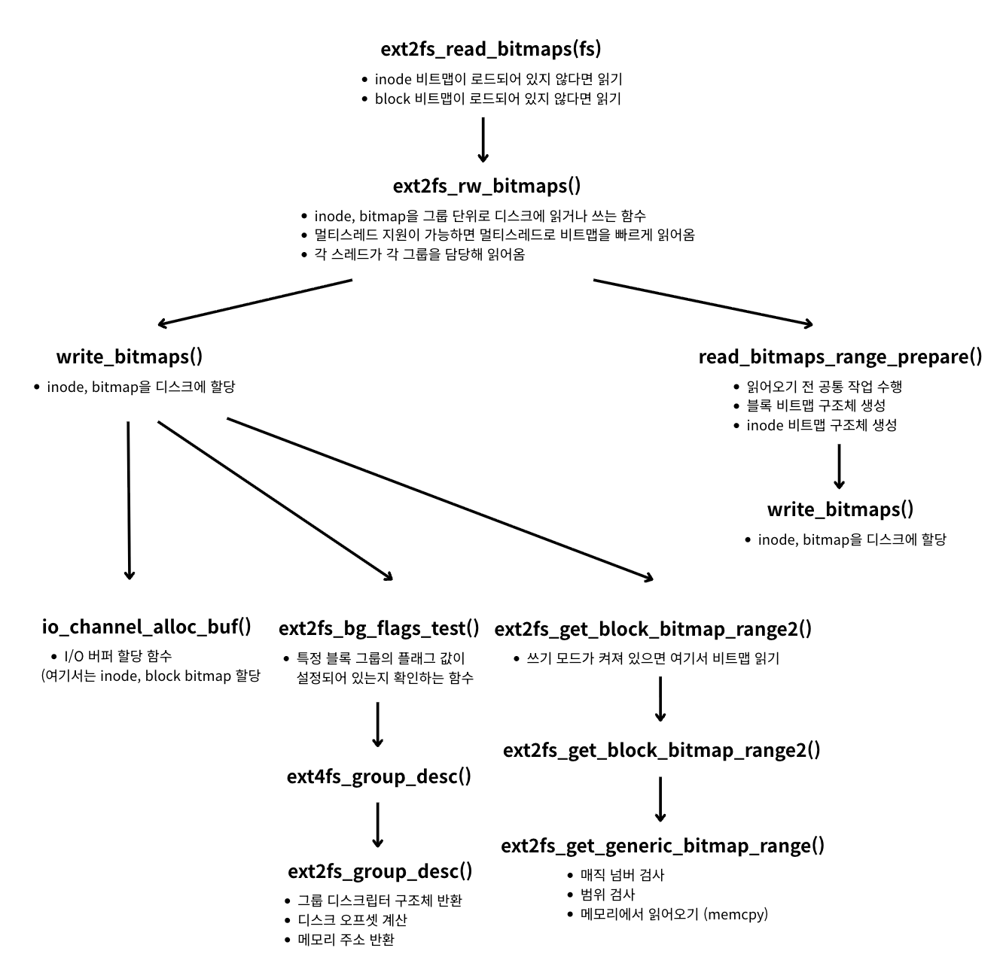

<strong>[e2fsprogs](https://github.com/tytso/e2fsprogs/tree/master)의 깃허브 코드를 참조해 분석한 글입니다.</strong>
{: .notice}

# 📌 e2fsprogs 코드 분석 : ext2fs_read_block_bitmap

## 🫧 ext2fs_read_block_bitmap(fs);
- ext2에서 제대로 작동, ext4에서도 가능하나 정확히 동작하지 않을 가능성 높음.
- 역할: group 번호에 해당하는 블록 그룹의 블록 할당 비트맵(block bitmap)을 읽어서 bitmap 객체에 저장
- 반환값: 성공 시 0, 실패 시 오류코드 반환
- 사용 이유: 블록 그룹 내에서 할당된 블록/사용 가능한 블록 정보가 비트맵에 있기 때문에 이걸 읽음

## 🫧 과정


## 🫧 코드

### ✨ ext2fs_read_block_bitmap(fs)

- - libs/ext2fs/rw_bitmaps.c, $660

```c
errcode_t ext2fs_read_bitmaps(ext2_filsys fs)
{
	int flags = 0;

    // inode_map이 로드되어 있지 않다면 로드
	if (!fs->inode_map)
		flags |= EXT2FS_BITMAPS_INODE;

    // block_map이 로드되어 있지 않다면 로드
	if (!fs->block_map)
		flags |= EXT2FS_BITMAPS_BLOCK;
	if (flags == 0)
		return 0;
	return ext2fs_rw_bitmaps(fs, flags, -1);
}
```

### ✨ ext4fs_rw_bitmaps()

- libs/ext2fs/rw_bitmaps.c, $521
- inode, bitmap을 그룹 단위로 디스크에 읽거나 쓰는 함수

```c
errcode_t ext2fs_rw_bitmaps(ext2_filsys fs, int flags, int num_threads)
{
    // 멀티스레드 지원이 되면 필요한 값들 초기화
#ifdef HAVE_PTHREAD
	pthread_attr_t	attr;
	pthread_t *thread_ids = NULL;
	struct read_bitmaps_thread_info *thread_infos = NULL;
	pthread_mutex_t rbt_mutex = PTHREAD_MUTEX_INITIALIZER;
	errcode_t retval;
	errcode_t rc;
	unsigned flexbg_size = 1U << fs->super->s_log_groups_per_flex;
	dgrp_t average_group;
	int i, tail_flags = 0;
#endif

    // 정의되어 있지 않은 flag일 경우 에러
	if (flags & ~EXT2FS_BITMAPS_VALID_FLAGS)
		return EXT2_ET_INVALID_ARGUMENT;

    // 저널 전용 장치일 경우 (외부 저널) 리턴 (지원 X)
	if (ext2fs_has_feature_journal_dev(fs->super))
		return EXT2_ET_EXTERNAL_JOURNAL_NOSUPP;

        // 비트맵 쓰기 권한이 허용되어 있다면 write_bitmap() 호출해 디스크에 비트맵 저장
	if (flags & EXT2FS_BITMAPS_WRITE)
		return write_bitmaps(fs, flags & EXT2FS_BITMAPS_INODE,
				     flags & EXT2FS_BITMAPS_BLOCK);

// 멀티스레드가 사용 가능한지
#ifdef HAVE_PTHREAD
	if (((fs->io->flags & CHANNEL_FLAGS_THREADS) == 0) ||
	    (num_threads == 1) || (fs->flags & EXT2_FLAG_IMAGE_FILE))
		goto fallback;

#if defined(HAVE_SYSCONF) && defined(_SC_NPROCESSORS_CONF)
	if (num_threads < 0)
		num_threads = sysconf(_SC_NPROCESSORS_CONF);
#endif
	/*
	 * Guess for now; eventually we should probably define
	 * ext2fs_get_num_cpus() and teach it how to get this info on
	 * MacOS, FreeBSD, etc.
	 * ref: https://stackoverflow.com/questions/150355
	 */
	if (num_threads <= 0)
		num_threads = 4;

	if ((unsigned) num_threads > fs->group_desc_count)
		num_threads = fs->group_desc_count;
	average_group = fs->group_desc_count / num_threads;
	
    // flex_bg 기능이 켜져 있을 때 수행
    if (ext2fs_has_feature_flex_bg(fs->super)) {
		average_group = (average_group / flexbg_size) * flexbg_size;
	}
	if ((num_threads <= 1) || (average_group == 0))
		goto fallback;

	io_channel_set_options(fs->io, "cache=off");
	retval = pthread_attr_init(&attr);
	if (retval)
		return retval;

	thread_ids = calloc(sizeof(pthread_t), num_threads);
	if (!thread_ids)
		return ENOMEM;

	thread_infos = calloc(sizeof(struct read_bitmaps_thread_info),
				num_threads);
	if (!thread_infos)
		goto out;

    // 비트맵 읽기 전 공통 수행 함수
	retval = read_bitmaps_range_prepare(fs, flags);
	if (retval)
		goto out;

//	fprintf(stdout, "Multiple threads triggered to read bitmaps\n");
	for (i = 0; i < num_threads; i++) {
		thread_infos[i].rbt_fs = fs;
		thread_infos[i].rbt_flags = flags;
		thread_infos[i].rbt_mutex = &rbt_mutex;
		thread_infos[i].rbt_tail_flags = 0;
		if (i == 0)
			thread_infos[i].rbt_grp_start = 0;
		else
			thread_infos[i].rbt_grp_start = average_group * i + 1;

		if (i == num_threads - 1)
			thread_infos[i].rbt_grp_end = fs->group_desc_count - 1;
		else
			thread_infos[i].rbt_grp_end = average_group * (i + 1);
		// 스레드 생성
        retval = pthread_create(&thread_ids[i], &attr,
					&read_bitmaps_thread, &thread_infos[i]);
		if (retval)
			break;
	}
	for (i = 0; i < num_threads; i++) {
		if (!thread_ids[i])
			break;
        // 스레드 종료 대기
		rc = pthread_join(thread_ids[i], NULL);
		if (rc && !retval)
			retval = rc;
		rc = thread_infos[i].rbt_retval;
		if (rc && !retval)
			retval = rc;
		tail_flags |= thread_infos[i].rbt_tail_flags;
	}
out:
	rc = pthread_attr_destroy(&attr);
	if (rc && !retval)
		retval = rc;
	free(thread_infos);
	free(thread_ids);

	if (retval == 0)
		retval = read_bitmaps_range_end(fs, flags, tail_flags);
	if (retval)
		read_bitmaps_cleanup_on_error(fs, flags);
	/* XXX should save and restore cache setting */
	io_channel_set_options(fs->io, "cache=on");
	return retval;
fallback:
#endif /* HAVE_PTHREAD */
    // 모든 그룹을 순차적으로 읽어 처리
	return read_bitmaps_range(fs, flags, 0, fs->group_desc_count - 1);
}
```

### ✨ write_bitmaps()

- libs/ext2fs/rw_bitmaps.c, $538
- inode, bitmap을 디스크에 쓰는 함수

```c
static errcode_t write_bitmaps(ext2_filsys fs, int do_inode, int do_block)
{
	dgrp_t 		i;
	unsigned int	j;
	int		block_nbytes, inode_nbytes;
	unsigned int	nbits;
	errcode_t	retval;
	char		*block_buf = NULL, *inode_buf = NULL;
	int		csum_flag;
	blk64_t		blk;
	blk64_t		blk_itr = EXT2FS_B2C(fs, fs->super->s_first_data_block);
	ext2_ino_t	ino_itr = 1;

	EXT2_CHECK_MAGIC(fs, EXT2_ET_MAGIC_EXT2FS_FILSYS);

	// 읽기 전용이면 에러 반환
	if (!(fs->flags & EXT2_FLAG_RW))
		return EXT2_ET_RO_FILSYS;

	csum_flag = ext2fs_has_group_desc_csum(fs);

	// 버퍼 할당
	inode_nbytes = block_nbytes = 0;
	if (do_block) {
        // block bitmap 한 그룹 바이트 수
		block_nbytes = EXT2_CLUSTERS_PER_GROUP(fs->super) / 8;
        // block 비트맵 버퍼 하나 만들기
		retval = io_channel_alloc_buf(fs->io, 0, &block_buf);
		if (retval)
			goto errout;
		memset(block_buf, 0xff, fs->blocksize);
	}
	if (do_inode) {
        // inode bitmap 한 그룹 바이트 수
		inode_nbytes = (size_t)
			((EXT2_INODES_PER_GROUP(fs->super)+7) / 8);
		// inode 비트맵 버퍼 하나 만들기
		retval = io_channel_alloc_buf(fs->io, 0, &inode_buf);
		if (retval)
			goto errout;
		memset(inode_buf, 0xff, fs->blocksize);
	}

	// 블록 그룹별 순회 돌기
	for (i = 0; i < fs->group_desc_count; i++) {
		// do_block이 0이 아닌 경우 비트맵에 쓰기
		if (!do_block)
			goto skip_block_bitmap;

		if (csum_flag && ext2fs_bg_flags_test(fs, i, EXT2_BG_BLOCK_UNINIT)
		    )
			goto skip_this_block_bitmap;

        // 메모리에 있는 블록 비트맵에서 해당 블록 그룹의 데이터를 꺼내 block_buf에 채움
		retval = ext2fs_get_block_bitmap_range2(fs->block_map,
				blk_itr, block_nbytes << 3, block_buf);
		if (retval)
			goto errout;

        // 마지막 그룹은 비트맵 끝부분에 존재하지 않는 블록들을 무조건 사용중(1)으로 표시
		if (i == fs->group_desc_count - 1) {
			/* Force bitmap padding for the last group */
			nbits = EXT2FS_NUM_B2C(fs,
				((ext2fs_blocks_count(fs->super)
				  - (__u64) fs->super->s_first_data_block)
				 % (__u64) EXT2_BLOCKS_PER_GROUP(fs->super)));
			if (nbits)
				for (j = nbits; j < fs->blocksize * 8; j++)
					ext2fs_set_bit(j, block_buf);
		}

        // 블록 비트맵 checksum 업데이트
		retval = ext2fs_block_bitmap_csum_set(fs, i, block_buf,
						      block_nbytes);
		if (retval)
			return retval;
        // 그룹 디스크립터 checksum 업데이트
		ext2fs_group_desc_csum_set(fs, i);
		fs->flags |= EXT2_FLAG_DIRTY;

        // 그룹 디스크립터에서 블록 비트맵 위치를 가져와 디스크에 쓰기
		blk = ext2fs_block_bitmap_loc(fs, i);
		if (blk && blk < ext2fs_blocks_count(fs->super)) {
			retval = io_channel_write_blk64(fs->io, blk, 1,
							block_buf);
			if (retval) {
				retval = EXT2_ET_BLOCK_BITMAP_WRITE;
				goto errout;
			}
		}
	skip_this_block_bitmap:
		blk_itr += block_nbytes << 3;
	skip_block_bitmap:


        // 블록 비트맵과 유사하게, inode bitmap도 쓰기
		if (!do_inode)
			continue;

		if (csum_flag && ext2fs_bg_flags_test(fs, i, EXT2_BG_INODE_UNINIT)
		    )
			goto skip_this_inode_bitmap;

		retval = ext2fs_get_inode_bitmap_range2(fs->inode_map,
				ino_itr, inode_nbytes << 3, inode_buf);
		if (retval)
			goto errout;

		retval = ext2fs_inode_bitmap_csum_set(fs, i, inode_buf,
						      inode_nbytes);
		if (retval)
			goto errout;
		ext2fs_group_desc_csum_set(fs, i);
		fs->flags |= EXT2_FLAG_DIRTY;

		blk = ext2fs_inode_bitmap_loc(fs, i);
		if (blk && blk < ext2fs_blocks_count(fs->super)) {
			retval = io_channel_write_blk64(fs->io, blk, 1,
						      inode_buf);
			if (retval) {
				retval = EXT2_ET_INODE_BITMAP_WRITE;
				goto errout;
			}
		}
	skip_this_inode_bitmap:
		ino_itr += inode_nbytes << 3;

	}

    // 자원 정리
	if (do_block) {
		fs->flags &= ~EXT2_FLAG_BB_DIRTY;
		ext2fs_free_mem(&block_buf);
	}
	if (do_inode) {
		fs->flags &= ~EXT2_FLAG_IB_DIRTY;
		ext2fs_free_mem(&inode_buf);
	}
	return 0;
errout:
	if (inode_buf)
		ext2fs_free_mem(&inode_buf);
	if (block_buf)
		ext2fs_free_mem(&block_buf);
	return retval;
}
```


### ✨ io_channel_alloc_buf()

- libs/ext2fs/io_manager.c, $126
- I/O 버퍼 할당 함수 (여기서는 inode bitmap, block bitmap 할당 시 사용)

```c
errcode_t io_channel_alloc_buf(io_channel io, int count, void *ptr)
{
	size_t	size;

    // count가 0이면 블록 사이즈만큼 할당
	if (count == 0)
		size = io->block_size;
    // count가 0보다 크면 블록 사이즈 * 크기만큼 할당
	else if (count > 0)
		size = io->block_size * count;
	else
		size = -count;

	if (io->align > 0) {
		if ((unsigned) io->align > size)
			size = io->align;
		return ext2fs_get_memalign(size, io->align, ptr);
	} else
		return ext2fs_get_mem(size, ptr);
}
```


### ✨ ext2fs_bg_flags_test()

- libs/ext2fs/blknum.c, $489
- 특정 블록 그룹의 플래그 값이 설정되어 있는지 확인하는 함수

```c
/*
 * Get the value of a particular flag for this block group
 */
int ext2fs_bg_flags_test(ext2_filsys fs, dgrp_t group, __u16 bg_flag)
{
	struct ext4_group_desc *gdp;

	// 그룹 디스크립터 위치 가져오기
	// group 번째 블록 그룹의 그룹 디스크립터 구조체를 반환
	// fs->group_desc는 모든 그룹 디스크립터 테이블의 시작 주소
	gdp = ext4fs_group_desc(fs, fs->group_desc, group);
	return gdp->bg_flags & bg_flag;
}
```

### ✨ ext4fs_group_desc()

- libs/ext2fs/blknum.c, $243

```c
/* Do the same but as an ext4 group desc for internal use here */
static struct ext4_group_desc *ext4fs_group_desc(ext2_filsys fs,
					  struct opaque_ext2_group_desc *gdp,
					  dgrp_t group)
{
	return (struct ext4_group_desc *)ext2fs_group_desc(fs, gdp, group);
}
```


### ✨ ext2fs_group_desc()

- libs/ext2fs/rw_bitmaps.c, $521
- 그룹 디스크립터를 읽어 메모리 주소를 반환하는 함수

```c
/*
 * Get a pointer to a block group descriptor.  We need the explicit
 * pointer to the group desc for code that swaps block group
 * descriptors before writing them out, as it wants to make a copy and
 * do the swap there.
 */
struct ext2_group_desc *ext2fs_group_desc(ext2_filsys fs,
					  struct opaque_ext2_group_desc *gdp,
					  dgrp_t group)
{
	struct ext2_group_desc *ret_gdp;
	errcode_t	retval;
	static char	*buf = 0;
	static unsigned	bufsize = 0;
	blk64_t		blk;
	// 슈퍼블록의 디스크립터 사이즈 반환
	int		desc_size = EXT2_DESC_SIZE(fs->super) & ~7;
	// 한 블록 내 들어갈 수 있는 그룹 디스크립터 수
	int		desc_per_blk = EXT2_DESC_PER_BLOCK(fs->super);

	if (group > fs->group_desc_count)
		return NULL;

	// 오프셋 계산
	if (gdp)
		return (struct ext2_group_desc *)((char *)gdp +
						  group * desc_size);
	/*
	 * If fs->group_desc wasn't read in when the file system was
	 * opened, then read it on demand here.
	 */
	if (bufsize < fs->blocksize)
		ext2fs_free_mem(&buf);
	if (!buf) {
		retval = ext2fs_get_mem(fs->blocksize, &buf);
		if (retval)
			return NULL;
		bufsize = fs->blocksize;
	}
	blk = ext2fs_descriptor_block_loc2(fs, fs->super->s_first_data_block,
					   group / desc_per_blk);
	retval = io_channel_read_blk(fs->io, blk, 1, buf);
	if (retval)
		return NULL;
	ret_gdp = (struct ext2_group_desc *)
		(buf + ((group % desc_per_blk) * desc_size));
#ifdef WORDS_BIGENDIAN
	ext2fs_swap_group_desc2(fs, ret_gdp);
#endif
	return ret_gdp;
}
```


### ✨ ext2fs_get_block_bitmap_range2()

- libs/ext2fs/bitmaps.c, $315

```c
errcode_t ext2fs_get_block_bitmap_range2(ext2fs_block_bitmap bmap,
					 blk64_t start, size_t num,
					 void *out)
{
	return (ext2fs_get_generic_bmap_range(bmap, start, num, out));
}

```


### ✨ ext2fs_get_generic_bmap_range()

- libs/ext2fs/rw_bitmaps.c, $521
- 비트맵의 일부 구간을 읽어오는 함수

```c
errcode_t ext2fs_get_generic_bmap_range(ext2fs_generic_bitmap gen_bmap,
					__u64 start, unsigned int num,
					void *out)
{
	ext2fs_generic_bitmap_64 bmap = (ext2fs_generic_bitmap_64) gen_bmap;

	if (!bmap)
		return EINVAL;

	// 비트맵 처리
	if (EXT2FS_IS_32_BITMAP(bmap)) {
		if ((start+num-1) & ~0xffffffffULL) {
			ext2fs_warn_bitmap2(gen_bmap,
					    EXT2FS_UNMARK_ERROR, 0xffffffff);
			return EINVAL;
		}
		return ext2fs_get_generic_bitmap_range(gen_bmap, bmap->magic,
						       start, num, out);
	}

	if (!EXT2FS_IS_64_BITMAP(bmap))
		return EINVAL;

	INC_STAT(bmap, get_range_count);

	return bmap->bitmap_ops->get_bmap_range(bmap, start, num, out);
}
```


### ✨ ext2fs_get_generic_bitmap_range()

- libs/ext2fs/gen_bitmap.c, $408
- inode, bitmap을 그룹 단위로 디스크에 읽거나 쓰는 함수

```c
errcode_t ext2fs_get_generic_bitmap_range(ext2fs_generic_bitmap gen_bmap,
					  errcode_t magic,
					  __u32 start, __u32 num,
					  void *out)
{
	ext2fs_generic_bitmap_32 bmap = (ext2fs_generic_bitmap_32) gen_bmap;

	// 매직 넘버 검사
	if (!bmap || (bmap->magic != magic))
		return magic;

	// 범위 검사
	if ((start < bmap->start) || (start+num-1 > bmap->real_end))
		return EXT2_ET_INVALID_ARGUMENT;

	// 메모리에서 읽어오기
	memcpy(out, bmap->bitmap + ((start - bmap->start) >> 3), (num+7) >> 3);
	return 0;
}
```

### ✨ read_bitmaps_range_prepare()

- libs/ext2fs/rw_bitmaps.c, $521
- 메모리 준비 단계 함수, 읽어오기 전 공통 작업 수행

```c
static errcode_t read_bitmaps_range_prepare(ext2_filsys fs, int flags)
{
	errcode_t retval;
	int block_nbytes = EXT2_CLUSTERS_PER_GROUP(fs->super) / 8;
	int inode_nbytes = EXT2_INODES_PER_GROUP(fs->super) / 8;
	char *buf;

	EXT2_CHECK_MAGIC(fs, EXT2_ET_MAGIC_EXT2FS_FILSYS);

	if ((block_nbytes > (int) fs->blocksize) ||
	    (inode_nbytes > (int) fs->blocksize))
		return EXT2_ET_CORRUPT_SUPERBLOCK;

	fs->write_bitmaps = ext2fs_write_bitmaps;

	// 임시 버퍼 할당
	retval = ext2fs_get_mem(strlen(fs->device_name) + 80, &buf);
	if (retval)
		return retval;

	// 블록 비트맵 구조체 생성 (읽기 전)
	if (flags & EXT2FS_BITMAPS_BLOCK) {
		if (fs->block_map)
			ext2fs_free_block_bitmap(fs->block_map);
		strcpy(buf, "block bitmap for ");
		strcat(buf, fs->device_name);
		retval = ext2fs_allocate_block_bitmap(fs, buf, &fs->block_map);
		if (retval)
			goto cleanup;
	}

	// inode 비트맵 구조체 생성 (읽기 전)
	if (flags & EXT2FS_BITMAPS_INODE) {
		if (fs->inode_map)
			ext2fs_free_inode_bitmap(fs->inode_map);
		strcpy(buf, "inode bitmap for ");
		strcat(buf, fs->device_name);
		retval = ext2fs_allocate_inode_bitmap(fs, buf, &fs->inode_map);
		if (retval)
			goto cleanup;
	}
	ext2fs_free_mem(&buf);
	return retval;

cleanup:
	if (flags & EXT2FS_BITMAPS_BLOCK) {
		ext2fs_free_block_bitmap(fs->block_map);
		fs->block_map = 0;
	}
	if (flags & EXT2FS_BITMAPS_INODE) {
		ext2fs_free_inode_bitmap(fs->inode_map);
		fs->inode_map = 0;
	}
	ext2fs_free_mem(&buf);
	return retval;
}