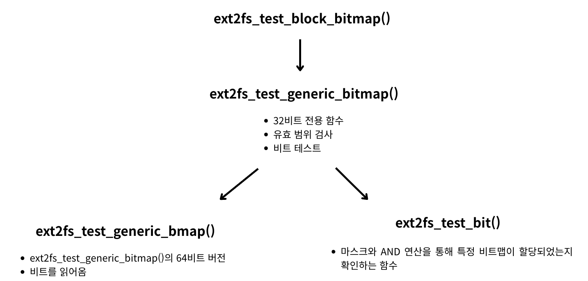

<strong>[e2fsprogs](https://github.com/tytso/e2fsprogs/tree/master)의 깃허브 코드를 참조해 분석한 글입니다.</strong>
{: .notice}

# 📌 e2fsprogs 코드 분석 : ext2fs_test_block_bitmap

## 🫧 ext2fs_test_block_bitmap(fs);
- 특정 블록이 사용 중인지 확인 (1이면 사용, 0이면 미사용)
- 역할: 비트맵 bitmap에서 i번째 비트(블록)가 할당되었는지(1) 아닌지(0) 검사
- 사용 이유: 0이면 free 블록이므로 이를 뽑아내기 위함

## 🫧 과정


## 🫧 코드

### ✨ ext2fs_test_block_bitmap(fs)

- libs/ext2fs/bitops.h, $430

```c
_INLINE_ int ext2fs_test_block_bitmap(ext2fs_block_bitmap bitmap,
				       blk_t block)
{
	return ext2fs_test_generic_bitmap((ext2fs_generic_bitmap) bitmap,
					  block);
}
```

### ✨ ext2fs_test_block_bitmap2(fs)

- libs/ext2fs/bitops.c, $430
- 32비트 전용 함수, 비트 테스트 수행 함수

```c
int ext2fs_test_generic_bitmap(ext2fs_generic_bitmap bitmap,
					blk_t bitno)
{
	ext2fs_generic_bitmap_32 bitmap32 = (ext2fs_generic_bitmap_32) bitmap;

	if (!EXT2FS_IS_32_BITMAP(bitmap)) {
		if (EXT2FS_IS_64_BITMAP(bitmap)) {
			ext2fs_warn_bitmap32(bitmap, __func__);
			return ext2fs_test_generic_bmap(bitmap, bitno);
		}
#ifndef OMIT_COM_ERR
		com_err(0, EXT2_ET_MAGIC_GENERIC_BITMAP,
			"test_bitmap(%lu)", (unsigned long) bitno);
#endif
		return 0;
	}

	if ((bitno < bitmap32->start) || (bitno > bitmap32->end)) {
		ext2fs_warn_bitmap2(bitmap, EXT2FS_TEST_ERROR, bitno);
		return 0;
	}
	return ext2fs_test_bit(bitno - bitmap32->start, bitmap32->bitmap);
}
```


### ✨ ext2fs_test_generic_bmap(fs)

- libs/ext2fs/gen_bitmap64.c, $513
- ext2fs_test_generic_bitmap()의 64비트 버전
- 비트를 읽어옴

```c
int ext2fs_test_generic_bmap(ext2fs_generic_bitmap gen_bitmap,
			     __u64 arg)
{
	ext2fs_generic_bitmap_64 bitmap = (ext2fs_generic_bitmap_64) gen_bitmap;
	if (!bitmap)
		return 0;

	// 32비트 타입이라면 ext2fs_test_generic_bitmap() 함수 호출
	if (EXT2FS_IS_32_BITMAP(bitmap)) {
		if (arg & ~0xffffffffULL) {
			ext2fs_warn_bitmap2(gen_bitmap, EXT2FS_TEST_ERROR,
					    0xffffffff);
			return 0;
		}
		return ext2fs_test_generic_bitmap(gen_bitmap, arg);
	}

	if (!EXT2FS_IS_64_BITMAP(bitmap))
		return 0;

	arg >>= bitmap->cluster_bits;

// 통계 수집을 위함
#ifdef ENABLE_BMAP_STATS_OPS
	bitmap->stats.test_count++;
	if (arg == bitmap->stats.last_tested + 1)
		bitmap->stats.test_seq++;
	if (arg < bitmap->stats.last_tested)
		bitmap->stats.test_back++;
	bitmap->stats.last_tested = arg;
#endif

	// 범위 검사
	if ((arg < bitmap->start) || (arg > bitmap->end)) {
		warn_bitmap(bitmap, EXT2FS_TEST_ERROR, arg);
		return 0;
	}

	// 비트 읽기
	return bitmap->bitmap_ops->test_bmap(bitmap, arg);
}
```


### ✨ ext2fs_test_bit(fs)

- libs/ext2fs/bitops.c, $52
- 마스크와 AND 연산을 통해 특정 비트맵이 할당되었는지 확인하는 함수

```c
int ext2fs_test_bit(unsigned int nr, const void * addr)
{
	int			mask;
	const unsigned char	*ADDR = (const unsigned char *) addr;

	ADDR += nr >> 3;
	mask = 1 << (nr & 0x07);
	return (mask & *ADDR);
}
```


### ✨ ext2fs_test_block_bitmap2(fs)

- libs/ext2fs/bitops.c, $430
- ~g하는 함수

```c
_INLINE_ int ext2fs_test_block_bitmap(ext2fs_block_bitmap bitmap,
				       blk_t block)
{
	return ext2fs_test_generic_bitmap((ext2fs_generic_bitmap) bitmap,
					  block);
}
```

