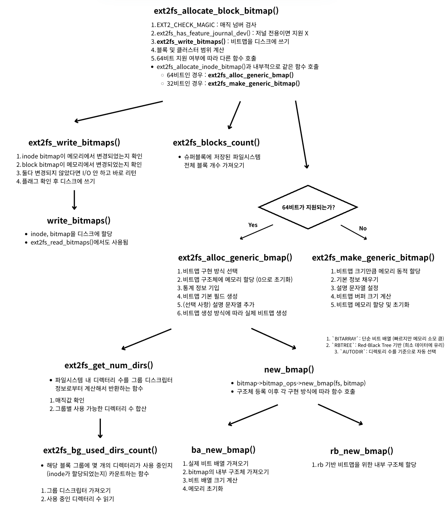

<strong>[e2fsprogs](https://github.com/tytso/e2fsprogs/tree/master)의 깃허브 코드를 참조해 분석한 글입니다.</strong>
{: .notice}

# 📌 e2fsprogs 코드 분석 : ext2fs_allocate_block_bitmap

## 🫧 ext2fs_allocate_block_bitmap(fs);
- block 비트맵 할당 시 사용
- 역할: 사용 가능한 영역을 추출해 보여주기 위한 비트맵 할당 시 사용
- 사용 이유: 사용 가능한 블록을 따로 마킹하여 사용자에게 보여주고자 함.


## 🫧 과정



## 🫧 특징

- 비트맵 할당 과정에서는 inode, block 대상 상관없이 모두 같은 함수 호출
	- 64비트 지원 여부에 따라 호출되는 함수가 다름
- `ext2fs_blocks_count()` : 슈퍼블록에 저장된 파일시스템 전체 블록 개수를 가져오는 함수 존재

## 🫧 코드

### ✨ ext2fs_allocate_inode_bitmap()

- libs/ext2fs/bitmaps.c, $98

```c
errcode_t ext2fs_allocate_block_bitmap(ext2_filsys fs,
				       const char *descr,
				       ext2fs_block_bitmap *ret)
{
	__u64		start, end, real_end;

	// 1. 매직 넘버 체크
	EXT2_CHECK_MAGIC(fs, EXT2_ET_MAGIC_EXT2FS_FILSYS);

	// 2. 외부 저널 장치인 경우 지원 X (리턴)
	if (ext2fs_has_feature_journal_dev(fs->super))
		return EXT2_ET_EXTERNAL_JOURNAL_NOSUPP;

	// 3. 비트맵 쓰기 함수 등록
	fs->write_bitmaps = ext2fs_write_bitmaps;

	// 4. 블록 및 클러스터 범위 계산
	start = EXT2FS_B2C(fs, fs->super->s_first_data_block);
	end = EXT2FS_B2C(fs, ext2fs_blocks_count(fs->super)-1);
	real_end = ((__u64) EXT2_CLUSTERS_PER_GROUP(fs->super)
		    * (__u64) fs->group_desc_count)-1 + start;

	// 5. 64비트 지원 여부 확인
	// ext2fs_allocate_inode_bitmap()과 내부적으로 같은 함수 호출
	if (fs->flags & EXT2_FLAG_64BITS)
		return (ext2fs_alloc_generic_bmap(fs,
				EXT2_ET_MAGIC_BLOCK_BITMAP64,
				fs->default_bitmap_type,
				start, end, real_end, descr, ret));

	if ((end > ~0U) || (real_end > ~0U))
		return EXT2_ET_CANT_USE_LEGACY_BITMAPS;

	return (ext2fs_make_generic_bitmap(EXT2_ET_MAGIC_BLOCK_BITMAP, fs,
					   start, end, real_end,
					   descr, 0,
					   (ext2fs_generic_bitmap *) ret));
}
```

### ✨ ext2fs_blocks_count()

- libs/ext2fs/blknum.c, $107

```c
/*
 * Return the fs block count
 */
blk64_t ext2fs_blocks_count(struct ext2_super_block *super)
{
	// 슈퍼블록에 저장된 파일시스템 전체 블록 개수 가져오기
	return super->s_blocks_count |
		(ext2fs_has_feature_64bit(super) ?
		(__u64) super->s_blocks_count_hi << 32 : 0);
}
```