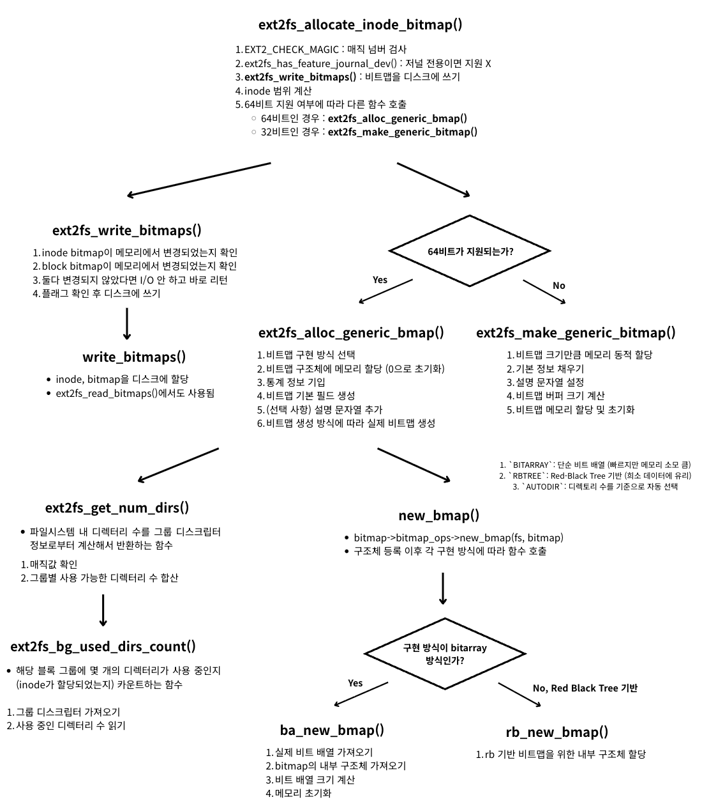

<strong>[e2fsprogs](https://github.com/tytso/e2fsprogs/tree/master)의 깃허브 코드를 참조해 분석한 글입니다.</strong>
{: .notice}

# 📌 e2fsprogs 코드 분석 : ext2fs_allocate_inode_bitmap

## 🫧 ext2fs_allocate_inode_bitmap(fs);
- inode 비트맵 할당 시 사용
- 역할: 사용 가능한 영역을 추출해 보여주기 위한 비트맵 할당 시 사용
- 사용 이유: 사용 가능한 블록을 따로 마킹하여 사용자에게 보여주고자 함.


## 🫧 과정



## 🫧 특징

- 사용 중인 디렉터리 수 파악하는 함수도 존재한다.

#### 💡 bitmap 내부 저장 방식

1. `BITARRAY`: 단순 비트 배열 (빠르지만 메모리 소모 큼)
2. `RBTREE`: Red-Black Tree 기반 (희소 데이터에 유리)
3. `AUTODIR`: 디렉토리 수를 기준으로 자동 선택

=> 디렉토리가 많은 경우에는 array 방식, 적은 경우에는 rbtree 방식을 선택하는 경향이 있다.

## 🫧 코드

### ✨ ext2fs_allocate_inode_bitmap(fs)

- libs/ext2fs/bitops.h, $430
- 블록 비

```c
// fs : 파일 시스템 구조체
// descr : 비트맵 설명 문자열
// ret : inode bitmap을 리턴할 구조체 포인터
errcode_t ext2fs_allocate_inode_bitmap(ext2_filsys fs,
				       const char *descr,
				       ext2fs_inode_bitmap *ret)
{
	__u64		start, end, real_end;

	EXT2_CHECK_MAGIC(fs, EXT2_ET_MAGIC_EXT2FS_FILSYS);

	if (ext2fs_has_feature_journal_dev(fs->super))
		return EXT2_ET_EXTERNAL_JOURNAL_NOSUPP;

	// 비트맵을 디스크에 쓰기
	fs->write_bitmaps = ext2fs_write_bitmaps;

	// inode 범위 계산
	start = 1;
	end = fs->super->s_inodes_count;
	// 실제 디스크상 최대 inode 번호
	real_end = (__u64)EXT2_INODES_PER_GROUP(fs->super) *
		fs->group_desc_count;

	// 64비트가 지원되는지 확인
	if (fs->flags & EXT2_FLAG_64BITS)
		// 64비트 버전 비트맵 할당
		return (ext2fs_alloc_generic_bmap(fs,
				EXT2_ET_MAGIC_INODE_BITMAP64,
				fs->default_bitmap_type,
				start, end, real_end, descr, ret));

	/* Otherwise, check to see if the file system is small enough
	 * to use old-style 32-bit bitmaps */
	if ((end > ~0U) || (real_end > ~0U))
		return EXT2_ET_CANT_USE_LEGACY_BITMAPS;

	// 32비트 전용 inode bitmap을 만들어서 리턴
	return (ext2fs_make_generic_bitmap(EXT2_ET_MAGIC_INODE_BITMAP, fs,
					 start, end, real_end,
					 descr, 0,
					 (ext2fs_generic_bitmap *) ret));
}
```


### ✨ ext2fs_write_bitmaps()

- libs/ext2fs/rw_bitmaps.c, $691


```c
errcode_t ext2fs_write_bitmaps(ext2_filsys fs)
{
	// inode bitmap이 메모리에서 변경되었는지 확인
	int do_inode = fs->inode_map && ext2fs_test_ib_dirty(fs);

	// block bitmap이 메모리에서 변경되었는지 확인
	int do_block = fs->block_map && ext2fs_test_bb_dirty(fs);

	// 둘다 변경되지 않았다면 I/O 안 하고 바로 리턴
	if (!do_inode && !do_block)
		return 0;

	// do_inode가 1이면 inode bitmap을 디스크에 씀
	// do_block가 1이면 block bitmap을 디스크에 씀
	// ext2fs_read_bitmaps()에서도 사용되었던 함수 (해당 내용에 자세히 기입되어 있음)
	return write_bitmaps(fs, do_inode, do_block);
}
```


### ✨ ext2fs_alloc_generic_bmap()

- libs/ext2fs/gen_bitmap64.c, $92
- 범용 64비트 비트맵 객체 생성 함수


```c
// 범용 64비트 비트맵 객체 생성 함수 (inode bitmap, block bitmap용으로 모두 사용)
errcode_t ext2fs_alloc_generic_bmap(ext2_filsys fs, errcode_t magic,
				    int type, __u64 start, __u64 end,
				    __u64 real_end,
				    const char *descr,
				    ext2fs_generic_bitmap *ret)
{
	ext2fs_generic_bitmap_64 bitmap;
	struct ext2_bitmap_ops	*ops;
	ext2_ino_t num_dirs;
	errcode_t retval;

	// 1. 비트맵 구현 방식 선택
	if (!type)
		type = EXT2FS_BMAP64_BITARRAY;

	switch (type) {
	case EXT2FS_BMAP64_BITARRAY:
		ops = &ext2fs_blkmap64_bitarray;
		break;
	case EXT2FS_BMAP64_RBTREE:
		ops = &ext2fs_blkmap64_rbtree;
		break;
	case EXT2FS_BMAP64_AUTODIR:
		retval = ext2fs_get_num_dirs(fs, &num_dirs);
		if (retval || num_dirs > (fs->super->s_inodes_count / 320))
			ops = &ext2fs_blkmap64_bitarray;
		else
			ops = &ext2fs_blkmap64_rbtree;
		break;
	default:
		return EINVAL;
	}

	// 2. 비트맵 구조체에 메모리 할당 (0으로 초기화하며)
	retval = ext2fs_get_memzero(sizeof(struct ext2fs_struct_generic_bitmap_64),
				    &bitmap);
	if (retval)
		return retval;

// 통계 정보
#ifdef ENABLE_BMAP_STATS
	if (gettimeofday(&bitmap->stats.created,
			 (struct timezone *) NULL) == -1) {
		perror("gettimeofday");
		ext2fs_free_mem(&bitmap);
		return 1;
	}
	bitmap->stats.type = type;
#endif

	// 비트맵 기본 필드 생성
	/* XXX factor out, repeated in copy_bmap */
	bitmap->magic = magic; // 비트맵 종류 구분 (inode bitmap, block bitmap)
	bitmap->fs = fs;
	bitmap->start = start;
	bitmap->end = end;
	bitmap->real_end = real_end;
	bitmap->bitmap_ops = ops; // 비트맵 생성 방식 기록
	bitmap->cluster_bits = 0;
	switch (magic) {
	case EXT2_ET_MAGIC_INODE_BITMAP64:
		bitmap->base_error_code = EXT2_ET_BAD_INODE_MARK;
		break;
	case EXT2_ET_MAGIC_BLOCK_BITMAP64:
		bitmap->base_error_code = EXT2_ET_BAD_BLOCK_MARK;
		bitmap->cluster_bits = fs->cluster_ratio_bits;
		break;
	default:
		bitmap->base_error_code = EXT2_ET_BAD_GENERIC_MARK;
	}

	// 설명 문자열 추가
	if (descr) {
		retval = ext2fs_get_mem(strlen(descr)+1, &bitmap->description);
		if (retval) {
			ext2fs_free_mem(&bitmap);
			return retval;
		}
		strcpy(bitmap->description, descr);
	} else
		bitmap->description = 0;

	// 실제 비트맵 생성
		// bitarray인 경우 단순 배열 메모리 할당
		// rbtree인 경우 트리 루트 초기화
	retval = bitmap->bitmap_ops->new_bmap(fs, bitmap);
	if (retval) {
		ext2fs_free_mem(&bitmap->description);
		ext2fs_free_mem(&bitmap);
		return retval;
	}

	*ret = (ext2fs_generic_bitmap) bitmap;
	return 0;
}
```

#### 💡 bitmap 내부 저장 방식

1. `BITARRAY`: 단순 비트 배열 (빠르지만 메모리 소모 큼)
2. `RBTREE`: Red-Black Tree 기반 (희소 데이터에 유리)
3. `AUTODIR`: 디렉토리 수를 기준으로 자동 선택

=> 디렉토리가 많은 경우에는 array 방식, 적은 경우에는 rbtree 방식을 선택하는 경향이 있다.

- `파일 시스템 내 디렉터리의 개수를 그룹 디스크립터 정보로부터 계산해서 반환하는 함수` 존재.


### ✨ ext2fs_get_num_dirs()

- libs/ext2fs/get_num_dirs.c, $28
- 파일 시스템 내 디렉터리의 개수를 그룹 디스크립터 정보로부터 계산해서 반환하는 함수


```c
/*
 * Returns the number of directories in the filesystem as reported by
 * the group descriptors.  Of course, the group descriptors could be
 * wrong!
 */
// 파일 시스템 내 디렉터리의 개수를 그룹 디스크립터 정보로부터 계산해서 반환하는 함수
errcode_t ext2fs_get_num_dirs(ext2_filsys fs, ext2_ino_t *ret_num_dirs)
{
	dgrp_t	i;
	ext2_ino_t	num_dirs, max_dirs;

	// 1. 매직값 확인
	EXT2_CHECK_MAGIC(fs, EXT2_ET_MAGIC_EXT2FS_FILSYS);

	num_dirs = 0; // 디렉터리 총 개수
	max_dirs = fs->super->s_inodes_per_group; // 한 그룹당 최대 inode 개수
	
	// 그룹별 사용 가능한 디렉터리 수 합산
	for (i = 0; i < fs->group_desc_count; i++) {
		// 만약 찾은 값이 max_dirs보다 큰 경우 (잘못된 값일 가능성 높음)
		if (ext2fs_bg_used_dirs_count(fs, i) > max_dirs)
			num_dirs += max_dirs / 8;
		else
			num_dirs += ext2fs_bg_used_dirs_count(fs, i);
	}

	// 전체 inode 개수보다 계산된 디렉터리 수가 많을 수는 없으므로 조정
	if (num_dirs > fs->super->s_inodes_count)
		num_dirs = fs->super->s_inodes_count;

	*ret_num_dirs = num_dirs;

	return 0;
}


```


### ✨ ext2fs_bg_used_dirs_count(fs)

- libs/ext2fs/blknum.c, $419


```c
/*
 * Return the used dirs count of a group
 */
// 해당 블록 그룹에 몇 개의 디렉터리가 사용 중인지 (inode가 할당되었는지) 카운트하는 함수
__u32 ext2fs_bg_used_dirs_count(ext2_filsys fs, dgrp_t group)
{
	struct ext4_group_desc *gdp;

	// 그룹 디스크립터 가져오기
	gdp = ext4fs_group_desc(fs, fs->group_desc, group);
	// 사용 중인 디렉터리 수 읽기
	// 하위 16비트 + 상위 16비트 합쳐서 리턴
	return gdp->bg_used_dirs_count |
		(ext2fs_has_feature_64bit(fs->super) ?
		 (__u32) gdp->bg_used_dirs_count_hi << 16 : 0);
}
```


### ✨ ext2fs_make_generic_bitmap(fs)

- libs/ext2fs/gen_bitmap.c, $81


```c
errcode_t ext2fs_make_generic_bitmap(errcode_t magic, ext2_filsys fs,
				     __u32 start, __u32 end, __u32 real_end,
				     const char *descr, char *init_map,
				     ext2fs_generic_bitmap *ret)
{
	ext2fs_generic_bitmap_32 bitmap;
	errcode_t		retval;
	size_t			size;

	// 1. 비트맵 크기만큼 메모리 동적 할당
	retval = ext2fs_get_mem(sizeof(struct ext2fs_struct_generic_bitmap_32),
				&bitmap);
	if (retval)
		return retval;

	// 2. 기본 정보 채우기
	bitmap->magic = magic; // inode bitmap인지, block bitmap인지 구분
	bitmap->fs = fs;
	bitmap->start = start;
	bitmap->end = end;
	bitmap->real_end = real_end;
	switch (magic) {
	case EXT2_ET_MAGIC_INODE_BITMAP:
		bitmap->base_error_code = EXT2_ET_BAD_INODE_MARK;
		break;
	case EXT2_ET_MAGIC_BLOCK_BITMAP:
		bitmap->base_error_code = EXT2_ET_BAD_BLOCK_MARK;
		break;
	default:
		bitmap->base_error_code = EXT2_ET_BAD_GENERIC_MARK;
	}

	// 3. 설명 문자열 설정
	if (descr) {
		retval = ext2fs_get_mem(strlen(descr)+1, &bitmap->description);
		if (retval) {
			ext2fs_free_mem(&bitmap);
			return retval;
		}
		strcpy(bitmap->description, descr);
	} else
		bitmap->description = 0;

	// 4. 비트맵 버퍼 크기 계산
	size = (size_t) (((bitmap->real_end - bitmap->start) / 8) + 1);
	/* Round up to allow for the BT x86 instruction */
	size = (size + 7) & ~3;
	retval = ext2fs_get_mem(size, &bitmap->bitmap);
	if (retval) {
		ext2fs_free_mem(&bitmap->description);
		ext2fs_free_mem(&bitmap);
		return retval;
	}

	// 5. 비트맵 메모리 할당 및 초기화
	if (init_map)
		memcpy(bitmap->bitmap, init_map, size);
	else
		memset(bitmap->bitmap, 0, size);
	*ret = (ext2fs_generic_bitmap) bitmap;
	return 0;
}
```


### ✨ ba_new_bmap()

- libs/ext2fs/blkmap64_ba.c, $71


```c
static errcode_t ba_new_bmap(ext2_filsys fs EXT2FS_ATTR((unused)),
			     ext2fs_generic_bitmap_64 bitmap)
{
	ext2fs_ba_private bp;
	errcode_t	retval;
	size_t		size;

	// 1. 실제 비트 배열 가져오기
	retval = ba_alloc_private_data (bitmap);
	if (retval)
		return retval;

	// 2. bitmap의 내부 구조체 가져오기
	bp = (ext2fs_ba_private) bitmap->private;
	// 3. 비트 배열 크기 계산
	size = (size_t) (((bitmap->real_end - bitmap->start) / 8) + 1);
	// 4. 메모리 초기화
	memset(bp->bitarray, 0, size);

	return 0;
}
```


### ✨ rb_new_bmap()

- libs/ext2fs/blkmap64_rb.c, $210


```c
static errcode_t rb_new_bmap(ext2_filsys fs EXT2FS_ATTR((unused)),
			     ext2fs_generic_bitmap_64 bitmap)
{
	errcode_t	retval;

	// 1. rb 기반 비트맵을 위한 내부 구조체 할당
	retval = rb_alloc_private_data (bitmap);
	if (retval)
		return retval;

	return 0;
}
```