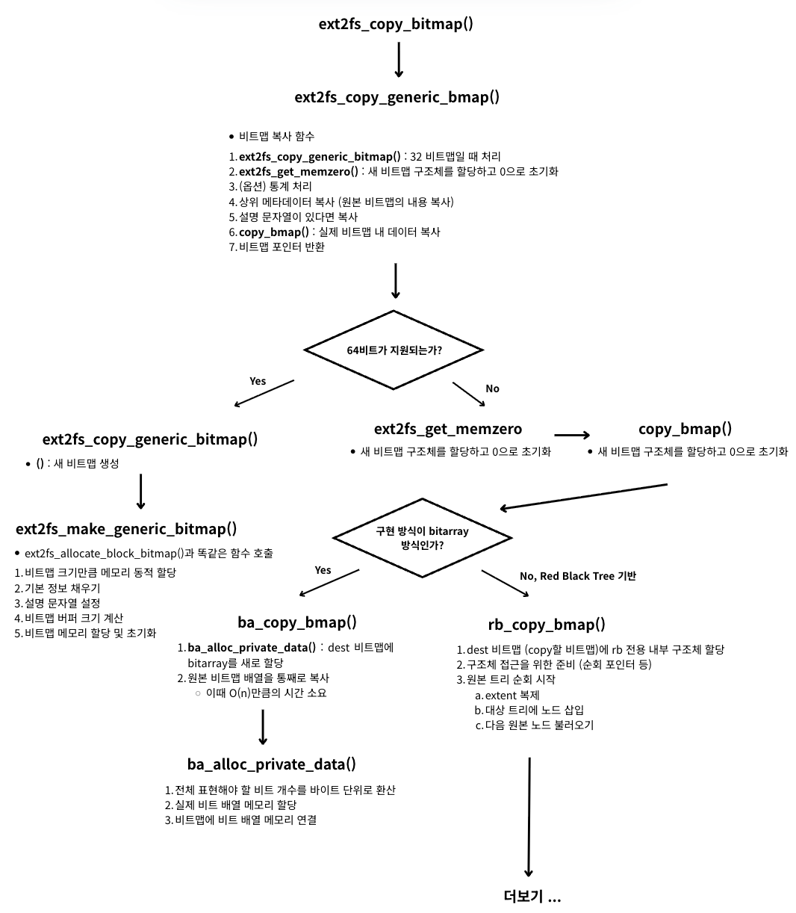
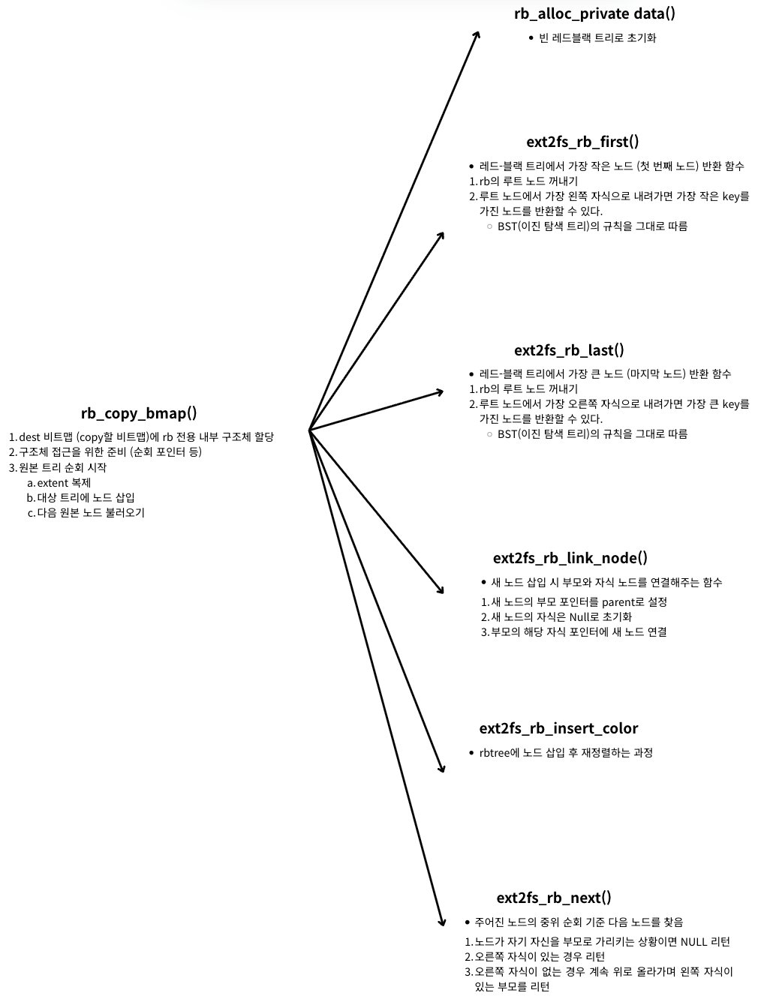

<strong>[e2fsprogs](https://github.com/tytso/e2fsprogs/tree/master)의 깃허브 코드를 참조해 분석한 글입니다.</strong>
{: .notice}

# 📌 e2fsprogs 코드 분석 : ext2fs_copy_bitmap

## 🫧 ext2fs_copy_bitmap();
- inode 비트맵 해제 시 사용
- block 비트맵 해제 시 사용


## 🫧 과정





## 🫧 특징

- `ext2fs_make_generic_bitmap()` : 비트맵을 만드는 과정에서 ext2fs_allocate_block_bitmap()과 똑같은 함수 호출
- [rbtree 설명](https://blogshine.tistory.com/102)


## 🫧 코드

### ✨ ext2fs_copy_bitmap(fs)

- libs/ext2fs/bitmaps.c, $43

```c
errcode_t ext2fs_copy_bitmap(ext2fs_generic_bitmap src,
			     ext2fs_generic_bitmap *dest)
{
	return (ext2fs_copy_generic_bmap(src, dest));
}
```


### ✨ ext2fs_copy_generic_bmap()

- libs/ext2fs/gen_bitmap64.c, $296

```c
// 비트맵 복사 함수
errcode_t ext2fs_copy_generic_bmap(ext2fs_generic_bitmap gen_src,
				   ext2fs_generic_bitmap *dest)
{
	ext2fs_generic_bitmap_64 src = (ext2fs_generic_bitmap_64) gen_src;
	char *descr, *new_descr;

	ext2fs_generic_bitmap_64 new_bmap;
	errcode_t retval;

	if (!src)
		return EINVAL;

	// 1. 32비트맵일 때 처리
	if (EXT2FS_IS_32_BITMAP(src))
		return ext2fs_copy_generic_bitmap(gen_src, dest);

	if (!EXT2FS_IS_64_BITMAP(src))
		return EINVAL;

	/* Allocate a new bitmap struct */
	// 2. 새 비트맵 구조체를 할당하고 0으로 초기화
	retval = ext2fs_get_memzero(sizeof(struct ext2fs_struct_generic_bitmap_64),
				    &new_bmap);
	if (retval)
		return retval;


// 3. (옵션) 통계 처리
#ifdef ENABLE_BMAP_STATS_OPS
	src->stats.copy_count++;
#endif
#ifdef ENABLE_BMAP_STATS
	if (gettimeofday(&new_bmap->stats.created,
			 (struct timezone *) NULL) == -1) {
		perror("gettimeofday");
		ext2fs_free_mem(&new_bmap);
		return 1;
	}
	new_bmap->stats.type = src->stats.type;
#endif

	// 4. 상위 메타데이터 복사 (원본 비트맵의 내용 복사)
	/* Copy all the high-level parts over */
	new_bmap->magic = src->magic;
	new_bmap->fs = src->fs;
	new_bmap->start = src->start;
	new_bmap->end = src->end;
	new_bmap->real_end = src->real_end;
	new_bmap->bitmap_ops = src->bitmap_ops;
	new_bmap->base_error_code = src->base_error_code;
	new_bmap->cluster_bits = src->cluster_bits;

	// 5. 설명 문자열이 있다면 복사
	descr = src->description;
	if (descr) {
		retval = ext2fs_get_mem(strlen(descr)+10, &new_descr);
		if (retval) {
			ext2fs_free_mem(&new_bmap);
			return retval;
		}
		strcpy(new_descr, "copy of ");
		strcat(new_descr, descr);
		new_bmap->description = new_descr;
	}

	// 6. 실제 비트맵 내 데이터 복사
	retval = src->bitmap_ops->copy_bmap(src, new_bmap);
	if (retval) {
		ext2fs_free_mem(&new_bmap->description);
		ext2fs_free_mem(&new_bmap);
		return retval;
	}


	// 7. 비트맵 포인터 반환
	*dest = (ext2fs_generic_bitmap) new_bmap;

	return 0;
}
```


### ✨ ext2fs_copy_generic_bitmap()

- libs/ext2fs/gen_bitmap.c, $154

```c
errcode_t ext2fs_copy_generic_bitmap(ext2fs_generic_bitmap gen_src,
				     ext2fs_generic_bitmap *dest)
{
	ext2fs_generic_bitmap_32 src = (ext2fs_generic_bitmap_32) gen_src;

	// 새 비트맵 생성
	return (ext2fs_make_generic_bitmap(src->magic, src->fs,
					   src->start, src->end,
					   src->real_end,
					   src->description, src->bitmap,
					   dest));
}
```


### ✨ ba_copy_bmap()

- libs/ext2fs/blk64_ba.c, $108

```c
static errcode_t ba_copy_bmap(ext2fs_generic_bitmap_64 src,
			      ext2fs_generic_bitmap_64 dest)
{
	ext2fs_ba_private src_bp = (ext2fs_ba_private) src->private;
	ext2fs_ba_private dest_bp;
	errcode_t retval;
	size_t size;

	// 1. dest 비트맵에 bitarray를 새로 할당
	retval = ba_alloc_private_data (dest);
	if (retval)
		return retval;

	dest_bp = (ext2fs_ba_private) dest->private;

	size = (size_t) (((src->real_end - src->start) / 8) + 1);

	// 2. 원본 비트맵 배열을 통째로 복사
	// O(n)만큼의 시간이 걸림
	memcpy (dest_bp->bitarray, src_bp->bitarray, size);

	return 0;
}
```


### ✨ ba_alloc_private_data()

- libs/ext2fs/blk64_ba.c, $43

```c
static errcode_t ba_alloc_private_data (ext2fs_generic_bitmap_64 bitmap)
{
	ext2fs_ba_private bp;
	errcode_t	retval;
	size_t		size;

	/*
	 * Since we only have the one pointer, we could just shove our
	 * private data in the void *private field itself, but then
	 * we'd have to do a fair bit of rewriting if we ever added a
	 * field.  I'm agnostic.
	 */
	retval = ext2fs_get_mem(sizeof (ext2fs_ba_private), &bp);
	if (retval)
		return retval;

	// 1. 전체 표현해야 할 비트 개수를 바이트 단위로 환산
	size = (size_t) (((bitmap->real_end - bitmap->start) / 8) + 1);

	// 2. 실제 비트 배열 메모리를 할당
	retval = ext2fs_get_mem(size, &bp->bitarray);
	if (retval) {
		ext2fs_free_mem(&bp);
		bp = 0;
		return retval;
	}

	// 비트맵에 비트 배열 메모리 연결
	bitmap->private = (void *) bp;
	return 0;
}
```


### ✨ rb_copy_bmap()

- libs/ext2fs/blk64_rb.c, $247

```c
static errcode_t rb_copy_bmap(ext2fs_generic_bitmap_64 src,
			      ext2fs_generic_bitmap_64 dest)
{
	struct ext2fs_rb_private *src_bp, *dest_bp;
	struct bmap_rb_extent *src_ext, *dest_ext;
	struct rb_node *dest_node, *src_node, *dest_last, **n;
	errcode_t retval = 0;

	// 1. dest 비트맵 (copy할 비트맵)에 rb 전용 내부 구조체 할당
	retval = rb_alloc_private_data (dest);
	if (retval)
		return retval;

	// 2. 구조체 접근을 위한 준비 (순회 포인터)
	src_bp = (struct ext2fs_rb_private *) src->private;
	dest_bp = (struct ext2fs_rb_private *) dest->private;
	// 순회 포인터 초기화
	src_bp->rcursor = NULL;
	dest_bp->rcursor = NULL;

	// 3. 원본 트리 순회 시작
	src_node = ext2fs_rb_first(&src_bp->root);
	while (src_node) {
		src_ext = node_to_extent(src_node);
		
		// 3.1. extent 복제
		retval = ext2fs_get_mem(sizeof (struct bmap_rb_extent),
					&dest_ext);
		if (retval)
			break;

		memcpy(dest_ext, src_ext, sizeof(struct bmap_rb_extent));

		// 3.2. 대상 트리에 노드 삽입
		dest_node = &dest_ext->node;
		n = &dest_bp->root.rb_node;

		dest_last = NULL;
		if (*n) {
			dest_last = ext2fs_rb_last(&dest_bp->root);
			n = &(dest_last)->rb_right;
		}

		ext2fs_rb_link_node(dest_node, dest_last, n);
		ext2fs_rb_insert_color(dest_node, &dest_bp->root);

		// 3.3 다음 원본 노드 불러오기
		src_node = ext2fs_rb_next(src_node);
	}

	return retval;
}
```


### ✨ rb_alloc_private_data()

- libs/ext2fs/blkmap64_rb.c, $187
- 레드블랙 트리 초기화 함수

```c
static errcode_t rb_alloc_private_data (ext2fs_generic_bitmap_64 bitmap)
{
	struct ext2fs_rb_private *bp;
	errcode_t	retval;

	retval = ext2fs_get_mem(sizeof (struct ext2fs_rb_private), &bp);
	if (retval)
		return retval;

	// 빈 레드블랙 트리로 초기화
	bp->root = RB_ROOT;
	bp->rcursor = NULL;
	bp->rcursor_next = NULL;
	bp->wcursor = NULL;

#ifdef ENABLE_BMAP_STATS_OPS
	bp->test_hit = 0;
	bp->mark_hit = 0;
#endif

	bitmap->private = (void *) bp;
	return 0;
}
```


### ✨ ext2fs_rb_first()

- libs/ext2fs/rbtree.c, $287

```c
/*
 * This function returns the first node (in sort order) of the tree.
 */
// 레드-블랙 트리에서 가장 작은 노드 (첫 번째 노드) 반환 함수
struct rb_node *ext2fs_rb_first(const struct rb_root *root)
{
	struct rb_node	*n;

	// rb의 루트 노드 꺼내기
	n = root->rb_node;
	if (!n)
		return NULL;
	// 2. 루트 노드에서 가장 왼쪽 자식으로 내려가면 가장 작은 key를 가진 노드를 반환할 수 있다.
	// BST (이진 탐색 트리)의 규칙을 그대로 따름
	while (n->rb_left)
		n = n->rb_left;
	return n;
}
```


### ✨ ext2fs_rb_last()

- libs/ext2fs/rbtree.c, $303

```c
// 레드-블랙 트리에서 가장 큰 노드 (마지막 노드) 반환 함수
struct rb_node *ext2fs_rb_last(const struct rb_root *root)
{
	struct rb_node	*n;

	// 1. rb의 루트 노드 꺼내기
	n = root->rb_node;
	if (!n)
		return NULL;
	// 2. 루트 노드에서 가장 오른쪽 자식으로 내려가면 가장 큰 key를 가진 노드를 반환할 수 있다.
	// BST (이진 탐색 트리)의 규칙을 그대로 따름
	while (n->rb_right)
		n = n->rb_right;
	return n;
}
```


### ✨ ext2fs_rb_link_node()

- libs/ext2fs/rbtree.h, $170

```c
// 새 노드 삽입 시 부모와 자식 노드를 연결해주는 함수
static inline void ext2fs_rb_link_node(struct rb_node * node,
				     struct rb_node * parent,
				     struct rb_node ** rb_link)
{
	// 1. 새 노드의 부모 포인터를 parent로 설정
	node->rb_parent_color = (uintptr_t)parent;
	// 2. 새 노드의 자식은 Null로 초기화
	node->rb_left = node->rb_right = NULL;

	// 3. 부모의 해당 자식 포인터에 새 노드 연결
	*rb_link = node;
}
```


### ✨ ext2fs_rb_insert_color()

- libs/ext2fs/rbtree.c, $71

```c
void ext2fs_rb_insert_color(struct rb_node *node, struct rb_root *root)
{
	struct rb_node *parent, *gparent;

	while ((parent = ext2fs_rb_parent(node)) && ext2fs_rb_is_red(parent))
	{
		gparent = ext2fs_rb_parent(parent);

		if (parent == gparent->rb_left)
		{
			{
				register struct rb_node *uncle = gparent->rb_right;
				if (uncle && ext2fs_rb_is_red(uncle))
				{
					ext2fs_rb_set_black(uncle);
					ext2fs_rb_set_black(parent);
					ext2fs_rb_set_red(gparent);
					node = gparent;
					continue;
				}
			}

			if (parent->rb_right == node)
			{
				register struct rb_node *tmp;
				__rb_rotate_left(parent, root);
				tmp = parent;
				parent = node;
				node = tmp;
			}

			ext2fs_rb_set_black(parent);
			ext2fs_rb_set_red(gparent);
			__rb_rotate_right(gparent, root);
		} else {
			{
				register struct rb_node *uncle = gparent->rb_left;
				if (uncle && ext2fs_rb_is_red(uncle))
				{
					ext2fs_rb_set_black(uncle);
					ext2fs_rb_set_black(parent);
					ext2fs_rb_set_red(gparent);
					node = gparent;
					continue;
				}
			}

			if (parent->rb_left == node)
			{
				register struct rb_node *tmp;
				__rb_rotate_right(parent, root);
				tmp = parent;
				parent = node;
				node = tmp;
			}

			ext2fs_rb_set_black(parent);
			ext2fs_rb_set_red(gparent);
			__rb_rotate_left(gparent, root);
		}
	}

	ext2fs_rb_set_black(root->rb_node);
}
```


### ✨ ext2fs_rb_next()

- libs/ext2fs/rbtree.c, $319

```c
// 주어진 노드의 중위 순회 기준 다음 노드를 찾음
struct rb_node *ext2fs_rb_next(struct rb_node *node)
{
	struct rb_node *parent;

	// 1. 노드가 자기자신을 부모로 가리키는 상황이면 NULL 리턴
	if (ext2fs_rb_parent(node) == node)
		return NULL;

	/* If we have a right-hand child, go down and then left as far
	   as we can. */
	// 2. 오른쪽 자식이 있는 경우
	if (node->rb_right) {
		node = node->rb_right;
		while (node->rb_left)
			node=node->rb_left;
		return (struct rb_node *)node;
	}

	/* No right-hand children.  Everything down and left is
	   smaller than us, so any 'next' node must be in the general
	   direction of our parent. Go up the tree; any time the
	   ancestor is a right-hand child of its parent, keep going
	   up. First time it's a left-hand child of its parent, said
	   parent is our 'next' node. */
	// 오른쪽 자식이 없는 경우
	// 계속 위로 올라가며 처음으로 왼쪽 자식이 있는 부모를 리턴
	   while ((parent = ext2fs_rb_parent(node)) && node == parent->rb_right)
		node = parent;

	return parent;
}
```