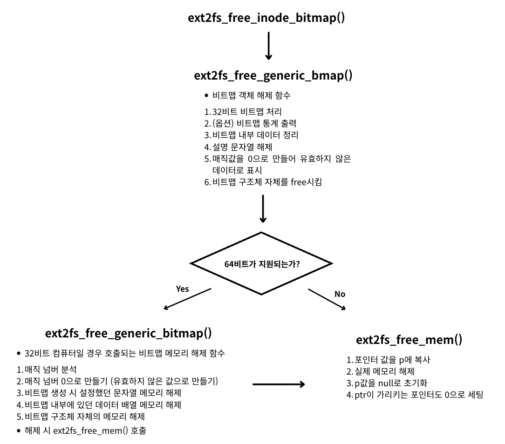

<strong>[e2fsprogs](https://github.com/tytso/e2fsprogs/tree/master)의 깃허브 코드를 참조해 분석한 글입니다.</strong>
{: .notice}

# 📌 e2fsprogs 코드 분석 : ext2fs_free_inode_bitmap

## 🫧 ext2fs_free_inode_bitmap()/ext2fs_free_block_bitmap();
- inode 비트맵 해제 시 사용
- block 비트맵 해제 시 사용


## 🫧 과정



## 🫧 특징
- 구조체를 초기화하기 전 매직 넘버를 먼저 초기화함
	- 이후에 다시 접근하려 할 때 오류를 방지할 수 있음
- inode bitmap과 block bitmap 모두 내부적으로는 `완전히 똑같은` 함수를 사용함.

## 🫧 코드

### ✨ ext2fs_free_inode_bitmap(fs)

- libs/ext2fs/bitmaps.c, $33

```c
void ext2fs_free_inode_bitmap(ext2fs_inode_bitmap bitmap)
{
	ext2fs_free_generic_bmap(bitmap);
}
```

### ✨ ext2fs_free_block_bitmap(fs)

- libs/ext2fs/bitmaps.c, $38

```c
void ext2fs_free_block_bitmap(ext2fs_block_bitmap bitmap)
{
	ext2fs_free_generic_bmap(bitmap);
}
```


### ✨ ext2fs_free_generic_bmap()

- libs/ext2fs/gen_bitmap64.c, $57

```c
// 비트맵 객체 해제 함수
void ext2fs_free_generic_bmap(ext2fs_generic_bitmap gen_bmap)
{
	ext2fs_generic_bitmap_64 bmap = (ext2fs_generic_bitmap_64) gen_bmap;

	if (!bmap)
		return;

	// 1. 32비트 비트맵 처리
	if (EXT2FS_IS_32_BITMAP(bmap)) {
		ext2fs_free_generic_bitmap(gen_bmap);
		return;
	}

	if (!EXT2FS_IS_64_BITMAP(bmap))
		return;

	// 2. (옵션) 비트맵 통계 출력
#ifdef ENABLE_BMAP_STATS
	if (ext2fs_safe_getenv("E2FSPROGS_BITMAP_STATS")) {
		ext2fs_print_bmap_statistics(bmap);
		bmap->bitmap_ops->print_stats(bmap);
	}
#endif

	// 3. 비트맵 내부 데이터 정리
	bmap->bitmap_ops->free_bmap(bmap);

	// 4. 설명 문자열 해제
	if (bmap->description) {
		ext2fs_free_mem(&bmap->description);
		bmap->description = 0;
	}
	// 5. 매직값을 0으로 만들어 유효하지 않은 데이터로 표시
	bmap->magic = 0;

	// 6. 비트맵 구조체 자체를 free시킴
	ext2fs_free_mem(&bmap);
}
```


### ✨ ext2fs_free_generic_bitmap()

- libs/ext2fs/gen_bitmap.c, $167
- 32비트 컴퓨터일 경우 호출되는 비트맵 메모리 해제 함수

```c
// 32비트일 경우 분기
void ext2fs_free_generic_bitmap(ext2fs_inode_bitmap gen_bitmap)
{
	ext2fs_generic_bitmap_32 bitmap = (ext2fs_generic_bitmap_32) gen_bitmap;


	// 1. 매직 넘버 분석
	if (check_magic(gen_bitmap))
		return;

	// 2. 매직 넘버 0으로 만들기 (유효하지 않은 값으로 만들기)
	bitmap->magic = 0;
	// 3. 비트맵 생성 시 설정했던 문자열 메모리 해제
	if (bitmap->description) {
		ext2fs_free_mem(&bitmap->description);
		bitmap->description = 0;
	}

	// 4. 비트맵 내부에 있던 데이터 배열 메모리 해제
	if (bitmap->bitmap) {
		ext2fs_free_mem(&bitmap->bitmap);
		bitmap->bitmap = 0;
	}

	// 5. 비트맵 구조체 자체의 메모리 해제
	ext2fs_free_mem(&bitmap);
}
```


### ✨ ext2fs_free_mem()

- libs/ext2fs/ext2fs.h, $2061

```c
/*
 * Free memory.  The 'ptr' arg must point to a pointer.
 */
_INLINE_ errcode_t ext2fs_free_mem(void *ptr)
{
	void *p;

	memcpy(&p, ptr, sizeof(p)); // 포인터 값을 p에 복사
	free(p); // 실제 메모리 해제
	p = 0; // p값 null로 초기화
	memcpy(ptr, &p, sizeof(p)); // ptr이 가리키는 포인터도 0으로 세팅
	return 0;
}
```