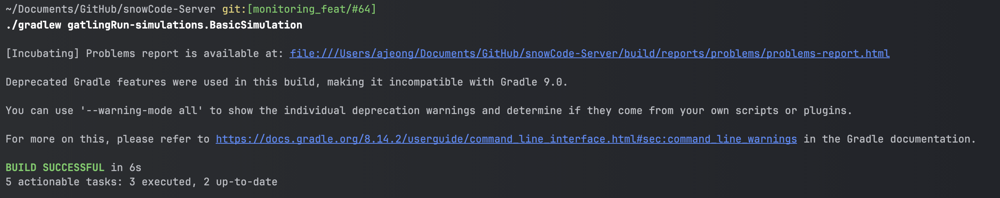
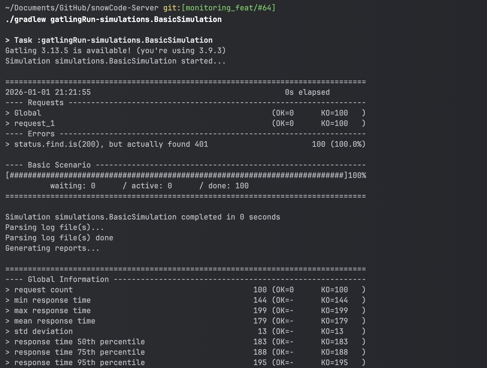
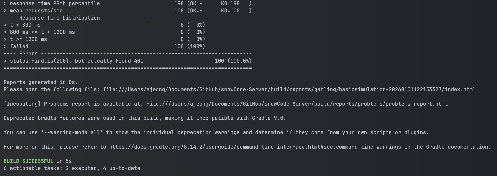
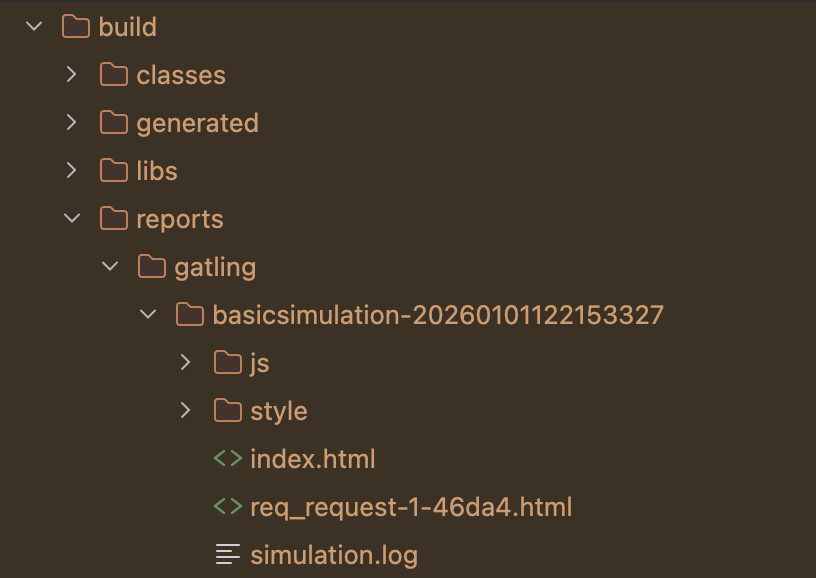
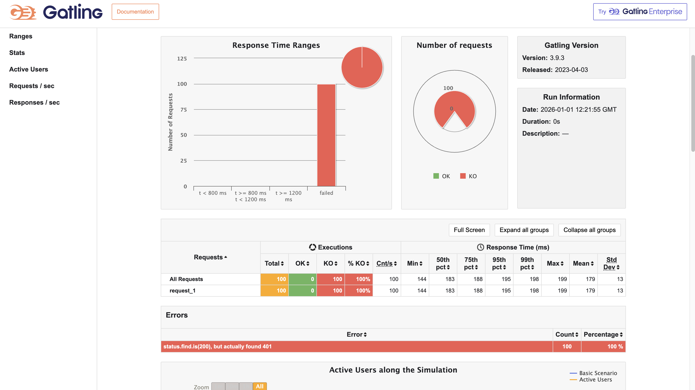

## 🫧 부하 테스트란?
- 일반적으로 여러 사용자가 동시에 프로그램에 액세스하는 것을 시뮬레이션하여 소프트웨어 프로그램의 예상 사용량을 모델링하는 방식을 의미한다. [출처: 위키백과](https://ko.wikipedia.org/wiki/%EB%B6%80%ED%95%98_%ED%85%8C%EC%8A%A4%ED%8A%B8#:~:text=%EB%B6%80%ED%95%98%20%ED%85%8C%EC%8A%A4%ED%8A%B8%EB%8A%94%20%EC%A0%95%EC%83%81%20%EB%B6%80%ED%95%98,%ED%95%98%EB%8A%94%20%EB%8D%B0%20%EB%8F%84%EC%9B%80%EC%9D%B4%20%EB%90%9C%EB%8B%A4.)
- 쉽게 말해 소프트웨어에 부하를 걸어보고, 한계치가 어디까지인지, 제대로 동작하는지 등을 판단할 수 있는 테스트라고 이해하면 된다.

## 🫧 부하 테스트 툴

N+1 문제와 복잡한 비즈니스 로직이 포함되어 있는 API 중 하나를 선정해 리팩토링을 수행하기 위한 필수 관문..

cf) 성능을 분석하고자 하는 더 자세한 이유는 [다음]()을 참고해주세요!

기존까지 부하 테스트를 해 본 적이 없기 때문에 우선 부하 테스트를 위한 툴을 선택해야 했다.

부하 테스트 툴 선택을 위한 나만의 기준은 다음과 같이 세웠다.

1. 나에게 익숙하거나 배우기 쉬운 언어를 사용하는가?
2. 간단하게 조작 가능할 것. (툴을 간단하게 이해하는 데 한 시간 이내)
3. 자료가 많을 것 (촉박한 시간 내 구현을 위해서, 스프링 연동 관련 기준!)

위 기준으로 열심히 성능 분석 툴을 찾아보았다!

다음은 우선 무료인 것들로만 필터링을 거친 툴들이다.

(개인적인 기준입니다!)

| 툴 | 특징 | 테스트용 언어 | 자료가 많은가? | 난이도 |
|---|------|-----------|-------------|--------------------|
| JMeter | 장점: 자료가 많다, GUI로 HTTP Request 작성이 가능하다, 코딩 없이 직관적 설정이 가능하다 | xml, Groovy | 상 | 하 |
| | 단점: GUI 사용 시 리소스 사용량 ↑, 클라이언트측 부하 측정의 어려움, 복잡한 테스트 시나리오나 대규모 시스템에서는 부적합 |
| nGrinder | 장점: Junit5 기반, 웹 기반 UI(분석, 프로세스, 스레드 설정이 가능), 분석을 정말 꼼꼼하게 할 수 있는 것 같다 | Jython, Grvovy | 상 | 중 |
| | 단점: 추가적인 설치 필요, 한 파일에 여러 테스트를 넣을 경우 쿠키 관련 설정 오류가 날 수 O, 스레드 기반 구현이기 때문에 성능 저하 O |
| K6 | 장점: Grafana에서 만들었기에 연동성이 좋다(Grafana에 import), docker-compose로 돌릴 수 있다, 가볍다 | Javascript | 상 | 중 |
| | 단점: 브라우저 기반 테스트 불가, 대시보드 연동 필요 |
| Locust | 장점: 테스트 시나리오를 프로그래밍하여 동적인 부하 생성이 가능 | Python | 중 | 중 |
| | 단점: 복잡한 시나리오와 대규모 테스트에서 성능이 제한 |
| Gatling | 장점: 코드 기반 테스트 가능, 테스트 시나리오 형태로 작성 가능, 테스트코드 짜는 것처럼 짜면 될 것 같다(개인적 견해), 효율적인 자원 사용, 복잡한 시나리오 작성 가능 | Java | 중 | 상 |
| | 단점: 코드 기반이기 때문에 프로그래밍적 지식이 필요하다 |


참고로 나는 Java >>>> Python >= Jython = Javascripth >> Groovy = XML(더듬더듬 보는 수준) 순으로 자신 있다(?)

그리고 아주 다행히도, TDD 방식으로 프로젝트를 진행해 본 적이 있기 때문에 테스트 코드에는 아주아주 조금 익숙한 편이었다.

따라서 언어적으로 가장 친숙하고, TDD 방식으로 프로젝트를 한 덕분에 익숙해진 테스트 코드 방식을 미루어 볼 때, Gatling가 가장 잘 맞을 것 같다고 생각하여 해당 툴을 선택하게 되었다.

(솔직히 가장 많이 들어본 NGrinder로 할 줄 알았는데, 찾아보니까 현재 상황에 맞는 툴은 Gatling인 것 같아서 해당 툴을 선택하게 되었다.)

### ✨ Gatling 장단점

오늘도 역시나 기술 도입 전 찾아보는 장점과 단점.

#### 💡 장점
- 코드 기반 테스트가 가능하기 때문에 복잡한 시나리오를 구성할 수 있다.
- 성능 테스트 도구가 가볍다. (대규모 부하 테스트에 유리)
- Java DSL로 작성되어 (나에게) 친숙하다.
- 그래프 가독성이 좋다.
- 코드 작성이기 때문에 연동과 Git 저장 등이 쉽다.


#### 💡 단점
- 새 데이터 생성 후 실제 서버 DB에 반영되므로 배포되고 있는 서버에서 사용이 불가능하다.
- 코드 기반이기 때문에 프로그래밍적 지식이 필요하다.
- 실시간 모니터링이 기본으로 제공되지 않으며, 결과는 종료 후 분석해야 한다.
- 코드 기반이기 때문에 비개발자는 보기 어렵다.
- 공식 문서 및 예제가 거의 Scala DSL로 설명되어 있다.

테스트를 코드처럼 한 눈에 보는 게 좋았으며, 무엇보다도 자바로 Spring에서 간단하게 구현 가능하기 때문에 Gatling이 마음에 들었다.

단점의 경우, 실시간 모니터링은 이미 연동된 Prometheus & Grafana로 보면 되며, 나 혼자 보는 것이기 때문에 상관 없다고 생각했다.

사실 조금 고민한 부분은 공식 문서 및 예제가 거의 Scala DSL로 되어 있다는 점이었는데, 이 또한 Java DSL 문서가 아예 없는 것은 아니며, 파이썬이나 다른 툴에서 사용하는 언어도 결국 찾는 것은 똑같으므로 단점 또한 포용 가능하다고 생각하여 최종적으로 Gatling을 선택하게 되었다.

이제 툴을 연동해 보자!

## 🫧 Gatling 툴 도입

### ✨ 1. 의존성 추가
- build.gradle에 다음과 같이 추가

```gradle
plugins {
...
   id 'io.gatling.gradle' version '3.9.3'
}

...

dependencies {
    testImplementation 'io.gatling.highcharts:gatling-charts-highcharts:3.9.3'
    testImplementation 'io.gatling:gatling-test-framework:3.9.3'
       }
```


### ✨ 2. 시나리오 작성

Gratling을 사용하여 부하 테스트를 수행하려면, 먼저 테스트 시나리오 작성이 필요하다.

시나리오는 Scala 또는 자바 기반의 DSL을 사용하여 작성 가능하다.

나는 Java가 익숙하므로 이를 사용하여 작성할 예정이다.

```
my-spring-app/
├── src/
│   ├── main/
│   │   ├── java/
│   │   │   └── com/
│   │   │       └── example/
│   │   │           └── MySpringApp.java
│   │   └── resources/
│   ├── test/
│   │   ├── java/
│   │   └── resources/
│   ├── gatling/
│   │   ├── java/
│   │   │   └── simulations/
│   │   │       └── BasicSimulation.java
│   │   └── resources/
└── build.gradle
```

여기서 반드시 다음과 같은 디렉터리 구조를 지켜야 파일을 찾을 수 없다는 에러가 나지 않는다.

이렇게 BasicSimulation.java를 만들었다면, 안의 내용을 다음처럼 채워주면 된다.

```java
package simulations;

import io.gatling.javaapi.core.*;
import io.gatling.javaapi.http.*;

import static io.gatling.javaapi.core.CoreDsl.*;
import static io.gatling.javaapi.http.HttpDsl.*;

public class BasicSimulation extends Simulation {

    HttpProtocolBuilder httpProtocol = http
        .baseUrl("http://localhost:8080") // 테스트할 서버의 URL
        .acceptHeader("application/json"); // 요청 헤더 설정

    ScenarioBuilder scn = scenario("Basic Scenario")
        .exec(http("request_1")
            .get("/health") // 테스트할 엔드포인트
            .check(status().is(200))); // 응답 상태 코드 확인

    {
        setUp(
            scn.injectOpen(atOnceUsers(100)) // 100명의 사용자가 동시에 요청
        ).protocols(httpProtocol);
    }
}
```

이건 테스트용이기 때문에 /health로 우선 테스트 코드를 돌리기로 했다.


### ✨ 3. 실행

```
./gradlew gatlingRun-simulations.BasicSimulation
```

여기서 BasicSimulation은 파일명으로, 만일 테스트가 추가된다면 이름을 바꾸어 실행시켜주면 된다.

다시 말하는데, 반드시 디렉터리 구조를 지킬 것...

아니면 이렇게 성공이라 나와도 실제로 레포트에 아무것도 없는 경우가 발생할 수 있다!!




성공 시 다음처럼 뜨게 된다.





테스트가 완료되면 Gatling은 결과를 그래프와 Report 형태로 제공하게 된다.

실행이 완료되면 다음처럼 디렉터리에 자동으로 레포트가 생기게 된다.


여기서 끝쪽에 보이는 index.html을 브라우저로 열면 다음과 같은 창이 뜨게 된다.



결과 사진이다!

툴 연동을 위해 임의로 /health를 쳤더니 401(...) 에러가 떠서 모든 테스트에 실패한 사진이다.

/health를 아직도 인증/인가 제외 API로 안 빼두었다니...

어쨌든.. 이제 연동도 했으니 진짜로 API 테스트를 위한 시나리오를 짜고 부하 테스트를 진행해 봐야겠다.


## 🫧 참고자료
- [성능 분석 툴_표](https://behoney.tistory.com/81)
- [출처: 위키백과](https://ko.wikipedia.org/wiki/%EB%B6%80%ED%95%98_%ED%85%8C%EC%8A%A4%ED%8A%B8#:~:text=%EB%B6%80%ED%95%98%20%ED%85%8C%EC%8A%A4%ED%8A%B8%EB%8A%94%20%EC%A0%95%EC%83%81%20%EB%B6%80%ED%95%98,%ED%95%98%EB%8A%94%20%EB%8D%B0%20%EB%8F%84%EC%9B%80%EC%9D%B4%20%EB%90%9C%EB%8B%A4.)
- [Gatling](https://bezzang2.tistory.com/193)
- [Ngrinder](https://leezzangmin.tistory.com/42#google_vignette)
- [JMeter 장단점](https://www.quora.com/What-are-the-pros-and-cons-of-using-JMeter-load-testing)
- [부하테스트 도구 선택](https://velog.io/@lswoo0705/%EB%B6%80%ED%95%98-%ED%85%8C%EC%8A%A4%ED%8A%B8-%EB%8F%84%EA%B5%ACJMeter-Gatling-nGrinder)
- [K6 부하테스트](https://velog.io/@kimhalin/%EC%84%9C%EB%B2%84-%EB%B6%80%ED%95%98-%ED%85%8C%EC%8A%A4%ED%8A%B8-K6)
- [Locust 등 부하 테스트 비교](https://hdbstn3055.tistory.com/318)
- [트래픽 테스트 시나리오](https://yoonsys.tistory.com/36)
- [테스트 종류](https://study0304.tistory.com/62)
- [Gatling 툴 도입하기](https://bezzang2.tistory.com/193)