## 🫧 모니터링이란?
- 모니터링이란 시스템, 네트워크, 애플리케이션 또는 서비스를 실시간으로 관찰하고 추적하는 과정이다.

### ✨ 모니터링이 필요한 이유

나의 경우는 사실 부하 테스트 결과를 수치로 검증하고 싶어서였다.

앞선 과정과 같이, 문제가 되는 API를 발견하였고, 그것이 문제가 된다는 사실을 확정하기 위해서는 부하 테스트가 필요했다.

그런데 요금의 문제로 로컬에서 테스트 해야 하는데, 어떻게 확인할지 감이 안 잡혔다.

관련하여 찾아보니, CPU 사용량, 로그 등 시각화하여 볼 수 있는 모니터링 툴이 있다는 사실을 알게 되었고, 이에 대해 정량적인 수치로 부하 테스트 결과를 정리하기 좋겠다는 생각이 들어 적용 후 블로그 글도 작성하게 되었다.


### ✨ 모니터링 항목
- 찾아보면서 알게 된 사실은, 모니터링 항목이 굉장히 많다는 것이다.

블로그 글을 참고해 간략하게 작성해 보자면 다음과 같다.

1. 시스템 리소스 모니터링
- CPU, 메모리, 디스크 사용량 -> 성능 저하 예방

2. 네트워크 트래픽
- 트래픽 과다 판단 가능
- 요청과 응답 간 지연 시간을 측정하여 성능 저하 방지

3. 애플리케이션 성능 모니터링
- 각 요청에 대한 응답 시간 확인 가능
- TPS (초당 처리되는 트랜잭션 수 모니터링 -> 부하 측정 가능)

4. 로그 모니터링
- 애플리케이션 로그 (오류, 경고, 디버그 정보 추적)
- 서버 로그
- 보안 로그

5. 데이터베이스 모니터링
- 쿼리 성능 (쿼리의 실행 시간 추적 가능)
- 디스크 공간
- 데이터베이스 응답 시간 (쿼리 응답 시간을 모니터링해 지연 식별 및 최적화 가능)

6. API 모니터링
- API 호출 횟수
- 응답 시간 (API 응답 시간 측정)

7. 보안 모니터링
- 침입 탐지
- 보안 취약점

8. 알림 및 경고
- 알림 시스템 (서버 다운, 성능 저하 등)
- 자동화된 경고

9. 사용자 경험 모니터링
- 응답 시간
- 사용자 활동
- 트랜잭션 완료율

10. 가용성 모니터링
- 서버/서비스 상태
- 서비스 가용성

11. 배포 및 인프라 모니터링
- 배포 상태
- 클러스터 상태

이 중에 나와 연관 높은 항목은 애플리케이션 성능 모니터링, 데이터베이스 모니터링, API 모니터링인 것 같다.

목적 자체가 부하 테스트 이후 정량적인 수치 판단을 위함이었으므로, 우선은 운영 환경의 모니터링보다는 수치 검증에서의 모니터링에 집중하기로 목표를 잡았다.


### ✨ 모니터링 단점

1. 알림 과부하
2. 시스템 오버헤드 (실시간 로그 수집, 데이터 분석 과정에서 CPU/메모리 사용량 증가 가능성 O)
3. 민감한 데이터 노출 (로그 파일 등)
4. 중앙 집중화된 시스템 공격 (모든 시스템 모니터링을 중앙에서 처리하는 경우, 공격자가 중앙 모니터링 시스템에 침투하여 모든 시스템에 대한 정보를 통제할 위험이 존재한다.)
5. 환경 변화에 따른 조정 (새 애플리케이션 추가 또는 인프라 확장 시 기존 모니터링 설정 업데이트 필요)

기술 도입에는 늘 트레이드 오프가 따르는 것 같다.

모니터링 단점을 잘 파악하고, 할 수 있는 최적의 선택을 하고 싶다.

또한, 프론트와 연동 이후에는 수치 검증에서의 모니터링에서 범위를 더 넓혀 운영 환경에서의 모니터링으로 확장시키고 싶다.

물론 단점도 확인하고 단점이 장점을 가리지 않도록 꼼꼼히 비교 후 업데이트 해야 함을 잊지 말자!

## 🫧 모니터링 툴 선택하기

### ✨ 기준

늘 스스로 세운 선택 기준을 갖고 선택해야 신기술 도입에서 기능을 더 잘 활용할 수 있다고 생각한다.

그래서 또 세운 기준...!

나는 백수 대학생이고(...) 모니터링 시스템을 처음 써 보며, 시간이 많지 않기 때문에 우선은 확인이 용이하고, 빠르게 도입할 수 있는 모니터링 툴을 원했다.

개인적으로 아직까지 알림 기능은 오버헤드가 크다고 생각했기 때문에 (사용자 모집 이전) 알림 기능 여부는 선택에 영향을 미치지 않는다.

1. 무료인가
2. 로컬 환경에서도 동작하는가
3. 보기 쉬운가
4. 관련 자료들이 많은가

이 기준으로 다음 모니터링 툴을 보자!

아래는 무료 여부에 따라 1차로 거른 모니터링 툴 리스트이다.

개인적으로 특징, 복잡도 등을 찾아 보고 느낀 바를 쓴 것이므로 참고용으로만 봐 주시길...

또한, 특징은 내 환경에 맞춰, 실제 필요해 보이는 장/단점을 간략하게 정리한 것이다! 더 자세한 내용은 인터넷을 찾아보시길...

참고로 여기서 언급한 APM은 Apache, php, MySQL 세 가지의 줄임말이다!

| 모니터링 툴 | 특징 | 로컬 환경 동작 여부 | 시각화 | 관련 자료 ↑? | 복잡도 |
|-----------|----|----------------|------|------------|-------|
| Cockpit | <strong>장점</strong>: 리눅스 환경에서 많이 사용, but 패키지 설치가 많고, 소켓 사용이 있음 | O | 중 | 중 | 중 |
|         | <strong>단점</strong>:  리눅스 직접 설치 필요 |
| Cacti | <strong>장점</strong>: 네트워크 모니터링 분야에서 주로 사용, 최소 5초 단위로 실시간 모니터링 가능 | O | 중 | 중 | 상 |
| | <strong>단점</strong>: DB 설정/스케줄러 편집 등 복잡한 과정, APM 설치 필요 |
| Zabbix | <strong>장점</strong>: 엔터프라이즈 환경에서 많이 사용, 네트워크 트래픽까지 확인 가능 | O | 상 | 중 | 상 | 
| | <strong>단점</strong>: APM, 에이전트 설치 등 과정 복잡, MSA 환경에 부적합
| Prometheus + Grafana | <strong>장점</strong>: 컨테이너 환경과 클라우드 네이티브 아키텍처에서 강력, 시계열 데이터 모니터링에 최적화, MSA 모니터링 | O | 상 | 상 | 하 |
| | <strong>단점</strong>: 장기 데이터 저장 한계 |
| Nagios | <strong>장점</strong>: 알림 기능 제공, RTT, Packet 등 네트워크 관련 모니터링 시스템 | O | 하 | 하 | 상 |
| | <strong>단점</strong>: APM 설치 등 초반 구성 복잡 |
| Netdata | <strong>장점</strong>: 간단한 설치 및 설정, 초 단위 실시간 데이터 수집 가능 | O | 상 | 중 | 하 |
| | <strong>단점</strong>: 루트 권한 필요, Linux 환경에서 설치 필요 |
| Whatap | <strong>장점</strong>: 5대 서버까지 무료 사용, 간단한 설치 | O | 상 | 중 | 하 |
| | <strong>단점</strong>: 오픈소스 대비 화면이 익숙하지 않음 |
| AWS CloudWatch | <strong>장점</strong>: AWS 서비스와 통합, 자동화 | X | 상 | 중 | 중 |
| | <strong>단점</strong>: UI 복잡, AWS 환경에서만 사용 가능 |
| ELK Stack | <strong>장점</strong>: 로그 수집, 저장, 시각화의 조합 | O | 중 | 상 | 상 |
| | <strong>단점</strong>: 단순 메트릭 수집 용도로는 오버헤드가 큼 |


그런데 모니터링 툴을 조사하면서 느낀 점은, 모니터링 툴에 대한 설명 및 비교에는 프로메테우스 & 그라파나가 별로 없는 반면 (개인적으로 느끼기에는 Cockpit, Cacti, Zabbix가 많았다), 실제 구현하는 블로그 글에서는 압도적으로 프로메테우스&그라파나가 많았다.

이유는 쓰임새가 다르기 때문..

앞선 표를 정리하면서, 다음 기준을 거쳐 모니터링 툴로 리스트를 추렸다.

- 로컬에서 사용 가능해야 한다.
- 애플리케이션 모니터링 분야에 주력했으면 좋겠다.
- 노트북(맥북)에서도 설치 가능해야 한다.


`Zabbix`, `Prometheus & Grafana`, `Whatap` 이 세 가지를 꼽았다!

그러나 Zabbix보다는 Prometheus가 자료가 더 많고, 무엇보다도 Spring Boot 등과 코드 수정 없이 연동 가능하며, Pull 방식을 사용하는 점이 다른 툴보다 좋다고 생각했기 때문에 `Prometheus & Grafana` 툴을 활용하여 모니터링 시스템을 구축하기로 했다!

(검색 결과, Zabbix는 Pull + Push, Prometheus는 Pull, Whatap은 push 방식인 것 같다!)

### ✨ 프로메테우스 장단점

#### 💡 장점
- 오픈소스 기반으로 비용 부담이 없다.
- Exporter가 다양하고, Spring Boot 등과 코드 수정 없이 연동 가능하다.
- Grafana를 통해 직관적인 대시보드와 알람 설정이 가능하다.
- PromQL 지원: 강력한 쿼리 언어(PromQL)를 통해 복잡한 조건의 메트릭 계산, 필터링 가능
- Pull 방식: Prometheus 서버가 각 서비스(Exporter)로부터 직접 메트릭을 주기적으로 가져옴(scrape)

#### 💡 프로메테우스 단점
- 데이터 기본 15일 보존 (장기 데이터 저장 기능 X)
- 예측 분석 기능이 없음
- 외부 메신저 연동 시 YAML 파일로 직접 구성 필요
- 대규모 분산환경에서는 Thanos 등 외부 확장 도구가 필요하다.
- 로그나 APM은 별도 도구(Loki, Jaeger 등)를 통해 보완해야 한다.

장기적으로 데이터 축적 필요 없고, 외부 메신저 연동이나 대규모 분산 환경, 로그 활용에 해당되지 않기 때문에 단점이 크리티컬하다고 느껴지지 않았다.

또한, 장점으로 되어 있는 PromQL의 경우 나에게는 단점이었는데, (사용해 보지 않았기 때문) 해당 부분도 간략하게 CPU, 메모리 사용량 등만 확인할 예정이므로 따로 PromQL을 위한 시간을 들이지 않아도 손쉽게 확인 가능할 것 같아, 크게 단점으로 느껴지지 않았다.

Prometheus 단독으로 써도 되고, Grafana가 아닌 다른 대안도 존재하였지만, 시각화 도구가 필요했으며 무엇보다도 Prometheus + Grafana 연동 관련 정보가 압도적으로 많았기 때문에 Grafana로 선정하게 되었다.

처음 쓰는 툴은 우선 많은 정보를 선별적으로 찾아 구현 후 더 좋은 툴로 교체해도 문제 없다고 생각했기 떄문이다.

이제 진짜로 구현해보자..


## 🫧 Prometheus 도입

### ✨ 환경 설정하기

1. 의존성 추가하기

```gradle
implementation 'org.springframework.boot:spring-boot-starter-web'
implementation 'org.springframework.boot:spring-boot-starter-actuator'
implementation 'io.micrometer:micrometer-registry-prometheus'
```

여기서 spring boot actuator는 스프링 부트 애플리케이션에서 제공하는 여러가지 정보를 모니터링하기 쉽게 해주는 기능이다.

우리는 Prometheus를 사용할 예정이므로, 이에 대한 의존성도 추가해줬다!

나는 성능 테스트를 위해 모니터링을 도입한 것이었으므로, 기존에 만들어 둔 프로젝트에 내용을 추가해주었다.

```yml
# application.yml
spring:
  application:
    name: test

management:
  endpoints:
    web:
      exposure:
        include: prometheus, health, info
  metrics:
    tags:
      application: ${spring.application.name}
```

만약 인증/인가 추가를 했다면 다음과 같이 권한 규칙 작성이 필요하다.

아니면 막히기 때문이다...

```java
 http.authorizeHttpRequests(authorize -> authorize
                        .requestMatchers(AUTH_WHITELIST).permitAll()
                        .anyRequest().authenticated()
        );
```

나는 SecurityConfig에 다음과 같이 구현되어 있는데, 여기서 AUTH_WHITELIST에 다음과 같이 추가해주었다.

```java
private static final String[] AUTH_WHITELIST = {
            "/swagger-ui/**", ... "/actuator/**"
    };
```

이렇게 함으로써 actuator에 접속할 수 있도록 했다.

http://localhost:8080/actuator

접속 시 다음 사진과 같이 뜨면 우선 1차적으로 연동 성공이다.


또한, http://localhost:8080/actuator/prometheus 접속 시 아래 사진처럼 뜬다.

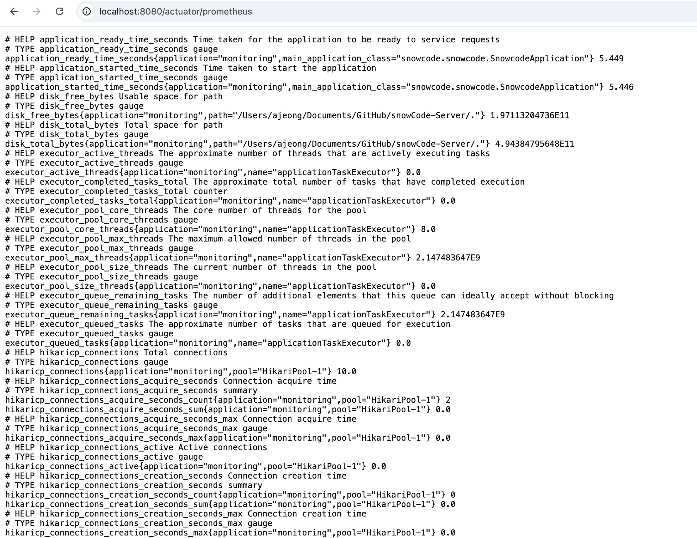

### ✨ yml 파일 설정

나는 docker compose로 따로 관리할 예정이라, monitoring이라는 폴더를 새로 만들어 그 안에 yml 파일을 만들었다.

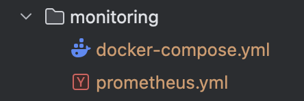

우선 필요한 파일은 두 개가 있다.

나는 로컬에서 스프링부트와 프로메테우스, 그라파나까지 돌릴 예정이라 다음처럼 설정해주었다.

#### 💡 1. prometheus.yml 파일 추가

참고로, .gitignore 파일에 *.yml을 추가해주어 yml 파일이 안 올라가도록 하는 것 잊지 말기!

```yml
scrape_configs:
  - job_name: "springboot"
    metrics_path: "/actuator/prometheus"
    static_configs:
      - targets:
          - "host.docker.internal:8080"
```

#### 💡 2. docker-compose.yml 파일 추가

docker-compose는 도커를 한 번에 돌릴 수 있도록 도와주는 도구라고 생각하면 이해가 쉽다.

로컬에서 prometheus, grafana 모두 돌릴 수도 있지만, 깔끔하게 삭제 가능하고 간단하게 설정 가능하다는 점 때문에 로컬에서 도커를 돌려 Prometheus, Grafana 환경을 세팅하기로 했다.

또한, Prometheus, Grafana 모두 docker 환경에서 동시에 돌릴 것이므로, docker-compose를 활용하였다.

```yml
version: "3.8"

services:
  prometheus:
    image: prom/prometheus
    ports:
      - "9090:9090"
    volumes:
      - ./prometheus.yml:/etc/prometheus/prometheus.yml
    command:
      - "--config.file=/etc/prometheus/prometheus.yml"

  grafana:
    image: grafana/grafana
    ports:
      - "3000:3000"
```

이제 실행을 위한 준비가 완료되었다!!!


### ✨ 실행

당연한 소리지만... 프로메테우스와 그라파나는 Spring의 정보를 활용해 데이터를 수집하고 시각화하는 툴이기 때문에 <strong>스프링을 먼저 실행</strong>해야 한다.

안 그러면

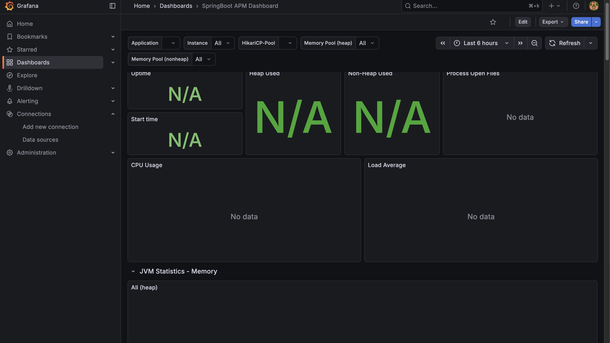

다음처럼 아무것도 안 뜬다!

당연한 소리... 긁어올 서버가 없으니까...


#### 💡 1. 폴더 위치로 이동하기

아까 전 만들어 두었던 폴더로 이동한다.

참고로 docker-compose를 돌리는 것은 명령어를 사용할 예정이기 때문에, intellij 터미널 창에서 작업하였다.

cd monitoring (각자 자신의 폴더 위치로 이동)

#### 💡 2. docker 켜기

나는 docker desktop이 깔려 있기 때문에 더블클릭(...)하여 도커를 켰다.

추가로, 명령어로 도커를 켤 수도 있다.

docker ps

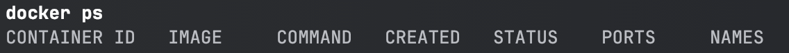

이렇게 뜨면 도커가 켜진 거다!

지금은 실행 중인 컨테이너가 없으므로 아무것도 안 뜨는 것이 정상이다.

#### 💡 3. docker 실행

앞서 말했듯, Prometheus와 Grafana를 도커 컨테이너 위에서 돌릴 예정이고, 한 번에 돌리고 싶었기 때문에 `docker-compose`를 사용했다.

```
docker-compose up -d
```

다음 명령어를 터미널에 쳐 준다.

`-d`는 daemon으로 (정확히 말하면 detached 모드), 백그라운드에서도 실행 가능하도록 한다.

참고로 docker-compose down은 docker-compose.yml로 실행된 모든 컨테이너를 중지하고 삭제하는 명령어이다.

위에 docker-compose up -d를 쳐 주면 다음과 같이 나오면 성공이다.

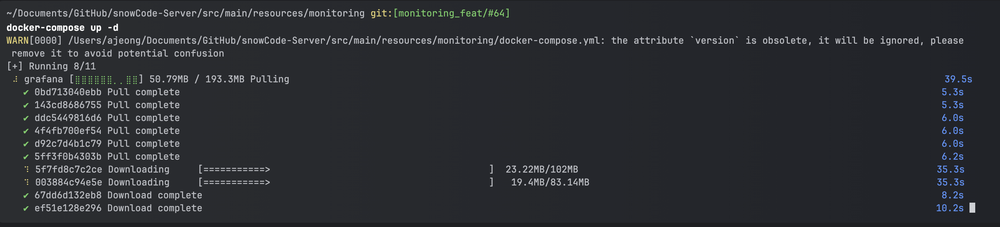


완료되면 아래 사진처럼 된다.

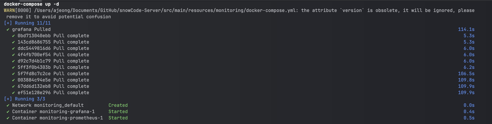


확인용으로 `docker ps` 명령어를 쳐 주면 다음처럼 Prometheus, Grafana가 동시에 컨테이너에 떠 있음을 확인할 수 있다.

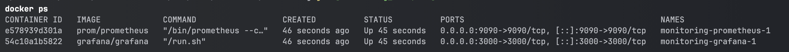

만약 docker ps를 쳤는데 아무것도 안 떠 있다면 도커 설정 자체가 잘못되어 실행이 안 됐거나 혹은 컨테이너가 뜨자마자 죽은 것일 수 있다.

후자의 경우 `docker ps -a`로 확인이 가능하다. 만약 docker ps에는 안 나왔는데, docker ps -a에서는 나왔다면.. 컨테이너가 죽은 거다...

#### 💡 4. 테스트

잘 들어갔는지 확인을 해 보자.

[http://localhost:9090](http://localhost:9090/)로 들어갔을 때 다음처럼 뜨면 프로메테우스 접속 성공이다.

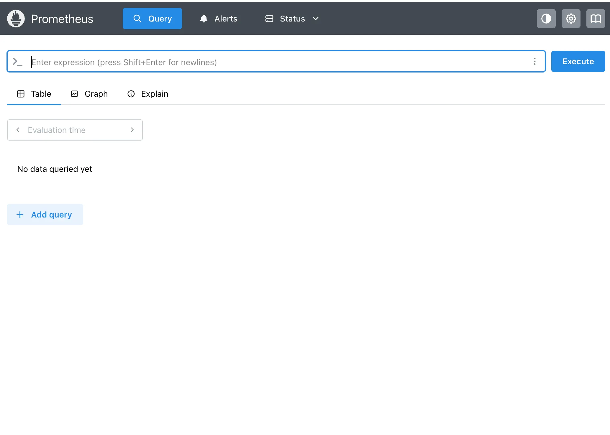

또한, [http://localhost:3000](http://localhost:3000/)로 들어갔을 떄 다음처럼 뜨면 성공이다.

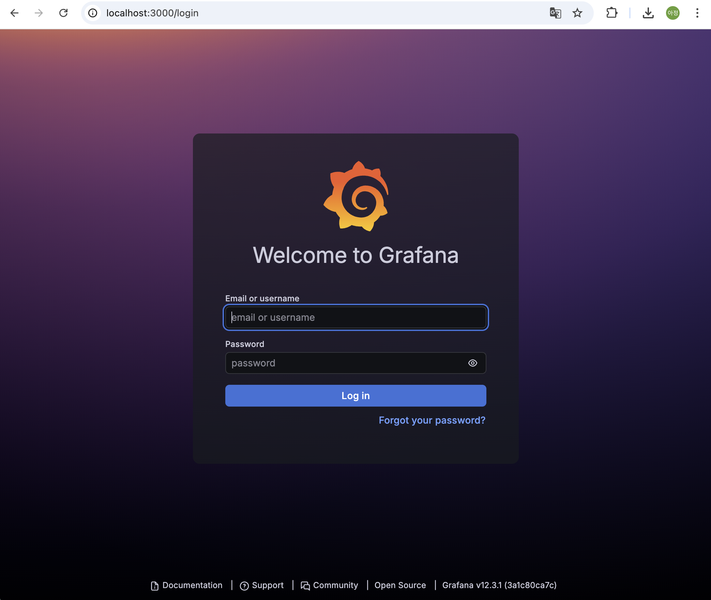

### ✨ 모니터링

여기까지 왔으면 진짜 다 온 거다!!!

이제 모니터링을 위해 Grafana를 설정해주자.

#### 💡 1. Grafana 로그인

아까 전 로그인 환경에서, ID/PW 모두 admin을 쳐 주면 로그인 성공이다.

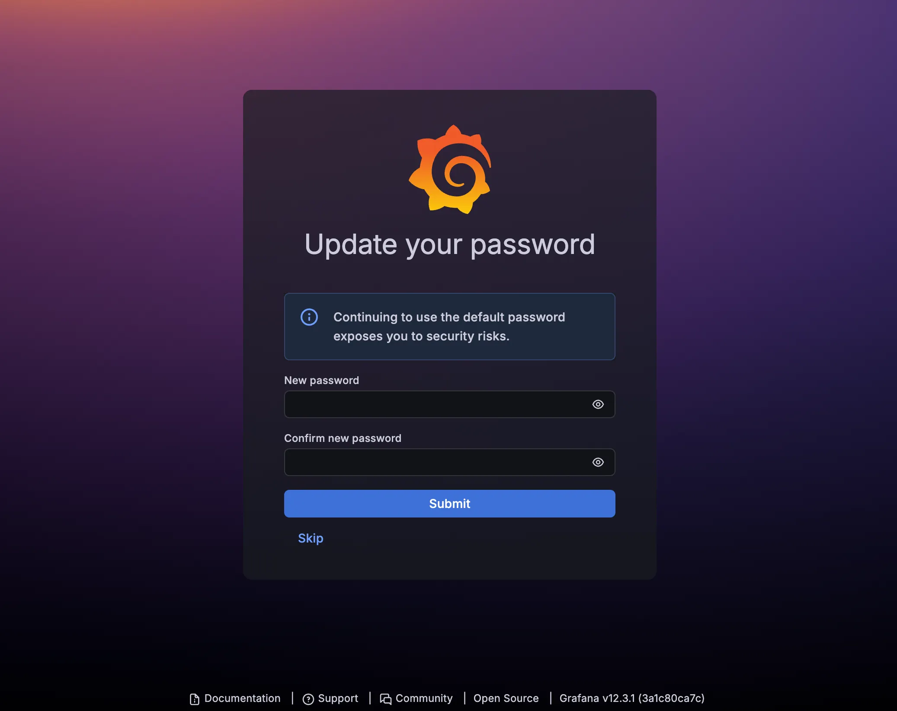

여기서 다음처럼 pw 업데이트하라고 하는데, 나는 local 환경이라 굳이 설정해주지는 않았다.

#### 💡 2. Data sources 설정

Prometheus는 데이터 수집을 위한 것이고, Grafana는 시각화 툴이므로 둘을 연결 해야 한다.

그리고 우리는 Grafana를 거의 사용할 예정이다.

1) connections -> DataSources
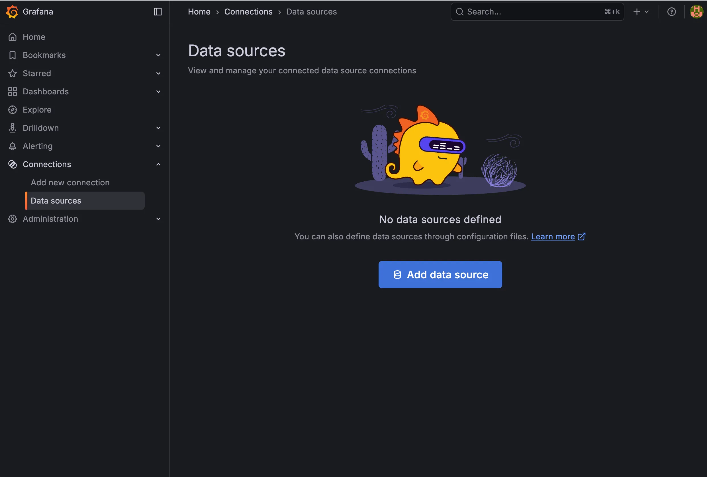

2) Prometheus 선택
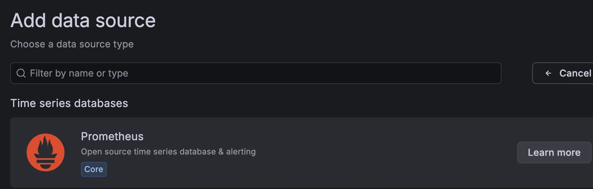

3) URL 입력
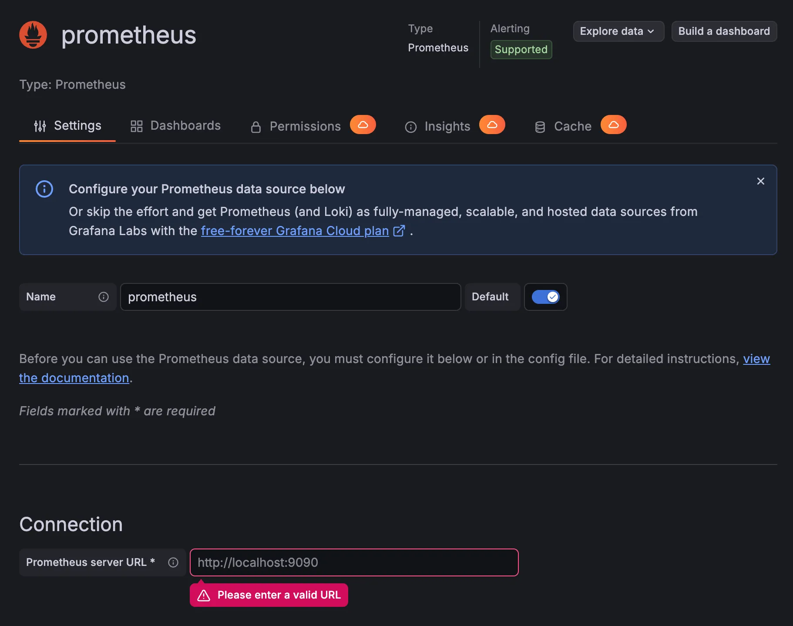

- http://prometheus:9090

4) Save & test -> Success 확인


다음처럼 뜨면 성공이다.

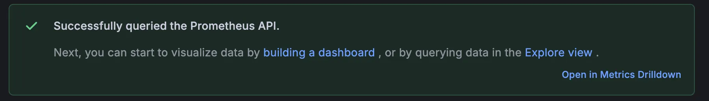


#### 💡 3. 대시보드 설정

대시보드를 만들 수도 있지만, 잘 만들어진 것들이 있으므로 가져다 쓰자..

1) Grafana 왼쪽 메뉴의 Dashboards
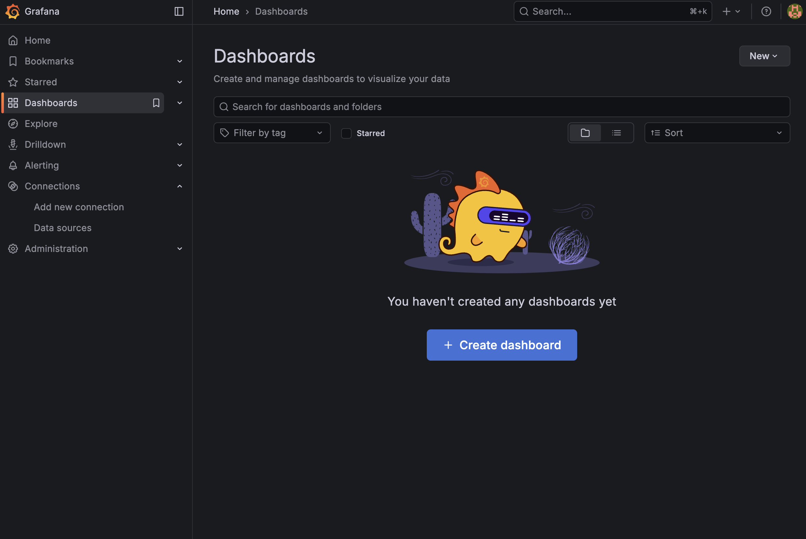

2) 오른쪽 import


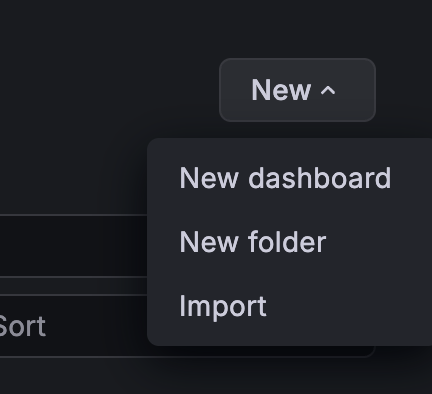

3) ID 입력
- 스프링 기본은 `12900`으로 다들 많이 쓰는 것 같길래 봤는데, 내가 필요한 cpu, memory 등이 잘 나와 있어서 나도 12900으로 쓰고자 한다.
- `4701`도, 대시보드를 통해 I/O, Memory, CPU, GC, Thread 등의 메트릭 데이터를 시각화할 수 있다.
- 잘 보고 원하는 것을 import해서 사용하자!
- 대시보드 라이브러리(?)는 그라파나 사이트에 들어가면 더 많이 확인 가능하다.
  - [12900](https://grafana.com/grafana/dashboards/12900-springboot-apm-dashboard/)
  - [4701](https://grafana.com/grafana/dashboards/4701-jvm-micrometer/)

4) import
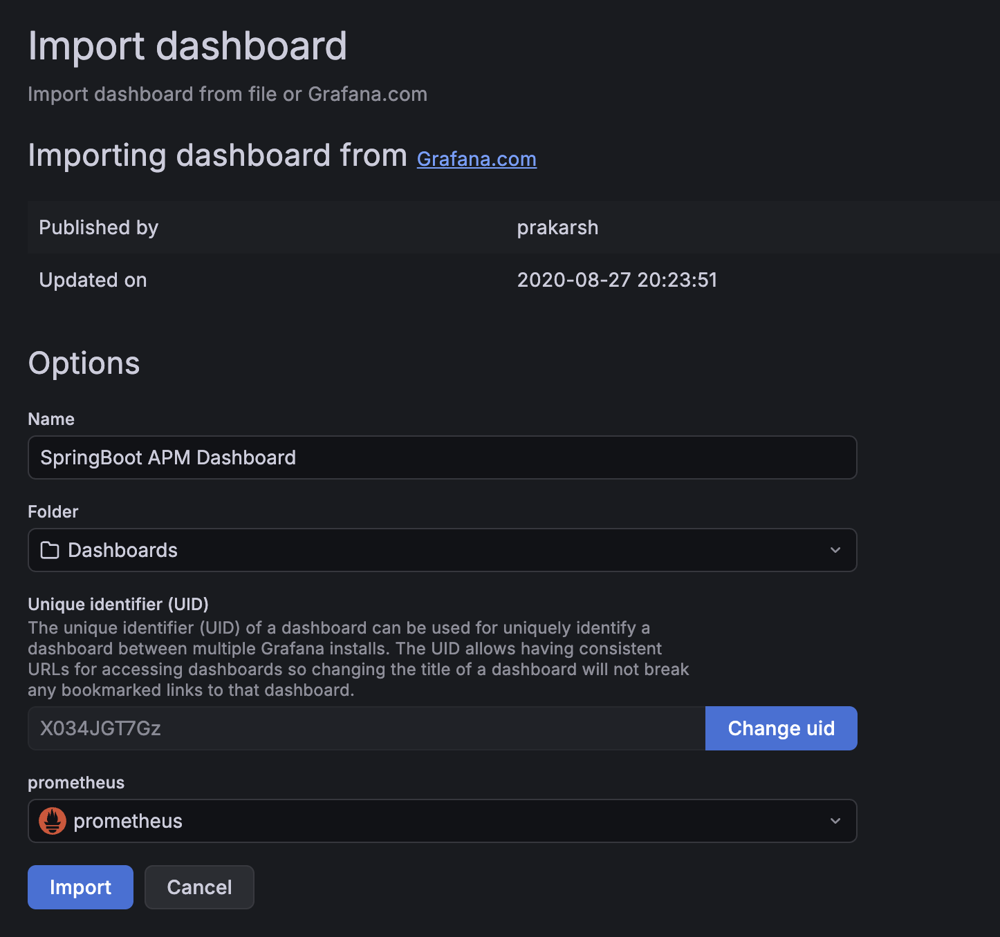
아래 Prometheus까지 선택하면 완료!


다음처럼 뜨면 성공이다.

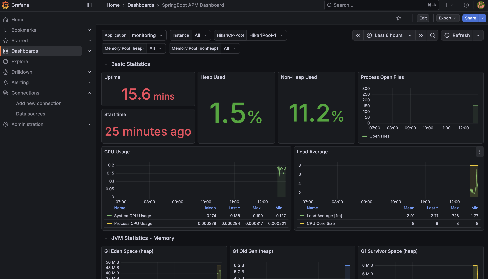


## 🫧 실제 API 호출해 모니터링하기

나는 제일 만만한(?) 로그인 API 호출로 모니터링이 제대로 이루어지고 있는지 테스트해보고자 한다.

### ✨ 처음 뜬 화면

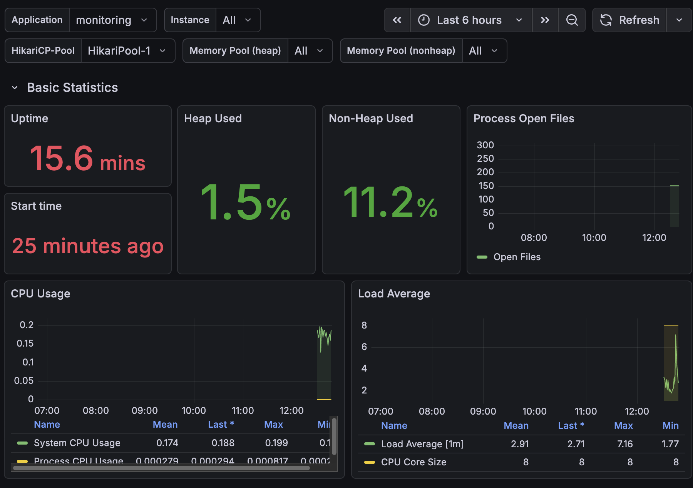

로그인 API 요청을 50번 보낸 후 다시 확인해 보았다.

### ✨ 요청 후 화면

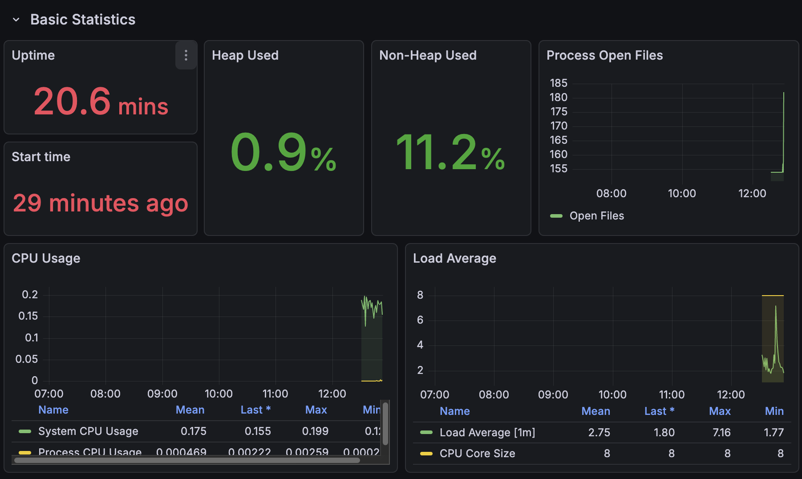

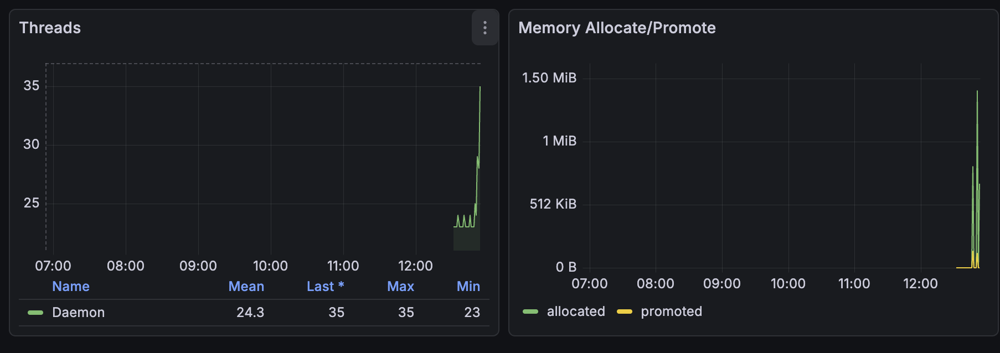

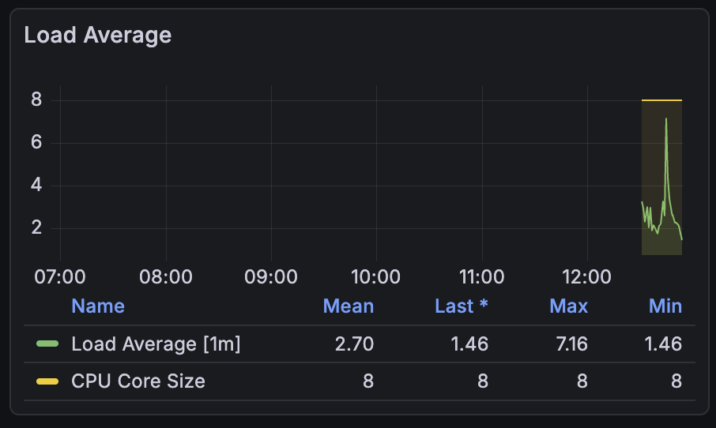

음... 보는 법은 아직 모르겠다.

우선 모니터링 연동 성공!

이제 해석하는 법도 찾아보면서 공부해야겠다.


### ✨ 두 시간 후 화면

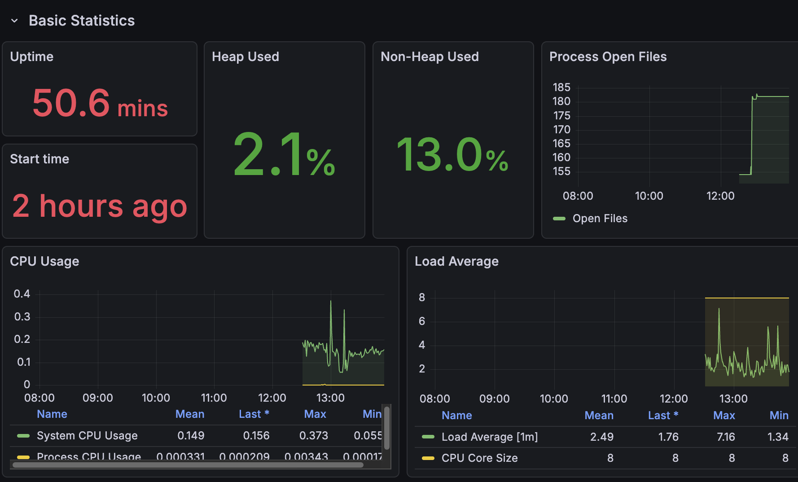

모니터링 툴 사용법을 다시 정리해야겠다...


## 🫧 참고 자료
- [모니터링을 왜 사용하는가](https://velog.io/@makehelloworld/%EB%AA%A8%EB%8B%88%ED%84%B0%EB%A7%81%EC%9D%84-%EC%99%9C-%EC%82%AC%EC%9A%A9%ED%95%98%EB%8A%94%EA%B0%80)
- [모니터링 툴 정리](https://codingjerk-diary.tistory.com/entry/%EC%A0%95%EB%A6%AC-%EB%B9%85%EB%8D%B0%EC%9D%B4%ED%84%B0-%EC%84%BC%ED%84%B0-%EC%84%9C%EB%B2%84-%EB%AA%A8%EB%8B%88%ED%84%B0%EB%A7%81-%ED%88%B4-%EC%A1%B0%EC%82%AC)
- [Zabbix vs Prometheus](https://dmove.tistory.com/entry/Zabbix-Prometheus)
- [Cacti 도구](https://www.igloo.co.kr/security-information/%EC%98%A4%ED%94%88%EC%86%8C%EC%8A%A4-%EB%AA%A8%EB%8B%88%ED%84%B0%EB%A7%81-%EB%8F%84%EA%B5%AC-%EB%B9%84%EA%B5%90-%EB%B6%84%EC%84%9D/)
- [모니터링 도구](https://jjangguitem.com/%EC%84%9C%EB%B2%84-%EB%AA%A8%EB%8B%88%ED%84%B0%EB%A7%81-%ED%88%B4-top-7-%EC%95%88%EC%A0%95%EC%84%B1-%ED%99%95%EB%B3%B4%EB%A5%BC-%EC%9C%84%ED%95%9C-%ED%95%84%EC%88%98-%EB%8F%84%EA%B5%AC/)
- [모니터링 도구-Whatap-AWS](https://po2-dev.tistory.com/24)
- [모니터링 도구-Zabbix-단점](https://kyxxgsoo.tistory.com/entry/Grafana%EC%99%80-Prometheus)
- [그라파나 대시보드](https://bes99.tistory.com/36)
- [SpringBootActuator](https://jeong-pro.tistory.com/160)