## 🫧 계기

### ✨ 졸업 프로젝트 소개

나의 졸업 프로젝트는 `자동 채점 웹 플랫폼`이다.

쉽게 생각해, 프로그래머스 + 대학에서 흔히 사용하는 LMS로, 강의-단원-과제 형태의 웹 플랫폼이다.

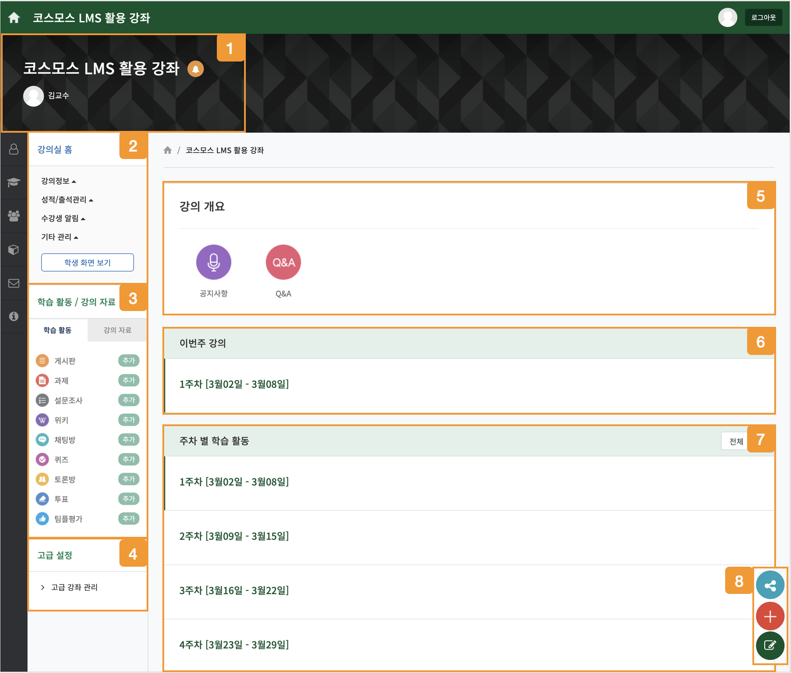

그런데 과제가 독립적인... (강의와 단원이 n:m 관계)


### ✨ 코드 개선을 왜 하려고 했는가

졸업 프로젝트 마무리까지 남은 시간 3개월...

사실 말이 3개월이지, 프론트엔드 연동까지 하려면 정말 촉박한 시간 내에 코드 실행 API, 복잡한 매핑 테이블 등을 고려하여 구현해야 했다.

소규모 프로젝트지만 UI 개발도 예쁘게 되어서, 정말 잘 해보고 싶다는 욕심이 들었다. 욕심은 커지고 할 일은 많아지는 상황이었다.

게다가 백엔드가 나 혼자라서, 시간적 압박도 존재했다. 못해서 일정이 지연되면 어떡하지, 라는 생각이 계속 들었다.


이럴 때는 일단 해 보기다!

그래서 우당탕탕 만들었다... 그랬더니 결과는 다음과 같았다.

다음은 졸업 프로젝트 코드 일부를 추출한 내용이다.

`빠른 코드 구현`을 우선순위에 두느라 알아보기 힘든 코드들이 엄청 많았다.

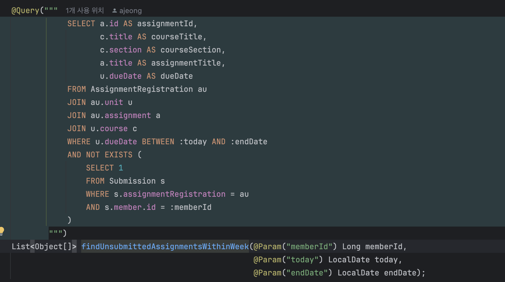

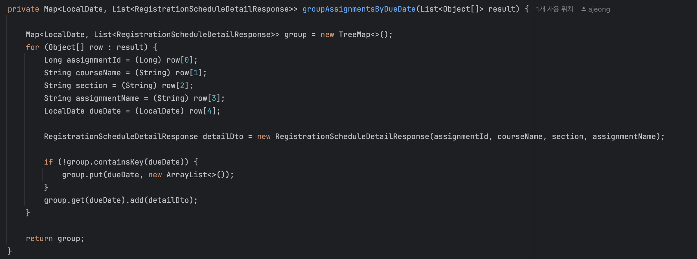

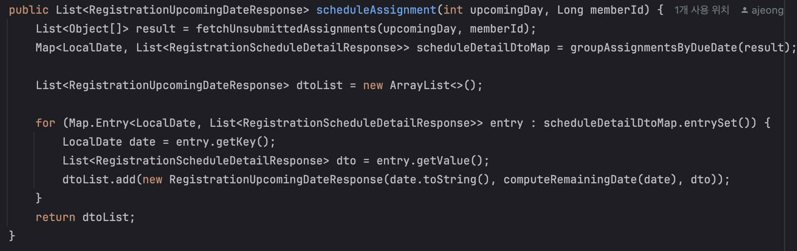


얻은 것: 기한보다 빠르게 완성된 API들과 엉망진창 코드들..

습......... 내가 보기에도 심각해 보이는 코드들... 심지어 이게 하나의 API이다.

내가 복잡하다고 판단하는 기준은 바로 `연필`을 들었냐 안 들었냐다.

나는 코드가 복잡해지면 해당 코드가 어떤 일을 하는지, 변수는 언제 어디서 쓰는지 정리하는 경향이 있는데, 지금이 딱 이 상황이었다.

따라서 문제의 심각성을 느꼈고, 일정이 급박하지 않다고 판단했기 때문에 코드 리팩토링을 결심하게 되었다.


### ✨ 어떤 코드를 개선할 것인가

현재 프로젝트는 다음과 같은 상황에 처해 있다.

- 다대다 관계가 복잡하다.
- 백엔드는 나 혼자 뿐이다.
- 프론트와 연동 전이다 ( == 수정 해야 할 API가 존재할 가능성이 높다.)

위에서 언급했던 API 외에도 개선해야 할 점들이 너무 많지만, 시간이 그렇게 많지 않기 떄문에 우선은 가장 문제가 되는 것 같은 API를 수정하고자 마음을 먹었다.

욕심을 부려 이도 저도 아니게 되는 것보다는, 하나에 우선 집중하고 이후 코드들도 차근차근 개선해 나가는 방식을 더 좋아하기 때문이다.

사실은 시간이 되는 한 다 수정하고 싶다... 하나 수정 후 일정에 맞춰 나머지도 수정할 것이다!

그래서 어떤 코드를 개선할 것인가?

## 🫧 개선 코드 선택 기준

내가 세운 개선 해야 할 API 선택 기준은 다음과 같다.

1. 자주 사용하는 기능인가? (API 호출 횟수로 판단)
2. API당 SQL문이 많이 나가는가? (SQL문 횟수로 판단)
3. 하나의 SQL 호출 시 오래 걸리는 작업인가? (성능 테스트로 판단)

기준을 세우게 된 이유는 별 거 없다... 추측만으로는 어떤 API가 중요한 API인지 판단이 어렵기 때문이다.

(개선 코드 선택을 위해 기준을 테스트 해 보자고 생각한 내 선택이 맞았다! 사유: 예상이 다 빗나감)

API 호출 횟수가 많을수록, 하나의 API 호출 시 API가 여러 개 나갈수록, 하나의 SQL에 드는 시간이 길수록, 성능 개선 시 효과가 두드러질 것이기 때문에 다음과 같은 기준을 세웠다.


### ✨ 1. 자주 사용하는 기능인가? (API 호출 횟수로 판단)
(아래 기준은 안 읽으셔도 됩니다! - 선정 과정)

- 상대적으로 사용하는 기능에 척도를 두어 측정해 보았다.
- 실제 흐름을 따라가며 다음과 같은 전제 하에 개수를 세어보았다. (6개월 기준 - 한 학기)
- 실제로 사용자가 없는 단계이므로(개발 단계), API 호출을 가정하여 계산하였다.
  - 사용자는 1주일에 한 번 접속한다.
  - 강의는 한 학기에 한 개 추가, 각 한 번씩 수정과 삭제가 일어난다.
  - 단원은 각 강의마다 5개 추가, 각 2번씩 수정과 삭제가 발생한다.
  - 과제는 각 단원마다 2개 추가, 각 2번씩 수정과 삭제가 발생한다.
  - 테스트케이스는 각 과제마다 10개 추가, 각 3번씩 수정과 삭제 발생한다.
  - 등록된 과제는 각 단원당 두 번씩 삭제가 일어난다.
  - 1주에 한 번 과제가 나온다.
  - 메인 페이지는 과제 제출 한 번당 세 번씩 접속한다.
  - 일주일에 세 번 강의 조회가 일어난다. (강의 조회 후 코드 제출 가능)
  - 과제 제출을 위해서 과제 조회와 코드 실행을 각각 세 번씩 한다.
  - 한 강의에는 50명의 학생이 존재한다.
  - 50명 학생 추가 시 각각 5번의 학생 수정/삭제가 일어난다.
  - 학생 전체 조회는 1주일에 한 번씩 일어나며, 학생 개별 조회는 수강생 수만큼 두 번씩 일어난다.
  - 코드 조회는 수강생 수만큼 두 번씩 일어난다.
  - Refresh Cookie 만료 기간은 2주이다.


- API 호출 20건이 안 되는 것들은 우선 제외

| API명 | API 호출 횟수 |
|-------|---------|
| 내 정보 조회 | 72 |
| 과제 조회 | 48 |
| 과제 추가 | 10 |
| 일정 리스트업 | 72 |
| 강의 조회 |  72 |
| 강의별 전체 과제 조회 | 24 |
| 전체 강의 조회 | 72 |
| 테스트케이스 추가 | 200 |
| 테스트케이스 삭제 | 60 |
| 학생 전체 조회 | 24 |
| 학생 등록 | 100 |
| 학생 조회 | 200 |
| 코드 제출 | 48 |
| 코드 조회 | 200 |


과제당 테스트할 테스트케이스는 양이 많아 예상했던 바였으며, 나머지 호출 횟수에서도 예상만큼 나왔던 것 같다.

실무에서는 CRUD에서 R이 가장 많이 나오므로, 이에 대해 반영을 하여 보면 좋을 것 같다! (현재 예제에서는 생성, 수정, 삭제 비율이 현업보다 높음)


### ✨ 2. API당 SQL문이 많이 나가는가? (SQL문 호출로 판단)

- 간략한 테스트를 위해 Hibernate SQL로 확인
- spring.jpa.show-sql: true 로 SQL 횟수 계산

1번에서 주요 API로만 테스트 실행했을 때, 결과는 다음과 같았다.

| API명 | SQL 호출 횟수 | 기타|
|-------|---------|----|
| 내 정보 조회 | 2 |
| 과제 조회 | 4 |
| 과제 추가 | 4 |
| 일정 리스트업 | 3 |
| 강의 조회 |  5 |
| 강의별 전체 과제 조회 | 5 |
| 전체 강의 조회 | - 하나 있을 때 6 | N+1 문제 발생 |
|        | - 두 개 있을 때 7 |
| 테스트케이스 추가 | 4 |
| 테스트케이스 삭제 | 5 |
| 학생 전체 조회 | 9 |
| 학생 등록 | 등록 실패 시 4, 등록 성공 시 6 |
| 학생 조회 | - 제출할 과제 0 : 6개 | N+1 문제 발생 |
|         | - 제출할 과제 2 : 12개 |
|         | - 제출할 과제 3 : 15개 |
| 코드 제출 | 5 |
| 코드 조회 | 4 |

사실 일정 리스트업 부분이 (위 캡쳐 코드) 굉장히 복잡하고, join도 많아서 제일 SQL문이 많이 나갈 것으로 생각했었다.

그러나 실제 테스트 결과, 오히려 일정 리스트업 API에서는 N+1 문제나 수많은 쿼리가 발생하지 않고, 학생 조회 시, 전체 강의 조회 시 N+1 문제가 발생함을 알 수 있었다.

이를 통해 로직이 복잡한 것과, 실제 N+1 문제 발생 등의 문제가 생기는 부분은 다르다는 것을 다시금 깨닫게 된 것 같다.


#### 💡 중요한 API가 뭘까?
- API 호출 횟수 * API 호출 시 나가는 쿼리 수로 계산 결과는 다음과 같다.

| API명 | API 호출 횟수 | SQL 호출 횟수 (최대) | 총 SQL 호출량 |
|------|------------|------------------|--------------|
| 내 정보 조회 | 72 | 2 | 144 |
| 과제 조회 | 48 | 4 | 192 |
| 과제 추가 | 10 | 4 | 40 |
| 일정 리스트업 | 72 | 3 | 216 |
| 강의 조회 | 72 | 5 | 360 |
| 강의별 전체 과제 조회 | 24 | 5 | 120 |
| 전체 강의 조회 | 72 | 7 | 504 |
| 테스트케이스 추가 | 200 | 4 | 800 |
| 테스트케이스 삭제 | 60 | 5 | 300 |
| 학생 전체 조회 | 24 | 9 | 216 |
| 학생 등록 | 100 | 6 | 600 |
| 학생 조회 | 200 | 15 | 3,000 |
| 코드 제출 | 48 | 5 | 240 |
| 코드 조회 | 200 | 4 | 800 |


- N+1 문제가 존재하는 SQL문은 최댓값으로 가정하고 계산했다.

실제로 학생 조회, 테스트케이스 추가, 코드 조회가 가장 많지만 실제로 N+1 문제와 단순히 API 호출 횟수가 많기 때문에 SQL 호출량이 많은 것들은 거르고, 최대한 변화를 극대화할 수 있는 API들로 추린 결과는 다음과 같다.

#### 💡 최종 선정 후보

| API명 | API 호출 횟수 | SQL 호출 횟수 (최대) | 총 SQL 호출량 | 특징 |
|------|--------------|------|---|---|
| 학생 조회 | 200 | 15 | 3,000 | N+1 문제, 학생 수 ↑ |
| 전체 강의 조회 | 72 | 7 | 504 | N+1 문제, 홈페이지 들어갈 때마다 호출 |
| 학생 전체 조회 | 24 | 9 | 216 | 진행 상황 (단원별 과제 채점 상태 표시) 등의 복잡한 로직 포함 |


성능 테스트 진행 전, 간단하게 UI를 보자면 다음과 같다.

#### 💡 전체 강의 조회 UI

- 총 504의 SQL 호출량
- 로그인 후 루트 페이지, 호출량 ↑
- 강의가 늘어날 때마다 N+1 문제 발생

#### 💡 학생 전체 조회 UI
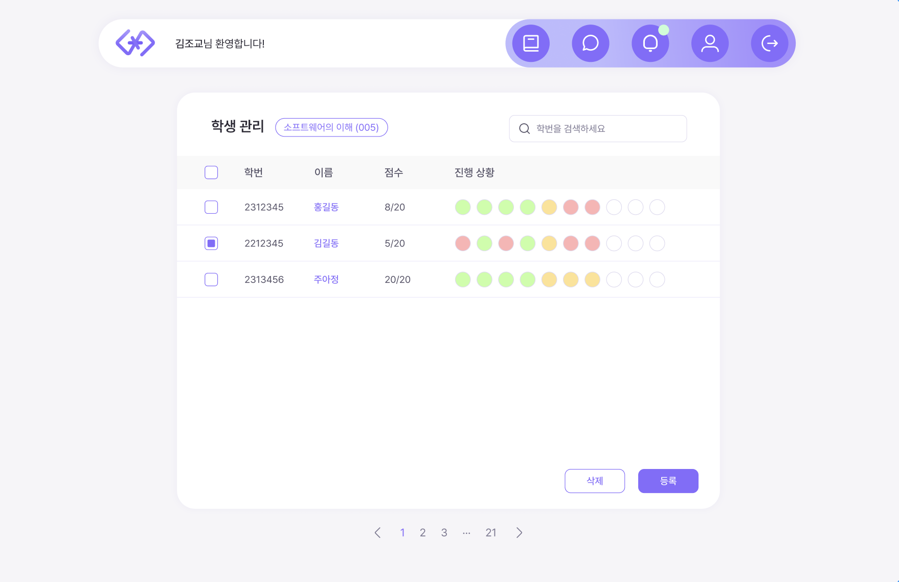
- 총 216의 SQL 호출량
- 진행 상황 (단원별 과제 채점 상태 표시) 등의 복잡한 로직 포함
- left join 다량 발생
- 과제 점수 업데이트 시마다 점수의 지속적 확인 상황 발생 가능성 O
- 페이징 기능 도입을 통해 쿼리를 줄일 수 있을 것이라 예상

#### 💡 학생 조회 UI
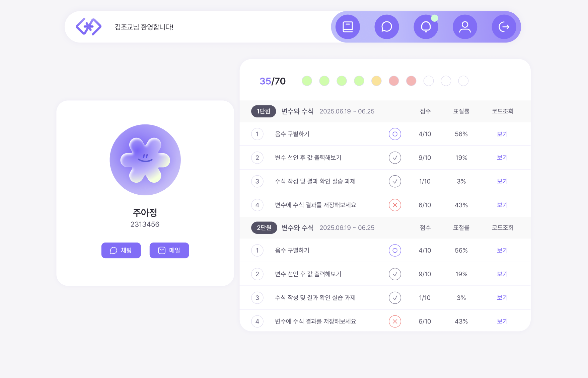
- 총 3,000의 SQL 호출량
- 학생이 제출해야 할 과제가 늘어날수록 쿼리 3개씩 추가됨 (N+1 문제)
- 코드 확인(자동 채점 후 확인) 을 위해서는 반드시 학생 조회 UI를 거쳐야 함
- 학생 전체 조회 시 진행 상황이 동일하게 표시
- 정답 여부 확인 및 점수 처리로 인해 쿼리가 많이 나갔을 것이라 예상
- 표절율은 이후 개발 예정,,


### ✨ 3. 하나의 SQL 호출 시 오래 걸리는 작업인가? (성능 테스트로 판단)

- 이를 통해 성능 분석을 해 보고자 한다.
- [성능 분석 툴 선택 및 도입](https://ajung7038.github.io/performance/Performance-Gatling%EC%9C%BC%EB%A1%9C-%EB%B6%80%ED%95%98-%ED%85%8C%EC%8A%A4%ED%8A%B8-%ED%88%B4-%EB%8F%84%EC%9E%85%ED%95%98%EA%B8%B0/)은 여기에..
- [모니터링 툴 선택 및 도입](https://ajung7038.github.io/performance/Performance-Prometheus-&-Grafana%EB%A1%9C-%EB%AA%A8%EB%8B%88%ED%84%B0%EB%A7%81-%EB%8F%84%EC%9E%85%ED%95%98%EA%B8%B0/)은 여기에..

#### 💡 서버 스펙

AWS EC2 환경에서는 과금될 확률이 높으므로, 우선은 로컬에서만 테스트하기로 했다.

그래서 스펙은 나의 작고 소중한 맥북 스펙으로...

- 맥북 pro 14인치
- Apple M3 칩
- 메모리 24GB
- SSD 512GB


하다 보니까 CPU 사용량은 Gatling에서 직접 측정이 불가능하다... 다들 이래서 nGrinder, K3 등의 툴을 쓰는 것 같다.

그렇지만 나는 이미 Prometheus & Grafana를 연동해줬으므로 테스트하면서 함께 돌려 확인 가능하다!!

테스트 방법도 다양했는데, 현재 목적은 우선 리팩토링할 API 선정이기 때문에 최대한 API 순수 성능을 측정하고자 `Ramp 기반 로드 테스트`로 방식을 통일했다.

테스트 방법에 대한 설명은 이후 성능 개선기에서 다룰 예정이다!

이제 진짜 성능을 측정해보자!


## 🫧 성능 측정하기

📌 주의: 실패한 과정까지 적혀 있으므로 내용이 다소 부산스러울 수 있습니다.

우리의 목적은 순수 API 성능 측정이다.

따라서, 테스트하려는 부분만 따로 빼어 최대한 다른 부분은 배제하고자 하였다.

측정하고자 하는 API는, 앞서 언급했던 API들이다.
- 전체 강의 조회 API
- 학생 전체 조회 API
- 학생 조회 API

위 세 가지의 순수 API 성능 측정을 위해 어떤 질문과 답을 세웠는지에 대해 간략하게 풀어보고자 한다.

마지막으로 개선 코드 선택까지..

### ✨ 내 노트북은 어디까지 버틸까?

이건 정말 궁금증에 실행한 시험이다.

/health API 호출을 통해 우선 나의 로컬 환경이 어느 정도까지 버틸 수 있는지 대략적으로 스트레스 테스트를 진행하였다.

그래야 이후 API 테스트 시 하드웨어나 런타임 한계에 걸리지 않도록 유저 수를 조정할 수 있다고 생각했기 때문이다.

코드는 다음과 같다.

```java
package simulations;

import io.gatling.javaapi.core.*;
import io.gatling.javaapi.http.*;

import static io.gatling.javaapi.core.CoreDsl.*;
import static io.gatling.javaapi.http.HttpDsl.*;

public class BasicSimulation extends Simulation {

    HttpProtocolBuilder httpProtocol = http
            .baseUrl("http://localhost:8080") // 테스트할 서버의 URL
            .acceptHeader("application/json"); // 요청 헤더 설정

    ScenarioBuilder scn = scenario("Basic Scenario")
            .exec(http("request_1")
                    .get("/health") // 테스트할 엔드포인트
                    .check(status().is(200))); // 응답 상태 코드 확인

    {
        setUp(
                scn.injectOpen(atOnceUsers(100)) // 100명의 사용자가 동시에 요청
        ).protocols(httpProtocol);
    }
}

```

해당 내용에서, `scn.injectOpen(atOnceUsers())`의 값만 변화하며 각각 100 -> 1,000 -> 10,000 -> 100,000명까지 테스트를 진행하였다.

#### 💡 100명

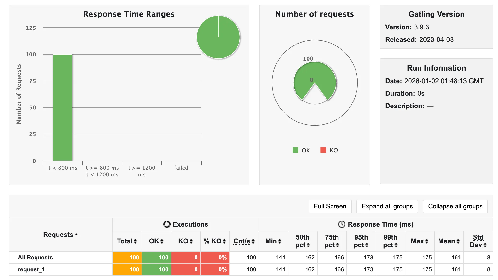

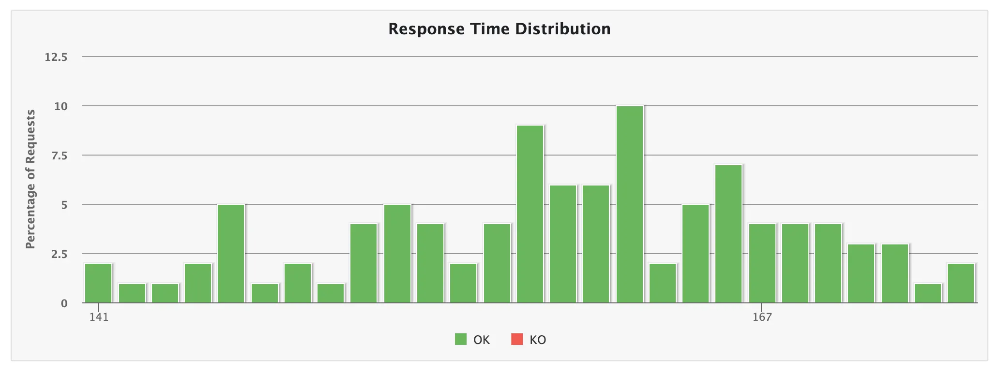

- 4초 소요

#### 💡 1,000명

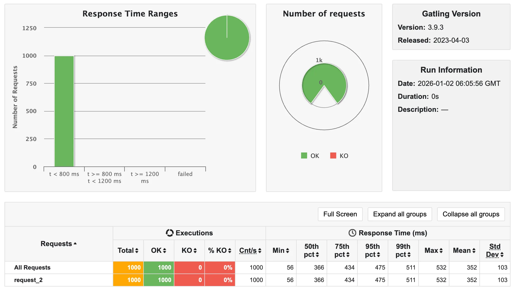

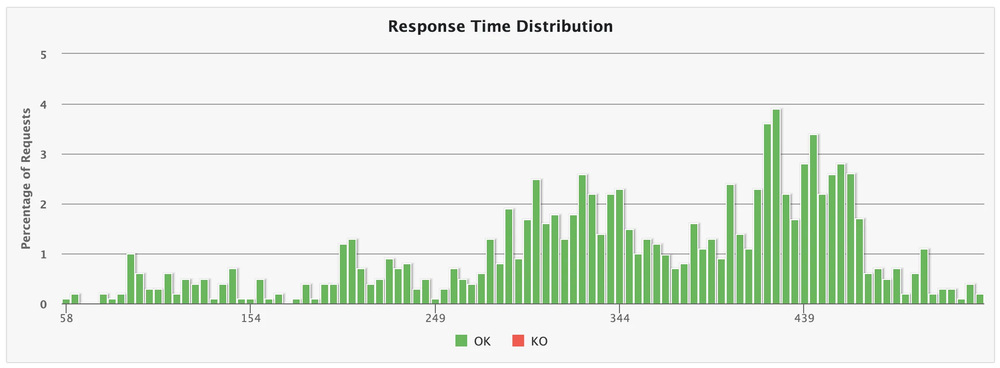

- 5초 소요

#### 💡 10,000명

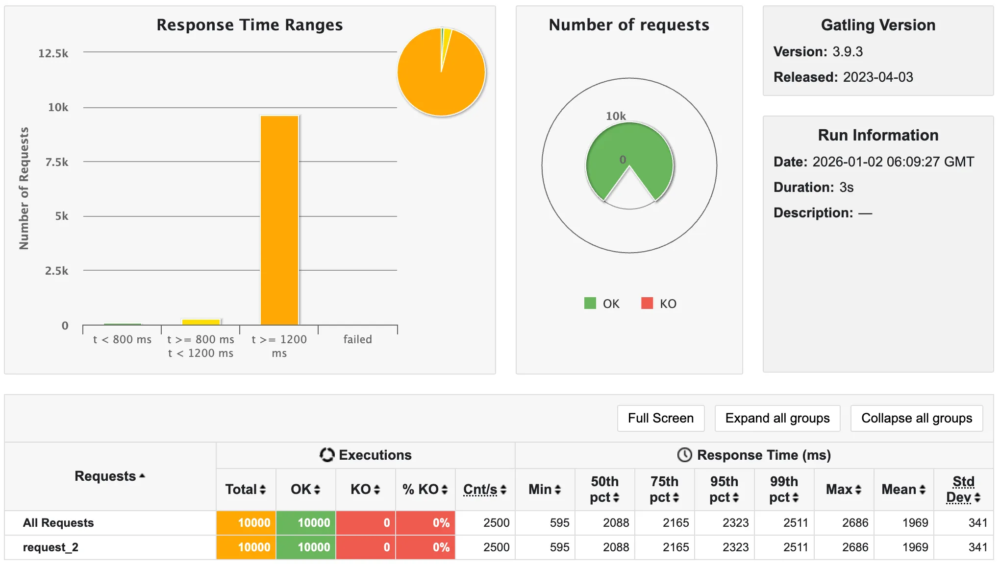

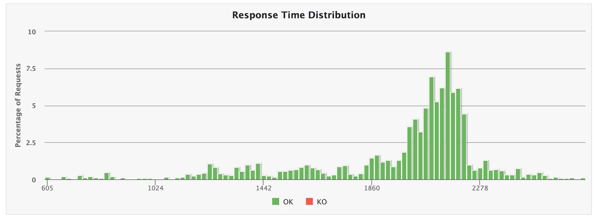

- 7초 소요

이때부터 슬슬 느려지고 있음을 알 수 있다.


#### 💡 100,000명

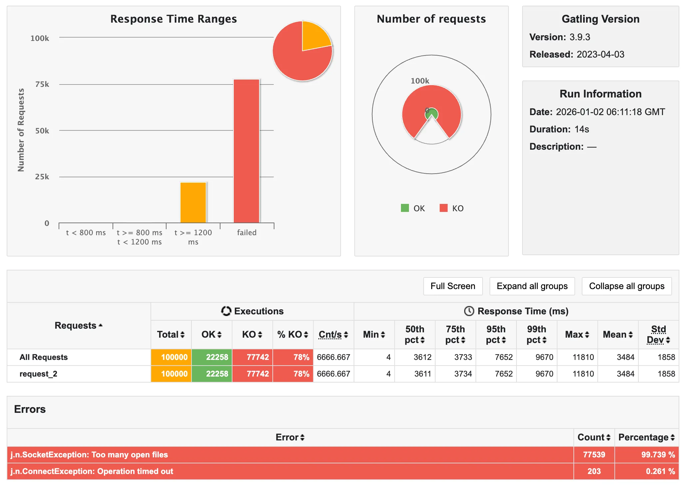

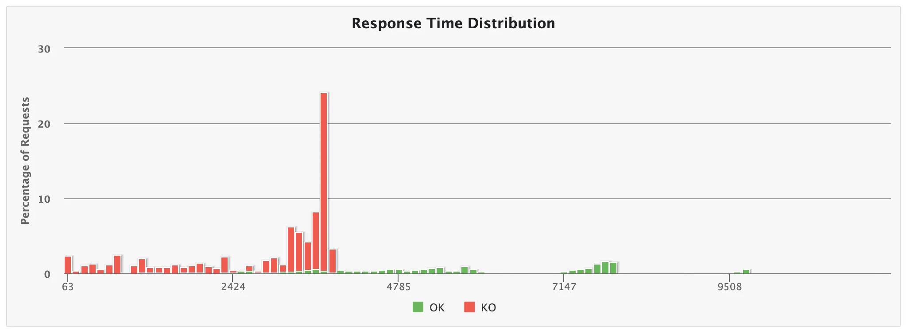

- 20초 소요

10,000명부터 응답율이 급격하게 느려지더니, 100,000명일 때 `SocketException`으로 인해 급격하게 실패율이 증가함을 알 수 있다.

따라서 내 노트북은 10,000 ~ 100,000 이내의 사용자를 수용할 수 있음을 파악할 수 있었다.

따라서 다른 API 테스트 시 이보다 적은 1,000 ~ 10,000의 사용자로 테스트하면 좋을 것 같다는 생각을 했다.


### ✨ 인증/인가를 어떻게 처리할 것인가?

#### 💡 (1) 로그인 API 호출 -> 쿠키로 인증하자

앞서 언급한 API들은 모두 인증/인가가 필요하다.

우리 프로젝트는 쿠키를 이용해서 인증을 진행한다.

사실 테스트를 처음 진행하다 보니, 어떤 식으로 인증/인가를 진행하는지 몰랐다.

찾아보니 인증/인가가 필요하다는 말만 나올 뿐, 어떤 식으로 처리 해야 하는지 정확히 나와있지 않아, 나는 가볍게 `로그인 API`를 미리 호출하면 되겠지, 생각했다.

로그인 API를 호출한다면 쿠키가 자동으로 들어갈 것이고, 그렇게 되면 인증/인가 시 문제가 없다고 생각했다.

그런데!! 쿠키가 안 들어가는 것이다!!!

.disableFollowRedirect()를 켜서 리다이렉트도 꺼 봤고, secure=false 등 어떤 짓을 해도 들어가지 않는 것이다...

#### 💡 (2) jwt를 사용하자

쿠키를 넣는 방법을 고민하다가, 문득 쿠키를 왜 넣어야 하는지에 대한 의문이 들었다.

나는 Swagger을 사용하기 때문에, 프론트엔드 테스트를 위해 쿠키 뿐만 아니라 jwt로도 인증이 가능하도록 열어두었다.

즉, jwt를 사용하면 더욱 쉽고 쿠키 인증의 시간을 제외한 순수 시간을 측정할 수 있을 것이라 생각했다.

따라서 들어가지지 않는 쿠키를 넣기보다는... JWT를 이용해 간편하게 구현하고자 하였다.

jwt로는 당연히 됐다. 파싱만 제대로 하면 되었으므로, 문제 없이 통과한 것 같다.

#### 💡 (3) 인증/인가 과정을 제외하자

그런데 또 생각해보니 로그인 API 호출을 미리 하면 순수 API 성능 측정에 문제가 생길 것 같은 것이다...

이미 개발 시기에는 테스트를 위해 accessToken의 만료 기간을 1일로 두었으므로, 텀을 두어 테스트를 진행하면 되리라 생각했지만 언제까지고 테스트를 위해 기다릴 수는 없으며, 무엇보다도 아무리 기다린다고 해도 로그인 API를 호출하는 것만으로도 부하 테스트에 잡음이 들어갈 것 같다는 생각이 들었다.

따라서 아예 인증 자체를 빼 버려 순수 API 성능을 측정하고자 생각했다.

그러나.... 나의 코드는 jwt 파싱 등의 과정을 거쳐 member을 가져오는 loadMember() 함수로 이미 구현되어 있었기에(memberId를 따로 받아 사용하지 않음) 기존 API를 수정해야 했다.

이렇게 수정 후 측정하는 것이 순수한 API 성능 측정이 맞는지에 대한 의문이 들어서, 결국 accessToken을 미리 발급 받아 사용하기로 했다.

#### 💡 (4) accessToken을 미리 발급 받자

Galting으로 로그인 api를 호출하는 테스트를 한 번 돌린 후, 결과로 나온 response를 파싱해 csv 파일로 저장했다.

그리고 각 테스트할 API의 feeder로 넣어주는 과정을 거치면서 인증/인가 문제를 해결할 수 있게 되었다.


이 외에도 feeder 고갈 문제, Prometheus 데이터 수집 문제, 인가 문제 등의 다양한 문제가 있었지만..... 생략하도록 하겠다........


### ✨ 테스트 환경 조성

최대한 비슷한 결과를 내기 위해 같은 환경 (강의, 문제, 단원, 학생 수, 접속자 수를 동일하게 설정)
에서 같은 가상 유저 수로 테스트를 진행하였다.

또한, 이후 성능 개선을 거치면서 같은 환경에서 테스트를 수행해야 하므로 동일한 환경 세팅이 가능하도록 코드로 테스트용 데이터를 생성하도록 짰다.

다음은 내가 임의로 설정한 환경이다.

#### 💡 가정 (환경 설정)

- LMS 특성상 과제 마감/성적 산출 기간에 많이 몰리는 경향이 존재함.
- 한 강의에 학생을 50명이라 가정
- 한 학교당 5개의 프로그래밍 강의가 열렸으며, 15개 대학이 사용한다고 가정
- 한 강의당 한 명의 ADMIN 존재
- 단원은 강의당 약 5개, 과제는 단원마다 2개씩 존재.
- 학생은 ADMIN이 일일이 추가한다고 가정 (강의 추가 시 한 번에 학생 50명 추가)
- 채점 기간에 ADMIN은 과제 수만큼 학생을 조회한다 (학생 조회 후 코드 확인이 가능하기 때문)
    - 학생 조회 → 코드 확인 → 뒤로 가기 과정에서 다시 학생 조회가 일어날 것이라 가정함.

#### 💡 선행되어야 할 테스트 데이터

위 가정을 바탕으로 산출한 임시 테스트 데이터이다.

- ADMIN -> 75명
- USER -> 3,750명
- 강의 -> 75개
- 과제 -> 750개
- 단원 -> 375개
- 학생 -> USER와 같은 <strong>3,750</strong>명

- 평소 트래픽은 사용자(ADMIN + USER)의 약 10%인 382명으로 가정

트래픽은 다음 두 가지 상황에서 몰린다.

1. 과제 마감 기간 (USER 트래픽)
- 트래픽이 몰릴 때는 USER의 50%가 (1,875명) 몰린다고 가정
- 약 4.9배 증가
2. 성적 산출 기간 (ADMIN 트래픽)
- 트래픽이 몰릴 때는 USER는 평소 트래픽 (USER 수의 10%), ADMIN은 전체가 다 몰린다고 가정 => 450명
- 동시 사용자 수는 적지만 학생 조회 API, 전체 학생 조회 API 등의 호출량이 급격하게 많아짐


#### 💡 테스트 데이터 만들기

테스트 데이터 수를 바탕으로 실제로 테스트 데이터를 만들고자 한다.

나의 환경은 다음과 같다.
- 로컬에서 테스트
- 서버를 껐다 켜면 데이터가 날아가도록 하고 싶음. (데이터 무결성을 위해)
- 테스트 중 데이터가 바뀌어도 다음 테스트에는 초기 데이터로 초기화한 채 시작하고 싶음

=> 계속 재사용할 데이터셋이 필요함!

`@PostConstruct`를 활용해 Spring Context 초기화 직후 테스트 데이터가 자동으로 만들어질 수 있도록 하였다.

이에 대해 빠른 성능을 요하거나, 측정할 것이 아니기 때문에 서비스의 함수를 일일이 호출하며 구현했다.

SQL문으로도 직접 시도하려고 했으나, 단원 생성 시 과제 연결 (과제 먼저 생성 후 연결 해야 한다), 학생 추가 시 enrollement 테이블 행 추가 등의 복잡한 비즈니스 로직을 가지고 있기 때문에 다음과 같이 <strong>서비스 로직을 그대로 구현하는 것</strong>으로 대신하였다.

#### 💡 테스트용 사용자 수 정하기

트래픽에 대한 통계 자료가 있다면 더 정확했을 것 같으나, 노트북으로는 대규모의 트래픽을 견딜 수 없을 것 같았고, 유의미한 통계 자료를 찾지 못했으므로 개인적인 견해로 사용자 수를 정하기로 했다.

실제 컴파일러 수업에서 교수님이 항상 자신의 서버로 접속해서 (ssh) 과제를 제출하라고 하시는데, 이때 11시 50분쯤부터 버벅이고 제대로 서버가 동작하지 않는 경험에 빗대어, 트래픽은 약 10분 동안 몰릴 것이라 감안했다.

앞선 트래픽에 대한 내용까지 합쳐, 다음과 같이 트래픽을 산정하였다.

```java
scn.injectClosed(
    constantConcurrentUsers(0).during(60),   // 1분간 정지 (유저 수 0명)
    rampConcurrentUsers(0).to(382).during(3 * 60),
    rampConcurrentUsers(382).to(1875).during(7 * 60),
    constantConcurrentUsers(1875).during(7 * 60),
    rampConcurrentUsers(1875).to(382).during(3 * 60)
  ).protocols(httpProtocol)
```

간략하게 설명하면 다음과 같다.

- `0분~1분`: 앞선 테스트 혼동 등 잡음 제거를 위해 1분 간 휴지
- `1분~4분`: 동시 사용자 수 0명 -> 382명으로 선형 증가 (증가하면서 어떻게 변화하는지 확인하기 위함)
- `4분~11분`: 동시 사용자 수 382명 -> 1875명으로 선형 증가 (훅 증가) 
- `11분~18분`: 동시 사용자 수 1875명 유지
- `18분~21분`: 동시 사용자 수 1875명 -> 382명으로 선형 감소 (어떻게 다시 회복하는지 보기 위함)

테스트 코드를 짜다 보니, `randomized()`도 발견하였는데, 이것은 순수 API 측정용에서는 사용하지 않는 것이 더 깔끔할 것 같아, 이후 실서비스 환경과 비슷하게 테스트할 때 사용할 예정이다.

## 🫧 결과

길고 긴 API 선정 과정의 끝...

첫 번째 사진이 Grafana 모니터링 사진이고, 두 번째가 Gatling Report 사진이다.

### ✨ 전체 강의 조회 API
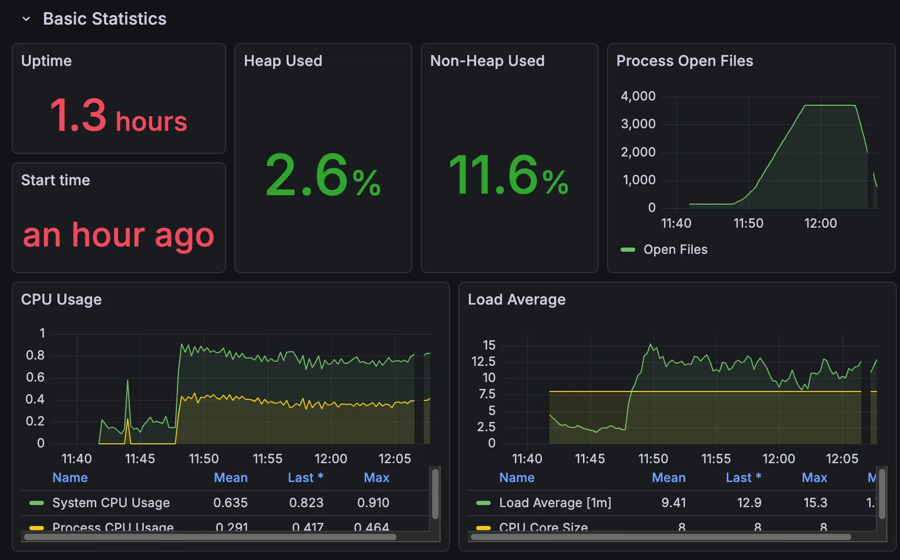
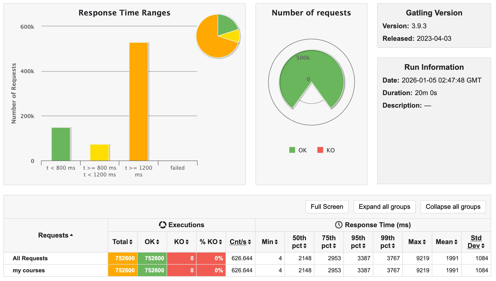


### ✨ 학생 전체 조회 API
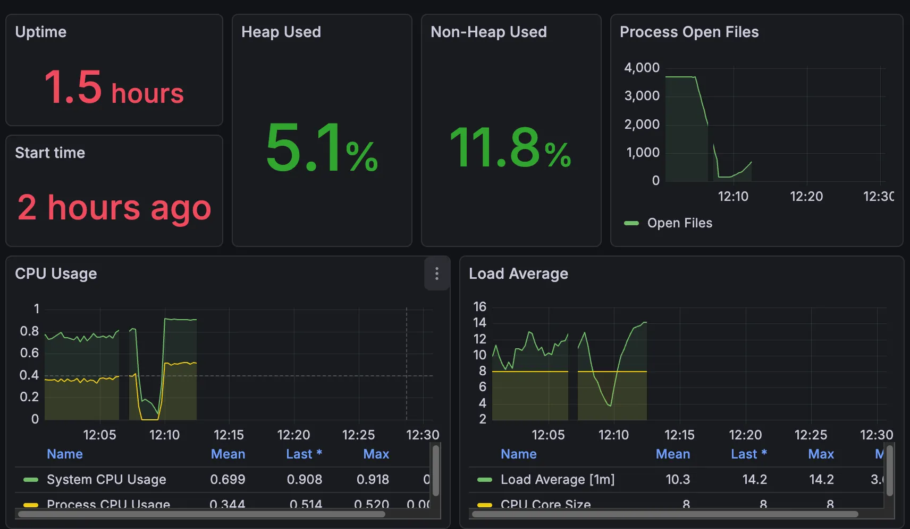
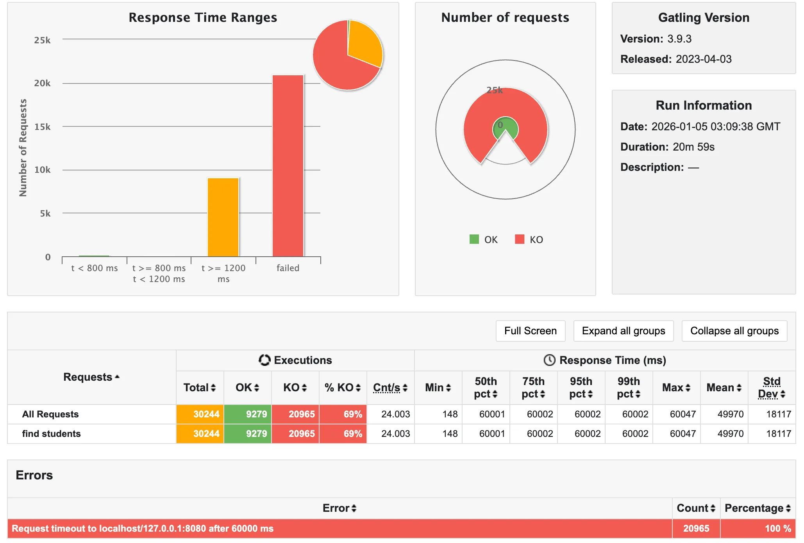

- 학생 전체 조회 API에서는 Prometheus가 Pull을 하지 못하고 (커넥션 풀 부족으로 인해 발생했다고 생각) 죽어버린(?) 모습을 볼 수 있다.

- 또한, 69%가 60,000ms가 넘어(60초 안에 응답을 받지 못해 실패) timeout이 되었음을 알 수 있다!!

### ✨ 학생 조회 API

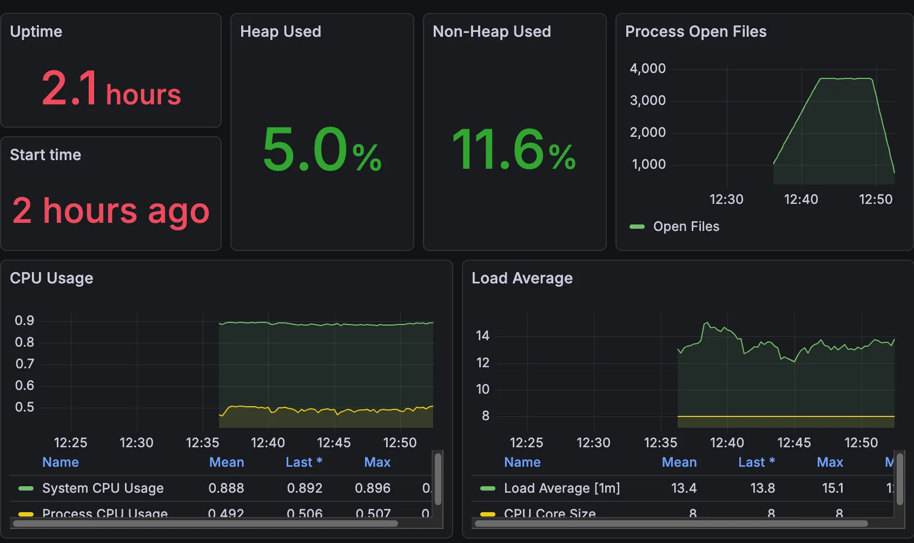
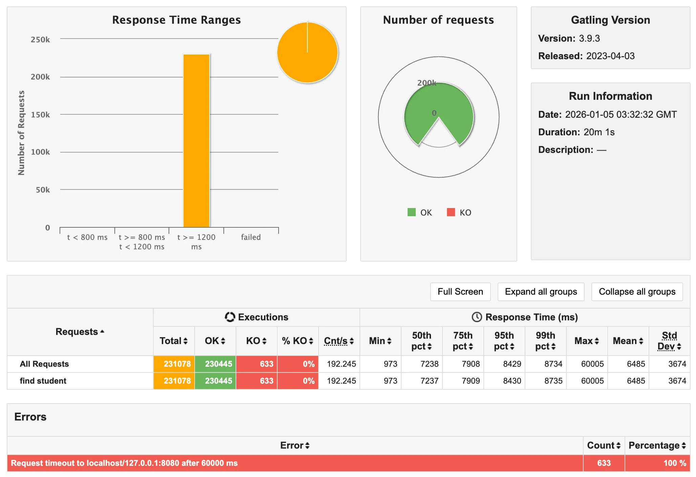

- 마지막은 극소수 정도가 타임아웃에 걸렸다. 전체 학생 조회 API보다는 준수한 편인 것 같다..


## 🫧 API 선정
정말 예상을 하나같이 빗나갔다!!!

예상으로는, N+1 문제가 심각하며, SQL 호출량이 가장 많은 (3,000) 학생 조회가 제일 최악으로 나올 것이라 생각했는데, 결과는 오히려 `학생 전체 조회 API`가 가장 최악으로 나왔다.

앞선 세 가지의 과정을 통해 선정한 API 내용이 무색하게도, 서버가 요청을 처리하지 못해 클라이언트 측에서 timeout으로 처리하는 것을 보고, 페이징 기능만 적용해도 결과가 눈에 띄게 좋아지겠다고 생각하여 <strong>`학생 전체 조회 API`</strong>를 리팩토링 대상으로 삼게 되었다.

(학생 50명으로 잡았으니 10명만 우선 호출 해도 1/5로 줄어든다고 생각했다.)

하지만 페이징 기능을 도입하면 API 호출량이 늘어날 텐데, 그것 포함 성능 개선을 계속 고민해 봐야겠다.

우선 글이 너무 길어졌으므로... 다음 글에서 계속 쓰는 걸로!!

10일 간 고생한... 리팩토링 API 선정 드디어 끝...


## 🫧 참고자료
- [코스모스 사진](https://support.coursemos.kr/ko/manual/lms/professor/3.9/a8dfcdd6313b7c69f547f369f9a0c999) 
- [Ramp-Up 테스트](https://mezzaninex.tistory.com/6433)
- [Gatling 사용법](https://code-run.tistory.com/42)
- [Gatling 공식문서](https://docs.gatling.io/)