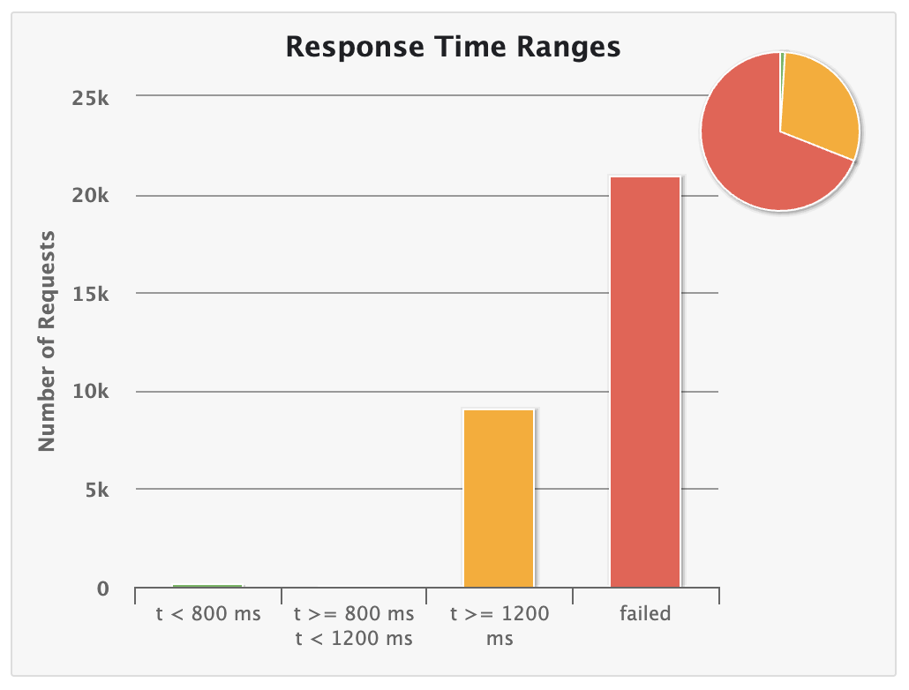
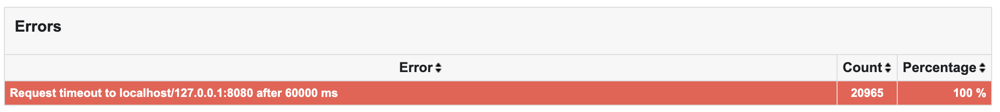
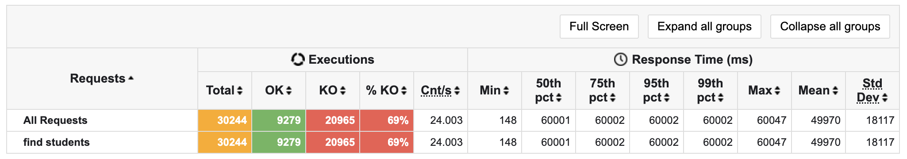
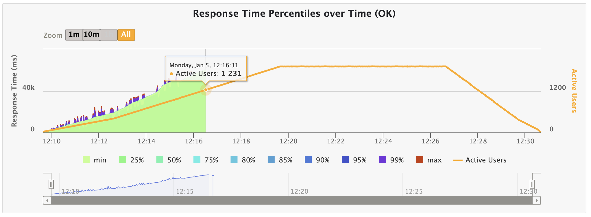
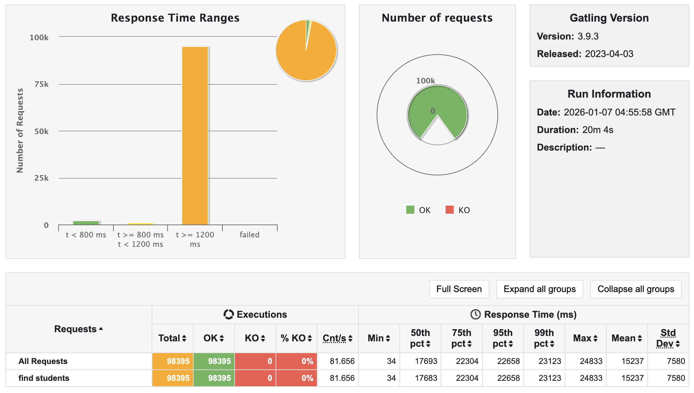
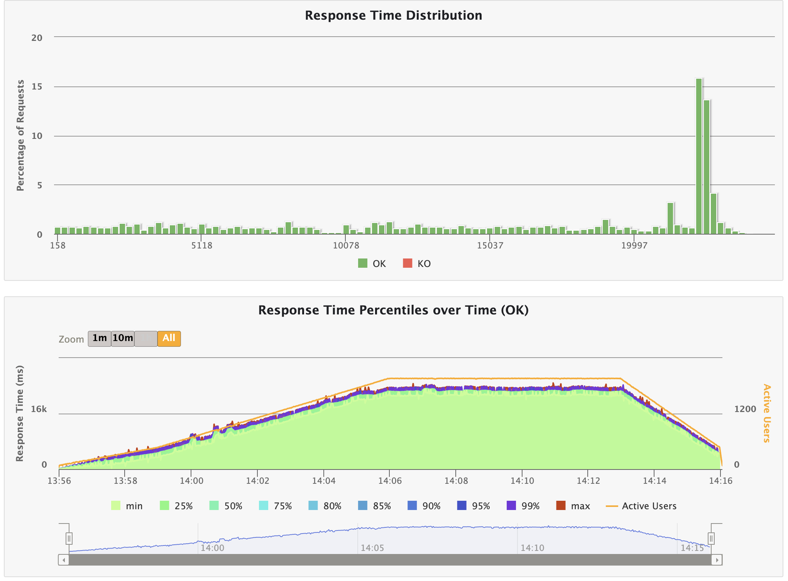

## 🫧 응답 시간 지표

결과 분석 전에 앞서, 응답 시간 지표에 대해 간략하게 짚고 넘어가자.

전형적인 응답 시간을 알고 싶다면 평균은 좋은 지표가 아니다. 얼마나 많은 사용자가 실제로 지연을 경험했는지 알려주지 않기 때문이다.

예를 들어 요청 99개는 100ms고, 요청 1개는 10초가 걸렸다고 하자. 그러면 평균은 약 200ms지만, 실제 사용자 한 명은 10초 동안 기다렸을 것이다..

따라서 얼마나 많은 사용자가 얼마나 많이 지연을 경험했는지 파악하기 위해 <strong>백분위</strong>를 사용하게 된다.

### ✨ 중앙값 (p50)

응답 시간 목록을 가지고 가장 빠른 시간부터 제일 느린 시간까지 정렬하면, 중간 지점이 중앙값이 되는데, 사용자가 보통 얼마나 오랫동안 기다려야 하는지 알고 싶다면 `중앙값` 이 가장 좋은 지표라고 할 수 있다.

말 그대로 중앙값으로, 50%의 확률로 중앙값보다 빠르게 요청이 처리될 수 있으며, 반대도 마찬가지이다.

### ✨ 상위 백분위

특이 값이 얼마나 좋지 않은지 알아보려면 `상위 백분위` 를 살펴 보아야 한다.

보통 p95, p99, p999 (99.9분위)를 사용한다.

어떤 시간 T가 있을 때, 전체 요청 중 95%가 T보다 빨리 끝나면 그 T를 95분위 응답 시간이라고 부르게 된다.

상위 백분위 응답 시간은 `꼬리 지연 시간(tail latency)` 이라고 알려져 있고, 서비스의 사용자 경험에 직접적인 영향을 미치므로 이를 잘 파악하고 빠르게 응답을 내릴 수 있는 것이 중요하다.

예를 들어 아마존의 경우, 내부 서비스 응답 시간 요구사항을 99.9분위로 기술하는데, 이때 99.9분위는 1,000개의 요청 중 1개에만 영향을 준다.

그럼에도 99.9분위 (p999)가 중요한 이유는, 보통 응답 시간이 가장 느린 요청을 경험한 고객들이 가장 많은 데이터를 가지고 있기 때문이다. 중요한 고객이다!

가령 결제가 느린 고객은, 가장 많은 물건을 장바구니에 담고 구매를 했기 때문에 느린 응답 시간을 경험했을 가능성이 크다.

아마존은 웹사이트가 0.1초 느려지면 판매량이 1% 줄어들고, 1초가 느려지면 고객의 만족도가 16% 줄어드는 현상을 관찰했다고 한다.

이를 토대로, 성능 테스트 결과를 분석해 보고자 한다.

## 🫧 성능 테스트 결과 분석

[저번 글](https://ajung7038.github.io/performance/Performance-%EC%BD%94%EB%93%9C-%EB%A6%AC%ED%8C%A9%ED%84%B0%EB%A7%81%ED%95%98%EA%B8%B0-(1)-API-%EC%84%A0%EC%A0%95-%EA%B3%BC%EC%A0%95/)에서는 성능 테스트를 통해 리팩터링할 API를 선정하는 과정을 거쳤다.

저번에 한 성능 테스트 결과를 토대로, 리팩터링 API(학생 전체 조회 API)에 대한 성능 테스트 결과를 상세하게 분석하고자 한다.

### ✨ 1. Response Time Ranges


- t < 800ms : 1%
- t >= 1,200ms (1.2초) : 30%
- failed : 69%



에러의 이유는 100% 타임아웃이었음을 알 수 있다...



다음 결과로 볼 때, 요청은 대략 30,000건이 들어왔지만, 69%가 실패했고, 성공한 요청(30%) 또한 1분이나 소요되었다.

이 정도면 스트레스 테스트로 진행한 게 아닌가 싶은 의문이 들었다...

실서비스에서는 1초 전후로 응답을 해야 한다는데... 나는 1분...도 넘었다..!!!!

결과를 계속 분석하자면 다음과 같다.

- `Cnt/s:24.003` : 초당 약 24건 요청 시도
- `Min: 148ms` : 가장 빠른 응답 시간으로, 극히 일부 요청만 빠르게 처리됨을 알 수 있다.
    - 분명 모두가 같은 조건 하에 실행되었는데, 어떤 요청은 빠른 걸로 봐서는 동시 사용자가 몇 없는 구간에서는 빠른 응답이 가능하다는 것을 보여준다.
- `p50(중앙값), p75, p95, p99: 60,001ms` : 요청의 50%가 60초 이상 걸렸다는 소리이다.

이미 69%가 처리를 못하는 상황이었기 때문에, 중앙값 이상은 모두 1분 이상으로 심각한 성능 저하 형태를 띄고 있음을 알 수 있다.

실제로 구글이 운영하는 [더블클릭](https://marketingplatform.google.com/about/resources/)에서는 모바일 페이지가 로드되는데 3초가 지나면 사용자의 절반 이상이 서비스를 포기한다고 조사 결과를 발표했다.

3초라는 시간 속에는 웹페이지의 렌더링 시간과 네트워크가 사용하는 시간 등이 포함되어 있기 때문에 웹 애플리케이션이 소모해야 하는 시간은 실제 밀리세컨드에 가깝다고 한다.

### ✨ 2. Response Time Percentiles over Time (OK)



성공한 요청만 시간 구간별로 백분위 응답 시간이 어떻게 변했는지를 보여주는 지표이다.

점점 증가하다가, 동시 접속자 수가 약 1,200명이 되었을 때부터 처리를 하고 있지 못하는 모습을 볼 수 있다.

또한, Active Users가 감소할 때도 응답 시간이 회복되지 못하고 계속 처리하지 못하고 있음을 알 수 있다.

따라서 우리의 한계 사용자 수는 1,200명을 알 수 있으며, 서버 내부에서 queue가 쌓이면서 요청을 제대로 처리하지 못하고 있다고 할 수 있다.

## 🫧 결론


사진을 보면 알 수 있다시피, 유저 수가 늘어날수록 선형적으로 증가하다가, 1,200에서 처리하지 못하고 있음을 알 수 있다.

이때 병목이 발생한 것으로 확인되며, 한 번의 API 호출 시 SQL문이 9개 나가며, 한 번에 50명의 학생을 가져오는 것으로 미뤄보아, 페이지네이션과 필요 없는 left join 양을 줄인다면 충분히 개선 가능할 것으로 판단된다.


## 🫧 API 설명


우리는 이 화면에서 학생 전체 조회 API를 호출한다.

학번, 이름, 점수, 진행 상황과 학번 검색 기능까지 제공할 수 있다.

이에 대한 코드에 대해 대략적인 설명을 하자면 다음과 같다.

다음은 학생 전체 조회 API Controller의 코드 일부분이다.

```java
public BasicResponse<StudentProgressListResponse> findAllStudentWithStatus(
            @PathVariable Long courseId,
            @RequestParam(required = false) String studentId) {

        List<Member> members = memberService.findNonAdmin(courseId, studentId);
        StudentProgressListResponse students = unitProgressFacade.findAllStudents(members, courseId);
        return ResponseUtil.success(students);
    }
```

@RequestParam을 통해 학생 검색도 가능하게 구현했음을 알 수 있다.

해당 API는 크게 두 가지 과정을 거치게 된다.

### ✨ 1. 강의를 듣는, ADMIN이 아닌 Member 전체 조회

```java
List<Member> members = memberService.findNonAdmin(courseId, studentId);
```

우선 Member과 Course는 n:m 관계이기 때문에 중간 테이블인 Enrollment를 두었다.

Member에는 USER과 ADMIN 두 개의 role이 존재하는데, Enrollment에 ADMIN과 USER 모두 등록하여, 이후 강의 전체 조회, 코드 제출 등의 API에서 ADMIN도 USER과 동일한 기능을 활용할 수 있도록 하였다.

따라서 강의와 연결된 Member을 모두 조회하면 ADMIN까지 나오게 되는데, 이 과정에서 NonAdmin을 찾아 반환하게 된다.

### ✨ 2. 학생의 과제 제출 및 점수 현황 불러오기

```java
StudentProgressListResponse students = unitProgressFacade.findAllStudents(members, courseId);
```

#### 💡 점수 계산하기

중간에 점수가 존재하는데, 제출한 모든 과제의 총합과 받은 점수를 표시 해야 한다.

당시 코드를 짤 때는 데이터 일관성 문제를 의식하고 조회할 때마다 모든 과제에서 점수를 불러와 저장했었는데, 이로 인해 다량의 left join과… 타임아웃이 발생했지 않았나 싶다.

우선 페이지네이션으로 한 번에 불러오는 학생 수를 줄이고, 차근차근 코드를 수정해 나갈 예정이다. 야호….

#### 💡 진행 상황 표시하기

또한, 학생 전체 조회 API의 우측 진행 상황을 보면, 초록, 노랑, 빨강으로 표시되어 있음을 알 수 있다.

이것들이 뜻하는 바는 다음과 같다.

- `초록` : 과제가 전부 만점인 경우
- `노랑` : 과제 중 일부가 만점인 경우
- `빨강` : 과제에 만점이 없는 경우

강의와 단원은 1:n, 단원과 과제는 n:m이므로 진행 상황 표시를 위해 강의 → 학생/단원, 과제를 모두 불러와서 확인 해야 한다는 점이 문제의 이유인 것 같다. (이후 SQL문을 통해 확인할 예정)

따라서, 해당 조회에서 사용된 JPA Repository에 페이징 기능을 넣어 우선적으로 불러오는 학생 수를 줄일 예정이다.


## 🫧 페이지네이션이란?

### ✨ 선택 이유

페이지네이션이란, 게시글이 많을 때 이를 전부 보여주지 않고 페이지화 시켜서 보여주는 것을 의미한다.

보통 적은 규모의 데이터는 리소스를 서버에서 클라이언트로 전부 전달해도 성능에 큰 지장이 없지만, 큰 규모의 데이터를 전달하거나 트래픽이 많은 서버에서는 쓸 데 없이 모든 리소스를 전달하기보다는 해당 페이지의 리소스만 전달하는 것이 서버 입장에 있어 부담이 덜 하기 때문에 사용한다고 한다.

나의 입장에서는, 50명의 학생을 전체 조회하는 데 동시 사용자 수가 많아질수록 타임아웃 현상이 일어났음을 확인했으므로, `우선은 가져오는 자료의 양을 줄이는 게 우선이라고 생각하여` 페이지네이션을 구현하게 되었다.

### ✨ 페이지네이션 구현 방식

페이지네이션은 일반적으로 다음 두 가지 정보를 함께 제공한다.

1. 현재 페이지의 리소스 반환
2. 전체 페이지에 대한 메타데이터

이때 메타데이터에는 다음과 같은 정보가 포함된다.
 - 현재 페이지 번호
 - 전체 페이지 수
 - 전체 데이터 수
 - 첫 페이지 또는 마지막 페이지 여부

### ✨ 페이지네이션 구현

Spring Data JPA는 위와 같은 페이지네이션 구현을 Page와 Pageable을 통해 편리하게 제공한다.

#### 💡 Pageable 인터페이스

Pageable은 페이지네이션의 메타데이터를 담고 있는 인터페이스로, 페이징 요청 시 필요한 페이지 번호, 페이지 크기, 정렬 방식 등을 캡슐화한다.

이를 사용하여 페이징 요청할 때 필요한 정보를 전달할 수 있다.

Pageable에는 다음과 같은 정보가 포함된다.
- 요청한 페이지 번호
- 한 페이지당 담겨 있는 데이터 개수
- 정렬 조건

주요 메서드는 다음과 같다.

- getPageNumber() : 요청한 페이지 번호 반환
- getPageSize() : 한 페이지에 몇 개의 데이터를 요청하는지 반환
- getSort() : 정렬 정보 반환

#### 💡 PageRequest

PageRequest는 Pageable의 구현체로, 페이지 번호, 페이지 크기, 정렬 조건을 명시적으로 지정하여 Pageable 객체를 생성할 때 사용된다.

PageRequest.of() 메서드를 통해 PageRequest 구현체를 생성할 수 있다.

```java
public static PageRequest of(int pageNumber, int pageSize) {
        return of(pageNumber, pageSize, Sort.unsorted());
    }

    public static PageRequest of(int pageNumber, int pageSize, Sort sort) {
        return new PageRequest(pageNumber, pageSize, sort);
    }

    public static PageRequest of(int pageNumber, int pageSize, Sort.Direction direction, String... properties) {
        return of(pageNumber, pageSize, Sort.by(direction, properties));
    }
```

PageRequest.of()는 다음과 같이 세 가지로 오버로딩 되어 있는데, 나의 경우 정렬 관련 내용은 현재로써는 필요하지 않으므로 첫 번째 함수를 사용할 예정이다.


## 🫧 페이지네이션 도입

```java
@Query("""
        select distinct m
        from Enrollment e
        join e.member m
        where e.course.id = :courseId
          and m.role <> :admin
    """)
    List<Member> findNonAdminByCourseId(@Param("courseId") Long courseId,
                                        @Param("admin") Role admin);
```

우선 첫 번째로 언급했던 `강의를 듣는, ADMIN이 아닌 Member 전체 조회` 파트이다.

이 부분을 페이지로 감쌀 예정이다.

Page<T>는 어떤 객체를 가지고 있는지 확인이 어려웠지만, PageImpl, get메서드 등을 통해 확인할 결과 다음과 같은 필드를 갖고 있음을 추측할 수 있다.

```java
- List<T> content;
- Pageable pageable;
- long total;
- int pageNumber;
- int pageSize;
- long pageOffset;
- Sort sort;
```

이들은 모두 추상화되어, getContent()와 같은 식으로 사용 가능하다.

이를 활용해 Page<T>를 List<T> 타입으로 바꾸려면 getContent() 메서드로 손쉽게 바꿀 수 있다.

따라서 Page<Member> 안에 이미 List<Member>이 포함되어 있기 때문에 Page<List<Member>>이 아닌, 다음과 같이 Page<Member>으로 써 줘야 한다.

```java
@Query("""
        select distinct m
        from Enrollment e
        join e.member m
        where e.course.id = :courseId
          and m.role <> :admin
    """)
    Page<Member> findNonAdminByCourseId(@Param("courseId") Long courseId,
                                        @Param("admin") Role admin, Pageable pageable);
```

다음과 같이 Pageable까지 넣어주면 된다.

그런데 여기에서 타입 'org.hibernate.query.Page'에 타입 매개변수가 없습니다. 라는 오류가 났다.

알고 보니 import문을 잘못 불러와서였다.

```java
// 잘못 불러온 import문
import org.hibernate.query.Page;
import java.awt.print.Pageable;

// 제대로 된 import문
import org.springframework.data.domain.Page;
import org.springframework.data.domain.Pageable;
```

궁금해서, 위의 Page, Pageable은 어떤 역할을 하는지 찾아보았다.

[hibernate의 Page](https://docs.hibernate.org/orm/6.6/javadocs/org/hibernate/query/Page.html)는 페이지 크기와 페이지 번호를 사용하여 검색 결과 페이지를 식별할 수 있도록 한다. 직접 Page를 생성하여, 쿼리 조회 시 넘겨줄 수 있다.

우리는 Spring Data JPA를 쓰므로, Hibernate용 Page를 사용하기 위해서는 Hibernate로 직접 접근해야 한다.

[java.awt.print.Pageable](https://docs.oracle.com/javase/8/docs/api/java/awt/print/Pageable.html?utm_source=chatgpt.com)는 인쇄할 페이지 집합을 나타내는 인터페이스로, 인쇄와 관련된 인터페이스이다.

아무튼.. 마저 수정해주자.

```java
@Transactional(readOnly = true)
    public Page<Member> findNonAdmin(Long courseId, @Nullable String studentId, int page, int pageSize) {
        // page: 현재 페이지 지정, 페이지 안 총 리소스 지정 (10개), 해당 페이지를 오름차순으로 정렬
        if (studentId == null || studentId.isBlank()) {
            Pageable pageable = PageRequest.of(page, pageSize);
            return findNonAdminByCourseId(courseId, pageable);
        }
        // 학번으로 한 명만 찾기
        List<Member> findMemberByStudentId = findNonAdminByCourseIdAndStudentId(courseId, studentId).stream().toList();
        if (findMemberByStudentId.isEmpty()) {
            return Page.empty();
        }
        return new PageImpl<>(findMemberByStudentId);

    }
```

학번으로는 한 명만 찾아지기 때문에 다음과 같이 if문을 활용해서 분기별로 처리 가능하도록 해 주었다.

등등 다른 부분도 바꾸어주면 완성이다.


## 🫧 성능 테스트

기존과 같은 테스트를 진행하였다.

```java
ChainBuilder findStudents =
            exec(
                    http("find students")
                            .get("/courses/#{courseId}/enrollments")
                            .queryParam("page", "#{randomInt(0,4)}")
                            .queryParam("pageSize", "10")
                            .header("Authorization", "Bearer #{accessToken}")
                            .check(status().is(200))
            );
```

다음과 같이, queryParam만 바꾼 채 나머지는 그대로 진행하였다.

테스트에서는 학생 50명이 고정이므로, pageSize를 10으로, page(현재 위치)는 0~4 중 랜덤값으로 설정하였다.



빨간 failed가 다 사라진 모습이 보인다!!

아무래도 하나의 api 호출 시 SQL문이 9개나 나가고, 한 SQL이 무거웠기 때문에 50명에서 10명으로 불러오는 수를 줄임으로써 크게 성능 개선에 성공할 수 있었던 것 같다.

그러나 여전히 절반 이상이 1200ms 이상이므로, 이에 대해 추가적으로 성능 개선을 진행하고자 한다.



또한, 동시 사용자 수가 증가함에 따라 여전히 응답 시간이 전체적으로 길어지고 있음을 확인할 수 있다.

각 HTTP 요청은 스레드 1개와 보통 DB 커넥션 1개를 점유하게 되는데, API를 한 번 호출할 때마다 SQL이 9개가 나가며, join 등 하나의 SQL문이 무겁기 때문에 DB 커넥션을 오래 잡게 된다.

따라서 이를 반환하는 시간이 길어지는 것이다.

SQL을 줄이거나 개별적인 SQL의 무게를 줄임으로써 이 문제를 해결할 수 있을 것이다.

추가 성능 개선 스토리는 길어질 것 같으므로 다음 글에서 이어나갈 예정이다.


## 🫧 참고 자료
- [응답 시간 참고 1](https://ayoung0073.tistory.com/entry/%EB%8D%B0%EC%9D%B4%ED%84%B0-%EC%A4%91%EC%8B%AC-%EC%95%A0%ED%94%8C%EB%A6%AC%EC%BC%80%EC%9D%B4%EC%85%98-%EC%84%A4%EA%B3%84-%EC%9D%91%EB%8B%B5-%EC%8B%9C%EA%B0%84-p50-p95-p99)
- [응답 시간 참고 2](https://kscodebase.tistory.com/544#:~:text=%EA%BC%AC%EB%A6%AC%20%EC%A7%80%EC%97%B0%20%EC%8B%9C%EA%B0%84%EC%9D%80%20%EC%83%81%EC%9C%84%20%EB%B0%B1%EB%B6%84%EC%9C%84%20%EC%9D%91%EB%8B%B5%20%EC%8B%9C%EA%B0%84%EC%9D%B4%EB%8B%A4.,%EA%B2%BD%ED%97%98%EC%97%90%20%EC%A7%81%EC%A0%91%20%EC%98%81%ED%96%A5%EC%9D%84%20%EC%A3%BC%EA%B8%B0%20%EB%95%8C%EB%AC%B8%EC%97%90%20%EB%A7%A4%EC%9A%B0%20%EC%A4%91%EC%9A%94%ED%95%98%EB%8B%A4.)
- [최적의 응답 시간](https://brunch.co.kr/@leedongins/29)
- [페이지네이션이란?](https://hdbstn3055.tistory.com/52)
- [Pageable을 이용해 페이지네이션 구현](https://kjs990114.tistory.com/64)
- [List->Page 변환](https://yjkim-dev.tistory.com/48)