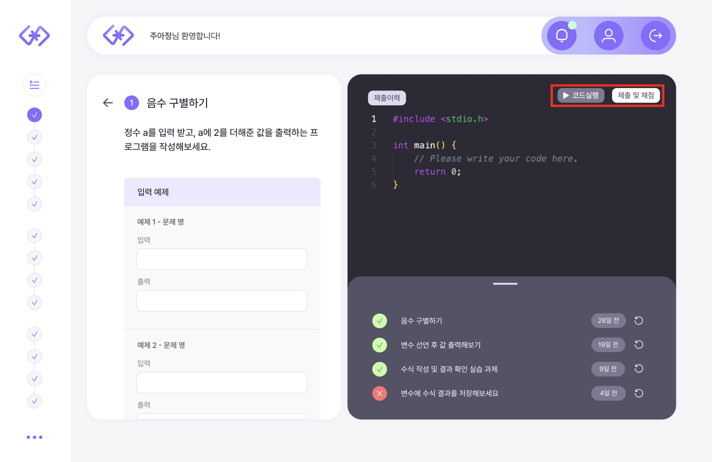
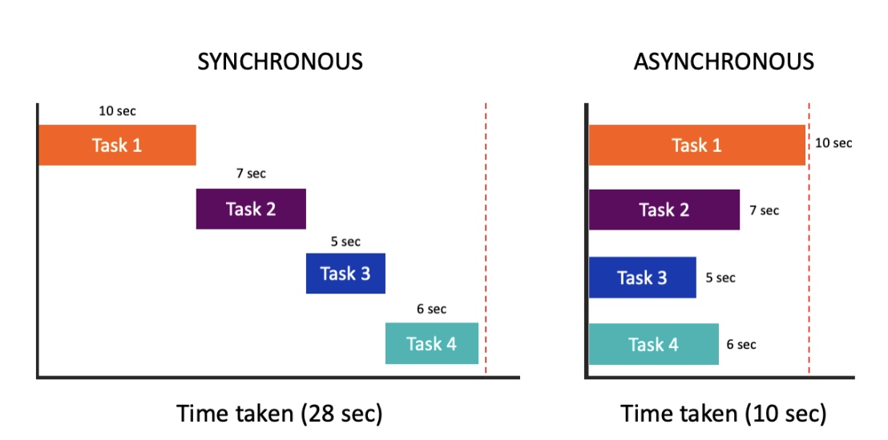

## 🫧 계기

현재 진행 중인 졸업 프로젝트의 주제가 `자동 채점 웹 플랫폼`이므로, 코드 제출 API와 코드 구현 API를 구현 해야 했다.

그러나 다른 API와 달리 이것저것 붙일 것이 많으므로... 정리 겸 지식을 공유(?)하고자 블로그 글을 쓰게 되었다.

추가적으로, 지극히 주관적인 글이므로 틀린 부분이 있을 수도 있으니 참고로만 봐 주시길 바랍니다!

### ✨ 1. 코드 실행 형태

아무것도 모를 시절... 다른 API와 비슷하게, 라이브러리를 가져와 붙이기만 하면 된다고 생각하였다.

그러나 코드 실행 시 시간 초과 문제, 스레드 등 여러 가지를 염두에 두고 만들어야 하기 때문에 이에 대해 간략하게 정리해 보고자 한다.

우선 코드 실행은 다음과 같이 두 가지 형태로 나눌 수 있다.

| 형태 | 특징 | 장점 | 단점 |
|-----|-----|-----|-----|
| 매칭 | input/output을 받아서 코드 실행 결과와 매칭 | 빠름, I/O 입출력 고려 X | 출력 포맷에 민감
| 실행 | 콘솔 창을 통한 실시간 input/output 처리 | 다양한 테스트 가능, 테스트 능력 향상 | 스레드 풀 관리 필요, 코드 버그, 예외, 타임아웃 등 별도의 처리 필요 |

특히, `실행`의 경우 스스로 어떤 결과가 나오는지, 모든 가능성에 대한 테스트를 직접 하는 능력을 기르게 할 수 있기 때문에 중요하다고 생각했다.

특정한 input을 넣을 때 예외가 발생할 수 있는데, 이러한 사고 능력까지 기르기에는 실행이 적당하다고 생각한다.

그러나 다음 UI를 보자.



... 그렇다. 나는 코드 실행과 제출이 모두 필요하다...

때문에, `실행 기능`을 통해 충분히 테스트를 진행한 후, 코드 채점을 통해 과제 제출을 통해 몇 점인지 확인이 가능하다.

실제로 프로그래머스와 같은 코드 제출 서비스를 사용할 때, 원하는 대로 input을 넣지 못해서 불편했던 기억이 있으며, 넣더라도 일일이 테스트용으로 만들어줘야 하므로 그것이 싫어 이클립스 에디터에서 코드를 짜고 확인 후 복사했던 경험이 있다.

그러므로 다음과 같이 두 가지 기능을 모두 넣기로 구상한 것이다.

우선적으로는 `input/output을 받아서 코드 실행 결과와 매칭하는 기능`을 먼저 구현할 예정이다.


### ✨ 2. 언어 선정하기

여러 가지의 언어를 동시에 구현하면 참 좋겠지만, 시간이 없으므로 우선 하나의 언어를 먼저 지원할 수 있도록 하였다.

내가 선택한 언어는 `Python`인데, 이유는 다음과 같다.
- 대부분의 알고리즘 수업은 구현보다 '사고력'을 요한다.
    <br/> -> 따라서 우리 대학의 알고리즘 수업에서는 구현이 간편한 Python을 사용한다.
- 우리가 타깃으로 잡은 학교 내 수업인 `소프트웨어의 이해(1학년 1학기 수강 과목)`는 파이썬으로 강의를 진행한다. (언어 배우기용)

언어 종류를 두고, 이를 Enum 타입으로 두어 이후 확장 가능하도록 구현하였다.

### ✨ 3. 자바에서 파이썬 실행 방법

[Java Working With Python](https://www.baeldung.com/java-working-with-python)과 [Spring 서버로 Python 코드 실행기 만들기](https://velog.io/@binimini/Spring-%EC%84%9C%EB%B2%84%EB%A1%9C-Python-%EC%BD%94%EB%93%9C-%EC%8B%A4%ED%96%89%EA%B8%B0-%EB%A7%8C%EB%93%A4%EA%B8%B0) 글에서 참고를 해, 자바에서 파이썬을 실행하는 방법에 대해 정리해 보았다.

#### 💡 1. ProcessBuilder
- java.lang.ProcessBuilder API를 통해 별도 OS 프로세스 실행
- 실행하는 서버의 OS를 기반으로 프로세스를 실행하므로 서버 내 Python 설치 필요
- 커맨드 라인으로 argument를 넘겨주는 것과 같은 방식으로 파이썬 실행이 가능하다.

```java
	// hello.py 소스코드를 실행하는 python 프로세스 생성
    ProcessBuilder processBuilder = new ProcessBuilder("python", "hello.py");
    // 프로세스 실행
    Process process = processBuilder.start();
    // 프로세스 종료까지 대기, 종료 코드 반환
    int exitCode = process.waitFor();
```

#### 💡 2. JSR-223 스크립팅 엔진 활용
- 프로그램 내부에서 다른 언어로 작성된 스크립트 실행 기능 제공
- JSR-223 스크립팅 엔진을 사용하여 jython을 사용하여 JVM 위에서 코드를 실행
- but 자료가 많이 없어 처음 구현하는 나에게 있어서는 고난이도가 될 것 같다.
- 또한, Python 2.7까지만 지원한다.

#### 💡 3. Jython
- Python 코드를 Java 코드에 직접 삽입 가능
- Python Interpreter 코드 사용
- 그러나 Jython에서 지원해주지 않는 이상 지원되지 않는 패키지가 존재할 수 있으며 공식적으로 지원하고 있는 버전이 Python 2까지라는 단점이 존재한다.

#### 💡 4. Apache Common Exec
- 일관된 API를 통해 다양한 운영체제를 지원하는 프로세스 실행 패키지 제공
- Apache Commons Exec를 사용하여 Java에서 외부 프로세스를 실행시켜 사용
- Jython은 Python 2.7까지만 지원하므로, 이 또한 Python 3의 기능 사용이 불가능하다.

```java
CommandLine cmdLine = new CommandLine("python");
cmdLine.addArgument("/path/to/your/python/script.py");
DefaultExecutor executor = new DefaultExecutor();
int exitValue = executor.execute(cmdLine);
```

#### 💡 5. HTTP
- Python 내 HTTP 서버 지원 활용 (Flask, Django 등)
- MSA와 같이, 역할과 책임을 명확하게 분리 가능할 것 같다.
- but 별도 Pyton 서버 구축 및 네트워크 통신 필요

우선적으로, 우리가 타깃으로 하는 수업 외 학교 내 데이터 관련 수업에서도 파이썬으로 수업 및 실습을 진행하며, numpy, pandas 등을 사용한다. 

그러나 [공식 문서 출처](https://www.jython.org/index)를 보면, Python 2.7까지만 지원을 한다고 한다.

또한, numpy, pandas 등은 Python 2.7을 더 이상 지원하지 않는다. [출처](https://numpy.org/neps/nep-0014-dropping-python2.7-proposal.html?utm_source=chatgpt.com)는 다음과 같다.

현재는 `소프트웨어의 이해` 과목만 타깃으로 하고 있지만, 이후 데이터 분석 강의(컴퓨터수학)까지 확대할 계획이 존재하므로, Jython을 사용하지 않는 쪽으로 기능을 구현해야겠다고 생각했다.

이렇게 필터를 거치고 나면, `ProcessBuilder`와 `HTTP` 방식이 남게 된다.

그러나 HTTP의 경우 Python 기능에 제약이 가장 덜 존재할 것 같으나, EC2 프리티어를 쓰고 있는 입장에서 서버를 하나 더 띄우기에는 금전적 제약이 존재했다.

그렇다고 람다를 사용하자니 코드 제출 API가 많이 호출되는 상황에서 요금이 폭탄될 것 같았다.

또한 관련 서비스를 하고 계신 교수님께 여쭤보았는데, 강제 타임아웃, 프로세스 관리 등 생각해야 할 요소가 많았다.

이러한 것들을 모두 람다로 처리하기에는 한계가 있을 것 같아, HTTP는 우선적으로 배제하기로 했다.

따라서 최종적으로는 `ProcessBuilder`를 사용하여 실행 코드를 만드는 방법을 채택할 것이다!

참고 자료로 삼은 [블로그 자료](https://velog.io/@binimini/Spring-%EC%84%9C%EB%B2%84%EB%A1%9C-Python-%EC%BD%94%EB%93%9C-%EC%8B%A4%ED%96%89%EA%B8%B0-%EB%A7%8C%EB%93%A4%EA%B8%B0)의 내용처럼, 프로세스를 생성해 Python을 실행한다고 해도 프로세스의 타임아웃 처리나 인풋/아웃풋 등의 추가적인 처리가 필요하므로 스레드 처리를 통해 해당 프로세스를 관리하고 필요한 전/후 처리를 포함하도록 구현하였다.

### ✨ 4. 스레드 처리

스레드 처리에는 TaskExecutor 인터페이스를 주로 사용하는데, 이는 여러 전략으로 태스크를 실행할 수 있다.

- `SyncTaskExecutor` : 동기적 스레드 실행. 멀티스레드 처리 불가
- `SimpleAsyncTaskExecutor` : 매 처리마다 새로운 스레드 생성. 동시 실행 한계 설정 가능
- `ConcurrentTaskExecutor` : 직접적으로 거의 사용 X, ThreadPoolTaskExecutor로 충분하지 않을 경우 대안으로 사용
- `ThreadPoolTaskExecutor` : 주로 사용. 스레드 풀 사용한 태스크 실행
- `DefaultManagedTaskExecutor` : JNDI 기반.

어떤 전략을 사용할 건지는 일단 동기/비동기 개념과 블로킹/논블로킹 개념을 알아야 한다.

#### 💡 동기/비동기

쉽게 말해 동기/비동기는 요청한 작업에 대해 작업을 순차적으로 수행할지 아닌지에 대한 관점이다.

`동기`는 요청과 응답의 순서가 보장되며, `비동기`는 순서가 보장되지 않는다는 특징이 있다.

또한, `비동기`는 성능과 밀접한 관계가 있는데, 요청한 작업에 대해 완료 여부를 신경쓰지 않고 자신의 그 다음 작업을 수행한다는 것은 I/O 작업과 같은 느린 작업이 발생할 때 기다리지 않고 다른 작업을 처리하면서 동시에 처리하여 멀티 작업 진행이 가능하기 때문이다.

이를 통해 시스템의 전반적인 성능 향상이 가능하다.

밑의 사진은 [한 블로그 글](https://inpa.tistory.com/entry/%F0%9F%91%A9%E2%80%8D%F0%9F%92%BB-%EB%8F%99%EA%B8%B0%EB%B9%84%EB%8F%99%EA%B8%B0-%EB%B8%94%EB%A1%9C%ED%82%B9%EB%85%BC%EB%B8%94%EB%A1%9C%ED%82%B9-%EA%B0%9C%EB%85%90-%EC%A0%95%EB%A6%AC)에서 가지고 온 것인데, 동기/비동기 개념을 너무 잘 설명한 것 같아 가지고 왔다.



#### 💡 블로킹/논블로킹

블로킹/논블로킹은 단어 그대로 현재 작업이 block(차단, 대기)하냐 안 하냐의 유무를 나타내는 프로세스의 실행 방식이다.

병렬 실행과 관련된 개념으로, 호출한 스레드가 작업이 완료될 때까지 대기하면 `블로킹`, 그렇지 않으면 `논블로킹`이 된다.

동기/비동기와 블로킹/논블로킹은 서로 조합이 되어 사용 가능하다.

- Sync Blocking (동기 + 블로킹)
- Async Blocking (비동기 + 블로킹)
- Sync Non-Blocking (동기 + 논블로킹) 
- Async Non-Blocking (비동기 + 논블로킹)


우리 프로젝트는 다음과 같은 조건을 가지고 있다.

- 타임아웃이 없는 실행(코드 제출 API)과 제한 시간 실행(코드 실행 API) 모두 존재한다.
- 한 스레드가 하나의 코드 실행을 맡는다.
- 다른 작업은 코드 실행에 영향을 미치지 않는다.

따라서 위 조건을 따져 볼 때, `Async Blocking(비동기 + 블로킹)` 방식이 맞다고 생각했다.

기본적으로 여러 개의 스레드를 동시에 실행시킴으로써 성능을 개선시킬 수 있으며, 타임아웃, stdin 처리 등의 일을 위해서는 블로킹을 사용해야 한다고 생각했기 떄문이다.

또한, 반복되는 작업이고, 스레드를 매번 새로 만들 필요가 없었다.

따라서 구현은 `ThreadPoolTaskExecution`을 사용하기로 했다.

## 🫧 구현

### ✨ AsyncConfig
```java
@Configuration
@EnableAsync
public class AsyncConfig {
    @Bean(name = "taskExecutor")
    public TaskExecutor taskExecutor() {
        // 테스크 수행시 스레드풀 사용
        ThreadPoolTaskExecutor taskExecutor = new ThreadPoolTaskExecutor();
        // 유지할 풀 사이즈
        taskExecutor.setCorePoolSize(5);
        // 최대 풀 사이즈
        taskExecutor.setMaxPoolSize(10);
        // 스레드 종료까지 시간
        taskExecutor.setAwaitTerminationSeconds(30);
        // 스레드 네임 프리픽스 설정
        taskExecutor.setThreadNamePrefix("compile");
        taskExecutor.initialize();
        return taskExecutor;
    }
}
```

### ✨ CodeExecutionService
```java
@Service
@Slf4j
@RequiredArgsConstructor
@Transactional(readOnly = true)
public class CodeExecutionService {

    @Async("taskExecutor") // 사용할 custom executor 지정
    public Future<String> run(String code, String testcase) throws IOException, InterruptedException {
        // 스레드 수행 내용 작성
        String random = UUID.randomUUID().toString();
        // 중복되지 않도록 UUID 값을 생성해 인풋 코드를 파일로 저장
        Path filePath = createFile(random, code);
        try {
            // 해당 소스코드 파일을 python3으로 실행하는 프로세스를 생성
            ProcessBuilder processBuilder = new ProcessBuilder("python3",
                    filePath.toString());
            Process process = processBuilder.start();

            try (BufferedWriter bw = new BufferedWriter(
                    new OutputStreamWriter(process.getOutputStream(), StandardCharsets.UTF_8))) {
                bw.write(testcase);
                bw.flush();
            }
            process.waitFor();

            // 프로세스 실행 아웃풋 반환
            BufferedReader br = new BufferedReader(new InputStreamReader(process.getInputStream(), StandardCharsets.UTF_8));
            return CompletableFuture.completedFuture(getOutput(br));
        } finally {
            deleteFile(filePath);
        }
    }
}
```

### ✨ getOutput

주석처럼, 결과를 읽어 String으로 합친 후 반환하는 코드이다.

```java
private String getOutput(BufferedReader bufferedReader) throws IOException {
        // 결과 읽어서 String으로 합친 후 반환
        StringBuilder sb = new StringBuilder();
        String line;
        boolean first = true;
        while ((line = bufferedReader.readLine()) != null) {
            if (first) first = false;
            else sb.append("\n");
            sb.append(line);
        }
        bufferedReader.close();
        return sb.toString();
    }
```

나의 경우에는 코드를 String으로 받아, 이를 파이썬 파일로 만든 후 실행시켜주는 방식으로 구현하였다.

실행 후 파일 삭제 과정을 거치게 된다.

나는 도커 컨테이너에서 스프링 서버를 동작시켰는데, 이 때문에 "python3"를 수행하는 과정에서 오류가 났었다.

컨테이너 환경에서는 로컬 환경과 달리, 로컬 서버에서 작동하는 환경변수 python3를 사용할 수 없기 때문에 Dockerfile 작성 시 파이썬을 설치하는 과정을 거쳐줘야 한다.

이렇게 하면 별 내용 없지만.. 코드 채점 API 만들기 완료!


## 🫧 참고 자료
- [코드 실행기 만들기](https://velog.io/@binimini/Spring-%EC%84%9C%EB%B2%84%EB%A1%9C-Python-%EC%BD%94%EB%93%9C-%EC%8B%A4%ED%96%89%EA%B8%B0-%EB%A7%8C%EB%93%A4%EA%B8%B0)
- [JSR223](https://lazoyoung.tistory.com/9)
- [AI 모델 적용의 고민 - Java 내 Python 실행 방법](https://suhanlim.tistory.com/273)
- [Python 2.7, 3.X 차이](https://snowdeer.github.io/python/2017/05/01/difference-between-python-2-7-x-and-python-3-x/)
- [Numpy 지원 중단](https://numpy.org/neps/nep-0014-dropping-python2.7-proposal.html?utm_source=chatgpt.com)
- [동기/비동기 & 블로킹/논블로킹 개념](https://inpa.tistory.com/entry/%F0%9F%91%A9%E2%80%8D%F0%9F%92%BB-%EB%8F%99%EA%B8%B0%EB%B9%84%EB%8F%99%EA%B8%B0-%EB%B8%94%EB%A1%9C%ED%82%B9%EB%85%BC%EB%B8%94%EB%A1%9C%ED%82%B9-%EA%B0%9C%EB%85%90-%EC%A0%95%EB%A6%AC)
- [자바에서 파일 생성하기](https://hianna.tistory.com/588)
- [도커 오류 수정](https://mierong.tistory.com/28)
- [컨테이너의 파일 시스템 이해하기: 데이터는 어디에 저장될까?](https://pixx.tistory.com/640)
- [Java 애플리케이션 실행 오류 해결법: ProcessException 처리하기](https://freshdawn.tistory.com/16)
- [Docker 컨테이너 내부 파일에 접근하는 4가지 방법](https://csj000714.tistory.com/674)
- [Docker 컨테이너 내부 데이터 영속적으로 관리하기](https://thalals.tistory.com/467)