> 들어가기 전에 앞서, 해당 부분은 제 지식과 참고 자료를 활용하여 정리한 것이므로 틀린 부분이 있을 수도 있다는 말씀을 드립니다.

## 🫧 응답 시간 지연 이유

테스트 및 결과에 대해 언급하기 전, 왜 응답 시간이 지연되는지 정리하고자 한다.

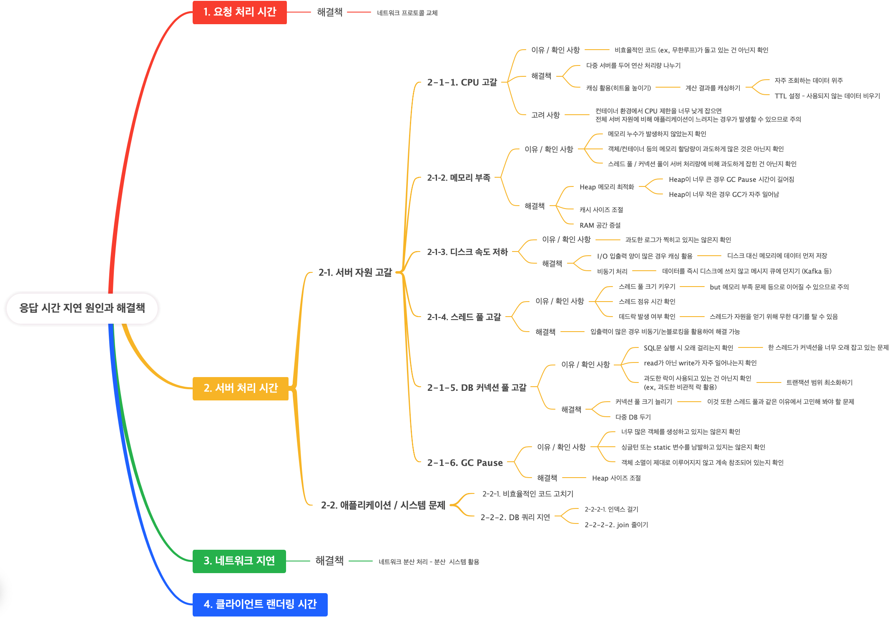

위 사진처럼, 응답 시간은 여러 이유에서 지연될 수 있다.

이들은 APM(Application Performance Monitoring) 도구를 활용해 어떤 부분이 병목인지 확인하는 과정이 선행되어야 한다.

따라서 이 글은 APM 도구를 활용하여 내가 만든 `코드 실행 API`의 병목이 어디에서 나타나는지, 어떤 문제가 있는지를 분석한 후 작성한 글이다.

## 🫧 코드 실행 API 테스트 환경 구축

현재 코드 실행 API의 경우 다음과 같이 구현되어 있다.

1. 사용자 요청 시 WebSocket 연결
2. 사용자 -> 서버로 input, code이 들어온다.
3. code를 파이썬 파일로 생성 후 `ProcessBuilder`로 파이썬 코드를 실행한다.
4. 실행 결과를 WebSocket을 통해 전송한다.

이때 3번 로직에서는 비동기 처리가 되어 있다.

동시 접속자가 약 700명을 웃도는 상황에서도 제대로 동작할 수 있는지 테스트를 해 보고자 상황을 가정하여 부하 테스트틀 진행하였다.

### ✨ 테스트 환경(사용자 수)

테스트 환경(사용자 수)은 다음과 같다.

- 0-1분 : 유입 X (휴지기)
- 1-11분: 초당 4명씩 투입
- 11-13분: 초당 4명 -> 0명으로 감소

### ✨ 테스트 환경 (input)

원래는 sleep(3)을 통해 사용자의 입력이 지연되는 시간을 기다리도록 했는데, 이것은 그저 사용자 입력 지연이 아닌 무한 대기 상태의 코드였다.

따라서 sleep(3) 코드를 제외하고, 실제 학교 내 과제로 나온 `컴퓨터와 가위바위보`를 할 수 있도록 구현한 코드를 사용자가 code로 넣을 수 있도록 하였다.

### ✨ 테스트 코드 작성

```java
ChainBuilder sendAndReceive = feed(codeFeeder)
    .exec(ws("Send ${caseName} Code") // 여기 (1)
    .sendText("""
            {
              "input": "#{input}",
              "code": "#{code}"
            }
        """)
    .await(20).on(
        ws.checkTextMessage("Check result") // 여기 (2)
            .check(bodyString().saveAs("responseBody"))))
            .exec(session -> { return session; });
```

다음은 테스트 코드 중 일부이다. 메시지를 보내기 전, `Send ${caseName} Code`와 `Check result`로 로깅을 하는 모습이 보이며,

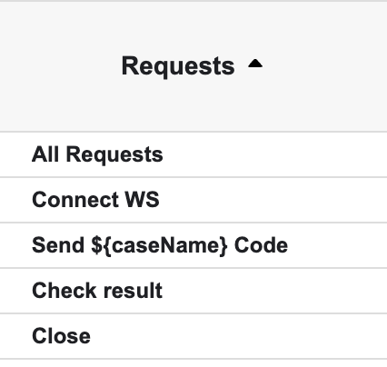

아래와 같이 나누어 리포트 확인이 가능하다. 어떤 작업을 진행하는 중 병목이 발생했고, 실패했는지 알아보기 위해 다음과 같이 네 단계로 나누어 진행했다.

또한 메시지 전송의 경우, WS를 연결하고 응답을 받을 때까지 `await(20)`을 활용해 시간 제한을 두었다.

코드 실행 후 응답을 받을 때까지가 하나의 흐름인데, 실행 API만 호출하게 되면 응답을 받지 못해도 성공이라고 기록할 것 같았기 때문이다.

또한, 사용자가 코드를 이미 제출하고 (WS 연결됨) 이후 코드 수정 -> 재제출의 과정을 거친다고 가정했으므로 이 사이에 텀을 3분 두어 사용자의 입력을 기다리는 시간을 가정하였다.

```java
ScenarioBuilder scn = scenario("Code Execution WS")
    .feed(tokenFeeder)
    .exec(wsConnect)
    .pause(60 * 3) // 사용자는 3분 동안 입력 시간을 거침
    .exec(sendAndReceive)
    .exec(ws("Close").close());
```


## 🫧 테스트 결과

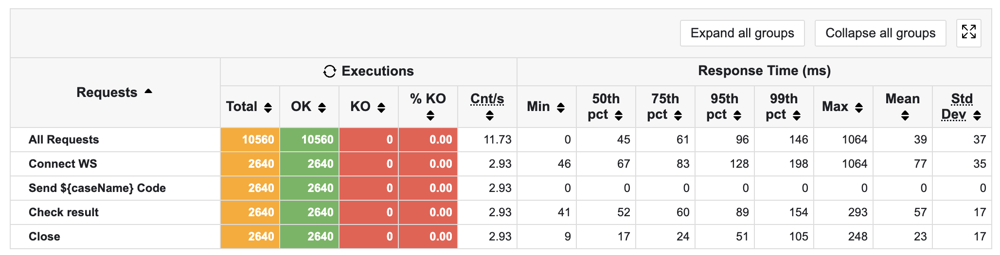

테스트의 전반적인 결과이다. 모두 성공으로 응답하고 있음을 알 수 있다.

여기서 p99까지는 0.1의 응답률을 보이지만, Max 값은 1초가 넘어가는 것을 확인할 수 있다.

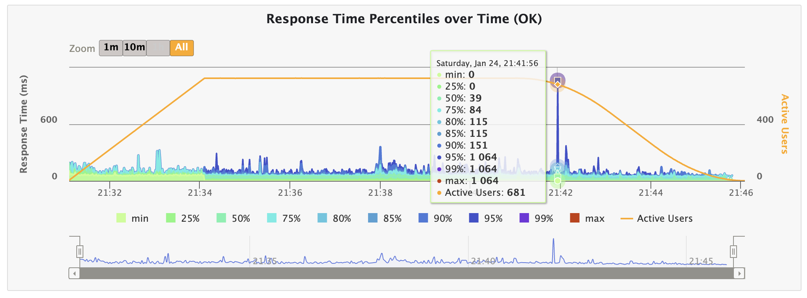

응답 퍼센트를 볼 때, 해당 부분이 확연하게 드러난다. 모든 부하가 끝나갈 때쯤 툭 튀는 현상으로, 1,064의 특정한 값을 갖고 있었다.

Gatling 환경이 내 컴퓨터이므로, 이에 대해 영향이 갔을까 싶어 같은 환경에서 테스트를 세 번 해 봐도 튀는 현상은 사라지지 않았다.

게다가 약 1,000ms의 튀는 현상이 지속되어 발생하는 것이다.

그렇다면 왜 이렇게 툭 튀는 현상이 발생할까?

따라서 가설을 세워 문제를 해결하고자 하였다.

<br/>

### ✨ 가설 1: WS 연결 실패 (참)
- WS Connection에서도 같은 시간대의 튐 현상이 관찰되었다.
- 게다가 p75부터 이런 현상이 나타나고 있었다.


<br/>

### ✨ 가설 2: GC STW의 문제일 것이다 (거짓)
- 실제로 Minor GC, Major GC 모두 일어나지 않았다.
- 여러 튀는 현상들을 전부 관찰했는데, Eden Space의 경우 차근차근 메모리가 쌓이는 곳도 있고, GC가 일어나던 부분도 있었다.

따라서 GC는 해당 문제와 상관 없을 것이라 생각하였다.

<br/>

### ✨ 가설 3: Process Open Files의 한계일 것이다 (거짓)

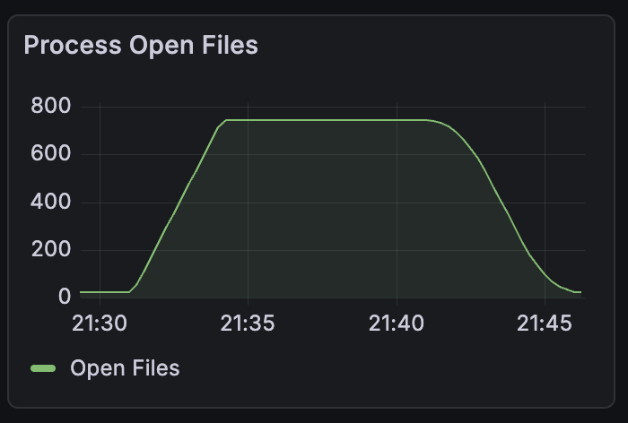

- 테스트를 지속한 결과, 다음과 같이 743까지 열리고 이후 떨어지는 모습을 보였다.
- 그러나 743, 110, 590 등에서 튐 현상이 발생되었으므로 이 또한 배제하기로 한다.

<br/>

### ✨ 가설 4: 네트워크 재전송 문제일 것이다. (거짓)
- 모든 튀는 지점의 응답 시간이 1,000ms를 웃돌고 있다.
- 따라서 1초간 타임아웃에 의해 패킷이 재전송되어 지연 시간이 발생할 것으로 예측하였다.
- 그러나 실제로 `cat /proc/net/netstat`를 활용해 `TCPTimouts` 숫자를 비교한 결과, 테스트 전후 값이 같았다.
- 따라서 패킷 재전송에 의한 타임아웃은 아니라는 결론을 내렸다.

<br/>

### ✨ 가설 5: 스레드가 부족하여 큐에 요청이 쌓이고 있을 것이다. (참)
- waiting thread는 16이 넘어가는 반면, 지속해서 Runnable 스레드는 7개를 웃돌고 있었다.
- Tomcat의 기본 스레드 풀 개수는 200개이며, 커스텀하지 않았다.
- 알고 보니 내가 비동기 처리용 풀을 커스텀하여 CorePool 사이즈를 5개, MaxPool 사이즈를 10개로 설정해 둔 것이었다.
- 실제 스트레스 테스트 결과 timed-waiting 스레드 수는 210개인 반면, Runnable 스레드는 7개를 유지하는 것을 확인하였다.

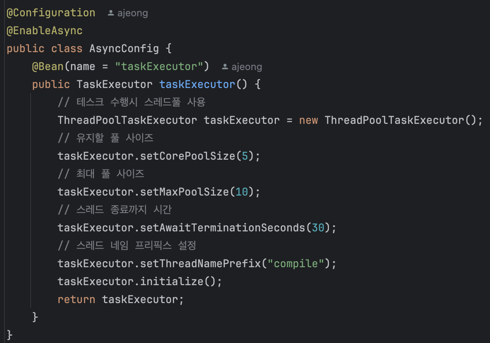
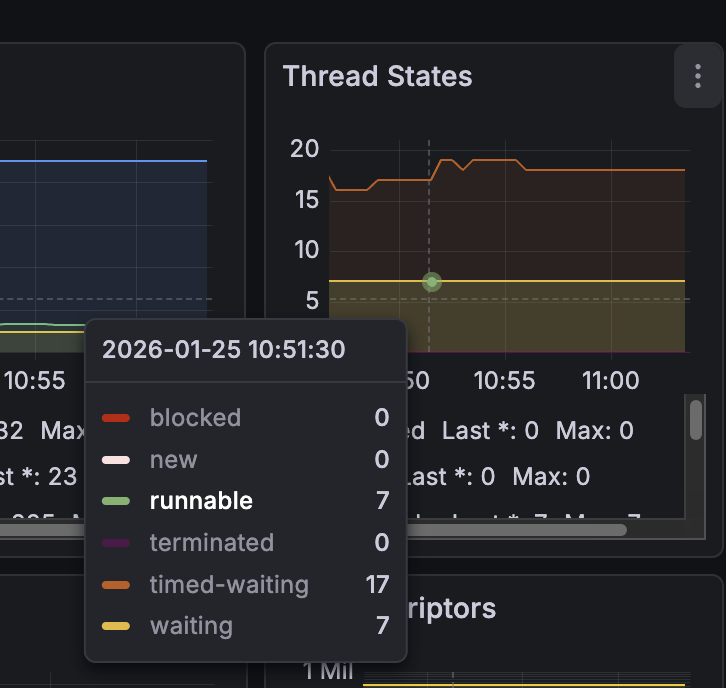

3분 지연의 과정이 테스트에 포함되고 있으므로 요청이 큐에 쌓이고 있음을 알 수 있다.

<br/>


### ✨ 가설 6: ThreadPoolTaskExecutor에서 큐 정리 시 타임아웃이 일어날 것이다. (거짓)

이에 대해 들어가기 전, 간단하게 Java NIO와 ThreadPoolTaskExecutor에 관련하여 언급하고자 한다.

#### 💡 가설을 세우게 된 계기


참고로, 내가 이 가설을 세운 이유는 다음과 같다.

- 1,000ms을 웃도는 지연 시간이 지속적으로 발생 -> 무언가 타임아웃에 의해 밀린다고 생각했음 (너무 일정했음)
- `가설 4`에 따라 네트워크 문제는 아님
- `가설 5`에 따라 대기하는 스레드가 많다는 사실을 알았음
- 강제 지연 후 서버를 끊어버렸는데, 이때 `java.nio.channels.ClosedChannelException` 오류가 발생하였음
- SocketChannel과 NioChannel과 연관된 `NioEndPoint`의 selectorTimeout 시간이 무려 1초!! 였음
<br/> -> 내부적으로 채널을 활용하며, WS 소켓 연결 과정에서 문제가 생겼다고 가정

따라서 이 Java NIO가 무슨 역할을 하는지 알아보기로 했다.

#### 💡 Java NIO

- Java NIO는 대표적으로 `Channel`, `Buffers`, `Selectors` 이 세 가지 컴포넌트를 가진다.
- 이 중 Selector는 하나의 스레드가 여러 개의 채널을 동시에 다룰 수 있도록 해 주며, Tomcat의 경우 이를 내부적으로 논블로킹으로 구현하여 여러 개의 스레드를 만들지 않고도 소켓을 처리할 수 있게 해 준다.

특히, Poller 스레드 run() 메서드에는 다음과 같은 코드가 포함되어 있다.

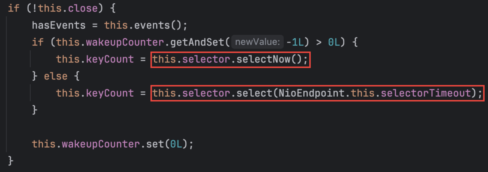

여기서 selectNow()는 바쁜 상황에서 이벤트가 있는지 확인하고 없으면 바로 다음으로 넘어가는 메서드이다.

select() 메서드는 이벤트가 생길 때까지 스레드가 자리에 멈춰서 기다린다.

여기서 나도 헷갈렸는데, `바쁜 상황`이란 CPU 등 부하가 많은 상황이 아닌, 이벤트가 있는지 없는지에 대한 상황이다.

#### 💡 가설 검증

위의 내용을 기반으로, select(1000)을 호출한 이후 원래대로라면 wakeup()을 해야하지만, 다량의 스레드 처리 및 병목에 의해 해당 파트가 제대로 실현되지 않고 있음으로 판단하였다.

따라서 직접 문제가 되는 selectorTimeout을 바꿔 실행해 보기로 하였다.

만약 타임아웃 시간이 1초가 아닌 다른 시간으로 나온다면, 해당 부분이 문제가 되고 있을 것이라고 생각하였기 때문이다.

```java
@Bean
public WebServerFactoryCustomizer<ConfigurableServletWebServerFactory> containerCustomizer() {
    return factory -> {
        if (factory instanceof TomcatServletWebServerFactory tomcat) {
            tomcat.addConnectorCustomizers(connector -> {
                // selectorTimeout 초 변경 (기본: 1000, 1초)
                connector.setProperty("selectorTimeout", "1000");
            });
        }
    };
}
```

- 1000으로 적혀 있는 부분을 바꾸며 테스트를 시도해 보았다.
    - 1초(기본 테스트) -> 5초 -> 0.5초 -> 2초

그러나 정말 놀랍게도 여전히 **<U>1062</U>**를 유지하고 있었다.

솔직히 맞는 줄 알았는데 ...

<br/>
<br/>

다시 문제 상황부터 정의하자.

- 현재 WS 커넥션 파트에서 문제가 발생한다.
- WS 커넥션 요청이 서버에 도착했는데, 이 커넥션을 획득하는 과정에서 1초가 소요된다.
- 요청을 처리하는 순서는 스레드 할당 -> WS Handshake -> 이후 다시 스레드 할당 순으로 이루어진다.
- 1초라는 주기적인 타이밍이 문제가 되고 있다.
    <br/> -> 주기 문제가 지연에 영향을 끼치고 있다.

Handshake가 일어나는 상황을 대략적으로 정리하자면 다음과 같다.

1. 요청 들어옴
2. 요청을 받아서 Selector에 소켓 등록
3. 스레드 풀의 스레드와 커넥션
    - Poller가 소켓을 읽을 수 있음을 감지
    - SocketProcessor 생성
    - Executor.execute(SocketProcessor) 호출
    - worker thread 할당 대기
4. 스레드 연결 후 WS Handshake (HTTP Upgrade)

그러면 다시 이를 기반으로 가설을 세워보자.

<br/>

### ✨ 가설 7: WS Handshake 전 워커 스레드를 할당 받는 과정에서 지연이 일어났을 것이다. (거짓)
- 이렇게 된다면 모든 요청이 지연되어야 하는데, p75 또는 p90부터 일정한 지연 시간을 가지고 튀기 때문에 아니라는 결론을 내렸다.

<br/>

### ✨ 가설 8: ThreadPoolTaskExecutor의 풀 사이즈를 적게 잡아 대기 시간이 길어지며 튀는 현상이 발생했다. (거짓)
- 처음에는 스레드 풀 부족으로 인한 병목 현상을 예상했다.
- 그러나 우리의 문제는 WS 커넥션 문제이다.
- WS Socket의 Handshake가 성공해야 ThreadPoolTaskExecutor의 스레드를 할당 받을 수 있다.
- 무엇보다 테스트 결과, API 요청과 결과 사이의 p99값이 0.1초이므로 해당 가설도 거짓이다.

<br/>

### ✨ 가설 9: Poller에 등록된 소켓이 Poller loop 경계에 걸리며 첫 처리까지 1초를 기다린다. (거짓)
- 그러나 1초로 지연이 일정하며, 꼬리에서 일부 요청만 튀는 현상이 발생하였다.
- Poller에 등록된 소켓이 처음 처리되는 시점이 다음 Poller loop로 밀릴 때 발생하는 건가 싶었지만, 가설 6과 마찬가지로 selectorTimeout의 값 변화에도 여전히 1,000ms의 지연 시간을 보였으므로 거짓이다.

<br/>

### ✨ 가설 10: CPU 사양 문제로 인해 연산이 제대로 이루어지지 않고 있다. (거짓)
- 그러나 CPU 사용량은 50%도 아닌 15%도 안 된다.

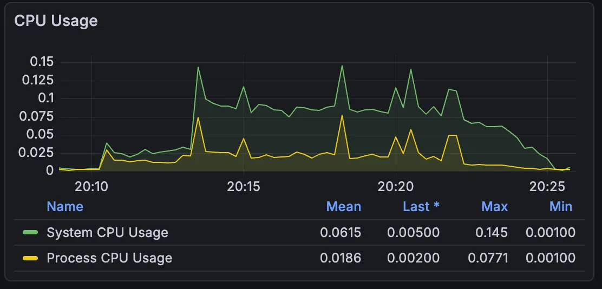

<br/>

### ✨ 가설 11: Poller 스레드의 부하로 인해 지연이 발생한다. (참)
- I/O 작업이 많이 일어나는 API를 집중적으로 테스트하다 보니, I/O 대기 과정에서 지연이 발생하는 것이 아닌가 하는 생각이 들었다.
- 또한 `ss -lnt` 명령어를 활용하여 대기 중인 소켓을 확인해본 결과, Recv-Q (현재 연결 수락을 기다리는 요청 수)는 0으로, 네트워크 패킷에서 지연이 발행하고 있지 않음을 파악했다.
- Recv-Q는 0인데, 서버 내부 스레드들은 waiting/timed-waiting이 많고, 지연 시간이 1초로 튀는 모습으로 보아, Poller 스레드가 과부화되어 I/O 처리에 지연이 일어나 문제가 발생한다고 생각하였다.
- 그래서 Poller가 많은 양의 소켓을 처리하지 못하고 병목이 발생하였다고 추측하였다.

<br/>

- 이를 검증하기 위해 `PollerThreadCount`의 값을 1 -> 2로 조정하여 테스트를 수행하였다.
- 확률적으로 둘 중 하나는 CPU를 잡아 select()를 수행할 가능성이 높기 때문이다.
- 이를 통해 I/O 환경에서 Poller가 빠르게 동작함으로써 요청을 스레드와 연결해 줄 수 있다고 생각했기 떄문이다.

결과적으로 동일한 환경에서 테스트를 두 번 진행한 결과, 성공률은 모두 100%를 달성할 수 있었으며, 튀는 현상이 **<U>1000ms -> 300ms로 감소</U>**했음을 알 수 있다.

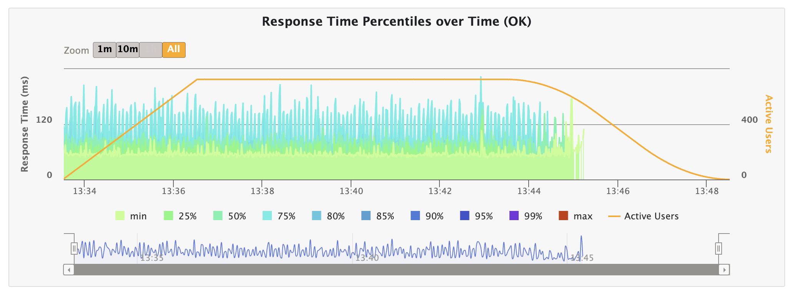

## 🫧 결론

응답률이 튀는 현상을 관찰하고, 이에 대한 가설을 11가지 세운 끝에 문제를 해결할 수 있었다.

다음은 이를 통해 얻어진 결과를 수치화한 것이다.

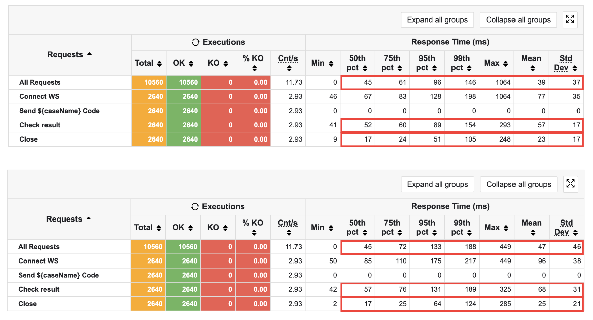

<S>

- `Max`: 1,000ms -> 300ms (약 70% 감소)

- `p99`: 146ms -> 110ms (약 25% 감소)

- `Check result(Max)`: 293ms -> 168ms (약 42.6% 감소)

- `Close(Max)`: 248ms -> 124ms (약 50% 감소)

</S>

인 줄 알았으나 시간이 지난 후 다시 테스트한 결과, 다른 결괏값이 나옴을 확인했다.. 따라서 조금 더 깨끗한 수치를 얻기 위해 텀을 두고 Poller가 한 개일 때와 두 개일 때를 여러 번에 걸쳐 테스트한 결과, 성능은 대략 다음과 같은 수치로 나왔다.

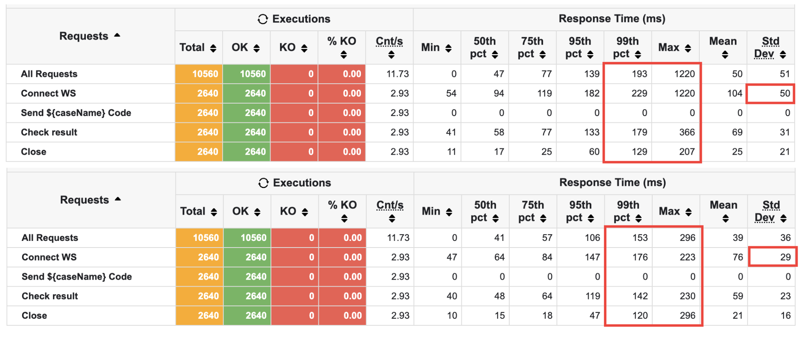

계속해서 같은 환경에서 테스트를 진행하다 보니 JVM 최적화 등으로 Poller가 몇 개인지 상관 없이 응답 속도가 좋게 나온 것 같았다.

따라서 환경적인 부분까지도 통제할 수 있도록 해야겠다고 생각하였다.


- `Max`: 1,220ms -> 449ms **<U>(63.2% 감소)</U>**
- `p99`: 193ms -> 188ms **<U>(2.6% 감소)</U>**
- `Connect WS(p99)`: 229ms -> 217ms **<U>(5.2% 감소)</U>**
- `Check result(Max)`: 366ms -> 325ms **<U>(11.2% 감소)</U>**
- `Close(Max)`: 207ms -> 285ms **<U>(37.7% 증가)</U>**
- `표준편차`: 50ms -> 38ms **<U>(24% 감소)</U>**

미미하지만 Close()를 제외한 모든 부분에서 성능이 개선되었음을 알 수 있다.

I/O 이벤트가 많은 API 특성상, I/O 처리를 위한 `PollerThreadCount` 값을 늘려줌으로써 API 결과를 받는 부분도 응답 시간을 줄일 수 있었던 것 같다.
(output 전달 시 패킷을 통해 전달, 이 과정에서 Poller 호출)

또한, 표준편차가 24% 감소하였다는 사실을 알 수 있는데, 이는 시스템의 안정성이 조금이나마 확보된 결과로 볼 수 있을 것이다!

연결 종료 시에는 특이하게도 증가하였는데, p95부터 증가하는 모습을 보인다. 또한, min 부분은 기존보다 11ms -> 2ms로 크게 줄어들었음을 알 수 있다. 따라서 Multi-Puller 도입에 의해 무언가 변화가 생겼음을 의심할 수 있을 것이다.

이 부분은 보완점으로 두고, 목표로 하던 Max Latency를 줄였으므로 우선은 여기서 마무리하고자 한다.


## 🫧 보완점

`Multi-Puller` 도입을 통해 Max Latency가 줄고, 서버가 안정적으로 변화함을 확인할 수 있었다.

그러나 여전히 고칠 점은 많다. 마지막 테스트 결과에서도 응답이 고르지 않게 분포하였으며, close() 상황에서 오히려 latency가 증가함을 확인할 수 있었다.

기존에는 PollerThread가 하나였기 때문에 앞단에서 병목 현상이 발생해 속도가 조절되었던 것 같은데, 이 문제를 해결하고 나니 이제는 대기 중인 스레드 수가 급격하게 늘어나며 서버가 부하를 버텨내지 못하고 있는 것 같았다.

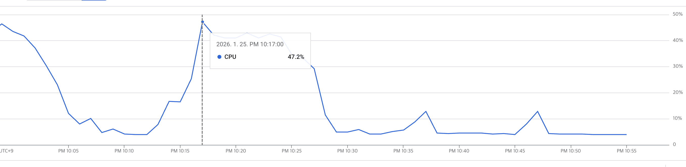

특히, 모니터링으로 관찰 결과 높아봤자 47.2%였기 때문에 CPU 부족으로 인한 불안정한 처리보다는 처리 흐름 상 어떠한 문제가 있을 것으로 예측할 수 있었다.

따라서 스레드 풀 크기 조절, Poller 속도 조절 등의 과정을 거쳐 계속해서 응답 시간을 개선해 나갈 것이다.


## 🫧 참고 자료
- [Chiba-in 응답 시간(Response Time): 시스템 성능의 핵심 지표](https://chiba.tistory.com/247)
- [네트워크 패킷-ss](https://www.sangchul.kr/745)
- [Spring WebSocket 동작 과정](https://velog.io/@gyehyunbak/Spring-WebSocket-Architecture)
- [Channel, Buffer, 그리고 Selector](https://hbase.tistory.com/36)
- [Slelector](https://hbase.tistory.com/39)
- [네트워크 입출력 (SocketChannel, ServerSocketChannel, DatagramChannel)](https://hbase.tistory.com/45)
- [ThreadPool 설정 기준에 대해 고민해보자 (feat.@Async)](https://velog.io/@vanillacake369/Async-Size-%EC%84%A4%EC%A0%95-%EA%B8%B0%EC%A4%80%EC%97%90-%EB%8C%80%ED%95%B4-%EA%B3%A0%EB%AF%BC%ED%95%B4%EB%B3%B4%EC%9E%90-feat.ThreadPoolQueue)
- [ThreadPoolTaskExecutor 이용하여 성능 개선하기](https://coor.tistory.com/33)
- [ThreadPoolExecutor vs ThreadPoolTaskExecutor](https://astrid-dm.tistory.com/604)
- [Java로 HTTP 서버 구현 - (2) 스레드 풀과 BIO](https://velog.io/@sangdevil/Java%EB%A1%9C-HTTP-%EC%84%9C%EB%B2%84-%EA%B5%AC%ED%98%84-2-%EC%8A%A4%EB%A0%88%EB%93%9C-%ED%92%80%EA%B3%BC-BIO)
- [netstat의 Send-Q, Recv-Q의 의미](https://blog.naver.com/tescom9/50041179020)
- [Chapter2. Story 1. 소켓을 작성한다.](https://iskull-dev.tistory.com/320)