> 들어가기 전에 앞서, 해당 부분은 제 지식과 참고 자료를 활용하여 정리한 것이므로 틀린 부분이 있을 수도 있다는 말씀을 드립니다.

## 🫧 문제 상황

저번 글에서는 Multi-Puller를 도입하여 Max Latency를 75.7% 낮춘 경험을 작성하였다.

그런데 해당 글에서도 썼다시피 결과를 보니 close() 시 Max Latency가 **<U>207ms -> 296ms로 약 43%</U>** 증가하는 것을 발견하였다.

단순히 우연의 일치인가 싶어 이후 테스트를 몇 번 더 수행했었는데, 그때마다 Max Latency가 약 300ms 정도를 웃도는 것을 확인하였다.

아래 이미지는 실제 Poller를 하나 더 도입하며 생긴 latency 수치이다.

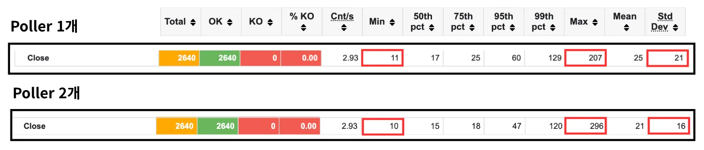

- `p95` : 60ms → 47ms 감소
- `max` : 207ms → 296ms 증가
- `표준편차` : 21 → 16으로 감소

해당 부분을 보면 모든 결과는 좋아졌지만 max Latency만 훅 튀고 있음을 알 수 있다.

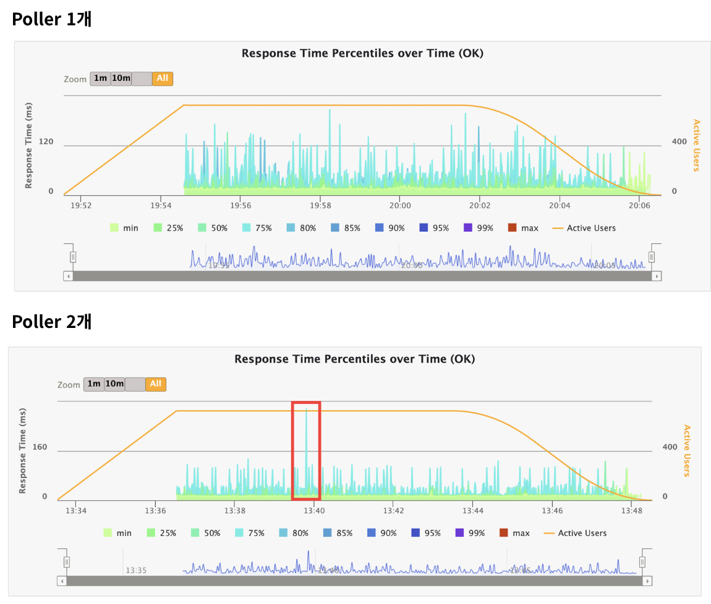

전에 발생했던 문제 또한 지연으로 인해 Max Latency가 두드러지는 현상이 나타났던 것이었으므로, 이번에도 어딘가 지연이 발생했을 것이라 추측할 수 있었다.

그래서 close() 과정을 추적하며, 어떤 부분에서 문제가 발생할 수 있는지를 파악하고 문제에 대한 원인을 찾고자 한다.

이를 Prometheus/Grafana를 활용하여 증명하고자 한다.

+) 문제 해결 과정에서, 지표의 한계를 느껴 핀포인트로 추적 과정을 담고자 했으나 `웹소켓 지원 미흡`, `latency 오버헤드 발생`의 이유로 열심히 연결했던 핀포인트를 제거했다...

## 🫧 close() 과정

그렇다면 close()를 호출하면 내부적으로 어떤 일이 발생하는지 보자.

내부적으로 close()는 다음과 같이 동작한다.

1. 클라이언트 측에서 close() 호출
2. Selector가 Poller를 깨움
  - 이 과정에서 Selector은 삭제 대상인 FD를 찾아 리스트로 저장
3. Poller가 깨어난 직후 Selector이 준 FD 리스트를 정리
4. 4-way handshake
  - 이 과정에서 쓸 내용이 남아있다면 스레드가 버퍼에 내용을 씀
5. Poller 상태 업데이트
6. 객체 정리

<br/>

우선 기본적으로 서버가 어떤 변화가 있었는지 파악하도록 하자.

<br/>

### ✨ 가설 1: Poller의 빠른 처리로 인해 객체가 전보다 빠르게 생성될 것이다. (참)

Poller -> Selector 처리 과정에서 Selector가 전보다 더 빠르게 객체를 생성할 것이라 예측하였다.

실제로 allocated의 경우 메모리 할당의 변동폭이 컸다.

여기서 `allocated`는 현재까지의 총 메모리 할당량을 뜻한다.

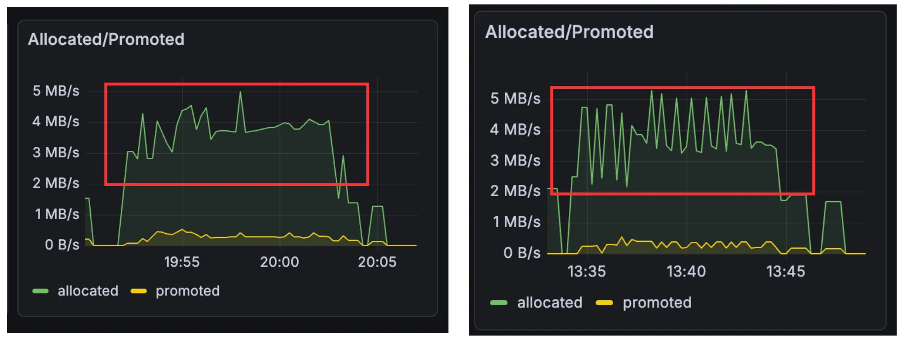

총 할당량 계산 결과, Poller 1개의 경우 **163.74MB**, 2개의 경우 **171.30MB**로 거의 비슷한 수치를 내고 있음을 알 수 있다.

그러나 삐죽삐죽 메모리가 치솟고 있음을 알 수 있는데, 이는 메모리가 몰아서 한 번에 할당되고 있음을 나타낸다.

따라서 Multi-Poller 도입으로 인해 처리가 지연되던 요청들이 한 번에 처리되며 객체가 빠른 시간에 생성되고 있음을 확인하였다.

<br/>


### ✨ 가설 2: GC 수행이 앞당겨질 것이다. (+ STW 시간이 증가할 것이다.)

가설을 세운 흐름은 다음과 같다.

Poller 두 개로 SocketChannel (Acceptor이 만드는 웹소켓용 객체)이 엄청 빠르게 만들어짐 -> GC가 전보다 더 빠르게 일어날 것.

실제로 WS 연결 속도가 p99 기준 23.1% 감소하였으므로 객체의 생성 속도가 전보다 앞당겨질 것으로 예측하였다.

<br/>

그러나 테스트 결과, GC 수행 시간은 비슷했다.

테스트 시작 후 약 3분 만에 GC가 발생하는 사실 또한 비슷했으며, **<U>STW 시간도 비슷하여</U>** 객체에서 발생하는 문제가 아님을 짐작할 수 있었다.

(그런데 당연한 소리였다. API 호출양은 변화하지 않았으므로 객체의 양은 달라지지 않는다..)

<br/>

### ✨ 가설 3: 객체의 생명 주기가 길어졌을 것이다. (참)

그러면 객체가 빨리 만들어지는데 왜 GC가 빠르게 발생하지 않는지에 대한 의문이 들었다.

따라서 객체의 살아남는 시간이 길어졌을 것이라 추측하였다.

모니터링 지표 확인 결과, Young -> Survivor 영역으로 이동하는 객체가 많아졌다는 것을 확인할 수 있었다.

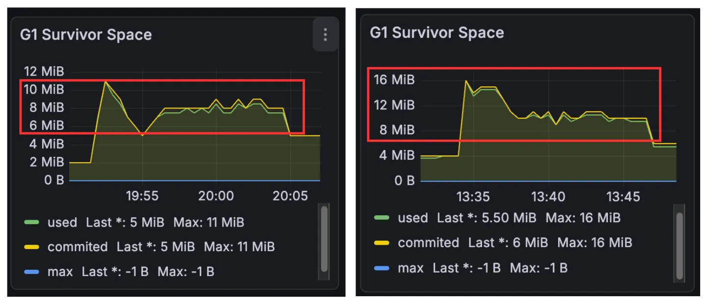

그러나 Survivor -> Old 영역의 이동은 잘 일어나지 않았음을 확인할 수 있었는데, Old 영역으로 이동하기 전 객체 정리로 인해 발생한 문제로 추측할 수 있었다.

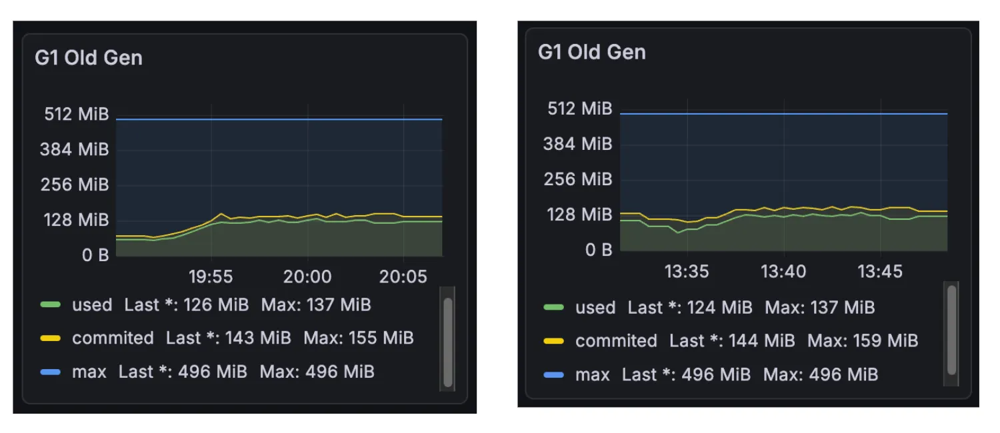

가설 1에서 객체 생성 주기가 몰아서 할당됨을 확인하였으므로 예상보다 GC가 빠르게 호출되어 Survivor 영역으로 이동하는 객체가 많아졌음을 파악할 수 있었다.

그러나 가설 2에서 GC 수행 시간이 비슷했다는 결과가 나왔다. 가설 1과 3을 미루어 볼 때, 이는 객체의 생성 주기가 엄청나게 빨라지지 않아 GC 모니터링 시 잘 드러나지 않을 것으로 생각하였다.

<br/>

이를 바탕으로 지연 원인을 파악해보자.

<br/>

### ✨ 가설 4: FD 반환 시 지연이 발생할 것이다. (거짓)

실제 Process Open File 확인 시 기울기가 유사하게 나왔으므로 해당 가설은 거짓임을 확인할 수 있었다.

<br/>

### ✨ 가설 5: write() 시 지연이 발생할 것이다. (거짓)

코드 실행 API 특성상 요청 시에는 input을 읽고, 응답 시에는 output을 내 줘야 한다.

따라서, 버퍼에 쓰는 과정에서 추가적인 지연이 발생할 것으로 예측했다.

그러나 버퍼 사용률과는 유의미한 상관 관계를 내지 못하였다.

<br/>


### ✨ 가설 6: Poller 상태 업데이트 시 공유 Selector 접근 과정에서 지연이 발생할 것이다. (거짓)

실제로 정리할 패킷의 FD 리스트를 Selector이 가지고 있다가, 한 번에 Poller를 깨우면서 이를 정리하게 된다.

그러나 Poller를 두 개로 늘리면서, Selector이 처리해야 할 양이 많아졌고, 이 부분에서 지연이 발생할 것으로 예측하였다.

그러나 실제로 Poller를 새로 만들지 않고, Tomcat의 pollerThreadCount를 2로 늘렸는데, 이는 Selector를 개별적으로 가지도록 프로그래밍되어 있다고 한다.

따라서 공유 Selector는 성립하지 않는다. (오히려 락 부분을 의심 해야 한다.)

<br/>

### ✨ 가설 7: 로그 부분에서 지연이 발생할 것이다. (거짓)

나의 프로젝트를 보면 사진처럼 `Slf4j`를 활용하여 로그를 남기고 있다.

이 부분은 테스트 시 제대로 소켓 연결이 이루어졌나 찍어보기 위함인데, 실제 테스트 상황에서 log.info까지 모두 찍어놓도록 구현한 것이었다.

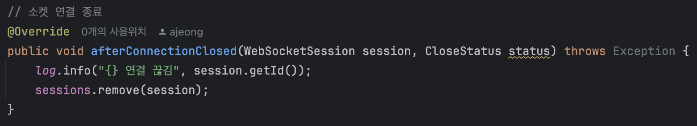

실제로 Slf4j의 경우 따로 건드린 것이 없다면 스프링 기본 설정인 LogBack를 활용하는데, 이에 대해 버퍼에 쓰는 과정에서 세션 정리와 겹쳐 혹시 지연이 발생할 수도 있지 않을까 하는 생각이 들었다.

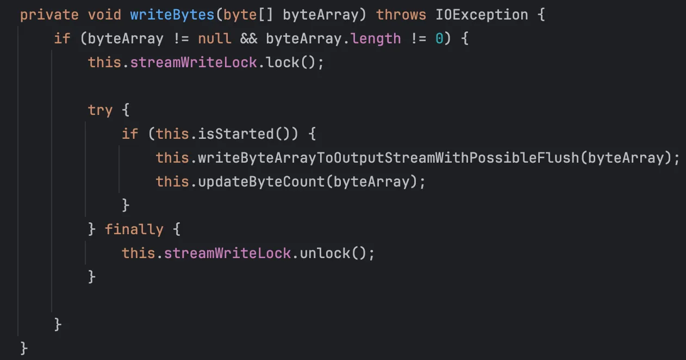

위 사진은 Slf4j의 구현체인 `LogBack`의 구현된 내용이다. (Slf4j는 인터페이스이다!)


System.out.println은 동기 방식으로 동작하지만, LogBack의 경우 비동기 방식으로 동작하여 더욱 효율적인 것은 사실이나, 실제로 락을 잡으며 버퍼에 쓰는 과정이 포함되어 있어 어느 정도의 오버헤드가 있을 것이라 생각하였다.

또한, 세션 id를 읽어오는 과정에서도 객체에 접근하는 것이기 때문에 조금의 시간이 들 것이라 생각하였다.

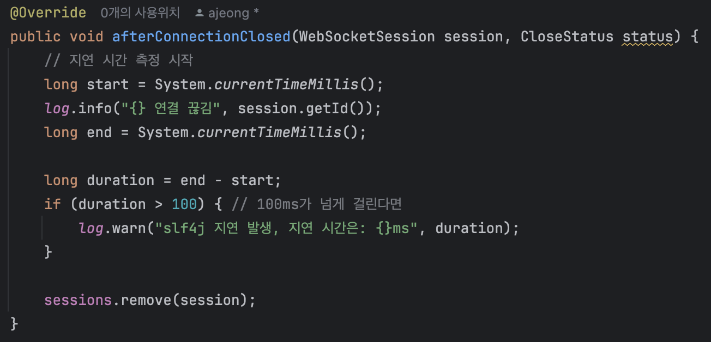

따라서 다음과 같이 로그를 찍는 시간을 두어 로그 지연 시간을 측정하였다.

그러나 첫 로그를 찍은 시간과 마지막 로그 사이에 100ms 이상의 차이를 보이는 로그는 없었다.

따라서 로그는 300ms에 다다르는 지연이 발생하는 것은 직접적인 원인이 아니라고 판단하게 되었다.

<br/>

### ✨ 가설 8: TLAB 추가 할당으로 인한 지연이 발생할 것이다. (거짓)

지금까지의 상황 종합 시 GC는 그대로이며, 객체 생명 주기가 길어져 Eden Space -> Survivor Space로의 이동이 많아졌다.

여기서 TLAB이란 `Thread-Local Allocation Buffer`의 약자로, 각 스레드별 메모리를 할당할 공간을 정해둔 것이다.

TLAB이 가득 차게 되면 전역 락을 잡고, Eden 영역에서 추가적으로 할당을 받아야 한다.

Poller가 하나일 때는 스레드가 TLAB을 사용하고, 다시 할당하는 과정이 천천히 발생하였는데, 두 개로 늘어나며 TLAB 추가 요청이 동시다발적으로 짧은 기간 내 몰리며 Race Condition 상태가 되었다고 생각하였다.

특히, 메모리의 전체적인 사용량은 비슷한데 단기적으로 사용량이 들쑥날쑥하다는 점에 의해 가설에 힘을 싣게 되었다.

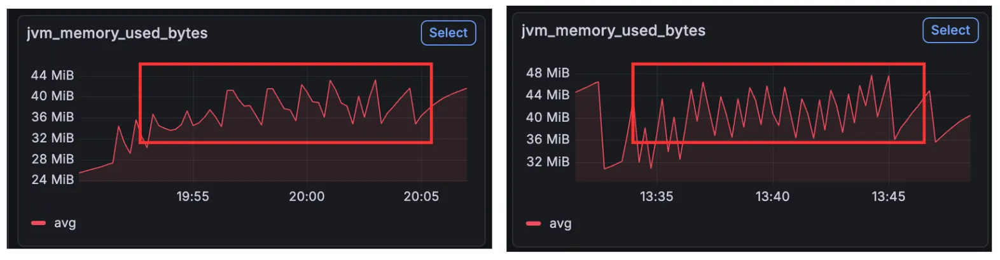

그런데 조금만 생각해 보면 이런 의문이 들 수 있을 것이다.

그렇다면 Eden 영역이 급격하게 뛰었나?

모니터링 지표에 따르면 아니다.

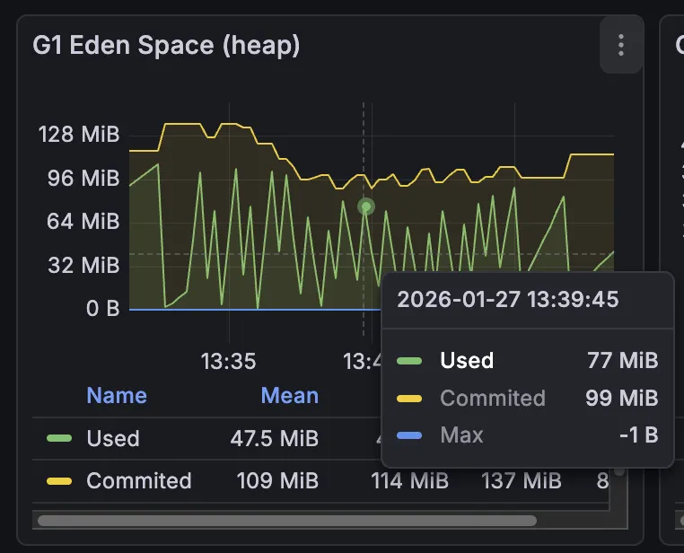

톱니바퀴 모형으로 들쭉날쭉한 것은 보이지만, 훅 튀는 시간대에 Eden Space는 오히려 다른 시기와 다를 바가 없었다.

이를 더 확실하게 증명하기 위해, TLAB의 크기를 각각 `1k`, `2M`으로 바꾸어 테스트를 수행했다.

만약 1K에서는 더 많이 튀고, 2M에서는 덜 튄다면 해당 가설이 참일 확률이 올라간다고 생각하였다.

하지만 1K와 2M의 테스트 결과는 큰 차이가 없었다.

Eden 영역이 급증하지 않은 이유를 설명하지 못하였으며, 테스트 결과 또한 상황과 일치하지 않았으므로 해당 가설 또한 거짓임을 알 수 있다.

<br/>

### ✨ 가설 9: 애플리케이션 계층에서의 락 경합으로 인해 지연이 발생하는 것이다. (거짓)

대략적으로 상황을 보자면 다음과 같다.

wakeup()을 받고 깨어난 Poller는 Key 제거, 캐시 삭제, 소켓 close() 등의 일을 처리한다.

이때 모두 락/동기화를 활용하게 된다. 따라서 락 경합에 의해 지연이 발생한다고 생각하였다.

<br/>

이를 증명하기 위해, Poller를 3개/4개로 늘려 테스트를 진행해 보았다.

이 가설이 맞다면, Poller의 개수와 정비례로 지연 시간이 늘어날 것이다. 락 경합이 심해질 것이라 생각했기 때문이다.

그러나 Poller가 3개/4개일 때 여전히 Max 값이 300ms 근처에서 튀고 있는 것을 확인할 수 있었다.

이 뿐만 아니라, CPU 사용량을 확인했을 때 (process_cpu_usage / system_cpu_usage로 확인) Poller가 한 개였을 때에 비해 오히려 줄어드는 결과를 확인할 수 있었다.

- `process_cpu_usage`: JVM 내에서 사용하는 CPU 사용량
- `system_cpu_usgae`: 전체 CPU 사용량

`process_cpu_usage / system_cpu_usage`를 통해 둘 사이의 간극 비율을 확인할 수 있다. 이것이 크다면 system이 큰데 process가 상대적으로 낮다는 소리이므로 OS 커널에 경합이 생겼다고 예측할 수 있을 것이다.

만약 락 경합이 진짜였다면 다음과 같은 두 가지 상황 중 하나였을 것이다.

1. 스핀락 -> CPU 사용량이 올라간다.
2. context-switching -> CPU 사용량이 줄어들 것이다.


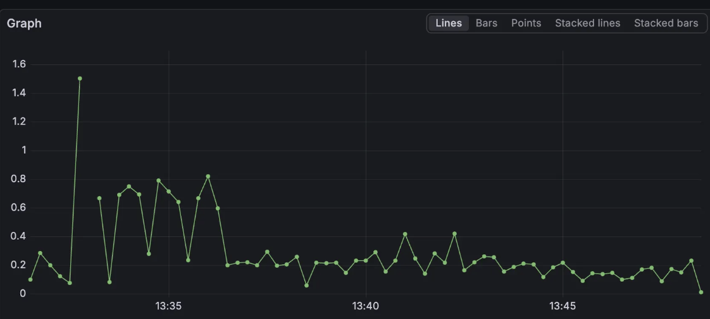

하지만 스핀락이라기에는 CPU 사용량이 올라가지 않았으므로 거짓이다.

context switching 또한 거짓임을 알 수 있는데, 이것이 사실이 되기 위해서는 system cpu와 process cpu 사이의 간극이 올라가야 하기 때문이다.
<br/> -> 시스템은 일하는데 프로세스는 놀기 때문이다.

따라서 해당 가설 또한 거짓임을 알 수 있었다.

<br/>

위 가설들로 보았을 때, 애플리케이션 내부에서 발생하는 문제는 아닌 것 같았다. 왜냐하면 CPU 사용량이 변화하지도 않았으며, GC, 버퍼 등의 주요 지표들에도 유의미한 결과를 찾지 못했기 때문이다.

따라서, 네트워크, OS 등 애플리케이션이 아닌 계층에 초점을 두고자 했다.

<br/>

### ✨ 가설 10: 4-way handshake 과정 중 지연이 발생했을 것이다.

#### 💡 4-way handshake 과정

기존보다 더 빠르게 생성이 되며, 빠르게 close()를 호출하고 있는 것을 확인했다. 이에 의해 네트워크 패킷이 전보다 더 많이 이동하므로 이 과정에서 지연이 발생했을 것이라 예측했다.

실제로 간단하게 4-way handshake 과정을 살펴보면 다음과 같다.


[[사진 출처](https://bangu4.tistory.com/74)]

1. 클라이언트 -> 서버: 연결 종료(FIN) 플래그 전송
2. FIN 플래그를 받은 서버는 ACK를 보내고, 자신의 통신이 끝날 때까지 기다린다. 이때 버퍼에 쓰기 작업이 남았다면 쓰는 과정을 거친다.
3. 서버가 연결을 종료할 준비가 되면 서버 -> 클라이언트로 FIN 플래그를 전송한다.
4. 클라이언트 -> 서버로 ACK 메시지를 보낸다.

3-Way handshake는 TCP의 연결을 초기화 할 때 사용한다면, 4-Way handshake는 세션을 종료하기 위해 수행되는 절차이다.

<br/>

원래 애플리케이션이 write()를 호출해서 곧장 데이터가 이동하는 것이 아니다. 오버헤드를 줄이기 위해 버퍼를 이용하는데, 이때 우선적으로 커널의 메모리 공간인 `송신 버퍼`에 복사만 하게 되는 것이다.

이후 커널이 네트워크 상황에 맞춰 이 버퍼에 쌓인 데이터를 조금씩 패킷으로 옮기게 된다.

<br/>

여기서 `송신 버퍼(Send Buffer)`란 소켓 하나당 할당된 커널 내 메모리 공간으로, 애플리케이션에서 write()를 호출한 데이터가 임시로 머무는 공간을 말한다.

서버는 데이터 유실을 막기 위해 클라이언트 측에서 데이터를 잘 받았다는 ACK 응답이 오기 전까지는 송신 버퍼를 비우지 않고 대기한다.

이 과정에서 클라이언트에서 사용되고 있는 `DelayedACKs` 옵션에 의해 ACK 응답이 지연되어서 한 번에 오고, 서버는 응답을 늦게 받아 송신 버퍼를 비우지 못하고 기다리는 것에 의해 응답 시간 지연 문제가 발생한다고 판단하였다.

<br/>

#### 💡 테스트 수행 - SO_LINGER

이를 확실시하기 위해, `SO_LINGER` 옵션을 켜고 테스트를 수행했다.

여기서 `SO_LINGER` 옵션은 C에서 제공되는 TCP 소켓 옵션으로, 톰캣 설정 시에는 `soLingerOn`으로 나타나게 된다.

원래는 클라이언트의 ACK 응답을 받은 후 끝냈다면, 해당 옵션을 켜게 되면 클라이언트의 ACK 응답을 받지 않고 곧장 종료해버린다.

따라서 수행 결과에서 max latency가 눈에 띄게 줄어든다면 송신 버퍼에서 기다리는 과정에서 지연이 발생했다는 뜻이므로 가설이 참임을 확신할 수 있는 것이다.

<br/>

#### 💡 테스트 결과

다음은 테스트 결과이다.

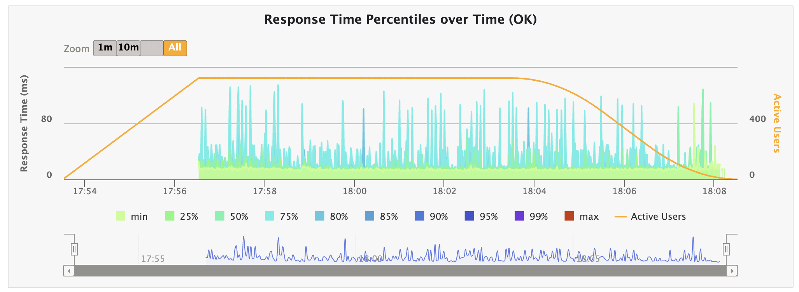

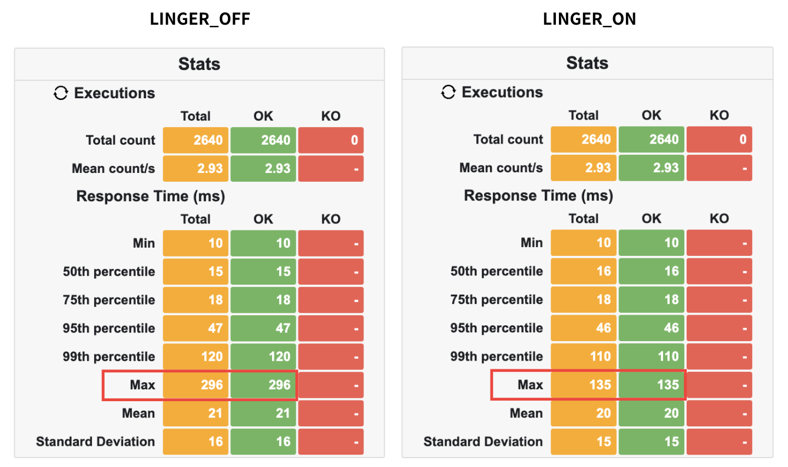

Max Latency 수치가 잡힌 것을 알 수 있다.

<br/>

다음은 주요 지표이다.

- `TCPAbortOnLinger`: SO_LINGER 설정에 의해 소켓이 강제 종료된 횟수
- `DelayedACKs`: ACK를 즉시 보내지 않고 타이머가 만료될 때까지 기다렸다가 보낸 횟수
- `TCPAbortOnData`: 데이터를 보내는 중 연결이 예기치 않게 끊긴 소켓의 수 
- `TW(TimeWait)`: 정상 종료 절차(FIN)를 거친 소켓 수
- `TCPTimeouts`: 재전송 타임아웃

<br/>

실제로 `netstat`로 확인 결과, 변화한 주요 지표의 수치는 다음과 같다.

| 지표 | 전 | 후 | 변화 |
|-----|---|----|-----|
| TCPAbortOnLinger | 3,249 | 3,337 | +88 |
| DelayedACKs | 33,100 | 33,304 | +204 |
| TCPAbortOnData | 11,527 | 11,873 | +346 |
| TW(TimeWait) | 187,797 | 192,043 | +4,246 |
| TCPTimeouts | 135 | 135 | 0 |

여기서 `DelayedACKs`가 204개로, 실제로 DelayedACKs가 일어나고 있음을 알 수 있으며, `TCPAbortOnData` 또한 346개나 증가했음을 확인할 수 있었다.

TCPTimeouts는 저번 글(Multi-Poller 도입)에서와 마찬가지로 변화하지 않았다. 지연이 문제일 뿐, 재전송은 일어나지 않았기 때문이다.

더욱 정확한 비교를 위해 Poller가 하나일 때도 같은 환경에서 테스트를 진행하였다. (SO_LINGER 옵션 ON)

| 지표 | Poller 1개 | Poller 2개 | 변화 |
|-----|---|----|-----|
| DelayedACKs | 351 | 204 | Poller가 한 개일 때 지연 ACK가 더 빈번 |
| TCPAbortOnData | 13,431 | 14,159 | Poller 2개일 때 빈번  |
| TW(TimeWait) | 4,276 | 4,246 | 차이 X |

여기서 TCPAbortOnData는 Poller 1개와 비교해서 **<U>5.4%</U>** 늘어난 반면, DelayedACKs는 **<U>41.9%</U>** 줄어든 이유는 무엇일까?

`TCPAbortOnData`는 데이터를 보내는 중 연결이 예기치 않게 끊긴 소켓의 수로, close()를 하려는데 아직 수신 버퍼(Receive Buffer)에 데이터가 남아 있을 때 (읽어야 하는 패킷을 읽지 못하고 close()를 호출한 경우) 발생한다.

Poller가 2개가 되며 요청을 처리하는 속도가 빨라지게 되고, close()가 빠르게 호출되며 클라이언트가 보낸 소켓을 끝까지 처리하지 못한 채 다음 패킷을 처리 해야 하는 상황이 발생했음을 보여준다.

<br/>

그렇다면 왜 DelayedACKs는 줄어들었을까?

이건 당연한 소리일지도 모르겠지만, DelayedACKs는 어느 정도 패킷이 모이면 한 번에 보낼 수 있도록 해 주는 역할을 한다. Poller가 1개에서 2개로 변화하며, 이전보다 빠르게 패킷이 찼을 것이다. 따라서 어느 정도 기다린 후 보내는 패킷의 수가 줄어든 것이다.


## 🫧 해결 방법

현재 4-way handshake 과정 중 서버가 버퍼에 데이터를 쓰고 다시 ACK 과정을 받기까지의 지연이 있다는 사실을 알았다.

실제로 `SO_LINGER` 옵션을 사용해 ACK 응답을 받지 않아도 대기 없이 끝낼 수 있도록 바꾼 결과, Max Latency가 잡힘을 확인할 수 있었다.

그런데 `SO_LINGER`의 경우 ACK를 받지 않기 때문에 빠르지만 데이터가 유실될 위험이 있다.

그렇다면 SO_LINGER 옵션을 사용하지 않고, 근본적으로 패킷의 수를 천천히 처리하거나 줄일 수 있는 방법이 있는지 살펴보고자 했다.

실제로, 테스트하면서 본 결과 `TCPAbortOnData`의 수치가 높게 나옴을 확인할 수 있었다.

이는 데이터를 보내는 중 연결이 예기치 않게 끊긴 소켓의 수로, 너무 빠르게 close()를 해 버려 생기는 문제로도 해석할 수 있을 것이다.

다음은 실제 부하 테스트에서 사용된 코드이다.

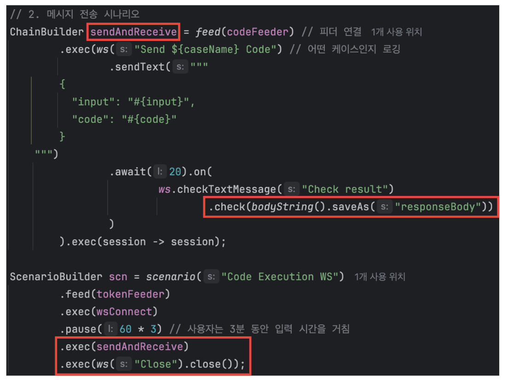

`sendAndReceive` 코드 호출 이후 어떠한 응답이라도 온다면 성공으로 간주하고 바로 close()를 호출하는 부분이 문제였다.

따라서 패킷을 기다리는 시간을 최대한 짧게 줄임으로써 문제를 해결할 수 있을 것이라 생각하였다.

1. 어느 정도 대기 후 close() 호출하기
2. SO_LINGER 옵션 활용
3. 클라이언트의 DelayedACKs 옵션 끄기
4. 응답 전송 시 비동기&콜백으로 전환

1번의 경우 테스트 코드를 수정하면 되는 일이다. 그러나 이는 사용자의 환경을 건드는 일이므로, 올바른 수정 방법이라고 생각하지 않았다. 3번 또한 마찬가지이다.

2번 또한 앞서 말한 것처럼 데이터가 유실되므로 적절하지 않다.

따라서 4번, 응답 전송 시 **<U>비동기&콜백 방식으로 전환</U>**하여 지연을 줄이고자 했다.

<br/>

전송 과정 자체를 비동기로 전환했기 때문에 DelayedACKs로 요청이 지연되어도 스레드는 다른 일을 할 수 있을 것이라고 생각했기 때문이다.

콜백의 경우도 마찬가지로, 응답을 완전히 받고 나서 sendMessage를 보내기 때문에 ACK를 기다리는 시간 중 버퍼에 쓰는 시간을 줄일 수 있다고 생각하였다.

이를 통해 4-way handshake 과정에서 서버가 FIN을 보낸 이후 다시 ACK를 받기까지의 과정에 드는 지연 시간을 줄이고자 했다.

## 🫧 해결 (테스트 결과)

동기적으로 구현되어 있던 sendMessage 부분을 비동기 콜백 함수로 교체한 코드이다.

```java
@Override
protected void handleTextMessage(WebSocketSession session, TextMessage message) {
    try {
        String payload = message.getPayload();
         CodeRequestSocket dto = mapper.readValue(payload, CodeRequestSocket.class);

        // 비동기 처리
        CompletableFuture.supplyAsync(() -> {
            try {
                return codeExecutionService.run(dto.code(), dto.input()).get();
            } catch (Exception e) {
                throw new RuntimeException(e);
            }
        }).thenAccept(result -> {
            // 2. 비즈니스 로직 완료 후 실행될 콜백 블록
            try {
                // 세션 상태 확인
                if (!session.isOpen()) {
                    log.error("ERROR: 세션이 이미 닫혀 있습니다. (SessionID: {})", session.getId());
                    return;
                }

                // 성공 응답 생성 및 전송
                String jsonResponse = mapper.writeValueAsString(ResponseUtil.success(result));
                session.sendMessage(new TextMessage(jsonResponse));

            } catch (Exception e) {
                log.error("메시지 전송 중 오류 발생", e);
            }
        });

    } catch (Exception e) {
        log.error("초기 데이터 파싱 오류", e);
    }
}
```

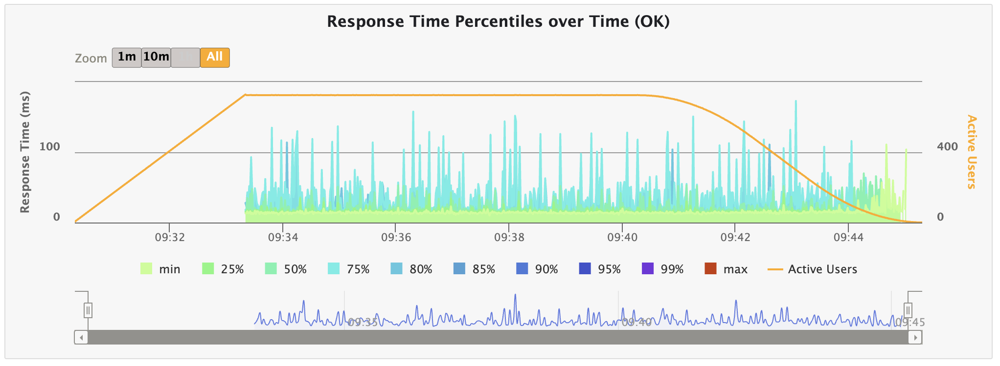

테스트 결과, close() 시 Max Latency가 튀는 현상을 잡을 수 있었다.

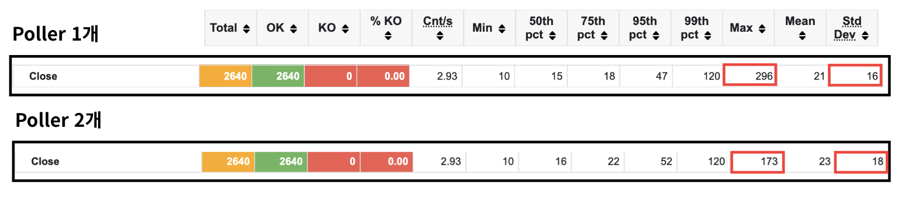

지표로 보았을 때, Max Latency가 296ms -> 173ms로, **<U>41.5% 감소</U>**하였음을 증명할 수 있었다.

<br/>

또한, `netStat`으로 지표를 다시 확인해 보았다. 이는 각각 테스트한 결과로, 둘의 차이를 계산하여 작성한 내용이다.

| 지표 | 도입 전 | 도입 후 | 변화 |
|-----|---|----|-----|
| TCPAbortOnLinger | 0 | 89 | 도입 후 손실되는 패킷 발생 |
| DelayedACKs | 317 | 203 | 도입 후 지연 발생 빈도 낮아짐 |
| TCPAbortOnData | 1,653 | 1,600 | 여전히 둘다 수신 버퍼 병목 발생 |
| TW(TimeWait) | 4,162 | 4,184 | 도입 후 처리 속도가 미세하게 빨라짐 |
| TCPTimeouts | 0 | 0 | 둘다 타임아웃 X |
| TCPOrigDataSent | 77,575 | 81,816 | 도입 후 전송 시도량 5.5% 증가 |
| TCPDelivered | 82,587 | 86,817 | 도입 후 처리량 5.1% 증가 |
| DelayedACKLost | 81 | 53 | 도입 후 네트워크 손실/처리량 안정화 |

- `TCPOrigDataSent`: 서버가 클라이언트로 전송한 순수 데이터 패킷 수
- `TCPDelivered`: 최종적으로 클라이언트와 응답에 성공한 데이터 패킷 수 (유효 처리량)
- `DelayedACKLost`: Delayed ACK 타이머 작동 중 패킷 손실 또는 추적에 실패한 횟수. 적을수록 네트워크가 안정하다는 뜻이다.

이를 토대로, 병목을 해결함으로써 5.1%의 처리량이 증가하였지만 89건의 강제 종료되는 패킷이 발생하였음을 알 수 있었다.

사용자 중 0.1는 오류인 상태로 도착하는 것이다.

<br/>

코드 실행 API의 경우 사용자가 코드를 돌리면 그 내용을 믿고, 이후 제출 버튼을 누르기 때문에 0.1% 오차도 큰 값이라 느껴질 것 같았다.

그러나 이 부분을 수정하기 위해서는 지연 시간이 길어질 수밖에 없는데, 이는 실시간성을 보장하지 못하는 요인으로 생각되었다.

이를 어떤 식으로 해결하면 좋을지 생각하다가, 현재 문제가 되고 있는 close() 호출에 1초 지연을 두고 닫기로 하였다.

<br/>

실제로 89건이었던 `TCPAbortOnLinger`이 0건으로 줄어들었으며, `TCPAbortOnData`의 값이 1,600 -> 1,477으로 중간에 데이터를 보내는 중 연결이 예기치 않게 끊긴 소켓의 수 또한 줄었음을 알 수 있다.

그러나 1초 대기 후 close()에 의해 동시 접속 사용자 수가 전보다 3명 정도가 늘었으며, Poller 1개일 때 보였던 스파이크 현상이 그대로 다시 나타남을 확인할 수 있었다.

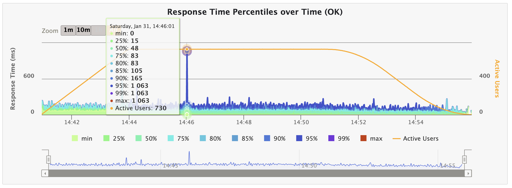

이는 현재 상황이 과부하 상태에 놓여있음을 알 수 있다.

사실 헷갈려서 1초 대기가 아닌 1분 대기로 바꿨었는데, 이때 500 에러가... 났다.

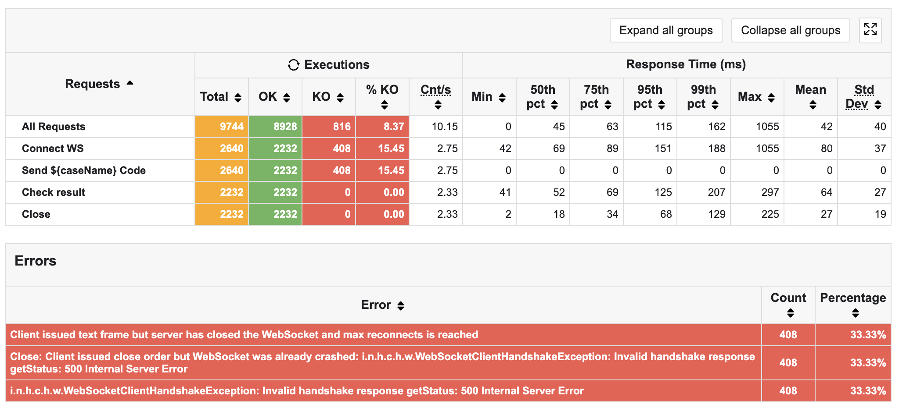

이는 추후 해결 해야 할 문제로 남겨두겠다. (다음 글에서 다룰 예정!)

<br/>

그래서 close() 전 대기 시간을 0.1초로 바꾸어 테스트를 진행했는데, 다음과 같은 결과를 얻을 수 있었다.

| 지표 | 지연 X | 0.1초 지연 |
|-----|---|----|
| TCPAbortOnLinger | 89 | 0 |
| DelayedACKs | 203 | 189 |
| TCPAbortOnData | 1,600 | 135 |
| TW(TimeWait) | 4,184 | 4,302 |
| TCPTimeouts | 0 | 5 |
| TCPDelivered | 86,817 | 89,791 |
| DelayedACKLost | 53 | 9 |

특히, `TCPAbortOnData`가 1,600 -> 135로 데이터 손실을 **<U>91% 감소</U>**시킬 수 있었다.


그러나 전체적으로 응답의 속도는 늘어남을 확인할 수 있는데, 이는 `동시 접속자 수가 늘어 병목이 심화`되었거나 `버퍼에 쓰는 시간에 의한 지연`을 이유로 생각하고 있다.

<br/>

close()는 프론트 측에서 호출하므로 웹사이트 구현 시 0.1초만이라도 지연을 시킨다면 조금 더 안정적인 서버로 동작할 수 있을 것이다.

지연 시간이 눈에 띌 정도로 늘어나지 않았고, 안정성이 더 중요시 되어야 한다고 생각했기 때문에 추후 실서비스 활용 시 프론트엔드 측과 협업하여 의도적인 지연 시간을 주어야겠다고 생각했다.

## 🫧 결론

close() 과정에서 Max Latency가 튀는 이유는 4-way handshake 과정에서 지연이 발생했기 때문이었다. 이는 TCP의 동기적 메커니즘에 의해서 발생하는 일로, 서버가 FIN을 보내고 클라이언트의 ACK 응답을 기다리는 과정에서 발생한 일이었다.

문제 상황은 다음 두 가지였다.

- 서버는 버퍼에 남은 데이터를 쓰는 과정에서 지연된다.
- DelayedACKs로 인해 클라이언트에서 보내는 ACK 요청이 지연된다.

이를 `LO_LANGER`를 활용해 ACK 요청을 기다리지 않고 바로 받을 수 있게 테스트하였는데, Max Latency가 잡히며 문제가 해결됨을 알 수 있었다.

그러나 실제로 결과로 오는 json이 일부 유실되는 등 문제가 발생하였다. 이는 가설 검증을 위한 임시 해결책임을 깨닫고, `sendMessage` 함수를 비동기 콜백 함수로 전환하여 Max Latency를 **<U>41.5% 감소</U>**시킬 수 있었다.

하지만 여전히 연결이 중간에 끊기는 데이터가 1,600건이 존재한다는 문제가 있었다. 따라서 close() 호출 전 0.1초의 지연 시간을 두어 `TCPAbortOnData` 값을 135로, **<U>91% 감소</U>**시킬 수 있었다.

<br/>

이번 문제는 애플리케이션 계층에서의 문제라기보다는 네트워크에서의 문제였기 때문에 모니터링으로 관측이 어려웠다.

게다가 핀포인트 또한 너무 무거워서 제대로 사용을 못 했었고... 찾는데 정말정말 힘들었다.

그러나 이 과정을 거치면서 네트워크에서 어떻게 송수신하는지 알게 되었으며, 튀는 문제를 잡을 수 있어서 정말 뿌듯했다.

앞으로 고칠 점은 수도 없이 많지만.. 이렇게 가설을 정의하고 실패하며 문제 범위를 좁혀 나가면 나중에는 안 보고도 찾을 수 있는 날이 오지 않을까(?) 하는 기대가 된다.

## 🫧 아쉬운 점

그러나 여전히 아쉬운 점은 존재한다.

테스트 결과를 다시 확인하자.


응답 시간이 전체적으로 (아주 살짝) 올라갔지만, 표준편차 또한 16 -> 18로 증가했음을 알 수 있었다.

뿐만 아니라, 마지막에 응답했던 0.1%의 패킷 손실 문제 또한 서버 쪽 해결이 아닌 테스트 코드를 수정함으로써 임시방편으로 해결했던 것 같다.

<br/>

그리고 마지막!! 굉장히 심각한 문제.. 500 에러를 수정하도록 해야겠다.

앞으로 이런 문제들을 다시 정의하고 해결하는 과정을 거치며 더욱 안정적인 서버를 구축하고 싶다는 생각이 들었다.


## 🫧 참고 자료
- [4way handshake](https://bangu4.tistory.com/74)
- [소켓 프로그래밍 SO_KEEPALIVE 옵션 사용법/SO_LINGER 옵션 사용법](https://mystyle1057.tistory.com/entry/%EC%86%8C%EC%BC%93-%ED%94%84%EB%A1%9C%EA%B7%B8%EB%9E%98%EB%B0%8D-SOKEEPALIVE-%EC%98%B5%EC%85%98-%EC%82%AC%EC%9A%A9%EB%B2%95SOLINGER-%EC%98%B5%EC%85%98-%EC%82%AC%EC%9A%A9%EB%B2%95)
- [오픈소스 분석 - Tomcat 소켓 I/O 동작 방식 파헤쳐보기(BIO, NIO Connector)](https://ego2-1.tistory.com/30)
- [[네트워크] 3way / 4way Handshake란?](https://bangu4.tistory.com/74)
- [What Is a TLAB or Thread-Local Allocation Buffer in Java?](https://www.baeldung.com/java-jvm-tlab)
- [<백엔드 성능에 영향을 미치는 네트워킹 개념> 성능에 대한 지연된 승인의 효과](https://velog.io/@okorion/%EB%B0%B1%EC%97%94%EB%93%9C-%EC%84%B1%EB%8A%A5%EC%97%90-%EC%98%81%ED%96%A5%EC%9D%84-%EB%AF%B8%EC%B9%98%EB%8A%94-%EB%84%A4%ED%8A%B8%EC%9B%8C%ED%82%B9-%EA%B0%9C%EB%85%90-%EC%84%B1%EB%8A%A5%EC%97%90-%EB%8C%80%ED%95%9C-%EC%A7%80%EC%97%B0%EB%90%9C-%EC%8A%B9%EC%9D%B8%EC%9D%98-%ED%9A%A8%EA%B3%BC)
- [네트워크 엔지니어링 (Network Engineering) 마스터하기! Section 7 백엔드 성능에 영향을 미치는 네트워크 개념](https://velog.io/@dbtjsahr/%EB%84%A4%ED%8A%B8%EC%9B%8C%ED%81%AC-%EC%97%94%EC%A7%80%EB%8B%88%EC%96%B4%EB%A7%81-Network-Engineering-%EB%A7%88%EC%8A%A4%ED%84%B0%ED%95%98%EA%B8%B0-Section-7-%EB%B0%B1%EC%97%94%EB%93%9C-%EC%84%B1%EB%8A%A5%EC%97%90-%EB%AF%B8%EC%B9%98%EB%8A%94-%EB%84%A4%ED%8A%B8%EC%9B%8C%ED%81%AC-%EA%B0%9C%EB%85%90)