> 들어가기 전에 앞서, 해당 부분은 제 지식과 참고 자료를 활용하여 정리한 것이므로 틀린 부분이 있을 수도 있다는 말씀을 드립니다.

## 🫧 문제 1: 자원 부족

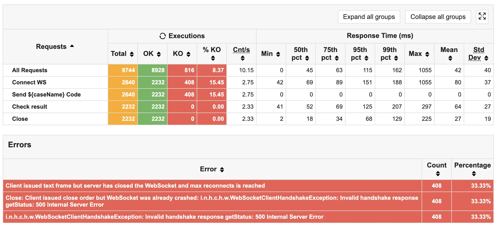

[저번 글](https://ajung7038.github.io/performance/Performance-%EB%B9%84%EB%8F%99%EA%B8%B0-%EC%BD%9C%EB%B0%B1-%EA%B8%B0%EB%B0%98-Max-Latency-41.5-%EA%B0%9C%EC%84%A0-(4-way-handshake-%EB%B3%91%EB%AA%A9-%ED%95%B4%EC%86%8C)/)에서, 문제를 찾기 위해 여러 테스트를 수행하던 중, 오타로 인해 1초 지연이 아닌 1분 지연 후 close()를 수행하는 테스트를 돌린 적이 있다.

이후 결과를 확인하였는데, 위 사진처럼 응답의 **<U>15.5%</U>**가 실패한 것이다.

연결 시간을 1분 더 늘렸더니 동시 사용자 수가 0.1초 지연 시간에 비해 726명 -> 965명으로 늘어나며 서버가 오류를 뱉고 있는 것이다.

<br/>

코드 실행 API의 특성상, 한 번 WS 연결 이후 지속적으로 사용자는 코드를 실행할 수 있다. 여러 번의 API 호출 사이에 분명 사용자가 코드를 수정할 수 있을 것이라 생각하였고, 이 과정에서 테스트를 위해 임의로 둔 3분의 지연 시간보다 지연이 더 될 수도 있다고 생각하였다.

그렇게 된다면, 사용자가 4분 동안 코드를 수정하며 웹소켓 연결만 잡아두고 있다면 반드시 위 문제 상황처럼 오류가 발생할 것이라고 생각했다.

따라서 해당 부분이 위험하다고 판단하게 되었다.
<br/>
(물론 서버가 상황을 정상적으로 처리하지 못하기 때문에 위험하다는 사실을 알고 있다.)

<br/>

해당 내용을 더 자세히 보도록 하자.

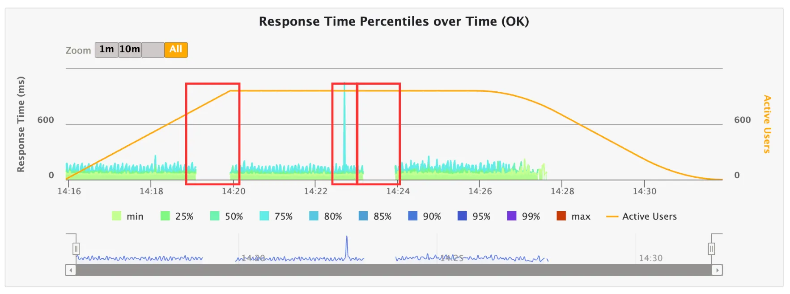

다음은 응답 결과이다. 사진처럼 중간중간 처리를 못하고 있다.

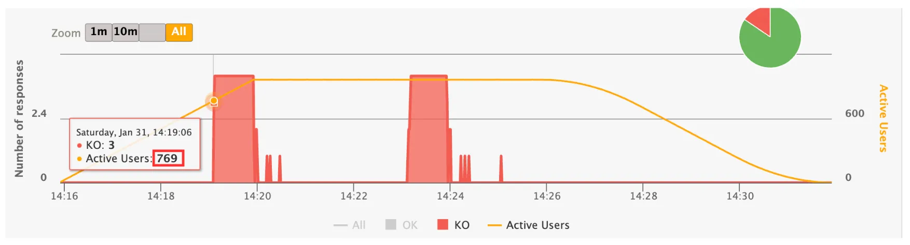

특히, 위 사진을 보면 서버가 뭉텅이로 오류를 내뱉고 있음을 알 수 있다.

이를 통해 우선적으로 리소스가 부족한 것이라는 생각이 들었다. Connect WS조차 되지 않으므로 스레드가 부족하여 연결 자체가 성립되지 않는다고 생각했기 때문이다.

### ✨ 가설 1: FD 수가 부족하여 서버가 요청을 처리하지 못할 것이다. (거짓)

모든 환경은 똑같았지만 0초 대기 → 1분 대기 후 close()를 호출하는 과정에서 문제가 발생하였으므로 그 안에 사용자 수가 늘어 WS 연결의 한계에 부딪혔을 것이라 생각했다.

오류 코드를 보면 다음과 같다.

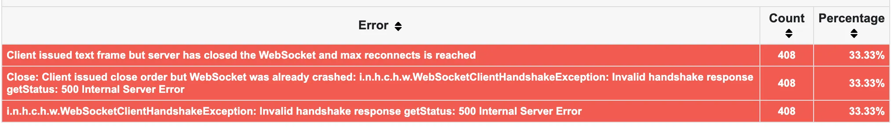

- `500 Internal Server Error`
    - 클라이언트가 웹소켓 연결을 시도했으나 서버가 500 에러를 뱉음
    - 서버가 Handshake 과정에서 응답을 주지 못함
- `WebSocketClientHandshakeException`
    - Handshake를 시도했으나 서버가 500 응답을 보냄
    - **Connect WS 과정**에서 오류 발생
- `max reconnects is reached`
    - 재연결을 시도했지만, 최대 재시도 횟수에 다다를 때까지 서버가 응답을 하지 않음
    - **Send Message 과정**에서 오류 발생

어떠한 이유로 서버가 일을 처리할 수 없는 상태가 되었고, 이로 인해 Handshake에 실패하였으며,  재연결 시에도 오류가 발생한 것으로 해석할 수 있다.

또한, 모두 33.3%로 동일한 비율을 보이므로 한 번의 연결에 세 개가 한 번에 문제가 터져 문제가 발생한 것으로 예측할 수 있다.

<br/>

그러나, 실제 서버 로그 확인 결과, 모니터링이 끊기고 연결조차 뭉텅이로 끊기던 시점에 로그 또한 존재하지 않음을 알 수 있다.

만약 FD 문제였더라면 Too Many Open File 오류가 떴을 것이다. 그러나 해당 시간대에 로그는 찍혀 있지 않았다.

그렇지만 로그 자체도 FD 연결을 소모하므로 **로그가 없어도 FD 부족일 수 있다는 가능성**을 열어두어야 했다.

<br/>

이를 증명하기 위해 테스트를 돌려보며 실제 문제가 되는 지점에서 실시간으로 fd 사용량을 확인해 보았다.

`ulimit -n`을 통해 FD의 최대 개수를 확인한 결과 1,024이며, 실제 찍힌 값은 **<U>최대 786</U>**임을 확인할 수 있었다.

따라서 가설이 틀렸음을 알 수 있다.

### ✨ 가설 2 : Nginx의 worker_connection 부족으로 인해 서버가 요청을 처리하지 못할 것이다. (참)

가설 1에 의해 서버의 FD는 부족하지 않음을 파악했다.

약 300개 정도로 널널한 FD를 가지고 있음에도 서버가 요청을 받지 못할 이유가 무엇일까 싶었다.

메모리인가 싶어서 메모리 지표, CPU 지표를 보았으나 해당 부분에서 특이점을 발견하지 못했다. 오히려 정상적인 범주 내에서 동작하고 있는 것 같았다.

그래서 서버 앞단에 존재하는 Nginx를 의심하게 되었다.

<br/>

우선적으로 Nginx는 들어오는 요청에 대해 로그를 남긴다.

이를 활용하여 `/var/log/nginx/error.log`를 우선적으로 확인하였다.

만약 정말 Nginx의 문제였다면 error.log에 문제가 드러날 것이라 생각했기 때문이다.

<br/>

실제로 해당 파일에서 다음과 같은 로그가 찍혀 있었다.

> 768 worker_connections are not enough while connecting to upstream

여기서 `worker_connections`는 각 작업자 프로세스가 동시에 처리할 수 있는 최대 연결 수로, 기본값은 512이다.

`nginx.conf`로 확인한 결과, 다음처럼 내 nginx는 동시에 768개까지의 연결을 처리할 수 있도록 되어 있었던 것이었다.

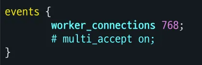


세 번 테스트 모두 **769명 이후부터 요청을 받지 못했다는 것을 보아** nginx에서 요청을 거절해 서버가 500 에러를 뱉고 있었던 것이었다.

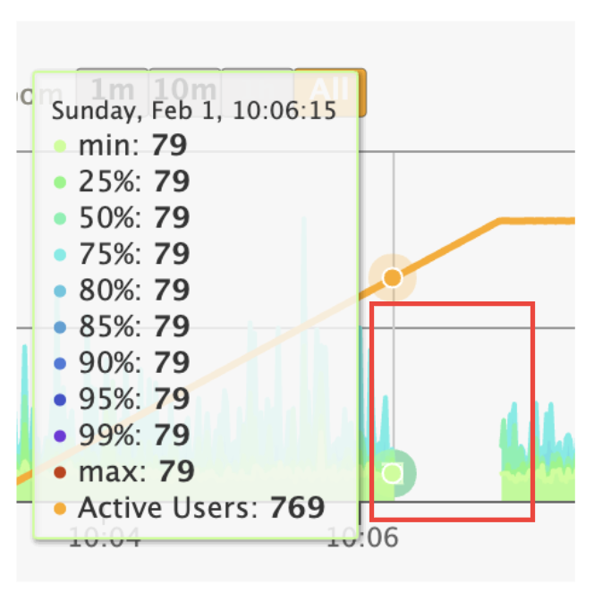

따라서 다음처럼 설정을 변경하였다.

- worker_connections: 4096
- worker_rlimit_nofile : 8192
- ulimit -n(프로세스가 열 수 있는 파일의 최대 개수): 8192

(rlimit_nofile를 맞춰주지 않으면 many open files 에러가 난다.)

## 🫧 테스트 결과

가설이 일치했다.

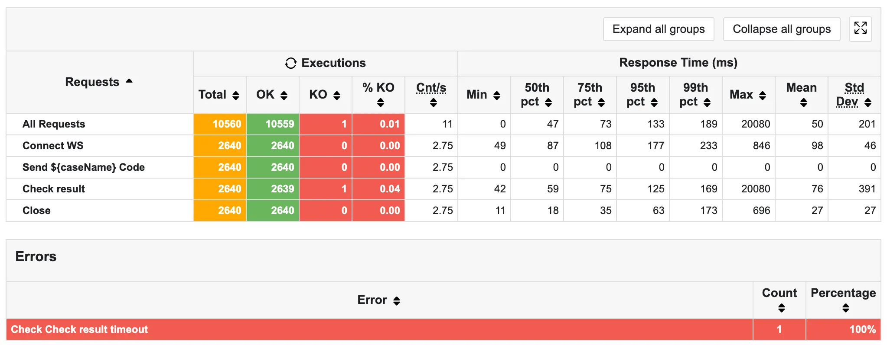

기존 오류 408 → 1로 **<U>99.75%</U>** 감소했음을 알 수 있다.

<br/>

## 🫧 문제 2

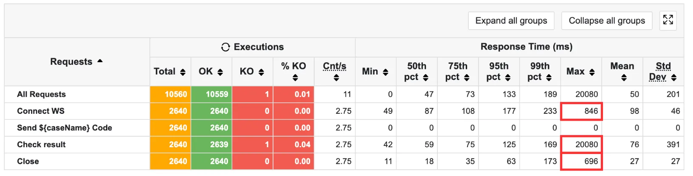

하지만 위 사진처럼 기존에 비해 max 값이 눈에 띄게 증가했으며, 여전히 API 결과를 반환하는 곳에서 **timeout 오류**가 나고 있음을 알 수 있다.

따라서 이런 문제가 왜 발생하는지, 그리고 어떻게 하면 해결할 수 있는지 가설을 세우고 이를 검증하고자 한다.

<br/>

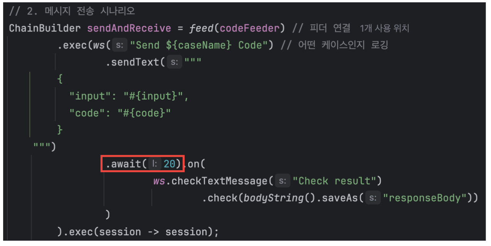

참고로 20초 타임아웃은 메시지를 보내고 응답을 받는 과정에서 나는 것으로 파악했다.

<br/>

### ✨ 가설 1: 스레드 풀 부족이 timeout의 원인일 것이다. (거짓)

이는 스레드 풀 부족을 의심할 수 있는데, close()시 Max Latency 값이 튀는 문제를 수정하는 과정에서 해당 풀 크기를 의심했고, 이것이 추후에 한계로 작동할 수 있겠다는 사실을 알고 있었기 때문이다.

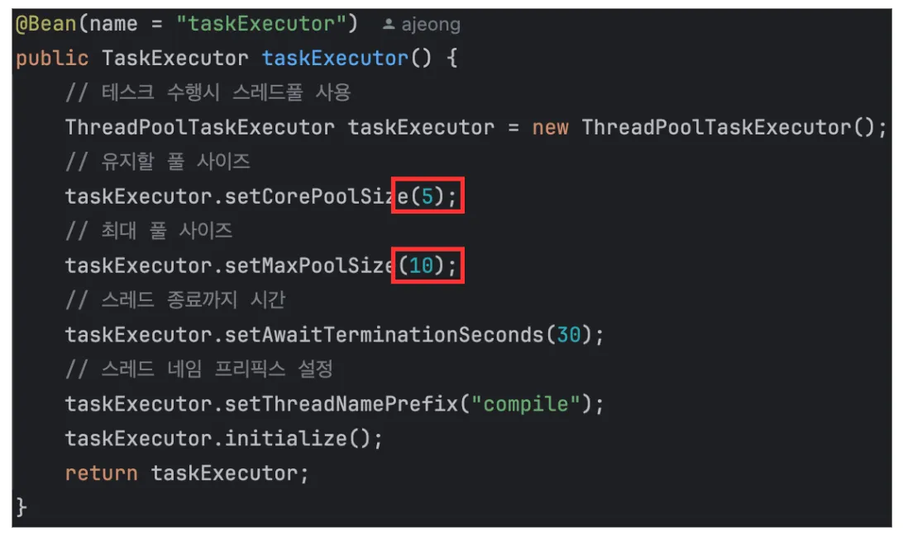

실제로 위 사진은 코드에서 직접 구현한 스레드 풀이다.

이를 증명하기 위해, `setCorePoolSize`는 5에서 150으로, `setCorePoolSize`는 200으로 잡았다.

톰캣의 기본 스레드 풀 사이즈와 맞춰, 비슷하게 수행하고자 하였기 때문이다.

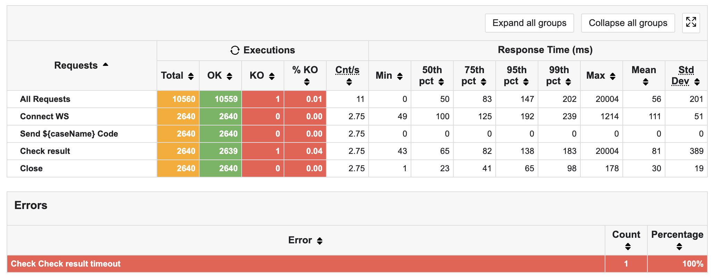

그러나 여전히 1개의 timeout 오류가 발생하고 있었다.

그러면 스레드가 제대로 적용되지 않은 것일까?

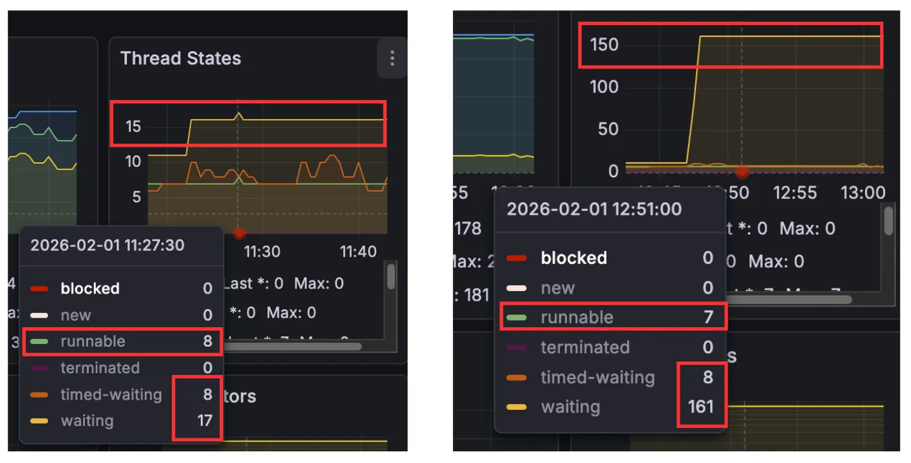

그러나 waiting thread 수가 증가하고 있음을 알 수 있었다.

여전히 runnable, timed-waiting은 비슷한 수순에서 동작하고 있음을 알 수 있다.

<br/>

그렇다면 왜 waiting만 늘어난 것일까?

나는 이것을 다른 병목이 있어 스레드가 Block 되어 있다고 판단하였다.

(이 부분은 추후 알아볼 예정이다.)

이를 통해 내가 직접 구현한 TaskExecutor은 직접적인 병목의 원인이 아님을 알 수 있다.

<br/>

### ✨ 가설 2: CPU 연산 부족으로 연산이 처리되지 못하고 timeout되었을 것이다. (거짓)

CPU가 2코어였기 때문에 연산 과정에서 대기하는 스레드가 많았을 것이라고 생각하였다.

그러나 최대 0.4, 평균 0.2를 유지하는 CPU 사용량을 보아 CPU는 놀고 있으며, I/O 작업 등 다른 작업에서 병목이 발생했음을 알 수 있었다.

CPU가 놀고 있음에도 불구하고 타임아웃이 난다는 것은 I/O Bound가 많다는 말로도 해석될 수 있을 것이다.

<br/>

### ✨ 가설 3: DB 커넥션이 부족해 병목이 발생했을 것이다. (거짓)

현재 테스트 중인 코드 실행 API의 경우 초반에 jwt를 가지고 사용자를 인증하는 로직이 존재한다.

따라서 동시 접속자가 약 200명 이상 늘어남으로써 DB 커넥션이 부족하여 앞단에서 병목이 발생하고 있는 건 아닌지 의심이 들었다.

그러나 `hikaricp_connections_timeout_total` 값이 처음부터 끝까지 0이었다.

커넥션의 경우 jwt 인증 시에만 짧게 쓰고 반납하기 때문에 해당 부분은 문제가 되지 않은 것이었다.

<br/>


### ✨ 가설 4: 제한되지 않은 큐 사이즈로 인해 새로운 스레드가 생성되지 않아 지연이 발생했을 것이다. (거짓)

가설 1에서 이미 스레드 수가 병목이 아님을 알았지만, 여전히 메시지를 보내고 응답 받는 과정에서 스레드 병목이 있을 것이라는 생각을 지울 수 없었다.

너무 과도하게 스레드 수를 늘려 다른 부분에서 병목이 생겨, 제대로 된 테스트가 아닐 수도 있다는 생각도 들었기 때문에 스레드 자원 부족에 관해 다시 한 번 의심하게 되었다.

또한, 메시지를 보내고 응답을 받는 과정에서 타임아웃이 났다는 것은 큐에서 대기하는 시간이 길 것이라 생각했기 때문이다.

따라서 큐 부분을 살펴보았는데, 실제로 스레드 풀의 큐 사이즈가 제한이 되어 있지 않았다.

나는 `ThreadPoolTaskExecutor`를 사용하고 있었는데, 해당 부분을 보면 기본적으로 다음과 같이 표기되어 있다.

```java
private int corePoolSize = 1;
private int maxPoolSize = Integer.MAX_VALUE;
private int queueCapacity = Integer.MAX_VALUE;
```

여기서 corePoolSize, maxPoolSize는 커스텀했지만 queueCapacity는 커스텀하지 않아 여전히 MAX_VALUE 값으로 남아있는 것이었다.

참고로 MAX_VALUE 값은 2^31-1이다. 약 21억...

<br/>

그렇다면 간단하게 ThreadPoolTaskExecutor의 동작 방식을 살펴보자.

1. core 사이즈만큼 스레드를 생성
2. 이후 들어오는 요청은 큐에 넣기
3. 큐가 전부 차게 되면 max 사이즈만큼 스레드 추가 생성

즉, 큐가 차게 되면 max값까지 상승하게 되는데, 큐의 사이즈가 21억이므로 아무리 max값을 늘려도 스레드 사이즈가 변하지 않았던 것이다.

<br/>

따라서 setQueuCapacity(10);을 통해 큐 사이즈에 제한을 걸어두었다.

이를 통해 풀 사이즈가 10을 웃돌아 빠르게 처리될 것으로 예상했다.

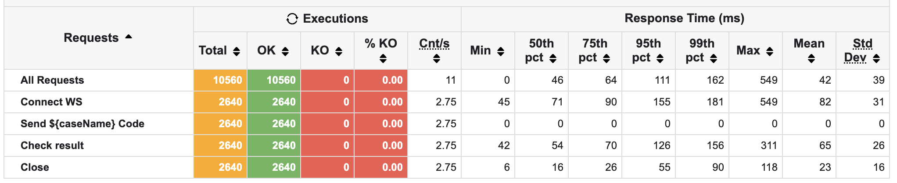

실제로 timeout이 사라진 모습이다!

또한, jdbc 커넥션도 많이 연결되며 더 활발하게 처리하는 모습을 볼 수 있다.

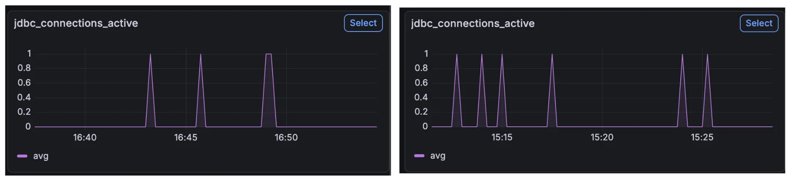

<br/>

그런데 결과가 이상했다. 분명 가설 1(스레드 풀 부족이 timeout의 원인일 것이다)에 따르면 스레드 부족으로 인해 생기는 문제가 아니라고 했었다.

정말로 가설 1이 틀린 걸까?

큐 제한을 통해 스레드의 수가 늘어나 문제를 해결했다고 한다면 분명 가설1에서 어느 정도 효과를 보였어야 하는 것이 아닌가 하는 생각이 들었다.

게다가 큐 제한을 걸고 난 후 아래 오른쪽 사진처럼 `executor_active_threads`가 현저하게 줄어든 모습을 보인다.

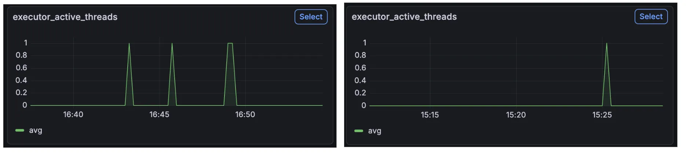

심지어 스레드 수도 비슷했다.

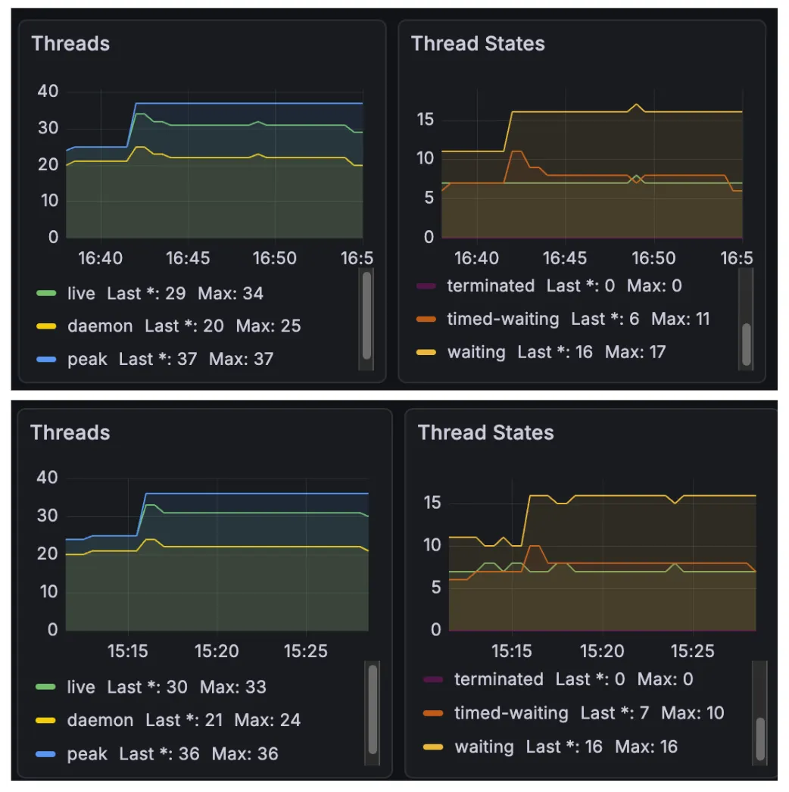

<br/>

만약 스레드가 늘어났기 때문에 해결됐던 문제라면, corePoolSize를 10으로 늘려도 같은 결과가 나올 것으로 기대할 수 있을 것이다.

그러나 **<U>corePoolSize를 10으로 늘렸는데도 timeout</U>**이 나고 있음을 확인할 수 있었다.

실제로 테스트를 두 번 했을 때까지만 해도 모두 timeout이 뜨지 않아 성공한 줄 알았는데..

따라서 처음 진행했던 테스트를 기존 테스트로 인한 오염으로 판단하고 연달아 테스트를 다시 진행하니 곧바로 timeout이 나는 것을 확인하였다.

따라서 스레드 병목에 의한 문제는 아니라고 판단하게 되었다.

<br/>

그런데 해당 가설을 증명하면서 하나 찾은 점이 있는데, 스레드 덤프를 찍었을 때 **톰캣 스레드가 12개로 확장**된다는 것이었다.

전까지만 해도 약 200개의 스레드 덤프를 확인했을 때, 톰캣 스레드는 10개, 내가 만든 ThreadPoolTaskExecutor은 5개로 일을 기다리는 상태였는데 갑자기 큐를 줄이니까 12개로 확장되는 것이 이상했다.

추측하건대, `ThreadPoolTaskExecutor`의 큐 사이즈를 줄임으로써 병목이 발생했고, 밀리고 밀려 앞단 TomcatThreadPool까지 영향을 준 것으로 생각하였다.

이 부분은 추후에 다시 언급할 예정이다!

<br/>

### ✨ 가설 5 : 자원 누수에 의해 timeout 되었을 것이다. (거짓)

#### 💡 가설을 세운 계기

가설 4에 의해 지금까지 했던 테스트 결과가 오염됐을 수도 있겠다는 생각이 들었다.

또한, 8시간 이후 테스트를 돌려본 결과, 아무 조치도 취하지 않은 문제 상황에서도 timeout이 나지 않고 성공한다는 사실을 알았다.

이를 증명하기 위해 여러 번의 테스트를 거쳤다. (각 두 번 이상씩 수행)

- 아무것도 안 건드렸을 때
- 큐 제한
- 스레드 풀 ↑ (150개)
- 스레드 풀 ↑ (10개)
- 비동기 + 큐 제한
- 큐 제한 + 스레드 풀 ↑ (10개)

<br/>

이를 통해 성공은 위에서 언급한 조건이 어떻게 되든 상관 없이, 다음과 같은 환경에서만 나온다는 사실을 알아냈다.

1. 8시간 이후 테스트
2. 서버 재시작 이후 테스트

이를 통해 자원 정리 이후 항상 성공한다는 것을 알아냈고, 자원 부족이 문제의 원인이라고 생각하게 되었다.

<br/>

#### 💡 코드 수정

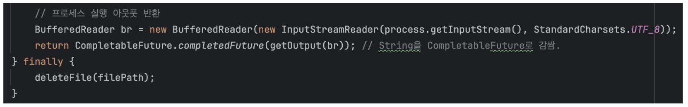

기존 코드는 다음과 같다. 끝날 때 `BufferedReader`을 닫아주지 않는 것이 보인다. 또한, finally에서도 생성된 파일을 삭제만 할 뿐, 생성된 Process를 닫아주지 않는 모습을 보였다.

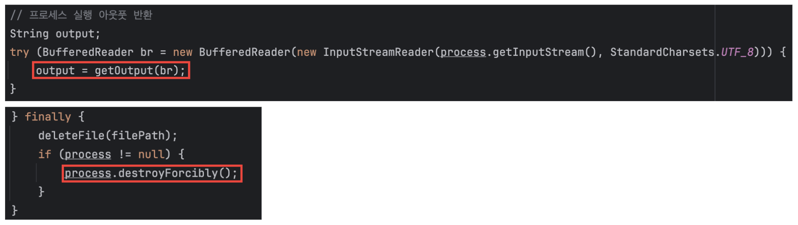

따라서 이 부분을 try-with-recourse 문법을 통해 수정해 주었다.

또한, 마지막 부분을 destroyForcibly()를 통해 프로세스 정리 또한 가능하도록 구현하였다.

<br/>

#### 💡 테스트 결과

그러나 연달아 두 번 수행 시 **<U>여전히 timeout을 내며 실패함</U>**을 알 수 있었다.

그렇다면 덜 닫힌 부분이 있었던 걸까?

<br/>

실제로 리눅스 환경에서 표준 스트림은 다음과 같이 구분된다.

- 표준 입력 스트림 (standard input, stdin)
- 표준 출력 스트림 (standard output, stdout)
- 표준 에러 스트림 (standard error, stderr)


현재 입력 스트림과 출력 스트림은 닫아 주었지만, 에러 스트림의 경우 닫지 않은 것을 확인하였다.

따라서 아래 사진과 같이 ErrorStream 또한 닫아줄 수 있도록 구현하였다.

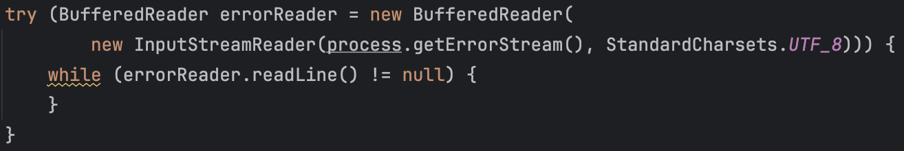

그러나 ErrorStream을 닫아도 여전히 timeout 문제가 발생하였다.

따라서 자원 누수 또한 직접적인 원인이 아님을 알 수 있었다.

<br/>

### ✨ 가설 6: 스레드를 매번 새로 생성하느라 연쇄적으로 지연되어 timeout이 발생했을 것이다.

#### 💡 가설을 세우게 된 계기

가설 1과 4를 통해 스레드 부족 문제가 아님을 알아낼 수 있었다.

그런데 앞서 말했던 것처럼, 가설 4에서 톰캣 스레드가 12개로 확장됨을 알 수 있었다.

이를 통해 이미 톰캣 스레드가 스레드 10개로 아슬아슬하게 부하를 받아내고 있느라 앞에서 `ThreadPoolTaskExecutor` 큐 사이즈를 제한했을 때 톰캣 스레드가 확장된 것이라고 예상할 수 있었다.

<br/>

그러면 다시 내가 어떤 방식으로 처리했는지 확인하도록 하자.

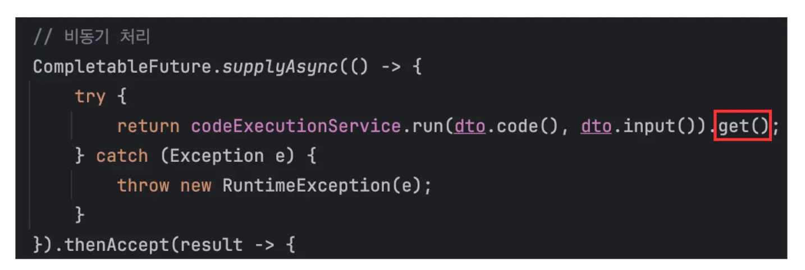

close() 시 max latency가 300ms로 튀는 문제를 해결하면서 해당 부분만 비동기 처리한 것이 원인이었다.

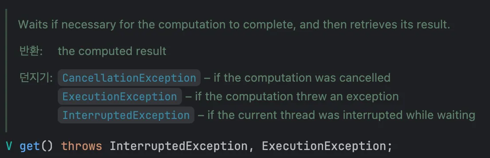

실제로 "필요한 경우 계산이 완료될 때까지 기다렸다가 결과를 가져옵니다"라고 써져 있는 것을 확인할 수 있다.

<br/>

사실은 get() 호출로 인해 톰캣 스레드가 (따로 스레드 풀을 설정하지 않았으므로) 내부 공용 풀인 ForkJoinPool의 스레드를 사용하고, get()에 의해 condeExecutionService.run()이 끝날 때까지 Block되어 있던 것이었다.

(이후 언급 예정이지만, CPU 코어가 2였기 때문에 내 프로젝트에서는 ForkJoinPool을 사용하지 않는다.)

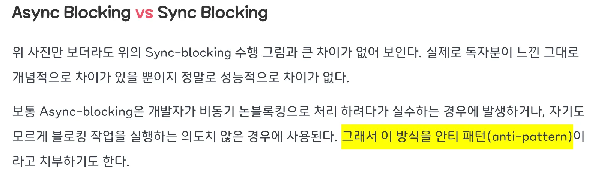

[출처: 완벽히 이해하는 동기/비동기 & 블로킹/논블로킹](https://inpa.tistory.com/entry/%F0%9F%91%A9%E2%80%8D%F0%9F%92%BB-%EB%8F%99%EA%B8%B0%EB%B9%84%EB%8F%99%EA%B8%B0-%EB%B8%94%EB%A1%9C%ED%82%B9%EB%85%BC%EB%B8%94%EB%A1%9C%ED%82%B9-%EA%B0%9C%EB%85%90-%EC%A0%95%EB%A6%AC)

그렇다. 나는 `Async Blocking` 패턴을 사용했다...

심지어 내부적으로 run() 메서드에서도 비동기 처리를 해 놓고 process.waitFor()로 Block되도록 구현해 둔 것이었다.

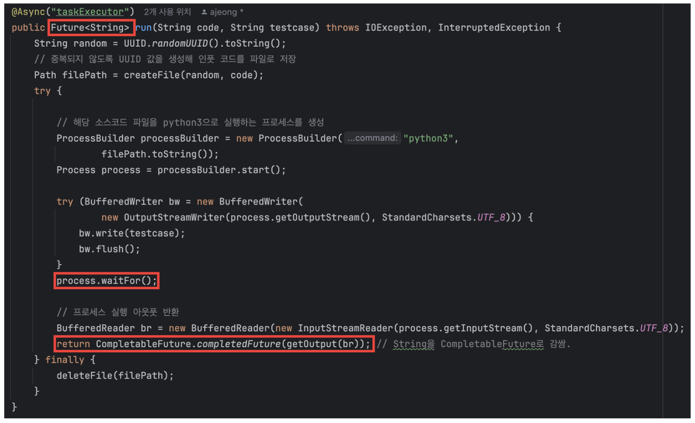

process.waitFor()에 의해 스레드가 비동기 + Blocking 방식으로 동작하게 된다. 또한, 리턴 시에도 CompletableFuture를 주는 것 같지만, 리턴 타입으로 Future()를 주기 때문에 get()으로 기다릴 수밖에 없는 구조였다.

원래 외부에서 호출할 떄 동기적으로 처리되었기 때문에 Future<>로 구현한 것이었는데, 이것이 바뀌면서 해당 부분을 놓친 것이었다.

get() 사용 이유를 언급했듯, 이미 get()으로 결과를 기다리고 있으니 CompletableFuture가 아닌 Future를 써도 문제되지 않겠다고 생각한 것이 원인이었다.

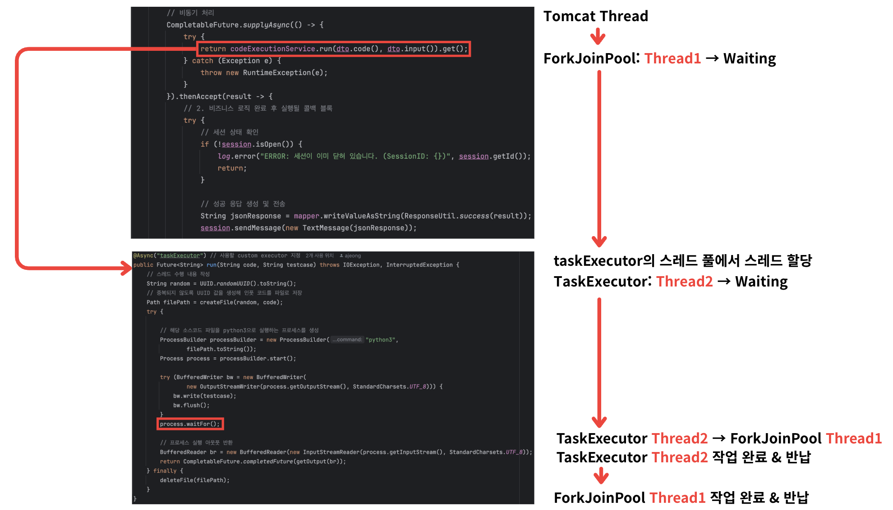

(다시 언급하지만 여기서 ForkJoinPool은 CPU Core 3 이상에서만 적용된다. 내 경우는 스레드 풀을 사용하지 않는다. 이후 언급 예정!)

따라서 다음과 같이 하나의 작업을 처리하기 위해 두 개의 스레드가 block되는 문제가 발생하고 있는 것이다.

<br/>

위 가설이 진짜인지 확인하기 위해 스레드 덤프를 일정 간격으로 떠서 확인한 결과, 아래 사진처럼 하나의 작업에 두 개의 스레드가 블락되고 있음을 확인할 수 있었다.

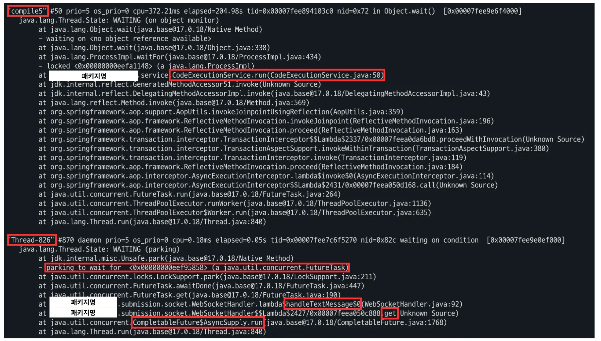

하나는 run()에서 Waiting되어 있고, 아래 하나는 get()에서 Waiting되어 있음을 확인할 수 있다.

<br/>

#### 💡 내부적으로 ForkJoinPool을 사용하지 않는 이유

그런데 여기서 Thread는 뭘까?

compile5라는 이름의 경우 내가 직접 `taskExecutor.setThreadNamePrefix("compile");`로 되어 있어 이것은 내가 만든 스레드 풀임을 알 수 있었다.

코드에서 CompletableFuture를 사용하는데, 이때 따로 스레드 풀 설정을 안 해주어 이것이 ForkJoinPool임이라 짐작했지만, 실제로 ForkJoinPool의 코드를 보니 그것도 아니었다.

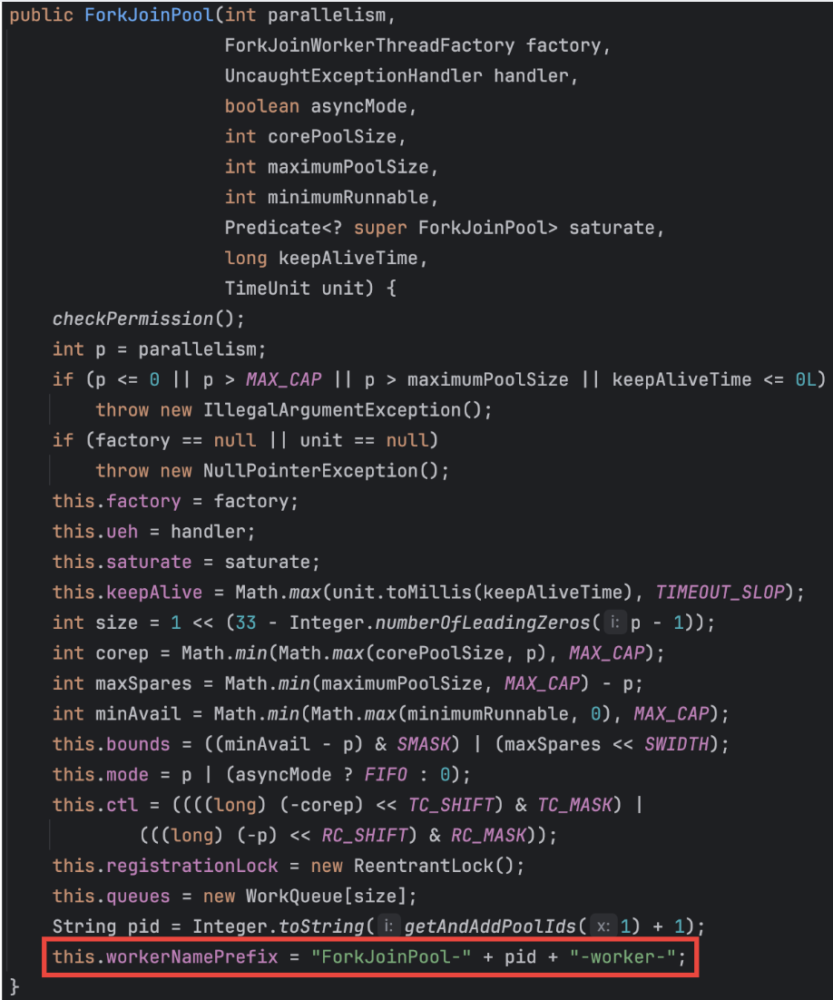

심지어 ForkJoinFool-로 시작하는 스레드는 보이지도 않았다..

그래서 로그로 ForkJoinPool의 core 크기, 작업 중인 스레드, 실행 중인 스레드, 큐에 있는 작업을 찍어보았는데, core 크기만 1이고 나머지는 계속해서 0으로 찍히고 있는 것을 확인할 수 있었다.

즉, ForkJoinPool은 실행되지 않고, 대신 Thread-로 시작하는 다른 스레드가 생기고 있음을 알 수 있다.

게다가 저 Thread-로 시작하는 스레드 또한 compile- 스레드가 Running or waitFor() 메서드에 의해 기다리고 있을 때만 함께 실행되는 것이었다!!

따라서 어떤 연유에서인지 ForkJoinPool은 사용되지 않고, 새로운 스레드가 대신 사용되고 있음을 알 수 있다.

<br/>

이를 알아내기 위해 실제 CompletableFuture 코드를 확인한 결과, 다음과 같은 코드로 동작하고 있었다.

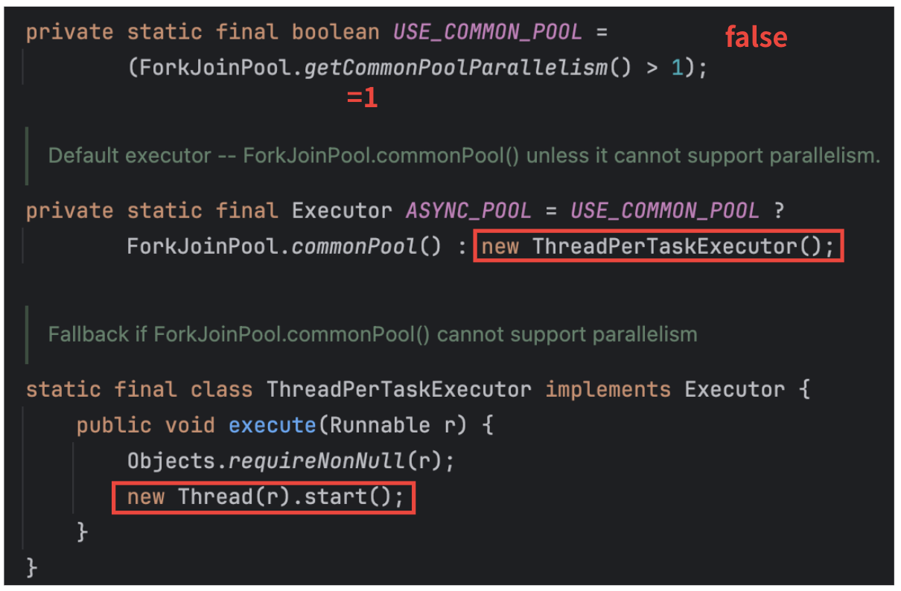

아까 전 확인한 ForkJoinPool의 core 크기 (getParallelism()으로 확인)가 1이었으므로, ForkJoinPool이 아닌 `new ThreadPerTaskExecutor()`로 만들어서 사용하고 있음을 알 수 있다.

그렇다면 `ThreadPerTaskExecutor`는 뭐하는 클래스일까?

오라클 공식 문서를 참조한 결과, 다음 클래스는 각 작업에 대해 새 스레드를 생성해주는 클래스였다.

**새 스레드를 생성해주는...**

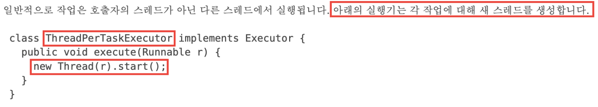

**<U>스레드 두 개 block 시키기 + 새 스레드 매번 생성</U>** 콤보로 timeout이 발생한 것이라면?

<br/>

따라서 코드를 다음과 같이 수정하였다.

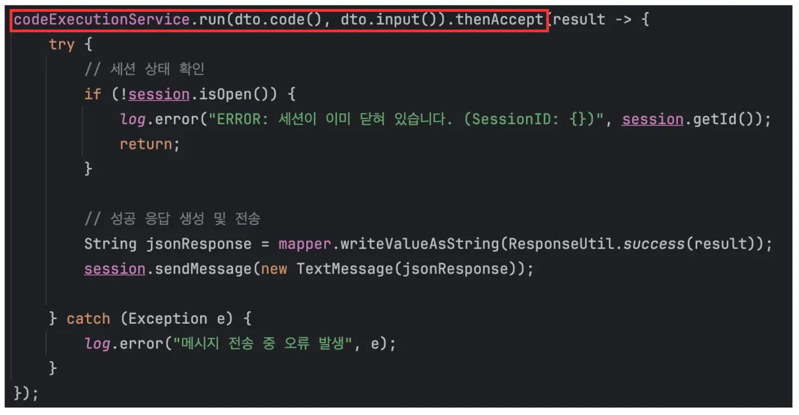

run() 메서드의 리턴 타입 또한 `Future<String> -> CompleteFuture<String>`으로 전환하였다.


이를 통해 내부에서 사용되는 ThreadPerTaskExecutor 대신 내가 만든 ThreadPoolTaskExecutor을 사용하도록 바꿔주었다.

<br/>

#### 💡 결과

변화는 크게 세 가지였다.

첫 번째로, 두 개의 스레드가 블락되는 문제가 해결된 모습을 알 수 있다.

실제로 스레드 덤프를 떠 봤을 때, 기존에는 run() 시 반드시 get()으로 block되는 스레드가 있었는데 사라진 모습을 보였다.

<br/>

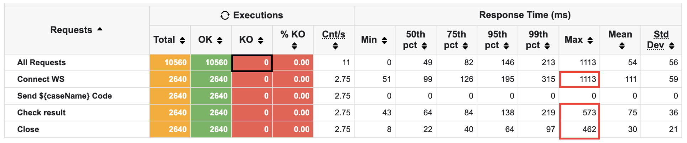

또한, 몇몇 튀는 부분은 존재하지만 timeout이 사라진 모습이 보인다.

<br/>

마지막으로, `jvm_threads_started_threads_total`이 최대 4 c/s -> 0.16 c/s까지 줄어든 모습을 확인할 수 있다.

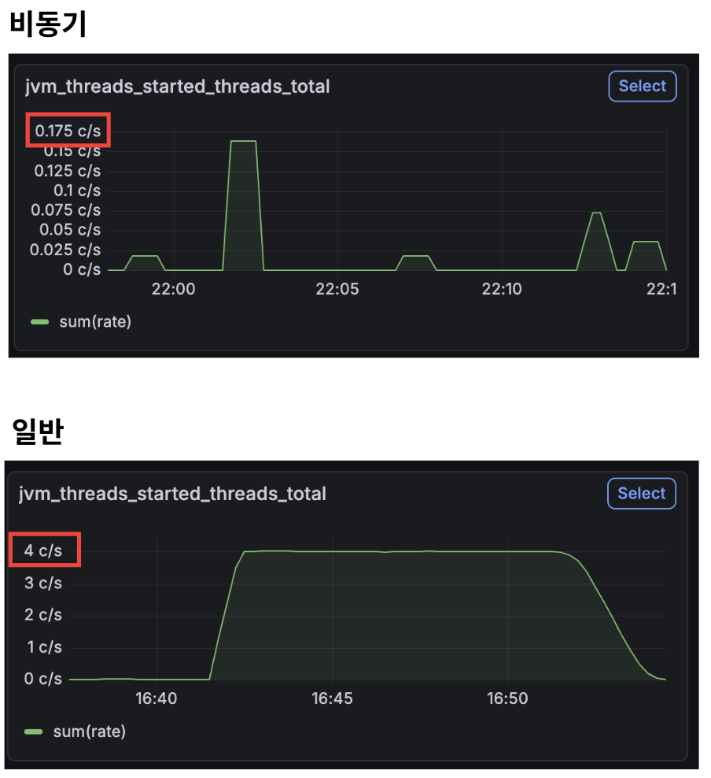

이를 통해 스레드가 재사용되고 있음을 알 수 있다.

<br/>

## 🫧 결론

자원 부족 문제로 인해 1분 지연 후 close() 시 응답의 **<U>15.5%</U>**가 실패한다는 문제가 있었다.

응답 결과를 보았을 때, 뭉텅이로 실패하는 것을 보아 자원이 부족할 것이라는 생각이 들었다.

따라서 FD 부족을 가장 먼저 의심했으나, 실제로 로그가 찍히지 않고, 실시간으로 fd 사용량을 확인한 결과 또한 최대 개수를 넘지 않았으므로 해당 부분은 문제가 되지 않을 것이라 생각했다.

이를 통해 서버는 정상적으로 동작하는데, 그 앞단에서 오류가 발생했을 것으로 예측할 수 있었다.

따라서 Nginx의 work_connection을 의심하게 되었는데, 실제로 로그에 768을 넘는 연결을 처리할 수 없다고 나와 있어 문제의 원인을 확정하게 되었다.

<br/>
<br/>

그러나 여전히 단 한 건의 timeout 오류가 발생하고 있었다.

20초 타임아웃 문제였는데, 여러 번 지속적인 20초 타임아웃으로 인해 메시지를 보내고 응답을 받는 과정에서 발생함을 확정짓게 되었다. (await(20) 코드를 짰기 때문)

처음에는 스레드 풀 부족을 의심했으나, 여전히 Block되어 처리되지 못함을 알고 이는 본질적인 문제의 원인이 아니라고 판단하였다.

<br/>

이후 CPU 사용량, DB 커넥션, 큐 사이즈 제한을 확인하였지만 이 또한 아니었다.

그런데 여러 테스트를 거치면서 알게 된 점은, 자원 정리 이후 타임아웃이 발생하지 않는다는 것이었다. 이를 기반으로 다시 가설을 세우고 자원을 정리했지만 이 또한 아니었음을 알게 되었다.

> 그렇다면 어떤 부분이 문제일까?

응답을 주고 받는 과정에서 타임아웃이 발생하였으므로, 스레드 관련 문제라고 생각해 다시 코드를 확인한 결과, 하나의 문제를 처리하기 위해 **<U>스레드 두 개 block + 새 스레드를 매번 생성</U>**하고 있다는 사실을 알았다.

따라서 코드에서 get()을 제거해 문제를 해결하고자 하였다.

그 결과로, 다음과 같이 변화 과정을 거치게 되었다.

1. 내부적으로 하나의 스레드만 Block
2. timeout이 사라져 성공률 100% 달성
3. jvm_threads_started_threads_total (JVM에서 시작된 애플리케이션 스레드의 총 개수)가 최대 **<U>4c/s -> 0.16c/s로 96% 감소</U>**

비동기의 잘못된 처리로 인해 두 개의 스레드가 Block되었고, 내부적으로 ForkJoinPool 사용이 아닌 new Thread로 계속해서 스레드를 생성하다 보니 연쇄적으로 밀려 timeout 문제가 발생한 것이었다.

그래서 스레드 풀을 늘려도, 오히려 jvm_threads_started_threads_total이 6c/s로 치솟을 뿐, 효과 없이 밀리고 있었던 것이었다.

또한, 직접 만든 ThreadPoolTaskThread가 병목이 아니었으므로 아무리 큐 사이즈를 제한해도 타임아웃이 발생했던 것이었다

테스트 시 close()로 착실하게 닫아주고 있으므로 해당 부분에서 누수 또한 별로 없어 timeout의 직접적인 원인이 아니라고 판단했다.

<br/>

이를 통해 실제로 스레드 생성 수를 초당 **<U>4c/s -> 0.16c/s로 96% 감소</U>**시키는 결과를 얻어낼 수 있었다.

<br/>

또한, 비동기도 잘 알고 써야 한다는 점을 다시 한 번 배운 것 같다. 특히, get()과 같은 함수도 이것이 정말로 비동기적으로 동작하는지, 왜 비동기를 써야 하는지 등을 찾아보는 것이 중요하다고 느꼈다.

비동기를 사용한 것으로 알고 있었지만 실제로는 두 개의 스레드가 block되어 실제로는 동기적으로 동작했던 것처럼...

또한, 언제나 내가 가진 지표를 전부 믿지 말고, 비판적으로 바라봐야 한다는 것도 깨달았다.

앞으로는 테스트 백만 번 할 것이다..

## 🫧 보완점

해당 부분의 직접적인 원인은 아니었지만, 간접적으로는 문제를 일으킬 수 있는 부분까지 수정을 완료하였다.


우선 비동기 처리에 br.close(), process.destroy() 코드를 추가해 사용된 자원들은 바로바로 정리될 수 있도록 하였다.

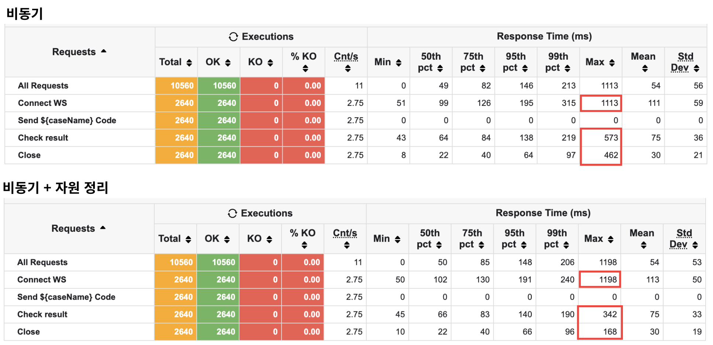

여전히 튀는 현상은 있지만... 결과적으로 `check result`와 `close` 파트에서 max 값이 감소함을 알 수 있다.

그러나 여전히 고칠 점은 (또) 많다..

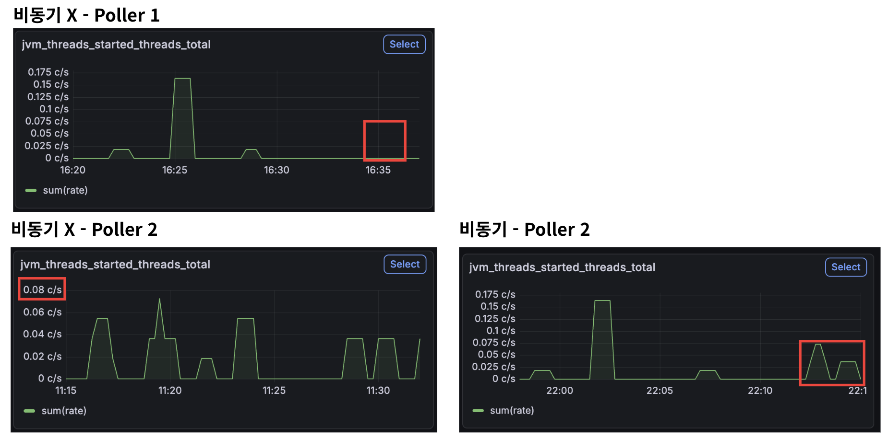

비동기 처리 전은 700명 대의 유입이다. 비동기 후는 900명 대의 유입이고!

이렇게 본다면 비동기 처리가 확실히 효과가 있음을 알 수 있다. 700명이든 900명이든 같은 수의 스레드를 사용하고 있음이 증명된 셈이다!

물론 Poller 2개일 때는 조금 더 느리긴 하지만..

어떻게 하면 이 부분을 줄일 수 있을지도 고민해보며 또 테스트를 해 봐야겠다.

<br/>

또한, 비동기 + 자원 정리에 이어 큐 사이즈 + 풀 사이즈 조정도 해 보았다.

- coreSize: 5 -> 10
- maxSize: 10 -> 20
- queueCapacity: INT_MAX -> 20

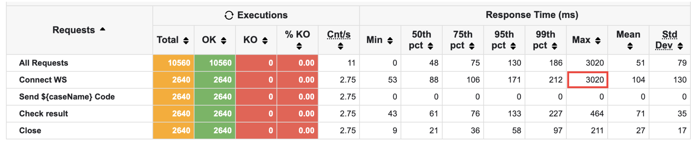

더 안 좋아졌다! Connect WS의 max값이 3초로 튀는 현상이 발생했다.

예상하기로는, 빠르게 처리되다보니 WS 연결 파트로 병목이 이동한 것 같았다.

이 부분도 가설을 세워 검증하는 과정을 거쳐 최적의 스레드 풀 크기를 찾아내면 재밌을 것 같다는 생각이 들었다.

<br/>

또한, 여전히 비동기의 이점을 제대로 활용하지 못하고 있는 것 같다.

내부적으로 여전히 waitFor()을 쓰느라 멈춰 있다는 것이 가장 아쉬웠다.

따라서 해당 부분을 이벤트 루프 방식 등 고쳐서 non-blocking 방식을 도입해 보고 싶다는 생각이 들었다.

<br/>

고쳐도 고쳐도 새롭게 고칠 부분이 나타난다는 게 너무 재밌는 것 같다.

앞으로도 고쳐 나가면서 좋은 서비스를 만들기 위해 노력해야겠다!!

## 🫧 참고 자료

- [Java_Thread-Pool이란?](https://jtm0609.tistory.com/159)
- [Java 병렬 처리 ForkJoinPool 기본 작동 원리](https://upcurvewave.tistory.com/653)
- [Java_빠른 입출력: BufferedReader & BufferedWriter](https://ontheway.tistory.com/64)
- [Java_BufferedWriter](https://velog.io/@cher_blair/Java-BufferedWriter)
- [Linux_표준 스트림 개념 및 표준 출력 및 오류를 /dev/null 처리하기](https://eehoeskrap.tistory.com/601)
- [Thread Pool에 대해서(with Tomcat, Spring Boot)](https://devpoong.tistory.com/132)
- [API reference for Java Platform, Standard Edition_Oracle](https://docs.oracle.com/en/java/javase/11/docs/api/java.base/java/util/concurrent/Executor.html)