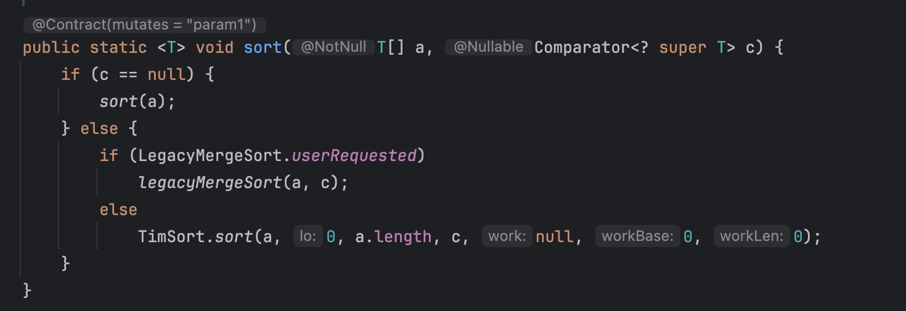

## 아이디어

1. 주문을 사전 순으로 정렬해서 큐에 삽입 (n보다 작은지 큰지 비교하기 위함)
2. banned 주문을 n과 비교해 앞선 순이면 제외함
3. n번째 문자열을 반환

⇒ 이때 반환 문자열은 26진법으로 처리함

(처음 문제 풀 때는 Math.pow() 썼는데 이를 쓰면 시간 초과로 실패함)

<br/>

a, b, … z (26개)

aa, ab, … az(26개), ba, bb, .. bz (26개) ⇒ 해서 26*26

aaa, aab … ⇒ 각 자릿수마다 26번이 반복되므로 26*26*26

> 26마다 반복되므로 26진법처럼 처리해주는 것!


## 코드

```java
import java.util.Queue;
import java.util.Arrays;
import java.util.ArrayDeque;

class Solution {
    public String solution(long n, String[] bans) {
        // 1. bans 정렬
        Queue<String> q = new ArrayDeque<>();
        Arrays.sort(bans, (o1, o2) -> {
            if (o1.length() == o2.length()) return o1.compareTo(o2);
            return o1.length() - o2.length();
        });
        for (int i=0; i<bans.length; i++) {
            q.add(bans[i]);
        }
        
        // 2. bans 원소 제거
        while (!q.isEmpty()) {
            String tmp = q.peek();
            String target = changeIntToString(n);
            if (tmp.length() < target.length() || 
                (tmp.length() == target.length() && tmp.compareTo(target) <= 0)) {
                n++;
                q.poll();
            } else break;
        }
        return changeIntToString(n);
    }
        
        // 3. 26진법으로 바꾸기
        private String changeIntToString(long n) {
            StringBuilder sb = new StringBuilder();
            while (n > 0) {
                long re = n%26;
                n/=26;
                
                if (re == 0) {
                    n--;
                    sb.append('z');
                } else sb.append((char)('a' + re-1));
            }
            return sb.reverse().toString();
        }
}
```

## 코드 설명

### 1. bans 정렬

```java
// 1. bans 정렬
        Queue<String> q = new ArrayDeque<>();
        Arrays.sort(bans, (o1, o2) -> {
            if (o1.length() == o2.length()) return o1.compareTo(o2);
            return o1.length() - o2.length();
        });
        for (int i=0; i<bans.length; i++) {
            q.add(bans[i]);
        }
```

- Arrays.sort()를 사용해 정렬
- 들어온 배열인 bans를 정렬 기준에 따라 정렬 (객체 비교를 위해 람다 함수로 구현)
    - 정렬 기준
        - 들어온 두 원소 (o1, o2)에 대해 o1.length() == o2.length()이면 o1과 o2를 compareTo 함수로 비교함. (기본적으로 사전 순으로 비교)
        - 그것이 아니라면 o1과 o2의 길이를 비교해 더 짧은 길이를 앞으로 정렬함
            - 음수 : 위치 교환 X
            - 양수 : 위치 교환 O
- for문으로 돌면서 queue에 정렬된 원소 넣어주기
- Arrays.sort()
    


- Arrays.sort() 함수는 제네릭 타입의 a와 객체를 비교할 수 있는 클래스인 Comparator을 인자로 받음 (T 타입이 들어갈 수 있도록 한정 타입으로 제한)
- 이때 Comparator과 Comparable을 헷갈리지 말아야 함
    - Comparator
        - 두 매개변수 객체 비교 (util 패키지에 존재 → import 필요)
    - Comparable
        - 자기 자신과 매개변수 객체 비교 (Lang 패키지에 존재)
        - compareTo 메서드 반드시 구현 필요

### 2. bans 원소 제거

```java
// 2. bans 원소 제거
        while (!q.isEmpty()) {
            String tmp = q.peek(); // bans 원소
            String target = changeIntToString(n); // n을 String으로 변환해 스트링끼리 비교
            if (tmp.length() < target.length() || // bans 원소가 n보다 길이가 짧거나 (앞에 있음)
		            // bans 원소의 길이가 같지만 사전순으로는 앞에 있으면
                (tmp.length() == target.length() && tmp.compareTo(target) <= 0)) {
                n++;
                q.poll();
            } else break;
        }
        return changeIntToString(n);
```

- bans가 n보다 앞에 있으면 제거된 수이므로 n의 리턴 값을 1 증가시켜줘야 함.
    - 예) n=1인데 bans가 [a]가 있는 경우 n은 b를 리턴해야 함 ⇒ 사실상 n=2 (a 때문에 +1됨)
- 따라서 bans 길이만큼 while문을 돌며 n을 증가시키는 작업을 진행함
    - for문이 아닌 while문으로 한 이유 → 이미 정렬되어 있기 때문에 중간에 n보다 큰 bans 원소가 나온 경우 그 이후부터는 볼 필요가 없기 때문

### 3. num → String (26진법)

```java
// 3. 26진법으로 바꾸기
        private String changeIntToString(long n) {
            StringBuilder sb = new StringBuilder();
            while (n > 0) {
                long re = n%26;
                n/=26;
                
                if (re == 0) {
                    n--;
                    sb.append('z');
                } else sb.append((char)('a' + re-1)); // 'a'는 97이므로 re=3이면 c, 97+3-1 = 99 (c)
            }
            return sb.reverse().toString();
        }
```

- 숫자 n을 받아 알파벳으로 바꾸는 함수 (이 과정에서 26진법 사용)
- n을 반복적으로 26으로 나누며 각 자릿수에 대응하는 알파벳 결정
- 이때, n이 26의 배수인 경우 ‘z’이지만, 나머지가 0이 되므로 n을 1 감소시키고 ‘z’를 추가해야함!
    - ex) n=26인 경우 알파벳은 z가 되어야 하지만 n--를 해 주지 않으면 다음 것들이 밀려버림 ^ㅡ^;;
- 그렇지 않은 경우는 아스키코드 ‘a’에 나머지 값을 더함.

## 참고자료
- https://velog.io/@parksegun/%EB%B4%89%EC%9D%B8%EB%90%9C-%EC%A3%BC%EB%AC%B8-Java