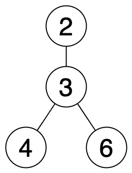

## 문제
[프로그래머스-홀짝트리](https://school.programmers.co.kr/learn/courses/30/lessons/388354)


## 문제 풀이
그래프에서의 동일한 노드가 root가 정해졌냐 아니냐에 따라 상태가 변화한다.

그에 대한 상태는 다음과 같다.


> <strong>역홀수 -> 홀수
> <br/> 역짝수 -> 짝수
> <br/> 홀수 -> 역홀수
> <br/> 짝수 -> 역짝수</strong>



다음 예시를 보자.

현재 상태에서 루트가 정해져 있지 않는다고 한다면

노드(2)는 짝수, 간선(1)은 홀수이므로 2는 역짝수, 노드(3)은 홀수, 간선(3)은 홀수이므로 3은 홀수,
노드(4)는 짝수, 간선(1)은 홀수이므로 4는 역짝수,
노드(6)은 짝수, 간선(1)은 홀수이므로 6은 역짝수.

그러나 3을 루트로 정하는 순간 자식 노드가 될 수 있던 노드가 부모 노드가 되면서 간선에 -1씩을 해줘야 한다.

이때 역짝수였던 노드 2, 4, 6의 간선이 사라지며 역짝수 -> 짝수로 상태가 변하게 된다.

이후 각 그룹마다 TreeInfo를 만들어 홀수 노드 수, 짝수 노드 수, 역홀수 노드 수, 역짝수 노드 수를 구한다.

```java
public class TreeInfo {
    public int oddNode;
    public int evenNode;
    public int reverseOddNode;
    public int reverseEvenNode;
    // ...
}
```

- 홀수 노드나 짝수 노드가 하나만 존재할 경우 해당 노드를 root로 정하면 홀짝 트리를 만들 수 있다.
- 역홀수 노드나 역짝수 노드가 하나만 존재할 경우 해당 노드를 root로 정하면 역홀짝 트리를 만들 수 있다.

## 코드

```java
import java.util.Map;
import java.util.HashMap;

class Solution {
    
    private int[] inDegree;
    private int[] parent;
    
    public int[] solution(int[] nodes, int[][] edges) {
        int[] answer = {};
        
        // 가장 큰 노드로 크기 잡기
        int lastNode = 0;
        for(int node : nodes) {
            lastNode = Math.max(lastNode, node);
        }
        
        // 같은 그룹이면 묶기 위해 parent 사용
        inDegree = new int[lastNode + 1]; // 차수 (간선 연결 수 카운트)
        parent = new int[lastNode + 1]; // 부모 노드
        for(int i = 1; i <= lastNode; i++) {
            parent[i] = i; //P[0]=0, p[1]=1, p[2]=2, ... p[11]=11 ...
        }
        
        // 간선 연결하기
        for(int[] edge : edges) {
            int a = edge[0];
            int b = edge[1];
            inDegree[a]++;
            inDegree[b]++;
            // 같은 그룹이므로 묶기
            merge(a, b);
        }
        
        Map<Integer, TreeInfo> MAP = new HashMap();
        for(int node : nodes) {
            int group = find(node); // 노드가 속한 그룹 찾기
            
            TreeInfo t = MAP.getOrDefault(group, new TreeInfo());
            
            // TreeInfo에 각 노드 상태 저장
            if((node % 2 == 0) && (inDegree[node] % 2 == 0)) {
                t.evenNode++;
            } else if((node % 2 == 1) && (inDegree[node] % 2 == 1)) {
                t.oddNode++;
            } else if((node % 2 == 0) && (inDegree[node] % 2 == 1)) {
                t.reverseEvenNode++;
            } else if((node % 2 == 1) && (inDegree[node] % 2 == 0)) {
                t.reverseOddNode++;
            }
            
            // 노드가 속한 그룹에 TreeInfo 넣기
            MAP.put(group, t);
        }
        
        int tree = 0;
        int rTree = 0;
        for(TreeInfo treeInfo : MAP.values()) {
            if(treeInfo.isTree()) {
                tree++;
            }
            
            if(treeInfo.isReverseTree()) {
                rTree++;
            }    
        }
        
        return new int[]{tree, rTree};
    }
               
    public class TreeInfo {
        public int oddNode;
        public int evenNode;
        public int reverseOddNode;
        public int reverseEvenNode;
        
        public TreeInfo() {
            this.oddNode = 0;
            this.evenNode = 0;
            this.reverseOddNode = 0;
            this.reverseEvenNode = 0;
        }
        
        public boolean isTree() {
            if((oddNode == 1 && evenNode == 0) || (oddNode == 0 && evenNode == 1)) {
                return true;
            }
            
            return false;
        }
        
        public boolean isReverseTree() {
            if((reverseOddNode == 1 && reverseEvenNode == 0) || (reverseOddNode == 0 && reverseEvenNode == 1)) {
                return true;
            }
            
            return false;
        }
    }
    
    // 재귀적으로 최상위 부모 루트 찾기
    public int find(int num) {
        if(parent[num] == num) return num;
        return parent[num] = find(parent[num]);
    }
    
    public void merge(int a, int b) {
        a = find(a);
        b = find(b);
        
        if(a != b) {
            parent[b] = a; // 다음에 다시 찾지 않도록 최상위 노드 저장
        }
    }
}
```

## 참고 자료
- https://blogshine.tistory.com/701