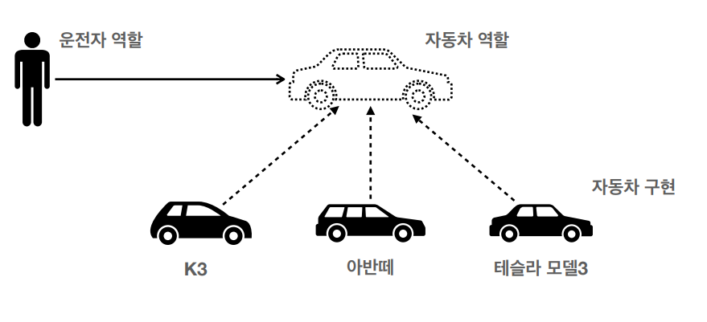

<strong>스프링 핵심 원리 - 기본편 (김영한) 강의를 바탕으로 정리한 글입니다.</strong>
{: .notice}

# 📌 객체 지향 프로그래밍이란?

## 🫧 객체 지향 프로그래밍

객체 지향 프로그래밍 (Object-Oriented Programming, OOP)은 프로그램은 객체 개념을 기반으로 하는 컴퓨터 프로그래밍의 패러다임이다.

## 🫧 객체

여기서 말하는 객체란, 다음과 같은 것들을 포함할 수 있다.

- 데이터 (필드 또는 속성으로 불림)
- 함수 (프로시저 또는 메서드로 불림)

객체를 `붕어빵`이라고 생각하고, 클래스를 `붕어빵 틀`이라고 생각하면 이해가 쉽다.

💡 여기서 객체(인스턴스)와 클래스를 혼동해서는 안 되는 것이, 객체(인스턴스)는 `new` 키워드로 만들어진 객체의 실체로써 붕어빵 예시에서 `붕어빵`에 속한다.

### ✨ 붕어빵 예시

붕어빵을 굽기 위해서는 속재료와 반죽이 필요하다.

이는 클래스에서 데이터로, 클래스 하나로 만든 인스턴스(붕어빵)마다 고유의 속재료를 갖고 있을 수 있다.

붕어빵 틀에 반죽을 붓는 행위, 뒤집는 행위 등이 객체에서의 함수가 되는 것이다.

이는 모든 붕어빵에 적용되므로 하나의 클래스에서 나온 객체는 모두 같은 함수를 가진다고 할 수 있다.

---

그럼 다시 객체 지향 프로그래밍으로 돌아가 보자.

이처럼, 객체 지향 프로그래밍은 컴퓨터 프로그램을 명령어의 목록으로 보는 시각에서 벗어나 여러 개의 독립된 단위, 즉 `객체들의 모임`으로 파악하고자 하는 것이다.

이런 객체들은 서로 <strong>상호작용</strong>하며 시스템을 구성하게 된다.

위와 같은 특성에 의해 객체지향 프로그래밍은 프로그램을 유연하고 변경이 용이하게 만들기 때문에 대규모 소프트웨어 개발에 많이 사용된다.

마치 블록 조립하듯, 원하는 부분을 갈아 끼울 수 있다는 것이 변경이 잦은 시스템에서 다른 곳에 영향을 미치지 않고 아주 쉽게 사용할 수 있는 것이다.

## 🫧 객체지향 특징
- 추상화
- 캡슐화
- 상속
- 다형성

## 🫧 다형성

객체 지향의 꽃은 다형성이다.

다형성이 바로 시스템의 변경이 생겼을 떄 용이하게 수정 가능하도록 도와주기 때문이다.

> 다형성이란 하나의 객체(Object) 혹은 메서드가 여러 가지 타입을 가질 수 있는 것을 말한다.

우선 시스템의 변경이 생겼을 때 수정을 쉽게 하기 위해서는 시스템의 세상을 `역할`과 `구현`으로 나누는 것이 필요하다.

### ✨ 다형성 예시 (자동차)

다음과 같은 예시를 살펴보자.

운전자는 자동차가 어떤 종류인지 알 필요가 없다.

자동차 역할만 알고, 운전하는 법만 알면 차의 종류에 상관 없이 운전이 가능하다.

반대로, 자동차 또한 운전자가 누구인지 알 필요가 없다.

운전자는 그저 자동차 역할을 잘 이해하고 수행하기만 하면 되는 것이다.

만약 이렇게 역할과 구현이 존재하지 않느다면 운전자나 자동차가 바뀌었을 때 완전히 새롭게 만들어야 하므로 시간이 배로 걸린다!

이렇듯, 자동차 역할에 자동차 구현이 들어가기 위해서는 다형성, 즉 타입이 맞아야 한다. (자동차인데 버스 구현이 오면 안 된다. 쉽게 말해 자동차, 버스와 같은 탑승수단을 타입이라고 생각하면 이해가 편하다.)

이때 하위의 K3, 아반떼, 테슬라 모델3 등 다양한 타입이 하나의 부모 타입 (자동차 역할)로 올 수 있는 것, 그것을 실현 가능하게 한 것이 바로 `다형성`이다.

## 🫧 다형성 구현

그렇다면 이러한 다형성은 어떻게 동작할까?

기본적으로 자바 언어의 다형성은 `오버라이딩`으로 동작할 수 있다.

> 오버라이딩이란 객체 지향 프로그래밍에서 상속 관계에 있는 하위 클래스 (자식 클래스, 여기서는 K3, 아반떼 등의 차 구현체)가 상위 클래스 (여기서는 자동차 역할)의 메서드를 재정의하여 사용하는 것을 말한다.

쉽게 말해, 부모 클래스가 구현해놓은 메서드(함수)를 자식 클래스에서도 똑같은 이름으로 재정의해서 실제로 호출되었을 때 자식 클래스의 메서드가 호출되게 되는 것이다.

### ✨ 다형성 구현 예시 (오버라이딩)

하나의 예를 더 살펴보자.

차 키의 `문열림` 버튼을 누르면 차의 문이 열린다고 가정하자.

이때, 어떤 차의 문이 열릴지는 미지수다.

사용자는 그저 차 키의 문열림 버튼을 누르기만 하면 된다.

이때, 만일 내가 오늘은 K3를 타고 출근하고 싶다고 하면, 사용자는 K3의 문열림을 기대하고 버튼을 누를 것이다.

그렇다면 자동차는 사용자(클라이언트)의 요청에 맞춰, 프로그래밍을 한다.

`자동차 역할`에서 문열림 메서드를 K3에서 문이 열리도록 재정의한다.

이후에 클라이언트에서 `문열림`을 요청할 떄, K3의 문이 열리게 되는 것이다.

이를 통해 클라이언트에 영향을 주지 않고 새로운 기능 제공이 가능해진다.

## 🫧 스프링과 객체지향
- 스프링은 다형성을 극대화해서 이용할 수 있게 한다.
- 스프링에서 이야기하는 제어의 역전 (IoC), 의존관계 주입(DI)는 다형성을 활용해서 역할과 구현을 편리하게 다룰 수 있도록 지원한다.

## 🫧 참고 자료
- [객체 지향 프로그래밍 정의](https://ko.wikipedia.org/wiki/%EA%B0%9D%EC%B2%B4_%EC%A7%80%ED%96%A5_%ED%94%84%EB%A1%9C%EA%B7%B8%EB%9E%98%EB%B0%8D#:~:text=%EA%B0%9D%EC%B2%B4%20%EC%A7%80%ED%96%A5%20%ED%94%84%EB%A1%9C%EA%B7%B8%EB%9E%98%EB%B0%8D%EC%9D%80%20%EC%BB%B4%ED%93%A8%ED%84%B0,%EA%B4%80%EB%A6%AC%ED%95%98%EB%8A%94%20%ED%94%84%EB%A1%9C%EA%B7%B8%EB%9E%98%EB%B0%8D%20%ED%8C%A8%EB%9F%AC%EB%8B%A4%EC%9E%84%EC%9D%B4%EB%8B%A4.)
- [다형성 정의](https://zerone-code.tistory.com/3)